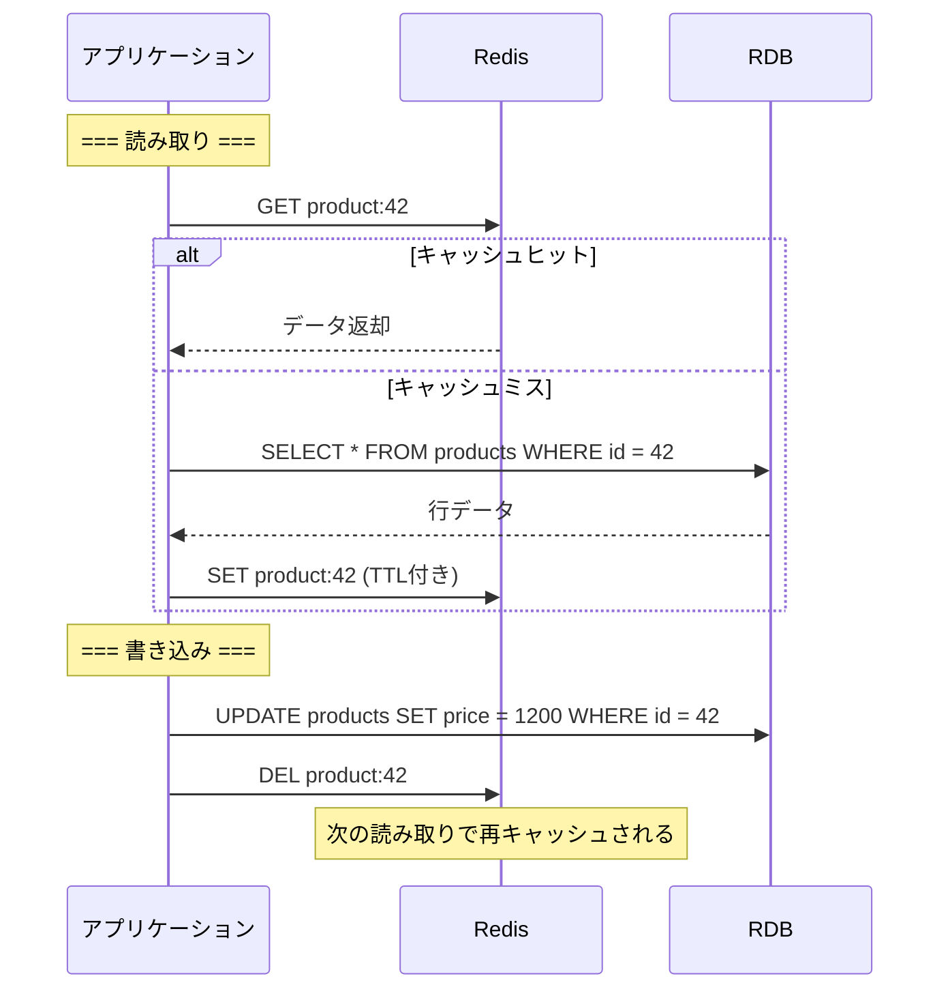
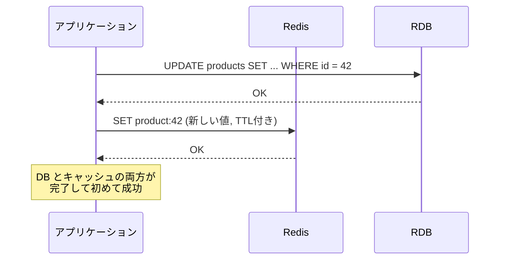
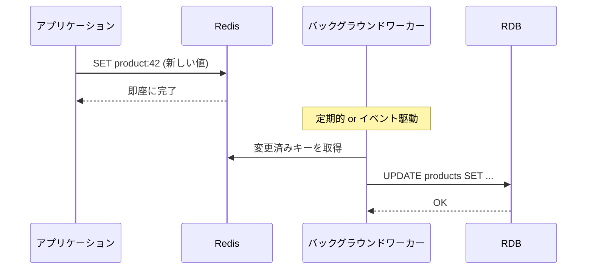
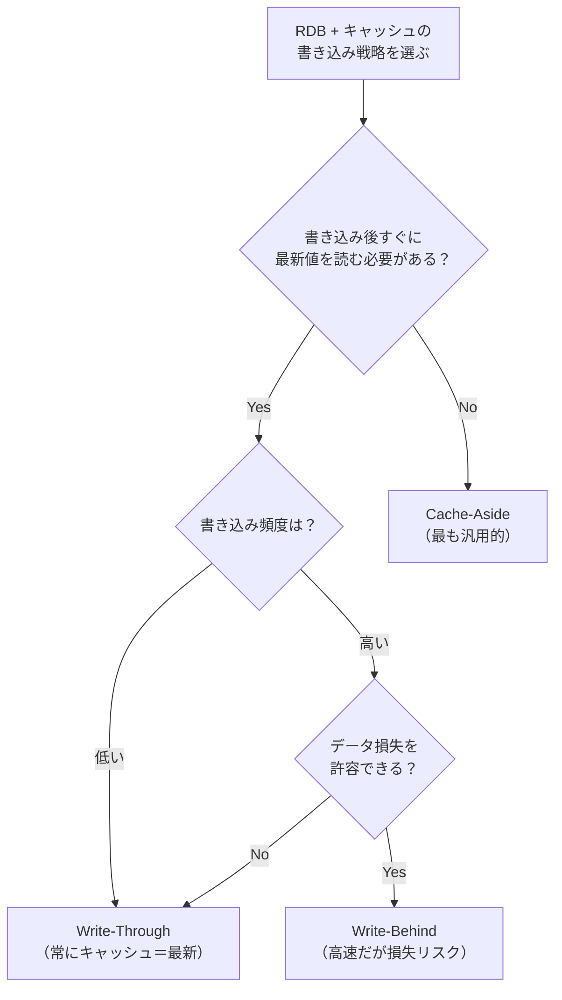

# キャッシュ書き込み戦略と TTL 設計（Cache Write Strategies & TTL Design）

> **一言で言うと:** RDB の前段にキャッシュを置くとき、「書き込みをどう反映するか」と「いつキャッシュを捨てるか」の設計が整合性とパフォーマンスを決定する。Cache-Aside / Write-Through / Write-Behind の選択と、TTL の決め方を理解すれば、"キャッシュ起因のバグ" の大半を防げる。

## 前提: なぜ RDB にキャッシュが必要か

RDB は ACID を保証するが、その代償としてディスク I/O とロック取得のコストがかかる。同じ商品情報を毎秒 1,000 回 `SELECT` するなら、結果をメモリに置いて RDB への問い合わせを減らすのが合理的。これが[[キャッシュ戦略]]の基本動機である。

問題は、キャッシュと RDB の間で**データの不整合**が起きること。書き込み戦略と TTL はこの不整合をどう制御するかの設計判断。

## 3 つの書き込み戦略

[[ライトバックとライトスルー]]では OS/ハードウェア層の書き込み方式を解説したが、ここではアプリケーション層（Redis + RDB）での戦略を扱う。

### Cache-Aside（Lazy Loading）

最も広く使われるパターン。アプリケーションがキャッシュと DB を**個別に**操作する。



**キャッシュ更新を DELETE にする理由:**

書き込み時に「新しい値で SET する」のではなく「DEL して次の読み取りで再取得」にするのが定石。理由は競合条件の回避:

```
❌ SET で更新する場合の競合（Race Condition）

  時刻1: TX-A が DB を price=1200 に更新
  時刻2: TX-B が DB を price=1500 に更新
  時刻3: TX-B がキャッシュを price=1500 で SET
  時刻4: TX-A がキャッシュを price=1200 で SET（古い値で上書き！）
  → キャッシュ: 1200、DB: 1500 — 不整合

✅ DEL で無効化する場合

  時刻1: TX-A が DB を price=1200 に更新
  時刻2: TX-B が DB を price=1500 に更新
  時刻3: TX-B がキャッシュを DEL
  時刻4: TX-A がキャッシュを DEL（すでに消えているが問題なし）
  → 次の読み取りで DB から最新値 1500 を取得
```

| 観点 | 評価 |
|------|------|
| 実装の複雑さ | 低い |
| 読み取り性能 | 高い（ヒット時） |
| 書き込み性能 | DB 速度に依存 |
| 整合性 | 結果整合性（Eventual Consistency、TTL 期間中は古い値の可能性） |
| キャッシュ障害時 | DB からフォールバック可能 |

### Write-Through

書き込み時にキャッシュと DB を**同期的に**両方更新する。



アプリケーションが DB とキャッシュの両方を同期的に更新する:

```typescript
async function updateProduct(id: number, data: ProductUpdate): Promise<void> {
  // トランザクションで DB とキャッシュを同期的に更新
  await db.query("UPDATE products SET name = $1, price = $2 WHERE id = $3", [
    data.name,
    data.price,
    id,
  ]);
  // DB 更新成功後にキャッシュを更新
  await redis.set(`product:${id}`, JSON.stringify(data), { EX: TTL });
}
```

| 観点 | 評価 |
|------|------|
| 実装の複雑さ | 中程度 |
| 読み取り性能 | 常にキャッシュヒット |
| 書き込み性能 | 遅い（DB + キャッシュ両方を待つ） |
| 整合性 | 強い（書き込み直後から最新値が読める） |
| キャッシュ障害時 | 書き込みが失敗する（要フォールバック設計） |

### Write-Behind（Write-Back）

書き込みをキャッシュにだけ行い、DB への反映は**非同期**で後から実行する。



| 観点 | 評価 |
|------|------|
| 実装の複雑さ | 高い（ワーカー、リトライ、順序保証が必要） |
| 読み取り性能 | 常にキャッシュヒット |
| 書き込み性能 | 非常に速い（メモリのみ） |
| 整合性 | 結果整合性（DB 反映まで遅延あり） |
| キャッシュ障害時 | **未反映データが失われる** |

## 戦略の選択フロー



| 戦略 | 代表的なユースケース |
|------|-------------------|
| **Cache-Aside** | 商品情報、ユーザープロファイル、設定値 |
| **Write-Through** | セッションデータ、ユーザー設定、表示名 |
| **Write-Behind** | ページビューカウンター、「いいね」数、アクセスログ集約 |

## TTL 設計

TTL（Time To Live）はキャッシュの自動期限切れ時間。短すぎるとキャッシュの意味がなく、長すぎると古いデータが返り続ける。

### TTL を決める3つの軸

| 軸 | 短い TTL（秒〜分） | 長い TTL（時間〜日） |
|---|---|---|
| **データの更新頻度** | 頻繁に更新されるデータ | ほぼ変わらないマスタデータ |
| **不整合の許容度** | 古い値を見せてはいけない | 多少古くても問題ない |
| **DB 負荷** | DB に余裕がある | DB への問い合わせを最小限にしたい |

### 実務での TTL 目安

```
ユーザーセッション:      24時間（セキュリティ要件で決まる）
商品一覧・カテゴリ:      5〜30分
ユーザープロファイル:     5〜15分
為替レート・外部API結果:  30秒〜5分（API側の更新頻度に合わせる）
都道府県マスタ:          24時間〜7日（ほぼ変わらない）
ランキング集計:          1〜10分（再集計コストが高い場合は長め）
```

### TTL ジッター — Thundering Herd 対策

同じ TTL を設定すると、大量のキャッシュが同時に期限切れし、一斉に DB に問い合わせが殺到する（Thundering Herd 問題）。TTL にランダムなばらつき（ジッター）を加えて回避する。

```typescript
const BASE_TTL = 300; // 5分
const JITTER = 60;    // ±60秒

function ttlWithJitter(): number {
  return BASE_TTL + Math.floor(Math.random() * JITTER * 2) - JITTER;
  // 240〜360秒のランダムな TTL
}

await redis.set(key, value, { EX: ttlWithJitter() });
```

```go
func ttlWithJitter(base, jitter time.Duration) time.Duration {
	return base + time.Duration(rand.IntN(int(jitter)*2)-int(jitter))
}

// 使用例: 5分 ±1分
ttl := ttlWithJitter(5*time.Minute, 1*time.Minute)
rdb.Set(ctx, key, value, ttl)
```

## コード例

### TypeScript — Cache-Aside + TTL ジッター

```typescript
import { createClient } from "redis";
import { Pool } from "pg";

const redis = createClient({ url: "redis://localhost:6379" });
const db = new Pool({ connectionString: "postgres://localhost/mydb" });

const BASE_TTL = 300;
const JITTER = 60;

async function getProduct(id: number): Promise<Product> {
  const cacheKey = `product:${id}`;

  // 1. キャッシュ確認
  const cached = await redis.get(cacheKey);
  if (cached) return JSON.parse(cached);

  // 2. キャッシュミス → DB から取得
  const { rows } = await db.query(
    "SELECT id, name, price FROM products WHERE id = $1",
    [id]
  );
  if (rows.length === 0) throw new Error("Product not found");

  const product = rows[0];

  // 3. TTL ジッター付きでキャッシュ
  const ttl = BASE_TTL + Math.floor(Math.random() * JITTER * 2) - JITTER;
  await redis.set(cacheKey, JSON.stringify(product), { EX: ttl });

  return product;
}

async function updateProduct(id: number, name: string, price: number) {
  await db.query("UPDATE products SET name = $1, price = $2 WHERE id = $3", [
    name,
    price,
    id,
  ]);
  // キャッシュは SET ではなく DEL（競合条件の回避）
  await redis.del(`product:${id}`);
}
```

### Go — Write-Behind（バッチ書き込み）

```go
package main

import (
	"context"
	"database/sql"
	"fmt"
	"sync"
	"time"

	"github.com/redis/go-redis/v9"
	_ "github.com/lib/pq"
)

// ViewCount は Write-Behind で DB に非同期反映する例
type ViewCounter struct {
	rdb     *redis.Client
	db      *sql.DB
	mu      sync.Mutex
	pending map[string]int64 // productID -> 増分
}

func NewViewCounter(rdb *redis.Client, db *sql.DB) *ViewCounter {
	vc := &ViewCounter{
		rdb:     rdb,
		db:      db,
		pending: make(map[string]int64),
	}
	go vc.flushLoop() // バックグラウンドで定期的に DB に反映
	return vc
}

// Increment はキャッシュにだけ書き込む（高速）
func (vc *ViewCounter) Increment(ctx context.Context, productID string) error {
	// Redis INCR はアトミック — ロック不要
	vc.rdb.Incr(ctx, fmt.Sprintf("views:%s", productID))

	vc.mu.Lock()
	vc.pending[productID]++
	vc.mu.Unlock()
	return nil
}

// flushLoop は定期的に蓄積した増分を DB に反映する
func (vc *ViewCounter) flushLoop() {
	ticker := time.NewTicker(10 * time.Second)
	defer ticker.Stop()

	for range ticker.C {
		vc.mu.Lock()
		batch := vc.pending
		vc.pending = make(map[string]int64)
		vc.mu.Unlock()

		if len(batch) == 0 {
			continue
		}

		// バッチで DB に反映
		ctx := context.Background()
		tx, err := vc.db.BeginTx(ctx, nil)
		if err != nil {
			// リトライのため pending に戻す
			vc.mu.Lock()
			for k, v := range batch {
				vc.pending[k] += v
			}
			vc.mu.Unlock()
			continue
		}

		for productID, delta := range batch {
			tx.ExecContext(ctx,
				"UPDATE products SET view_count = view_count + $1 WHERE id = $2",
				delta, productID,
			)
		}
		tx.Commit()
	}
}
```

## よくある落とし穴

### 1. キャッシュと DB の更新順序を間違える

```
❌ キャッシュ DEL → DB UPDATE の順序

  時刻1: TX-A がキャッシュを DEL
  時刻2: TX-B がキャッシュミス → DB から旧値を読み取りキャッシュに SET
  時刻3: TX-A が DB を更新
  → キャッシュ: 旧値、DB: 新値 — 不整合が TTL まで続く

✅ DB UPDATE → キャッシュ DEL の順序

  時刻1: TX-A が DB を更新
  時刻2: TX-A がキャッシュを DEL
  → 次の読み取りで DB から最新値を取得
```

**原則: 「先に DB を更新し、後でキャッシュを無効化する」**。これでも微小な窓で不整合は起きうるが、TTL があるため自然に解消される。

### 2. Write-Behind でキャッシュ障害時のデータ損失

Write-Behind はキャッシュにしかデータがない期間がある。Redis が落ちると未反映データが消失する。対策:
- Redis の AOF 永続化を有効にする（ただし完全なデータ保証ではない）
- **損失しても許容できるデータ**（閲覧数、クリック数）にのみ使う
- 金銭や在庫など重要データには絶対に使わない

### 3. TTL なしでキャッシュする

TTL を設定せずにキャッシュすると、DB が更新されてもキャッシュが永遠に古い値を返し続ける。明示的なキャッシュ無効化を全更新パスに漏れなく実装するのは困難なため、**TTL は必ず設定する**（安全ネットとして機能する）。

### 4. Cache-Aside で DB 更新とキャッシュ DEL を別トランザクションにする

DB 更新は成功したがキャッシュ DEL が失敗するケースがある。キャッシュ操作は DB [[トランザクション]]の外で行うため、DEL 失敗時のリトライまたは TTL による自然解消を設計に組み込む。

### 5. 全テーブルの全行をキャッシュしようとする

キャッシュすべきは「読み取り頻度が高く、かつ更新頻度が低い」データ。全データをキャッシュしようとするとメモリを圧迫し、キャッシュの管理コストがデータベースへの直接アクセスより高くなる。

## 関連トピック

- [[RDB]] — 親トピック。キャッシュは RDB の読み取り負荷を軽減する主要な手段
- [[キャッシュ戦略]] — キャッシュの階層構造、無効化パターン、Thundering Herd 対策の全体像
- [[ライトバックとライトスルー]] — OS/ハードウェア層での書き込み方式。アプリケーション層の Write-Through / Write-Behind と同じ原理
- [[MemcachedとRedis]] — キャッシュストアの具体的な選択肢と使い分け
- [[トランザクション]] — キャッシュ更新と DB トランザクションの境界設計
- [[コネクションプール]] — キャッシュミス時の DB 接続が枯渇しないよう注意

## 参考リソース

- Alex Xu 著『System Design Interview』第6章 — 分散キャッシュ設計
- [Redis Documentation — Client-side caching](https://redis.io/docs/latest/develop/use/client-side-caching/) — Redis のキャッシュパターン
- Martin Kleppmann 著『Designing Data-Intensive Applications』第5章 — レプリケーションとキャッシュの整合性
