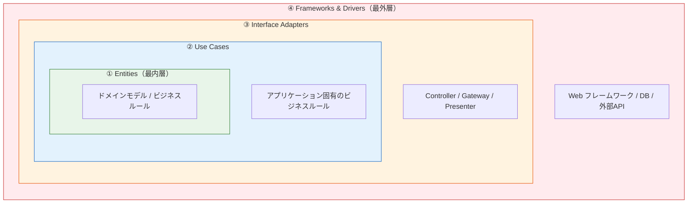
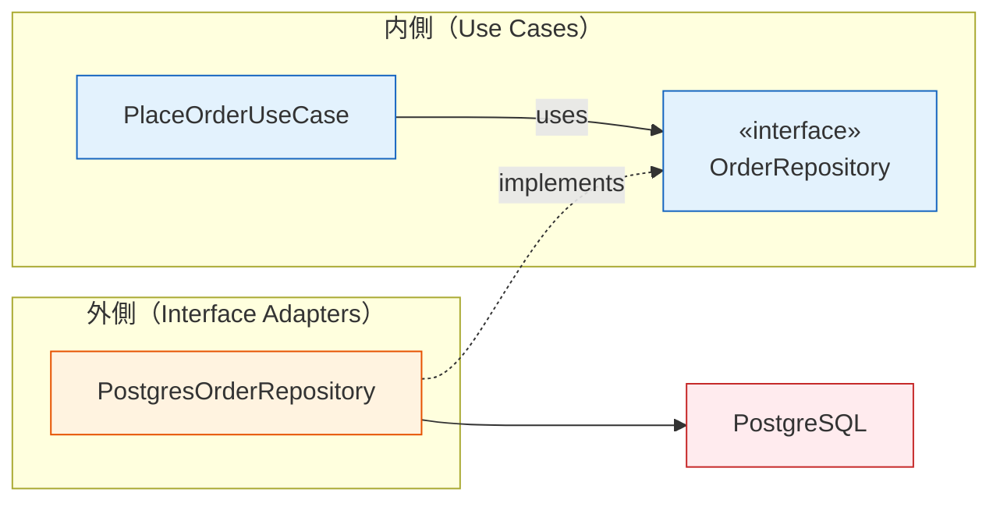

# クリーンアーキテクチャ（Clean Architecture）

> **一言で言うと:** 依存の方向を「外側→内側」の一方向に制限し、ビジネスロジックをフレームワーク・DB・UIから完全に独立させるアーキテクチャパターン。Robert C. Martin（Uncle Bob）が2012年に提唱した。

## 核心 — 依存性の規則（Dependency Rule）

クリーンアーキテクチャの本質は**たった1つのルール**に集約される:

> **ソースコードの依存は、常に内側（上位の方針）に向かわなければならない。内側の円は外側の円について何も知ってはならない。**



依存の方向: **④ → ③ → ② → ①**（外から内へのみ）

| 層 | 役割 | 変更頻度 | 例 |
|---|---|---|---|
| ① Entities | 企業全体のビジネスルール | 最も低い | `Order.calculateTotal()`, `User.canPurchase()` |
| ② Use Cases | アプリケーション固有のルール | 低い | `PlaceOrderUseCase`, `RegisterUserUseCase` |
| ③ Interface Adapters | 内外のデータ形式変換 | 中程度 | Controller, Repository実装, Presenter |
| ④ Frameworks & Drivers | 技術的な詳細 | 最も高い | Express, Laravel, PostgreSQL, React |

**なぜこの方向なのか:** 変更頻度が高いもの（フレームワーク、DB）が変更頻度が低いもの（ビジネスルール）に依存する構造にすることで、技術的な変更がビジネスロジックに波及しない。DB を PostgreSQL から MongoDB に変えても、Use Cases と Entities は一切変更不要になる。

## 依存性逆転による境界の越え方

内側の Use Case が外側の DB にデータを保存したい場合、直接依存すると依存性の規則に違反する。ここで[[SOLID原則]]の依存性逆転の原則（DIP）が使われる。



Use Case はインターフェース（抽象）にのみ依存し、具体的な DB 実装は外側に置く。実行時には[[DIコンテナ]]が具体実装を注入する。

## 類似アーキテクチャとの比較

クリーンアーキテクチャは、同心円型のアーキテクチャの系譜に位置する。

| 観点 | レイヤードアーキテクチャ | ヘキサゴナルアーキテクチャ（Ports & Adapters） | クリーンアーキテクチャ |
|------|------------------------|----------------------------------------------|----------------------|
| 提唱者 | — （伝統的） | Alistair Cockburn（原案1990年代、2005年に文書化） | Robert C. Martin（2012） |
| 依存方向 | 上→下（UI→Domain→DB） | 内→外を禁止（Ports で境界定義） | 内→外を禁止（4層の同心円） |
| DB層の位置 | 最下層（Domain が DB に依存しがち） | 外側の Adapter | 最外層の Frameworks & Drivers |
| 核心概念 | 層の分離 | Port（境界）と Adapter（差し替え可能な実装） | 依存性の規則 + Entities/Use Cases の明確な分離 |
| 実用上の違い | DB 変更時に Domain 層まで影響しやすい | Port 定義が設計の中心 | Use Cases が明示的な層として独立 |

本質的にはどれも「ビジネスロジックを技術的詳細から分離する」という同じ目標を持つ。クリーンアーキテクチャの特徴は、Use Cases（アプリケーション固有のルール）と Entities（企業レベルのルール）を明確に分離した点にある。

## コード例

### TypeScript — Express での実装

```typescript
// ① Entity — フレームワークに依存しない純粋なビジネスルール
class Order {
  constructor(
    public readonly id: string,
    public readonly items: OrderItem[],
    public readonly status: OrderStatus,
  ) {}

  calculateTotal(): number {
    return this.items.reduce((sum, item) => sum + item.price * item.quantity, 0);
  }

  canBeCancelled(): boolean {
    return this.status === "pending" || this.status === "confirmed";
  }
}

// ② Use Case — アプリケーション固有のルール
// インターフェース（Port）を定義
interface OrderRepository {
  findById(id: string): Promise<Order | null>;
  save(order: Order): Promise<void>;
}

class CancelOrderUseCase {
  constructor(private orderRepo: OrderRepository) {} // 抽象に依存

  async execute(orderId: string): Promise<void> {
    const order = await this.orderRepo.findById(orderId);
    if (!order) throw new Error("Order not found");
    if (!order.canBeCancelled()) {
      throw new Error("Order cannot be cancelled");
    }
    const cancelled = new Order(order.id, order.items, "cancelled");
    await this.orderRepo.save(cancelled);
  }
}

// ③ Interface Adapter — Controller（HTTP → Use Case の変換）
import { Request, Response } from "express";

class OrderController {
  constructor(private cancelOrder: CancelOrderUseCase) {}

  async cancel(req: Request, res: Response): Promise<void> {
    try {
      await this.cancelOrder.execute(req.params.id);
      res.status(200).json({ message: "Order cancelled" });
    } catch (e) {
      res.status(400).json({ error: (e as Error).message });
    }
  }
}

// ③ Interface Adapter — Repository 実装（Use Case → DB の変換）
class PostgresOrderRepository implements OrderRepository {
  constructor(private pool: Pool) {}

  async findById(id: string): Promise<Order | null> {
    const result = await this.pool.query(
      "SELECT * FROM orders WHERE id = $1", [id]
    );
    if (result.rows.length === 0) return null;
    const row = result.rows[0];
    return new Order(row.id, JSON.parse(row.items), row.status);
  }

  async save(order: Order): Promise<void> {
    await this.pool.query(
      "UPDATE orders SET items = $1, status = $2 WHERE id = $3",
      [JSON.stringify(order.items), order.status, order.id]
    );
  }
}

// ④ Frameworks & Drivers — Express のルーティング（Composition Root）
import express from "express";

const pool = new Pool({ connectionString: process.env.DATABASE_URL });
const orderRepo = new PostgresOrderRepository(pool);
const cancelOrder = new CancelOrderUseCase(orderRepo);
const orderController = new OrderController(cancelOrder);

const app = express();
app.post("/orders/:id/cancel", (req, res) => orderController.cancel(req, res));
```

### Go — 標準ライブラリでの実装

```go
// ① Entity — キャンセル処理に必要なフィールドのみ示す
type Order struct {
    ID     string
    Status string
}

func (o *Order) CanBeCancelled() bool {
    return o.Status == "pending" || o.Status == "confirmed"
}

// ② Use Case — インターフェースを内側で定義（Go の慣習）
type OrderRepository interface {
    FindByID(id string) (*Order, error)
    Save(order *Order) error
}

type CancelOrderUseCase struct {
    repo OrderRepository
}

func NewCancelOrderUseCase(repo OrderRepository) *CancelOrderUseCase {
    return &CancelOrderUseCase{repo: repo}
}

func (uc *CancelOrderUseCase) Execute(orderID string) error {
    order, err := uc.repo.FindByID(orderID)
    if err != nil {
        return err
    }
    if !order.CanBeCancelled() {
        return errors.New("order cannot be cancelled")
    }
    order.Status = "cancelled"
    return uc.repo.Save(order)
}

// ③ Interface Adapter — Repository 実装
type PostgresOrderRepository struct {
    db *sql.DB
}

func (r *PostgresOrderRepository) FindByID(id string) (*Order, error) {
    row := r.db.QueryRow("SELECT id, status FROM orders WHERE id = $1", id)
    order := &Order{}
    if err := row.Scan(&order.ID, &order.Status); err != nil {
        return nil, err
    }
    return order, nil
}

func (r *PostgresOrderRepository) Save(order *Order) error {
    _, err := r.db.Exec(
        "UPDATE orders SET status = $1 WHERE id = $2",
        order.Status, order.ID,
    )
    return err
}

// ④ main.go — Composition Root
func main() {
    db, _ := sql.Open("postgres", os.Getenv("DATABASE_URL"))
    repo := &PostgresOrderRepository{db: db}
    cancelUseCase := NewCancelOrderUseCase(repo)

    http.HandleFunc("/orders/cancel", func(w http.ResponseWriter, r *http.Request) {
        orderID := r.URL.Query().Get("id")
        if err := cancelUseCase.Execute(orderID); err != nil {
            http.Error(w, err.Error(), http.StatusBadRequest)
            return
        }
        w.WriteHeader(http.StatusOK)
    })
    http.ListenAndServe(":8080", nil)
}
```

### PHP — Laravel での実装

```php
// ① Entity — Eloquent Model ではなく純粋なドメインオブジェクト
// app/Domain/Order.php
class Order
{
    public function __construct(
        public readonly string $id,
        public readonly string $status,
    ) {}

    public function canBeCancelled(): bool
    {
        return in_array($this->status, ['pending', 'confirmed']);
    }
}

// ② Use Case — インターフェース定義と実行ロジック
// app/UseCases/Ports/OrderRepository.php
interface OrderRepository
{
    public function findById(string $id): ?Order;
    public function save(Order $order): void;
}

// app/UseCases/CancelOrderUseCase.php
class CancelOrderUseCase
{
    public function __construct(private OrderRepository $repo) {}

    public function execute(string $orderId): void
    {
        $order = $this->repo->findById($orderId);
        if ($order === null) {
            throw new \DomainException('Order not found');
        }
        if (!$order->canBeCancelled()) {
            throw new \DomainException('Order cannot be cancelled');
        }
        $cancelled = new Order($order->id, 'cancelled');
        $this->repo->save($cancelled);
    }
}

// ③ Interface Adapter — Eloquent による Repository 実装
// app/Adapters/Repositories/EloquentOrderRepository.php
class EloquentOrderRepository implements OrderRepository
{
    public function findById(string $id): ?Order
    {
        $record = OrderModel::find($id);
        if ($record === null) return null;
        return new Order($record->id, $record->status);
    }

    public function save(Order $order): void
    {
        OrderModel::where('id', $order->id)
            ->update(['status' => $order->status]);
    }
}

// ③ Interface Adapter — Controller
// app/Http/Controllers/OrderController.php
class OrderController extends Controller
{
    public function __construct(private CancelOrderUseCase $cancelOrder) {}

    public function cancel(string $id): JsonResponse
    {
        $this->cancelOrder->execute($id);
        return response()->json(['message' => 'Order cancelled']);
    }
}

// ④ Frameworks & Drivers — サービスプロバイダでバインド
// app/Providers/AppServiceProvider.php
class AppServiceProvider extends ServiceProvider
{
    public function register(): void
    {
        $this->app->bind(OrderRepository::class, EloquentOrderRepository::class);
    }
}
```

Laravel では Eloquent Model（`OrderModel`）は ④ Frameworks & Drivers 層に属する。① Entity の `Order` は Eloquent に依存せず、ビジネスルールのみを持つ。この分離により、DB を Eloquent 以外（Doctrine や外部 API）に差し替えても Use Case 層は変更不要になる。

## ディレクトリ構成の例

```
src/
├── domain/           # ① Entities — 外部依存なし
│   ├── order.ts
│   └── user.ts
├── usecases/         # ② Use Cases — domain/ のみに依存
│   ├── cancel-order.ts
│   └── ports/        # インターフェース定義
│       └── order-repository.ts
├── adapters/         # ③ Interface Adapters — usecases/ に依存
│   ├── controllers/
│   │   └── order-controller.ts
│   └── repositories/
│       └── postgres-order-repository.ts
└── infrastructure/   # ④ Frameworks & Drivers
    ├── server.ts     # Express 設定
    └── database.ts   # DB 接続
```

依存の方向: `infrastructure/ → adapters/ → usecases/ → domain/`

## よくある落とし穴

### 1. 全てのプロジェクトにクリーンアーキテクチャを適用する

CRUD 中心の小規模アプリケーションに4層構造を導入すると、ビジネスロジックがほとんどない Use Case 層が単なるパススルーになる。**ドメインロジックの複雑さ**がアーキテクチャの複雑さを正当化するかどうかが判断基準。

### 2. 層を越える際にデータ変換を過剰に行う

Entity → Use Case DTO → Controller DTO → Response DTO と、各境界で変換オブジェクトを作りすぎる。小〜中規模のアプリでは、必要な境界だけで変換すれば十分。

### 3. 「Entity = DB のテーブル構造」と考える

Entity はビジネスルールを表現するオブジェクトであり、DB のテーブル構造の反映（ORM のモデル）ではない。Entity が `@Column` や `@Table` のようなデコレータを持っている時点で、最内層が最外層のフレームワークに依存している。

### 4. Use Case が肥大化する

Use Case に条件分岐やバリデーション、通知、ログが詰め込まれると、結局「関心の分離ができていないサービスクラス」と同じになる。Use Case は**オーケストレーション**（処理の流れの調整）に徹し、個々のロジックは Entity やドメインサービスに委譲する。

### 5. 依存方向の違反に気づかない

`import` 文を確認して、内側の層が外側の具体クラスを参照していないかチェックする。TypeScript なら ESLint の `no-restricted-imports` ルール、Go なら `depguard` で自動検出できる。

## AIによる実装のアンチパターン

| アンチパターン | なぜ問題か | 対策 |
|---|---|---|
| 全メソッドに Use Case クラスを作成 | `GetUserByIdUseCase` のような、ロジックが1行しかない Use Case が量産される | CRUD 操作は Repository を直接呼んでも良い。Use Case はビジネスルールがある場合のみ |
| Entity に永続化コードを混入 | `user.save()` のように Entity が DB を知っている。Active Record パターンとの混同 | Entity は純粋なビジネスロジックのみ。永続化は Repository の責務 |
| 4層×全ドメインのボイラープレート生成 | 機械的に Controller/UseCase/Repository/Entity を全ドメインに作る | 実際のビジネスルールの複雑さに応じて層を省略する判断が重要 |
| インターフェースの過剰定義 | 実装が1つしかないのに全てにインターフェースを定義 | テストでの差し替えや将来の実装変更が現実的な場合のみ定義する |

## 実務での判断基準

クリーンアーキテクチャを**採用すべき**場面:
- ビジネスロジックが複雑で、長期間メンテナンスが必要
- DB やフレームワークの変更が現実的にあり得る
- チームが大きく、境界を明確にしないと認知的負荷が高い

**過剰な**場面:
- プロトタイプや短命なプロジェクト
- CRUD がメインで、ドメインロジックがほとんどない
- チームが小さく、全員がコードベース全体を把握できる

> 「良いアーキテクチャとは、決定を遅延させるアーキテクチャだ」— Robert C. Martin

## 関連トピック

- [[関心の分離]] — クリーンアーキテクチャが実践する根本原則。変更の理由ごとに層を分ける
- [[SOLID原則]] — 特に依存性逆転の原則（DIP）が層間の境界を支える
- [[DIコンテナ]] — 外側の具体実装を内側のインターフェースに注入する仕組み
- [[モノリスvsマイクロサービス]] — クリーンアーキテクチャはモノリス内での構造化にも、マイクロサービスの各サービス内部にも適用できる
- [[テスト戦略]] — 依存性の規則に従った設計はユニットテストの容易さに直結する
- [[イベント駆動-CQRS]] — CQRS はクリーンアーキテクチャと組み合わせて使われることが多い

## 参考リソース

- *Clean Architecture* — Robert C. Martin（原典。アーキテクチャの原則と実践を体系的に解説）
- [The Clean Architecture](https://blog.cleancoder.com/uncle-bob/2012/08/13/the-clean-architecture.html) — Uncle Bob のブログ記事（原典のエッセンス）
- *Hexagonal Architecture* — Alistair Cockburn（Ports & Adapters の原典、1990年代に考案し2005年に文書化。クリーンアーキテクチャの先行概念）
