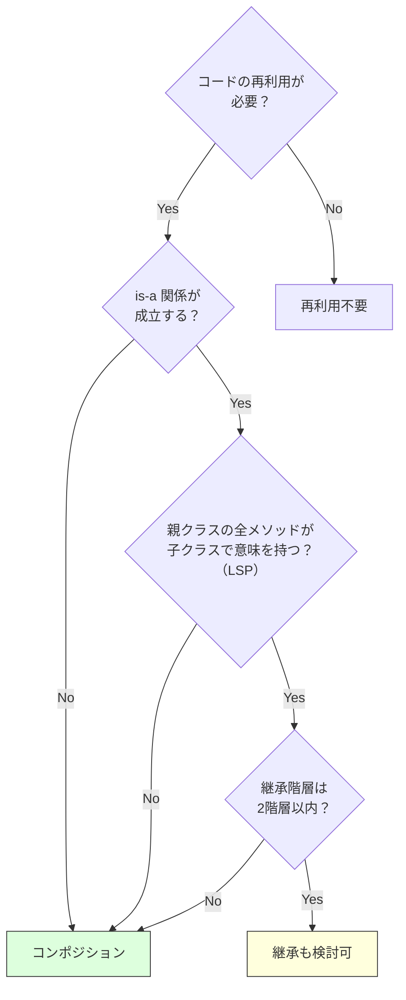

# コンポジション over 継承（Composition over Inheritance）

> **一言で言うと:** 機能の再利用には継承よりもコンポジション（委譲）を優先せよ。継承は最も強い結合であり、親クラスの変更が全ての子クラスに波及する。

## 概念

GoF（Gang of Four）の *Design Patterns*（1994年）で提唱された原則:

> Favor object composition over class inheritance.

**継承（Inheritance）** は「is-a」関係を表現し、親クラスの実装をそのまま引き継ぐ。**コンポジション（Composition）** は「has-a」関係を表現し、別のオブジェクトに処理を委譲する。

## なぜ継承が問題になるのか

### 1. 強い結合

継承は最も強い結合形態。子クラスは親クラスの public/protected メンバー全てに依存する。親クラスの内部実装を変更するだけで、全ての子クラスが影響を受ける可能性がある。

### 2. 脆い基底クラス問題（Fragile Base Class Problem）

親クラスに安全に見える変更を加えても、子クラスがオーバーライドしたメソッドとの相互作用で予期しない挙動が発生する。

```typescript
// 親クラス
class Collection {
  protected items: string[] = [];

  add(item: string) {
    this.items.push(item);
  }

  addAll(items: string[]) {
    for (const item of items) {
      this.add(item); // 内部で add() を呼んでいる
    }
  }
}

// 子クラス: 追加回数をカウントしたい
class CountingCollection extends Collection {
  count = 0;

  add(item: string) {
    this.count++;
    super.add(item);
  }

  addAll(items: string[]) {
    this.count += items.length;
    super.addAll(items); // ← 内部で this.add() が呼ばれ、count が二重加算される！
  }
}

const c = new CountingCollection();
c.addAll(['a', 'b', 'c']);
console.log(c.count); // 期待: 3, 実際: 6
```

この問題は親クラスの実装詳細（`addAll` が内部で `add` を呼ぶ）に子クラスが依存していることで起きる。親クラスの実装を変更すると子クラスが壊れるため、[[SOLID原則]]のリスコフの置換原則（LSP）違反にもつながる。

### 3. 多重継承の不在

多くの言語（Java, PHP, TypeScript, C#）は多重継承をサポートしない。「ログ機能」と「キャッシュ機能」の両方を継承で取り込むことはできない。コンポジションならば任意の数の機能を組み合わせられる。

## 具体例

### 継承 → コンポジションへのリファクタリング

```typescript
// ❌ 継承: 「ログ付きリポジトリ」を継承で実現
class UserRepository {
  async findById(id: string): Promise<User | null> {
    return db.query('SELECT * FROM users WHERE id = $1', [id]);
  }
}

class LoggingUserRepository extends UserRepository {
  async findById(id: string): Promise<User | null> {
    console.log(`Finding user: ${id}`);
    const user = await super.findById(id);
    console.log(`Found: ${user ? 'yes' : 'no'}`);
    return user;
  }
}

// UserRepository の実装変更が LoggingUserRepository を壊す可能性あり
// CachingUserRepository も作りたい → 多重継承が必要になる

// ✅ コンポジション: 機能を独立したオブジェクトとして組み合わせる
interface UserRepository {
  findById(id: string): Promise<User | null>;
}

class PostgresUserRepository implements UserRepository {
  async findById(id: string): Promise<User | null> {
    return db.query('SELECT * FROM users WHERE id = $1', [id]);
  }
}

class LoggingRepository implements UserRepository {
  constructor(private inner: UserRepository) {}

  async findById(id: string): Promise<User | null> {
    console.log(`Finding user: ${id}`);
    const user = await this.inner.findById(id);
    console.log(`Found: ${user ? 'yes' : 'no'}`);
    return user;
  }
}

class CachingRepository implements UserRepository {
  private cache = new Map<string, User>();
  constructor(private inner: UserRepository) {}

  async findById(id: string): Promise<User | null> {
    if (this.cache.has(id)) return this.cache.get(id)!;
    const user = await this.inner.findById(id);
    if (user) this.cache.set(id, user);
    return user;
  }
}

// 自由に組み合わせ可能（デコレータパターン）
const repo = new LoggingRepository(
  new CachingRepository(
    new PostgresUserRepository()
  )
);
```

### React における実践

React ではクラスコンポーネントの継承よりも、コンポジションが公式に推奨されている。

```tsx
// ❌ 継承: React では非推奨
class SpecialButton extends Button {
  render() {
    return <button className="special">{super.render()}</button>;
  }
}

// ✅ コンポジション: children や props で合成
function Button({ variant, children, ...props }: ButtonProps) {
  return (
    <button className={`btn btn-${variant}`} {...props}>
      {children}
    </button>
  );
}

// 使用側で自由に合成
<Button variant="primary">
  <Icon name="save" /> 保存
</Button>
```

### PHP/Laravel での実践: Trait によるコンポジション

```php
// PHP では Trait がコンポジションの軽量な実現手段
trait HasTimestamps {
    public function getCreatedAt(): DateTimeInterface { /* ... */ }
    public function touch(): void { /* ... */ }
}

trait SoftDeletes {
    public function softDelete(): void { /* ... */ }
    public function restore(): void { /* ... */ }
}

// 継承なしで複数の機能を合成
class User extends Model {
    use HasTimestamps, SoftDeletes;
}
```

### Go での実践: 言語が継承を持たず、コンポジションを強制する

[[Go]] は他の OOP 言語と決定的に違い、**そもそもクラスも継承も存在しない**。コードの再利用は3つの機構だけで行う:

1. **構造体埋め込み**（Struct Embedding）— 匿名フィールドによる合成
2. **メソッド昇格**（Method Promotion）— 埋め込んだ型のメソッドが外側の型から直接呼べる
3. **インターフェース埋め込み**（Interface Embedding）— インターフェース同士を合成

「コンポジションを優先せよ」という原則は他言語では選択だが、**Go ではこれが言語仕様によって強制される**。「`extends` を書こうとしても書けない」のが Go の独自性。

#### 構造体埋め込みとメソッド昇格

```go
// 機能1: タイムスタンプ
type Timestamps struct {
    CreatedAt time.Time
    UpdatedAt time.Time
}

func (t *Timestamps) Touch() {
    t.UpdatedAt = time.Now()
}

// 機能2: ソフト削除
type SoftDelete struct {
    DeletedAt *time.Time
}

func (s *SoftDelete) Delete() {
    now := time.Now()
    s.DeletedAt = &now
}

// User は両方の機能を「埋め込み」で取り込む（フィールド名なし = 匿名フィールド）
type User struct {
    ID    int
    Name  string
    Timestamps  // ← 埋め込み（has-a だが書き味は継承的）
    SoftDelete  // ← 埋め込み
}

func main() {
    u := &User{ID: 1, Name: "Alice"}
    u.Touch()   // Timestamps.Touch() が昇格していて直接呼べる
    u.Delete()  // SoftDelete.Delete() も同様

    // 内部的には委譲: u.Touch() ≡ u.Timestamps.Touch()
    fmt.Println(u.Timestamps.UpdatedAt) // 明示的にもアクセス可能
}
```

**ポイント**: 見た目は継承に似ているが、Go の埋め込みは**フィールドへの自動委譲のシンタックスシュガー**であり、is-a 関係ではない。`*User` は `*Timestamps` として渡せない（型が違う）。

#### 同じ Repository パターンを Go で

TypeScript で示した「Repository + Logger + Cache」のデコレータパターンは、Go では構造体埋め込みとインターフェースで自然に書ける:

```go
type UserRepository interface {
    FindByID(ctx context.Context, id string) (*User, error)
}

// 実装
type postgresUserRepo struct {
    db *sql.DB
}

func (r *postgresUserRepo) FindByID(ctx context.Context, id string) (*User, error) {
    // ...DBクエリ
    return &User{}, nil
}

// ロギングデコレータ — 埋め込みで継承的に書く
type loggingRepo struct {
    UserRepository  // ← 匿名埋め込み: 未オーバーライドのメソッドはこれが提供
    log *slog.Logger
}

func (r *loggingRepo) FindByID(ctx context.Context, id string) (*User, error) {
    r.log.Info("finding user", "id", id)
    return r.UserRepository.FindByID(ctx, id) // 内側の実装を呼ぶ
}

// 自由に組み合わせ可能
repo := &loggingRepo{
    UserRepository: &postgresUserRepo{db: db},
    log:            logger,
}
```

`loggingRepo` は `UserRepository` を「埋め込んでいる」ため、自動的に `UserRepository` インターフェースを満たす（実装しないメソッドは内側に委譲される）。**これはどの OOP 言語でも書きづらいパターンが、Go では言語の素機能として表現できる**例。

#### インターフェース埋め込み — 標準ライブラリの実例

```go
// io パッケージ — 小さなインターフェースの合成
type Reader interface {
    Read(p []byte) (n int, err error)
}

type Writer interface {
    Write(p []byte) (n int, err error)
}

type Closer interface {
    Close() error
}

// インターフェース同士を合成
type ReadWriter interface {
    Reader
    Writer
}

type ReadWriteCloser interface {
    Reader
    Writer
    Closer
}

// io.Copy は Reader と Writer の最小要求のみ
func Copy(dst Writer, src Reader) (written int64, err error) {
    // *os.File も bytes.Buffer も net.Conn も渡せる
}
```

**Goの哲学**: 「**The bigger the interface, the weaker the abstraction**」（Rob Pike）— インターフェースが大きいほど抽象が弱くなる。小さなインターフェースを合成して大きなものを作る。

#### Go の埋め込みの落とし穴

```go
// 同名メソッドの曖昧性
type A struct{}
func (A) Hello() { fmt.Println("A") }

type B struct{}
func (B) Hello() { fmt.Println("B") }

type C struct {
    A
    B
}

c := C{}
c.Hello() // ❌ コンパイルエラー: ambiguous selector
c.A.Hello() // ✅ 明示的にアクセス
```

埋め込みはダイヤモンド継承のような曖昧さを生むことがあり、その場合**コンパイラが必ずエラーを出す**（C++ の virtual 継承のような暗黙の解決はしない）。

詳細は[[Goの埋め込みとメソッド昇格]]（今後作成予定）も参照。

## 継承が適切な場面

コンポジションを優先すべきだが、継承が正当化される場面もある:

1. **フレームワークが要求する場合** — `React.Component`、Laravel の `Controller extends BaseController` など。フレームワークの設計に従う
2. **真の is-a 関係** — `HttpError extends Error` のように、振る舞いレベルで完全に互換性がある場合
3. **テンプレートメソッドパターン** — アルゴリズムの骨格を親クラスで定義し、一部のステップだけ子クラスでカスタマイズする。ただし深い継承階層は避ける（2階層まで）

## 判断のフローチャート



## 落とし穴

### 1. コンポジションの過剰な適用

「継承は全て悪」と解釈して、フレームワークの規約に反してまで回避するのは行き過ぎ。また、`Error` や `Event` のような薄い継承（フィールド追加程度）まで避ける必要はない。

### 2. 委譲コードのボイラープレート

コンポジションでは委譲のためのメソッドを書く必要がある。TypeScript のようにインターフェースの自動実装がない言語では、ラッパーメソッドが増えることがある。これはトレードオフとして受け入れるか、Proxy パターンで軽減する。

## 参考リソース

- *Design Patterns* — GoF（「継承よりコンポジション」の原典）
- *Effective Java* (3rd Edition) — Joshua Bloch（Item 18: "Favor composition over inheritance" の詳細な解説）
- React 公式ドキュメント "Composition vs Inheritance" — react.dev
