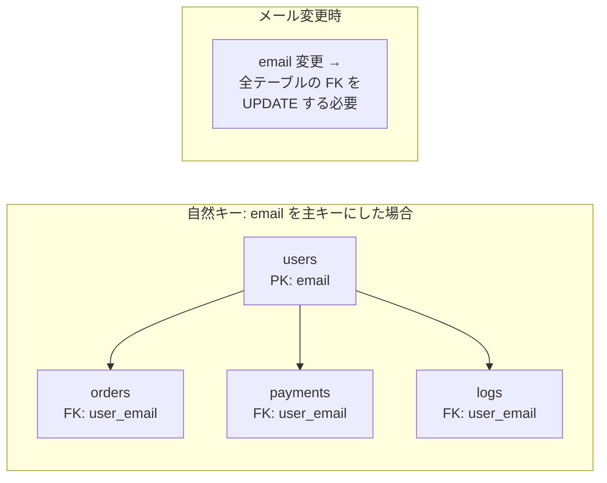
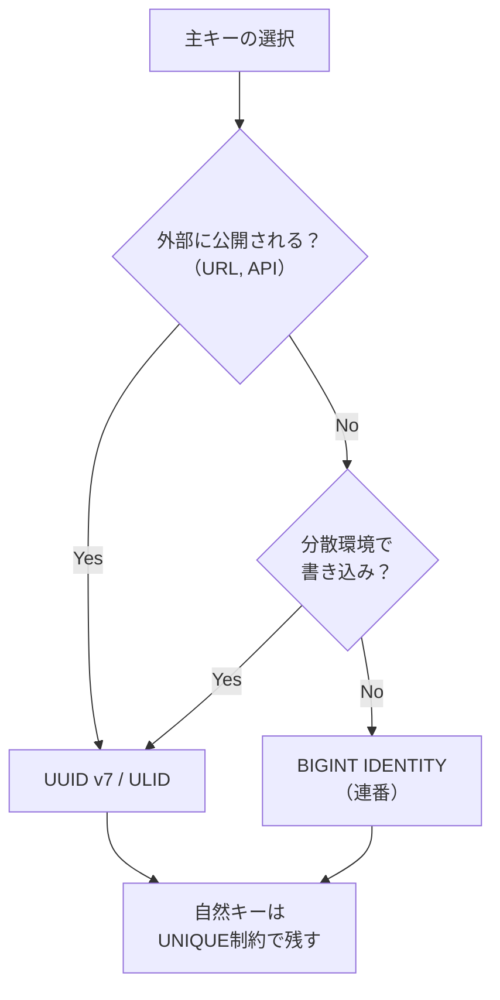

# サロゲートキーと自然キー（Surrogate Key vs Natural Key）

> **一言で言うと:** サロゲートキー（Surrogate Key）はデータベースが自動生成する意味を持たない識別子であり、自然キー（Natural Key）はビジネス上の意味を持つ属性を主キーにしたもの。実務ではサロゲートキーが推奨されるが、その理由を理解することが重要。

## 2つのキーの本質的な違い

| 観点 | 自然キー | サロゲートキー |
|------|---------|--------------|
| **定義** | ビジネス上の意味を持つ属性（メールアドレス、社員番号等） | システムが自動生成する意味のないID |
| **不変性** | 変更される可能性がある | 一度生成されたら変更されない |
| **外部依存** | ビジネスルールに依存する | データベース内部で完結する |
| **例** | `email`, `isbn`, `social_security_number` | `SERIAL`, `BIGINT IDENTITY`, `UUID` |

なぜサロゲートキーが推奨されるかを理解するには、主キーが持つべき性質を知る必要がある:

1. **一意性（Uniqueness）** — 行を一意に識別できること
2. **不変性（Immutability）** — 一度決まったら変わらないこと
3. **非NULL** — 値が常に存在すること

自然キーは 1 と 3 を満たせることが多いが、**2 の不変性を保証できないケースが多い**。メールアドレスは変更されうるし、社員番号も組織再編で体系が変わることがある。主キーが変更されると、それを外部キーとして参照しているすべてのテーブルで連鎖的な更新が必要になる。



## サロゲートキーの種類と選択

### 連番型（SERIAL / IDENTITY）

データベースが自動で連番を採番する。

```sql
-- PostgreSQL: IDENTITY（SQL標準、推奨）
CREATE TABLE users (
    id BIGINT GENERATED ALWAYS AS IDENTITY PRIMARY KEY,
    email VARCHAR(255) UNIQUE NOT NULL
);

-- MySQL: AUTO_INCREMENT
CREATE TABLE users (
    id BIGINT AUTO_INCREMENT PRIMARY KEY,
    email VARCHAR(255) UNIQUE NOT NULL
);
```

**利点:**
- 小さい（8バイト）のでインデックスが効率的
- 時系列順にソート可能
- 人間が読みやすい

**欠点:**
- 分散環境で衝突する（複数DBノードが同時に採番すると重複の可能性）
- 連番から総レコード数やビジネス規模が推測される（セキュリティ上の懸念）
- INSERT 前にIDが確定しない

### UUID（Universally Unique Identifier）

128ビットのグローバルに一意な識別子。バージョンによって生成方法が異なる。

```sql
-- PostgreSQL: uuid-ossp 拡張 または組み込みの gen_random_uuid()
CREATE EXTENSION IF NOT EXISTS "uuid-ossp";

CREATE TABLE orders (
    id UUID PRIMARY KEY DEFAULT gen_random_uuid(),  -- v4: ランダム
    user_id BIGINT NOT NULL REFERENCES users(id)
);
```

| バージョン | 生成方法 | 特徴 |
|-----------|---------|------|
| **v4** | 完全ランダム | 最も一般的だが、ソート不可・インデックス断片化 |
| **v7** | タイムスタンプ + ランダム | 時系列ソート可能、B-Tree と相性が良い（**推奨**） |

**UUID v4 の問題:** ランダム値のため、B-Tree [[インデックス]]への挿入がランダムな位置になり、ページ分割が頻発する。大量データでは連番型と比較して INSERT 性能が著しく低下する。

**UUID v7 がこれを解決する:** 先頭48ビットにUnixタイムスタンプ（ミリ秒）を含むため、時系列順に単調増加する。B-Tree への挿入は常に末尾付近で行われ、連番型と同等の INSERT 性能を実現する。

### ULID（Universally Unique Lexicographically Sortable Identifier）

UUID v7 と同様に時系列ソート可能だが、Base32エンコードで人間が読みやすい。

```
01ARZ3NDEKTSV4RRFFQ69G5FAV
|----------|--------------|
 タイムスタンプ   ランダム部
  (48bit)      (80bit)
```

## コード例

### TypeScript — UUID v7 の生成と使用

```typescript
import { randomUUID } from "node:crypto";
import { uuidv7 } from "uuidv7"; // npm install uuidv7

// UUID v4（Node.js 組み込み）
const idV4 = randomUUID();
console.log(idV4); // "f47ac10b-58cc-4372-a567-0e02b2c3d479"

// UUID v7（時系列ソート可能）
const idV7 = uuidv7();
console.log(idV7); // "018f3b3c-1234-7abc-8def-0123456789ab"

// UUID v7 は文字列比較で時系列ソートできる
const ids = [uuidv7(), uuidv7(), uuidv7()];
ids.sort(); // 生成順にソートされる

// ORM での使用例（Prisma 風）
interface User {
  id: string;       // UUID v7
  email: string;
  createdAt: Date;
}

async function createUser(email: string): Promise<User> {
  return await prisma.user.create({
    data: {
      id: uuidv7(),  // アプリ側でID生成 → INSERT前にIDが確定
      email,
    },
  });
}
```

### Go — 連番 ID と UUID の使い分け

```go
package main

import (
	"database/sql"
	"fmt"
	"log"

	"github.com/google/uuid" // go get github.com/google/uuid
	_ "github.com/lib/pq"
)

// 内部テーブル: 連番IDで十分
type User struct {
	ID    int64  // BIGINT IDENTITY
	Email string
}

// 外部公開するリソース: UUID v7 で外部から推測不可に
type Order struct {
	ID     uuid.UUID // UUID v7
	UserID int64
	Amount float64
}

func main() {
	db, err := sql.Open("postgres", "postgres://localhost/mydb?sslmode=disable")
	if err != nil {
		log.Fatal(err)
	}
	defer db.Close()

	// 連番ID: DB 側で生成
	var userID int64
	err = db.QueryRow(
		"INSERT INTO users (email) VALUES ($1) RETURNING id",
		"taro@example.com",
	).Scan(&userID)
	if err != nil {
		log.Fatal(err)
	}
	fmt.Printf("User ID: %d\n", userID) // User ID: 1

	// UUID v7: アプリ側で生成（INSERT前にIDが確定）
	orderID, _ := uuid.NewV7()
	_, err = db.Exec(
		"INSERT INTO orders (id, user_id, amount) VALUES ($1, $2, $3)",
		orderID, userID, 9800.0,
	)
	if err != nil {
		log.Fatal(err)
	}
	fmt.Printf("Order ID: %s\n", orderID)
	// Order ID: 018f3b3c-... (時系列ソート可能)
}
```

### PostgreSQL — スキーマ設計の実例

```sql
-- 内部的に参照されるテーブル: 連番IDが効率的
CREATE TABLE users (
    id BIGINT GENERATED ALWAYS AS IDENTITY PRIMARY KEY,
    -- email は UNIQUE 制約で一意性を保証（自然キーとしてではなく）
    email VARCHAR(255) UNIQUE NOT NULL,
    name VARCHAR(100) NOT NULL,
    created_at TIMESTAMPTZ NOT NULL DEFAULT NOW()
);

-- 外部公開される（URLに含まれる等）テーブル: UUID v7
CREATE TABLE orders (
    id UUID PRIMARY KEY DEFAULT gen_random_uuid(), -- v7 対応関数があれば置換
    user_id BIGINT NOT NULL REFERENCES users(id) ON DELETE RESTRICT,
    amount DECIMAL(10,2) NOT NULL,
    created_at TIMESTAMPTZ NOT NULL DEFAULT NOW()
);

-- 自然キーは UNIQUE 制約として残す（検索用）
CREATE TABLE products (
    id BIGINT GENERATED ALWAYS AS IDENTITY PRIMARY KEY,
    sku VARCHAR(50) UNIQUE NOT NULL,  -- SKUは自然キーだが、PKにはしない
    name VARCHAR(200) NOT NULL,
    price DECIMAL(10,2) NOT NULL
);

-- products.sku で検索しつつ、FK は products.id を使う
CREATE TABLE order_items (
    id BIGINT GENERATED ALWAYS AS IDENTITY PRIMARY KEY,
    order_id UUID NOT NULL REFERENCES orders(id),
    product_id BIGINT NOT NULL REFERENCES products(id), -- sku ではなく id で参照
    quantity INT NOT NULL CHECK (quantity > 0)
);
```

## よくある落とし穴

### 1. UUID v4 を大量データの主キーに使い、性能劣化に気づかない

UUID v4 はランダムなため、数百万行を超えると B-Tree のページ分割が頻発しINSERT性能が大幅に劣化する。`pg_stat_user_tables` でテーブルの膨張（bloat）を監視していれば気づけるが、見落とされやすい。UUID v7 またはULIDへの移行を検討する。

### 2. 連番IDをURLやAPIレスポンスにそのまま露出する

`/users/1`, `/users/2` のようなURLは、総ユーザー数の推測やIDの列挙攻撃（IDOR: Insecure Direct Object Reference）を可能にする。外部に公開するリソースにはUUIDを使うか、別途公開用の識別子を持たせる。

### 3. 自然キーの「変更されない」という思い込み

「社員番号は絶対に変わらない」「ISBN は永久に一意」という前提は、組織再編や規格変更で崩壊する。自然キーは UNIQUE 制約として残しつつ、主キーにはサロゲートキーを使うのが安全。

### 4. 複合主キー（Composite Primary Key）の多用

複合主キーは外部キーの定義が複雑になり、ORM との相性も悪い。中間テーブル以外では避けるのが実務的。

```sql
-- 避けたい: 複合主キー
CREATE TABLE enrollments (
    student_id BIGINT REFERENCES students(id),
    course_id BIGINT REFERENCES courses(id),
    PRIMARY KEY (student_id, course_id)  -- 他テーブルから参照しづらい
);

-- 推奨: サロゲートキー + UNIQUE制約
CREATE TABLE enrollments (
    id BIGINT GENERATED ALWAYS AS IDENTITY PRIMARY KEY,
    student_id BIGINT NOT NULL REFERENCES students(id),
    course_id BIGINT NOT NULL REFERENCES courses(id),
    UNIQUE (student_id, course_id)
);
```

## AIによる実装のアンチパターン

| アンチパターン | なぜ問題か | 対策 |
|---|---|---|
| 全テーブルに UUID v4 を一律適用 | 内部テーブルには不要なオーバーヘッド（16バイト vs 8バイト）でインデックスが肥大化する | 外部公開するリソースのみUUID、内部は連番で十分 |
| ID生成ライブラリの過剰ラップ | UUID生成をさらに抽象化して「IDファクトリ」を作るが、振る舞いが1つしかない | 標準ライブラリの関数を直接呼ぶ |
| `SERIAL` の使用（PostgreSQL） | `SERIAL` は古い構文で、`GENERATED ALWAYS AS IDENTITY` がSQL標準かつ安全 | `IDENTITY` を使う |

## 実務での使い分け指針



## 関連トピック

- [[RDB]] — 親トピック。テーブル設計のベストプラクティスでサロゲートキーを推奨
- [[インデックス]] — UUID v4 vs v7 のB-Tree性能差を理解するにはインデックスの内部構造の知識が必要
- [[マイグレーション]] — 主キー戦略の変更は大規模なマイグレーションを伴う
