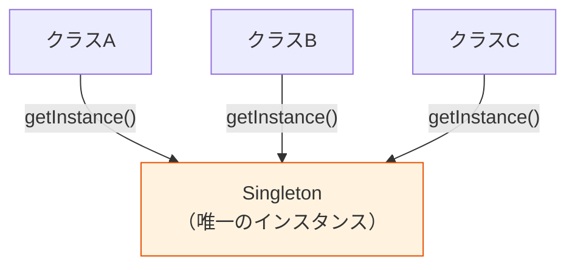

# シングルトンパターン（Singleton Pattern）

> **一言で言うと:** アプリケーション全体でインスタンスが1つだけ存在することを保証するデザインパターン。便利だが、グローバル状態・テスト困難・並行性の問題を招きやすく、多くの場合 DI（依存性注入）で代替すべき「アンチパターン寄りのパターン」。

## 概念

シングルトンは GoF（Gang of Four）デザインパターンの1つで、以下の2つを保証する:

1. **クラスのインスタンスが1つしか存在しないこと**
2. **そのインスタンスへのグローバルなアクセスポイントがあること**



### いつ「1つだけ」が必要か

シングルトンが正当化されるのは、**複数のインスタンスが存在すると矛盾が生じる**場合に限られる:

- データベースの[[コネクションプール]] — プールが複数あるとコネクション数の制御ができない
- ロガー — ログの出力先や設定が分裂すると運用上問題になる
- 設定オブジェクト — アプリケーション設定が複数存在すると整合性が取れない

## コード例

### TypeScript — モジュールスコープのシングルトン

TypeScript / JavaScript ではモジュール自体がシングルトンとして機能する。ES Modules は一度だけ評価され、以降はキャッシュされた結果が返る。

```typescript
// db.ts — モジュールスコープのシングルトン（推奨）
import { Pool } from "pg";

// このモジュールを何回 import しても Pool は1つだけ
const pool = new Pool({
  connectionString: process.env.DATABASE_URL,
  max: 20,
});

export { pool };
```

```typescript
// クラスベースのシングルトン（通常は不要だが理解用）
class AppConfig {
  private static instance: AppConfig | null = null;
  readonly apiUrl: string;

  private constructor() {
    this.apiUrl = process.env.API_URL ?? "http://localhost:3000";
  }

  static getInstance(): AppConfig {
    if (!AppConfig.instance) {
      AppConfig.instance = new AppConfig();
    }
    return AppConfig.instance;
  }
}

// どこから呼んでも同じインスタンス
const config1 = AppConfig.getInstance();
const config2 = AppConfig.getInstance();
console.log(config1 === config2); // true
```

### Go — `sync.Once` によるスレッドセーフな初期化

Go にはクラスがないため、パッケージレベル変数と `sync.Once` でシングルトンを実現する。

```go
package database

import (
	"database/sql"
	"sync"
)

var (
	db   *sql.DB
	once sync.Once
)

// GetDB は DB 接続のシングルトンを返す。
// sync.Once により、複数の goroutine から同時に呼ばれても初期化は1回だけ実行される。
func GetDB() *sql.DB {
	once.Do(func() {
		var err error
		db, err = sql.Open("postgres", "postgres://...")
		if err != nil {
			panic(err) // 起動時に失敗するなら即終了
		}
		db.SetMaxOpenConns(20)
	})
	return db
}
```

### PHP — Laravel のサービスコンテナでのシングルトン

```php
// AppServiceProvider.php
// Laravel ではサービスコンテナに「シングルトン」として登録する。
// DI コンテナが生存期間を管理するため、クラス自体にシングルトンロジックは不要。
class AppServiceProvider extends ServiceProvider
{
    public function register(): void
    {
        // singleton() で登録すると、コンテナから解決するたびに同じインスタンスが返る
        $this->app->singleton(PaymentGateway::class, function ($app) {
            return new StripeGateway(config('services.stripe.secret'));
        });
    }
}

// 利用側 — コンストラクタインジェクション（クラスは Singleton を知らない）
class OrderService
{
    public function __construct(private PaymentGateway $payment) {}
}
```

### Python — モジュールレベルのシングルトン

```python
# config.py — Python のモジュールもシングルトンとして機能する
import os

class _Config:
    def __init__(self):
        self.api_url = os.getenv("API_URL", "http://localhost:3000")
        self.debug = os.getenv("DEBUG", "false").lower() == "true"

# モジュールレベルでインスタンス化 → import するたびに同じオブジェクト
config = _Config()
```

## なぜシングルトンは問題になるのか

### 1. グローバル状態 = 隠れた依存関係

シングルトンはグローバル変数の亜種。依存関係がコンストラクタに現れないため、コードを読むだけではどのクラスが何に依存しているか分からない。

```typescript
// ❌ 隠れた依存 — UserService が Database に依存していることがシグネチャから読めない
class UserService {
  async findUser(id: string) {
    return Database.getInstance().query("SELECT * FROM users WHERE id = $1", [id]);
  }
}

// ✅ 明示的な依存 — コンストラクタを見れば依存が分かる
class UserService {
  constructor(private db: Database) {}

  async findUser(id: string) {
    return this.db.query("SELECT * FROM users WHERE id = $1", [id]);
  }
}
```

### 2. テストが困難

シングルトンはテスト間で状態が残る。テスト A で変更したシングルトンの状態がテスト B に影響する。

```typescript
// ❌ シングルトンに依存したコードのテスト
test("ユーザー作成", async () => {
  // Database.getInstance() がテスト用DBを返すように差し替える方法がない
  // （グローバルな状態をモンキーパッチするしかない）
  const service = new UserService();
  await service.createUser({ name: "test" });
});

// ✅ DI なら簡単にテスト用の実装を注入できる
test("ユーザー作成", async () => {
  const mockDb = { query: vi.fn().mockResolvedValue({ id: "1", name: "test" }) };
  const service = new UserService(mockDb);
  await service.createUser({ name: "test" });
  expect(mockDb.query).toHaveBeenCalled();
});
```

### 3. SSR 環境でのリクエスト間状態リーク

[[SSR-SSG-CSR|SSR]] 環境ではサーバープロセスが複数リクエストを処理する。モジュールスコープのシングルトンに「リクエスト固有の状態」を持たせると、異なるユーザーのデータが混在する深刻なバグになる。

```typescript
// ❌ リクエスト間で状態がリークする
let currentUser: User | null = null; // モジュールスコープ = プロセス全体で共有

export function setCurrentUser(user: User) {
  currentUser = user; // ユーザーAの情報がユーザーBのリクエストで読める
}
```

### 4. 並行処理での競合

マルチスレッド環境（Go, Java, Ruby with Ractor 等）では、シングルトンの初期化と状態更新で[[ロック|競合状態]]が発生しうる。Go の `sync.Once` や Java の `enum Singleton` のようなスレッドセーフな実装が必要。

## シングルトン vs DI コンテナ

| 観点 | シングルトンパターン | [[DIコンテナ]] |
|------|-------------------|-------------|
| インスタンスの生存期間管理 | クラス自身が管理 | コンテナが管理 |
| 依存関係の可視性 | 隠れる（`getInstance()` がどこでも呼べる） | 明示的（コンストラクタ引数） |
| テスト時の差し替え | 困難（グローバル状態の書き換えが必要） | 容易（テスト用の実装を注入） |
| [[SOLID原則]]との整合性 | DIP 違反（具体クラスに直接依存） | DIP 準拠（抽象に依存） |

**結論:** 「インスタンスが1つ」という要件は、クラス自身ではなく**DI コンテナのスコープ設定**で実現する方が、テスタビリティと設計の柔軟性の両方で優れる。

## よくある落とし穴

### 1. 「便利だから」でシングルトンを使う

「どこからでもアクセスできる」便利さはグローバル変数と同じ誘惑。依存関係が暗黙的になり、コードベースが大きくなるほど影響範囲の把握が困難になる。

### 2. シングルトンに状態を持たせすぎる

設定値のような不変データの保持は問題ないが、リクエストごとに変わる状態（認証ユーザー、カート内容等）をシングルトンに持たせると、特にサーバーサイドで深刻なバグになる。

### 3. テストでシングルトンのリセットを忘れる

やむを得ずシングルトンを使う場合、テストのセットアップ/ティアダウンでリセット処理が必要。これを忘れるとテストの実行順序に依存する不安定なテストスイートになる。

## 関連トピック

- [[SOLID原則]] — シングルトンは DIP（依存性逆転の原則）に反しやすい。DI で代替することが推奨される
- [[DIコンテナ]] — シングルトンの「インスタンスが1つ」という要件を、クラスではなくコンテナのスコープで管理する
- [[コネクションプール]] — シングルトンが正当化される代表例
- [[SSR-SSG-CSR]] — SSR 環境でのシングルトン状態リークは頻出バグ
- [[メモリリーク]] — シングルトンが参照を保持し続けることで GC されない問題
- [[ロック]] — マルチスレッド環境でのシングルトン初期化の競合

## 参考リソース

- *Design Patterns* — GoF（Singleton パターンの原典）
- *Dependency Injection: Principles, Practices, and Patterns* — Mark Seemann（シングルトンの問題点と DI による代替を詳述）
- *Clean Code* — Robert C. Martin（グローバル状態の害悪とテスタビリティの関係）
