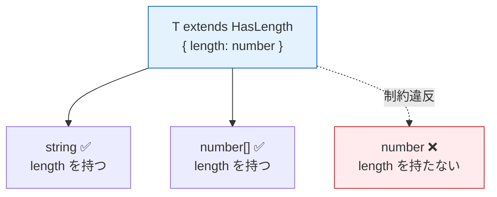

# ジェネリクス（Generics）

> **一言で言うと:** 型をパラメータとして受け取り、データ構造やアルゴリズムを「どんな型にも使える形」で定義する仕組み。型安全性を保ちつつコードの再利用性を実現する、パラメトリック多態性（Parametric Polymorphism）の実装手法。

## なぜ必要か

ジェネリクスがない世界では、型安全性と再利用性がトレードオフになる。

```
型安全だが再利用できない:
  IntArray    → push(int), pop(): int
  StringArray → push(string), pop(): string
  UserArray   → push(User), pop(): User
  ...型ごとに同じコードをコピペ

再利用できるが型安全でない:
  AnyArray → push(any), pop(): any
  ...何でも入るが、取り出すとき「何が入っているか」わからない
```

ジェネリクスはこの二択を解消する。**型をパラメータ化**することで、1つの定義で全ての型に対応しつつ、使用時には具体的な型が確定する。

```
Array<T> → push(T), pop(): T

Array<int>    → push(int), pop(): int      ← 型安全
Array<string> → push(string), pop(): string ← 型安全
Array<User>   → push(User), pop(): User    ← 型安全
                1つの定義で全て対応           ← 再利用可能
```

## 概念

### 型パラメータと型引数

関数の「仮引数」と「実引数」の関係と同じ構造がある。

| 用語 | 関数の場合 | ジェネリクスの場合 |
|------|-----------|------------------|
| 定義側（パラメータ） | `function f(x: number)` の `x` | `Array<T>` の `T` |
| 使用側（引数） | `f(42)` の `42` | `Array<string>` の `string` |

型パラメータの命名慣習:

| 名前 | 意味 | 使用場面 |
|------|------|---------|
| `T` | Type | 汎用的な型パラメータ |
| `K`, `V` | Key, Value | マップ・辞書系 |
| `E` | Element | コレクションの要素 |
| `R` | Return | 戻り値の型 |

### 制約（Bounded Generics）

「何でも受け入れる」のでは広すぎる場合、型パラメータに制約（上界）をつけて、特定のインターフェースや性質を持つ型に限定する。



制約をつけることで、型パラメータに対して「その構造のプロパティやメソッドを使える」ことがコンパイル時に保証される。この例は後述のコード例 `longest` 関数と対応している。

### 型消去（Type Erasure）と型具現化（Reification）

ジェネリクスの実行時の扱いは言語によって大きく異なる。

| 方式 | 言語 | 実行時に型情報が… | 影響 |
|------|------|------------------|------|
| 型消去（Type Erasure） | Java, TypeScript | **残らない** | `instanceof T` ができない、実行時の型判定に制約 |
| 型具現化（Reification） | C# | **残る** | `typeof(T)` で実行時に型を参照可能、JIT が型ごとに最適化 |
| モノモーフィゼーション（Monomorphization） | Rust, Go | **残らない**（コンパイル時に展開済み） | 型ごとに専用コードが生成される、バイナリサイズが増大 |

TypeScript のジェネリクスはコンパイル後の JavaScript には一切残らない。これは「開発時の安全ネット」であり、実行時の機能ではない。

## コード例

### TypeScript — ジェネリック関数と制約

```typescript
// 基本: 型パラメータを持つ関数
function first<T>(arr: T[]): T | undefined {
  return arr[0];
}

const n = first([1, 2, 3]);       // n: number | undefined
const s = first(["a", "b", "c"]); // s: string | undefined

// 制約付き: length プロパティを持つ型に限定
function longest<T extends { length: number }>(a: T, b: T): T {
  return a.length >= b.length ? a : b;
}

longest("hello", "world!");   // OK: string は length を持つ
longest([1, 2], [1, 2, 3]);   // OK: 配列も length を持つ
// longest(10, 20);            // ❌ コンパイルエラー: number に length はない

// 実務例: API レスポンスのラッパー型
type ApiResponse<T> = {
  data: T;
  status: number;
  timestamp: string;
};

type User = { id: number; name: string };
type UserResponse = ApiResponse<User>;
// → { data: { id: number; name: string }, status: number, timestamp: string }

type UserListResponse = ApiResponse<User[]>;
// → { data: User[], status: number, timestamp: string }
```

### Go — 型パラメータ（Go 1.18+）

```go
package main

import "fmt"

// 制約をインターフェースで定義
type Number interface {
	int | int64 | float64
}

// ジェネリック関数: 任意の数値スライスの合計
func Sum[T Number](nums []T) T {
	var total T
	for _, n := range nums {
		total += n
	}
	return total
}

// ジェネリック型: 型安全なスタック
type Stack[T any] struct {
	items []T
}

func (s *Stack[T]) Push(item T) {
	s.items = append(s.items, item)
}

func (s *Stack[T]) Pop() (T, bool) {
	var zero T
	if len(s.items) == 0 {
		return zero, false
	}
	item := s.items[len(s.items)-1]
	s.items = s.items[:len(s.items)-1]
	return item, true
}

func main() {
	// 型推論で型引数を省略可能
	fmt.Println(Sum([]int{1, 2, 3}))         // 6
	fmt.Println(Sum([]float64{1.5, 2.5}))    // 4.0

	s := Stack[string]{}
	s.Push("hello")
	s.Push("world")
	val, _ := s.Pop()
	fmt.Println(val) // "world"
}
```

### PHP — テンプレート（PHPStan / Psalm による静的解析）

PHP にはランタイムのジェネリクスがないが、PHPDoc アノテーションと静的解析ツールで型安全性を実現する。

```php
<?php

/**
 * @template T
 */
class TypedCollection
{
    /** @var T[] */
    private array $items = [];

    /**
     * @param T $item
     */
    public function add(mixed $item): void
    {
        $this->items[] = $item;
    }

    /**
     * @return T|null
     */
    public function first(): mixed
    {
        return $this->items[0] ?? null;
    }

    /**
     * @template U
     * @param callable(T): U $fn
     * @return TypedCollection<U>
     */
    public function map(callable $fn): self
    {
        $result = new self();
        foreach ($this->items as $item) {
            $result->add($fn($item));
        }
        return $result;
    }
}

// PHPStan は以下の型を追跡する
/** @var TypedCollection<User> */
$users = new TypedCollection();
$users->add(new User('Alice'));

$names = $users->map(fn(User $u) => $u->getName());
// PHPStan 推論: TypedCollection<string>
```

### Python — typing モジュール

```python
from typing import TypeVar, Generic

T = TypeVar("T")

class Stack(Generic[T]):
    def __init__(self) -> None:
        self._items: list[T] = []

    def push(self, item: T) -> None:
        self._items.append(item)

    def pop(self) -> T:
        return self._items.pop()

# 型チェッカー（mypy）が型を追跡
stack: Stack[int] = Stack()
stack.push(1)
stack.push(2)
# stack.push("three")  # mypy エラー: str は int と互換性がない

# Python 3.12+ ではより簡潔な構文が使える
# class Stack[T]:
#     ...
```

## よくある落とし穴

### 1. 過剰な型パラメータ

```typescript
// ❌ 使用箇所が1つしかない型パラメータは不要
function print<T>(value: T): void {
  console.log(value);
}
// ✅ unknown で十分
function print(value: unknown): void {
  console.log(value);
}
```

**原則:** 型パラメータは「入力と出力の型を関連付ける」ために使う。1箇所にしか出現しない型パラメータは、`unknown` や具体的な型で代替できる。

### 2. TypeScript の型消去を忘れた実行時判定

```typescript
// ❌ コンパイルエラー: T は実行時に存在しない
function isType<T>(value: unknown): value is T {
  return value instanceof T; // T は値ではなく型
}

// ✅ 型ガード関数を具体的に書く
function isString(value: unknown): value is string {
  return typeof value === "string";
}
```

### 3. Go の `any` への逃げ

```go
// ❌ ジェネリクス導入前の癖で interface{} / any を多用
func Process(data any) any {
    // 型アサーションの嵐になる
    switch v := data.(type) {
    case string:
        return v
    case int:
        return fmt.Sprint(v)
    default:
        return nil
    }
}

// ✅ 型パラメータで制約を表現
type Processable interface {
    Process() string
}

func Process[T Processable](data T) string {
    return data.Process()
}
```

### 4. 共変性・反変性の罠

```typescript
// TypeScript の配列は共変（covariant）— 型安全でない場合がある
class Animal { name = "animal" }
class Dog extends Animal { bark() { return "woof" } }

const dogs: Dog[] = [new Dog()];
const animals: Animal[] = dogs; // OK（共変）
animals.push(new Animal());     // コンパイルは通るが…
dogs[1].bark();                 // 実行時エラー: bark is not a function
```

配列の共変性は歴史的な理由（Java の `Object[]` も同様）で許容されているが、安全ではない。`readonly` にすることで防げる。

## AIによる実装のアンチパターン

| アンチパターン | なぜ問題か | 対策 |
|---|---|---|
| **何にでもジェネリクスを付ける** — `createUser<T extends User>(data: T): T` のように、具体型で十分な場面にジェネリクスを使う | 型定義が複雑になるだけで柔軟性の向上がない。読み手の認知負荷が増える | ジェネリクスは「複数の型で再利用される」場合にのみ使う |
| **ジェネリックユーティリティの量産** — `Nullable<T>`, `AsyncResult<T, E>`, `DeepPartial<T>` などを大量に自作する | 標準の `T \| null`, `Promise<T>`, `Partial<T>` で足りる場面がほとんど。プロジェクト固有の型ユーティリティが増えすぎると新規参加者の学習コストが跳ね上がる | 言語・フレームワーク標準のユーティリティ型をまず確認する |
| **ジェネリクスで汎用性を出しすぎる** — `Repository<T, ID, Filter, Sort, Pagination>` のように型パラメータを4つ以上持つ | 使用側の記述が冗長になり、型推論が効きにくくなる。多くの場合、将来の拡張に備えた過剰設計 | 型パラメータは2つまでを目安にする。3つ以上必要なら設計を見直す |

## 実務での使用シーン

| シーン | 例 | ジェネリクスの役割 |
|--------|-----|------------------|
| API クライアント | `fetch<T>(url): Promise<T>` | レスポンスの型をエンドポイントごとに確定 |
| フォームライブラリ | `useForm<T>(defaultValues: T)` | フォームのフィールド型を推論 |
| ORM / クエリビルダ | `Repository<User>.findOne()` | テーブルごとのエンティティ型を保証 |
| 状態管理 | `createStore<T>(initial: T)` | ストアに格納する値の型を固定 |
| コレクション操作 | `Array<T>.map<U>(fn: (item: T) => U): U[]` | 変換前後の型を追跡 |

## 関連トピック

- [[データ構造とアルゴリズム]] — ジェネリクスの主要な適用先。型安全なコレクション（`Map<K, V>`, `Set<T>`, `Stack<T>`）はジェネリクスなしには実現できない
- [[ポリモーフィズムとストラテジーパターン]] — サブタイプ多態性との比較。ジェネリクスはパラメトリック多態性に分類される
- [[SOLID原則]] — 依存性逆転原則（DIP）でインターフェースをジェネリクスと組み合わせるパターン

## 参考リソース

- [TypeScript Handbook — Generics](https://www.typescriptlang.org/docs/handbook/2/generics.html) — 公式ドキュメント、制約やユーティリティ型まで網羅
- [Go Tutorial — Getting started with generics](https://go.dev/doc/tutorial/generics) — Go 1.18+ のジェネリクス入門
- [PHPStan — Generics](https://phpstan.org/blog/generics-in-php-using-phpdocs) — PHP での静的解析ベースのジェネリクス
