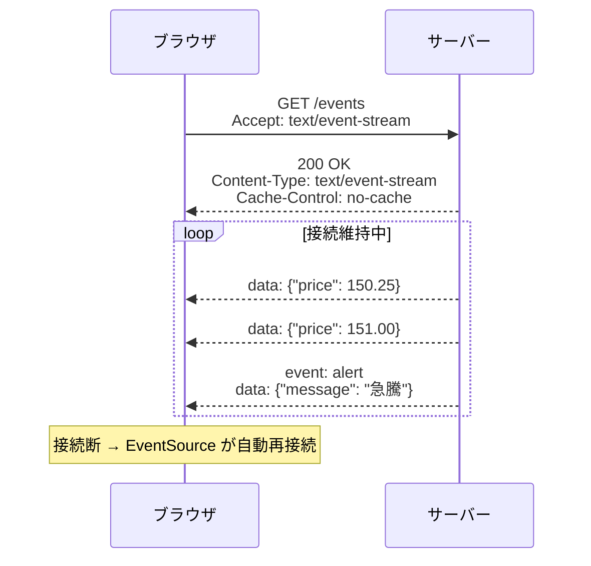

# ストリームレスポンス（Streaming Response）

> **一言で言うと:** サーバーがレスポンスボディを一括ではなく**断片的に送出**する仕組み。Chunked Transfer Encoding、Server-Sent Events（SSE）、Fetch API の ReadableStream などを用いて、大量データの段階的配信やリアルタイムイベント通知を実現する。

## なぜ必要か

通常の HTTP レスポンスは、サーバーがレスポンス全体を生成し終えてから一括で返す。しかし以下の場面ではこのモデルが破綻する:

1. **レスポンス生成に時間がかかる** — LLM の推論結果、大規模 DB クエリの結果など。全体が完成するまでクライアントが空白画面で待つのは UX として受け入れられない
2. **レスポンスの長さが事前に不明** — ログのテール、リアルタイム通知など終わりのないデータ
3. **サーバーメモリの制約** — 数 GB の CSV エクスポートを全体バッファリングするとサーバーがメモリ不足になる

ストリームレスポンスはこれらを解決するために、HTTP の「レスポンスは1回で完結する」という暗黙の前提を崩さずに、**ボディの送出だけを段階的に行う**。

## 3つの主要パターン

### 1. Chunked Transfer Encoding

HTTP/1.1 で導入された転送方式。`Content-Length` を事前に指定せず、ボディを可変長のチャンクに分割して送る。

```
HTTP/1.1 200 OK
Transfer-Encoding: chunked
Content-Type: application/json

1a\r\n                     ← チャンクサイズ（16進数: 26バイト）
{"partial":"data_chunk_1"}\r\n
1a\r\n
{"partial":"data_chunk_2"}\r\n
0\r\n                      ← サイズ0 = 終端
\r\n
```

HTTP/2 以降ではフレーミングが組み込まれているため `Transfer-Encoding: chunked` は不要（DATA フレームが自然にストリーム配信を実現する）。ただし、アプリケーションレベルでレスポンスを段階的にフラッシュする点は同じ。

### 2. Server-Sent Events（SSE）

サーバーからクライアントへの**一方向リアルタイム通知**に特化したプロトコル。HTTP 上で動作し、`text/event-stream` という Content-Type を使う。



**SSE のプロトコル形式:**

```
event: update\n          ← イベント名（省略可）
id: 42\n                 ← イベントID（再接続時に Last-Event-ID で送信）
retry: 3000\n            ← 再接続間隔（ミリ秒）
data: {"key": "value"}\n ← データ本体（複数行可）
\n                       ← イベント区切り（空行）
```

### 3. Fetch API + ReadableStream（クライアント側）

ブラウザの Fetch API はレスポンスボディを `ReadableStream` として公開しており、チャンク単位で逐次処理できる。

```mermaid
graph LR
    subgraph サーバー
        A["レスポンス生成"] -->|chunk| B["フラッシュ"]
    end

    subgraph ブラウザ
        C["fetch()"] --> D["response.body<br/>(ReadableStream)"]
        D --> E["getReader()"]
        E -->|read()| F["チャンク処理"]
        F -->|done: false| E
        F -->|done: true| G["完了"]
    end

    B -.->|HTTP| C
```

## SSE vs WebSocket — 使い分け

| 観点 | SSE | [[WebSocket]] |
|------|-----|---------------|
| 通信方向 | サーバー → クライアント（一方向） | 双方向 |
| プロトコル | HTTP そのまま | HTTP からアップグレード（独自フレーミング） |
| 再接続 | `EventSource` が自動再接続 + `Last-Event-ID` | 手動で再接続ロジックが必要 |
| プロキシ/CDN 互換性 | HTTP なので透過的に通る | Upgrade が必要で一部プロキシが対応しない |
| データ形式 | テキスト（UTF-8）のみ | テキスト + バイナリ |
| 適するユースケース | 通知、フィード更新、LLM ストリーミング | チャット、ゲーム、共同編集 |

**判断基準:** サーバーからの一方向プッシュだけで足りるなら SSE を選ぶ。双方向が必要、またはバイナリデータを流す場合のみ WebSocket を使う。SSE は HTTP インフラ（ロードバランサ、CDN、プロキシ）との互換性が圧倒的に高い。

## コード例

### TypeScript（Node.js）— SSE エンドポイント

```typescript
import { createServer, IncomingMessage, ServerResponse } from 'http';

function sseHandler(req: IncomingMessage, res: ServerResponse) {
  res.writeHead(200, {
    'Content-Type': 'text/event-stream',
    'Cache-Control': 'no-cache',
    'Connection': 'keep-alive',
  });

  let id = 0;
  const interval = setInterval(() => {
    id++;
    res.write(`id: ${id}\n`);
    res.write(`data: ${JSON.stringify({ time: new Date().toISOString() })}\n\n`);
  }, 1000);

  req.on('close', () => {
    clearInterval(interval);
  });
}

createServer((req, res) => {
  if (req.url === '/events') sseHandler(req, res);
  else res.writeHead(404).end();
}).listen(3000);
```

### TypeScript（ブラウザ）— SSE クライアント + ReadableStream

```typescript
// --- パターン1: EventSource（SSE の標準 API）---
const source = new EventSource('/events');

source.onmessage = (e) => {
  const data = JSON.parse(e.data);
  console.log(`[${e.lastEventId}]`, data);
};

source.addEventListener('alert', (e) => {
  // カスタムイベント名でのリスン
  console.warn('Alert:', JSON.parse(e.data));
});

source.onerror = () => {
  // EventSource は自動再接続する — 手動で close() しない限り復帰を試みる
  console.log('接続断 → 自動再接続中...');
};

// --- パターン2: fetch + ReadableStream（より細かい制御が必要な場合）---
async function streamFetch(url: string) {
  const res = await fetch(url);
  const reader = res.body!.getReader();
  const decoder = new TextDecoder();

  while (true) {
    const { done, value } = await reader.read();
    if (done) break;
    const text = decoder.decode(value, { stream: true });
    console.log(text); // チャンク単位で処理（実際はDOM更新等）
  }
}
```

### Go — ストリームレスポンス（Flush）

```go
package main

import (
	"encoding/json"
	"fmt"
	"net/http"
	"time"
)

func sseHandler(w http.ResponseWriter, r *http.Request) {
	flusher, ok := w.(http.Flusher)
	if !ok {
		http.Error(w, "Streaming not supported", http.StatusInternalServerError)
		return
	}

	w.Header().Set("Content-Type", "text/event-stream")
	w.Header().Set("Cache-Control", "no-cache")
	w.Header().Set("Connection", "keep-alive")

	for id := 1; ; id++ {
		select {
		case <-r.Context().Done():
			return // クライアント切断
		default:
			data, _ := json.Marshal(map[string]string{"time": time.Now().Format(time.RFC3339)})
			fmt.Fprintf(w, "id: %d\ndata: %s\n\n", id, data)
			flusher.Flush() // バッファを即座に送出
			time.Sleep(time.Second)
		}
	}
}

func main() {
	http.HandleFunc("/events", sseHandler)
	http.ListenAndServe(":8080", nil)
}
```

### Python — FastAPI での SSE

```python
import asyncio
from datetime import datetime, timezone

from fastapi import FastAPI
from fastapi.responses import StreamingResponse

app = FastAPI()


async def event_generator():
    event_id = 0
    while True:
        event_id += 1
        now = datetime.now(timezone.utc).isoformat()
        yield f"id: {event_id}\ndata: {{\"time\": \"{now}\"}}\n\n"
        await asyncio.sleep(1)


@app.get("/events")
async def sse_endpoint():
    return StreamingResponse(
        event_generator(),
        media_type="text/event-stream",
        headers={"Cache-Control": "no-cache"},
    )
```

### PHP — Laravel での SSE

```php
// routes/web.php
use Illuminate\Http\Request;
use Symfony\Component\HttpFoundation\StreamedResponse;

Route::get('/events', function (Request $request) {
    $response = new StreamedResponse(function () {
        $id = 0;
        while (true) {
            if (connection_aborted()) {
                break; // クライアント切断を検知
            }
            $id++;
            $data = json_encode(['time' => now()->toIso8601String()]);
            echo "id: {$id}\n";
            echo "data: {$data}\n\n";
            ob_flush();  // 出力バッファをフラッシュ
            flush();     // システムバッファをフラッシュ
            sleep(1);
        }
    });

    $response->headers->set('Content-Type', 'text/event-stream');
    $response->headers->set('Cache-Control', 'no-cache');
    $response->headers->set('Connection', 'keep-alive');

    return $response;
});
```

## よくある落とし穴

### 1. バッファリングによるストリーミングの無効化

リバースプロキシ（Nginx）やアプリケーションフレームワークがレスポンスをバッファリングし、チャンクがまとめて送出されることがある。これではストリーミングの意味がない。

```nginx
# Nginx: SSE エンドポイントではバッファリングを無効化する
location /events {
    proxy_pass http://backend;
    proxy_buffering off;          # レスポンスバッファリング無効
    proxy_cache off;              # キャッシュ無効
    proxy_read_timeout 3600s;     # 長時間接続を許可
    proxy_set_header Connection '';  # HTTP/2 向け
}
```

Node.js の `compression` ミドルウェアも SSE レスポンスを圧縮バッファに溜めてしまう。SSE エンドポイントでは圧縮を除外する必要がある。

### 2. `Last-Event-ID` を実装しない

SSE はネットワーク断で再接続する際、`Last-Event-ID` ヘッダを自動送信する。サーバーがこれを無視すると、再接続後にクライアントがイベントを取りこぼす。イベント ID を発行し、再接続時に欠落分を再送する設計が必要。

### 3. コネクション数の上限

ブラウザは同一ドメインに対する HTTP/1.1 の同時接続数を**6本**に制限している。SSE 接続が1本を常時占有するため、同じドメインへの他のリクエストが圧迫される。対策:

- **HTTP/2 を使う** — 1接続上に多重化されるため接続数の制限を受けない
- SSE 用のサブドメインを分ける（HTTP/1.1 環境のみ）

### 4. LLM ストリーミングでのエラーハンドリング不備

LLM API のストリーミングレスポンスは途中でエラーになることがある。ストリームの途中でエラーが発生した場合、HTTP ステータスコードはすでに 200 で送出済みのため、エラーをボディ内のイベントとして通知する設計が必要。

```
data: {"content": "回答の途中で"}

event: error
data: {"error": "rate_limit_exceeded", "message": "レート制限超過"}
```

### 5. サーバーメモリリーク — 切断検知の不備

SSE では接続が長時間維持される。クライアントが切断してもサーバー側でそれを検知しなければ、タイマーやイベントリスナーがリークする。`request.on('close')` や `r.Context().Done()` を必ず監視する。

## 実務での使用シーン

| シーン | パターン | 理由 |
|--------|----------|------|
| LLM チャット応答 | SSE | トークン単位の逐次表示。一方向で十分 |
| 株価・暗号資産のリアルタイム表示 | SSE / WebSocket | 更新頻度が高い。双方向が不要なら SSE |
| 大規模 CSV エクスポート | Chunked streaming | ファイル全体をバッファリングせずに送出 |
| CI/CD ログのリアルタイム表示 | SSE | 終了時刻が不明なログの段階的表示 |
| React Server Components | Chunked HTML streaming | サーバーで逐次レンダリングした HTML をブラウザに流す |

## AIによる実装のアンチパターン

| アンチパターン | なぜ問題か | 対策 |
|---|---|---|
| SSE レスポンスを全体バッファリングしてから返す | ストリーミングの意味が完全に失われる。全データ生成後に一括送信になる | レスポンスに書き込んだら即座に `flush()` する |
| すべてのリアルタイム通信に WebSocket を使う | SSE で十分な一方向通知にも WebSocket を導入し、再接続・認証・プロキシ対応の複雑さを抱え込む | 一方向プッシュなら SSE を優先する |
| ストリーム中のエラーを HTTP ステータスコードで返そうとする | ストリーム開始後はステータスコードが変更できない（すでに 200 を送出済み） | エラーイベントをボディ内で送信する |
| `Content-Length` ヘッダを設定する | ストリームレスポンスはサイズが事前に不明。不正確な `Content-Length` はクライアントの挙動を壊す | ストリーミング時は `Content-Length` を省略する（HTTP/1.1 では `Transfer-Encoding: chunked` が使われる） |

## 関連トピック

- [[HTTP-HTTPS]] — 親トピック。Chunked Transfer Encoding は HTTP/1.1 の転送方式、SSE は HTTP 上のプロトコル
- [[WebSocket]] — 双方向リアルタイム通信。SSE と使い分ける
- [[イベントループ]] — Node.js でストリーミングを実現する非同期 I/O モデル
- [[HTTP圧縮]] — ストリーミングと圧縮の併用にはバッファリング制御が必要

## 参考リソース

- [MDN Web Docs — Server-Sent Events](https://developer.mozilla.org/en-US/docs/Web/API/Server-sent_events) — SSE の公式リファレンス
- [MDN Web Docs — ReadableStream](https://developer.mozilla.org/en-US/docs/Web/API/ReadableStream) — Fetch API でのストリーム処理
- [HTML Living Standard — Server-Sent Events](https://html.spec.whatwg.org/multipage/server-sent-events.html) — SSE の仕様
- [RFC 9112 §7.1](https://datatracker.ietf.org/doc/html/rfc9112#section-7.1) — HTTP/1.1 Chunked Transfer Coding の仕様
