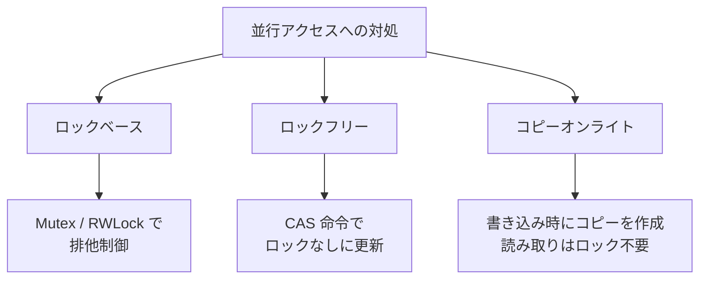

# スレッドセーフなデータ構造（Thread-Safe Data Structures）

> **一言で言うと:** 複数のスレッドやゴルーチンが同時にアクセスしても壊れないデータ構造。通常のデータ構造に「並行制御」を組み込むことで、競合状態（Race Condition）を防ぐ。

## なぜ普通のデータ構造では壊れるのか

通常の[[ハッシュテーブル]]や配列は「同時に1人だけが操作する」前提で設計されている。複数スレッドが同時に操作すると、内部状態が矛盾する。

```
スレッドA: map["key"] を挿入 → バケット配列を拡張中…
スレッドB: map["key2"] を挿入 → 拡張前のバケットに書き込む
→ データ消失、無限ループ、クラッシュ
```

Go の `map` はこの問題を明示的に検出し、並行読み書きが検知されると `fatal error: concurrent map writes` でクラッシュする（壊れたデータでサイレントに動き続けるよりましという設計判断）。

## 並行制御の3つのアプローチ



| アプローチ | 仕組み | 長所 | 短所 |
|-----------|--------|------|------|
| **ロックベース** | Mutex や RWLock で排他制御 | 実装がシンプル、理解しやすい | ロック競合でスループット低下、[[デッドロック]]のリスク |
| **ロックフリー** | CAS（Compare-And-Swap）命令で原子的に更新 | ロック待ちが発生しない | 実装が複雑、ABA 問題 |
| **コピーオンライト（COW）** | 書き込み時に新しいコピーを作成 | 読み取りが高速（ロック不要） | 書き込みが高コスト、メモリ消費が大きい |

### CAS（Compare-And-Swap）とは

ロックフリーの中核となる CPU 命令。「現在の値が期待値と同じなら、新しい値に置き換える」を**原子的に**（途中で割り込まれずに）実行する。

```
CAS(メモリ位置, 期待値, 新しい値)
  → 成功: 値を更新して true を返す
  → 失敗: 他のスレッドが先に変更していた → false を返す → リトライ
```

## 各言語の並行データ構造

| 言語 | スレッドセーフな Map | スレッドセーフなキュー | アトミック操作 |
|------|-------------------|---------------------|-------------|
| Go | `sync.Map` | チャネル（`chan`） | `sync/atomic` パッケージ |
| Python | `queue.Queue` / `multiprocessing.Manager().dict()` | `queue.Queue` | GIL が簡易的に保護（ただし信頼すべきでない） |
| TypeScript | — （シングルスレッド） | — | `SharedArrayBuffer` + `Atomics`（Worker間） |
| Ruby | `Concurrent::Map`（concurrent-ruby gem） | `Queue`（標準ライブラリ） | GIL が簡易的に保護（CRuby） |

## コード例

### Go — `sync.Map` vs ロック付き Map

```go
package main

import (
	"fmt"
	"sync"
)

// ❌ 通常の map を並行アクセス → クラッシュする
func unsafeMap() {
	m := make(map[string]int)
	var wg sync.WaitGroup
	for i := 0; i < 100; i++ {
		wg.Add(1)
		go func(n int) {
			defer wg.Done()
			m[fmt.Sprintf("key%d", n)] = n // fatal error: concurrent map writes
		}(i)
	}
	wg.Wait()
}

// ✅ 方法1: sync.RWMutex でラップ
type SafeMap struct {
	mu sync.RWMutex
	m  map[string]int
}

func (s *SafeMap) Store(key string, value int) {
	s.mu.Lock()
	defer s.mu.Unlock()
	s.m[key] = value
}

func (s *SafeMap) Load(key string) (int, bool) {
	s.mu.RLock() // 読み取りロック（複数スレッドが同時に読める）
	defer s.mu.RUnlock()
	v, ok := s.m[key]
	return v, ok
}

// ✅ 方法2: sync.Map（読み取りが多く書き込みが少ない場合に最適）
func syncMapExample() {
	var m sync.Map
	var wg sync.WaitGroup

	// 並行書き込み
	for i := 0; i < 100; i++ {
		wg.Add(1)
		go func(n int) {
			defer wg.Done()
			m.Store(fmt.Sprintf("key%d", n), n)
		}(i)
	}
	wg.Wait()

	// 読み取り
	m.Range(func(key, value any) bool {
		fmt.Printf("%s: %v\n", key, value)
		return true
	})
}

func main() {
	syncMapExample()
}
```

### Go — アトミック操作でロックなしカウンター

```go
package main

import (
	"fmt"
	"sync"
	"sync/atomic"
)

func main() {
	var counter int64
	var wg sync.WaitGroup

	for i := 0; i < 1000; i++ {
		wg.Add(1)
		go func() {
			defer wg.Done()
			atomic.AddInt64(&counter, 1) // ロックなしで安全にインクリメント
		}()
	}

	wg.Wait()
	fmt.Println(atomic.LoadInt64(&counter)) // 常に 1000
}
```

### Python — `queue.Queue` によるプロデューサー・コンシューマー

```python
import threading
import queue

def producer(q: queue.Queue, items: list[str]):
    for item in items:
        q.put(item)  # スレッドセーフな enqueue
    q.put(None)      # 終了シグナル

def consumer(q: queue.Queue, name: str):
    while True:
        item = q.get()  # スレッドセーフな dequeue（空なら待機）
        if item is None:
            q.put(None)  # 他のコンシューマーにも終了を伝搬
            break
        print(f"{name}: {item}")

q = queue.Queue(maxsize=10)  # バッファサイズ制限付き

t1 = threading.Thread(target=producer, args=(q, ["a", "b", "c", "d"]))
t2 = threading.Thread(target=consumer, args=(q, "worker-1"))
t3 = threading.Thread(target=consumer, args=(q, "worker-2"))

t1.start(); t2.start(); t3.start()
t1.join(); t2.join(); t3.join()
```

### TypeScript — `SharedArrayBuffer` + `Atomics`（Worker 間の共有メモリ）

```typescript
// main.ts（メインスレッド）
const buffer = new SharedArrayBuffer(4); // 4バイト = Int32 1個分
const view = new Int32Array(buffer);

const worker = new Worker("worker.js");
worker.postMessage(buffer);

// worker からの更新を読み取る
setTimeout(() => {
  console.log(Atomics.load(view, 0)); // worker が書き込んだ値を安全に読む
}, 100);

// worker.js（Worker スレッド）
// self.onmessage = (e) => {
//   const view = new Int32Array(e.data);
//   Atomics.add(view, 0, 42);  // 原子的に 42 を加算
// };
```

## `sync.Map` vs `RWMutex` + `map` — いつどちらを使うか

Go で並行 Map を使う場面は多いが、`sync.Map` が常に最適とは限らない。

| 条件 | `sync.Map` | `RWMutex` + `map` |
|------|-----------|-------------------|
| **読み取りが大半**（キャッシュなど） | ✅ 最適（内部で COW 的な最適化） | ○ 動作するがロック競合あり |
| **読み書きが半々** | △ 性能低下 | ✅ こちらが速い |
| **キーの型安全が欲しい** | ❌ `any` 型になる | ✅ ジェネリクスで型安全 |
| **サイズの取得（`.Len()`）** | ❌ 提供されていない | ✅ `len(m)` で O(1) |

## 実務での使用シーン

### 1. キャッシュ（読み取り多・書き込み少）

最も典型的なユースケース。DB のクエリ結果やAPI レスポンスをメモリにキャッシュし、複数のリクエストハンドラから同時に参照する。

### 2. レートリミッター

IP アドレスやユーザーID ごとのリクエスト回数を並行に記録・参照する。アトミック操作でカウンターをインクリメントし、閾値を超えたらリクエストを拒否する。

### 3. コネクションプール

DB やHTTP クライアントの[[コネクションプール]]は、内部的にスレッドセーフなキューで空き接続を管理している。

## よくある落とし穴

1. **「GIL があるから Python はスレッドセーフ」という誤解** — Python の GIL（Global Interpreter Lock）はインタプリタの内部状態を保護するが、アプリケーションのデータを保護するわけではない。`counter += 1` は内部的に read → modify → write の3ステップであり、GIL はこの3ステップの原子性を保証しない。
2. **RWLock の読み取りロック中に書き込みする** — 読み取りロックを取得した状態で同じスレッドから書き込みロックを取ろうとするとデッドロックする。
3. **ロックの粒度が粗すぎる** — Map 全体を1つのロックで守ると、異なるキーへの同時アクセスまでブロックされる。ストライプドロック（キーの範囲ごとにロックを分ける）で改善できる。
4. **`sync.Map` を万能薬として使う** — 読み書きが半々の場面では `RWMutex` + 通常の `map` の方が速い。ベンチマークで判断する。
5. **アトミック操作の組み合わせが原子的でないと思い込む** — `atomic.Load` と `atomic.Store` を別々に呼んでも、2つの操作の間に他のスレッドが割り込める。CAS ループで「読んで→条件判断→書き込む」を1つの原子的操作にする必要がある。

## AIによる実装のアンチパターン

| アンチパターン | なぜ問題か | 対策 |
|---|---|---|
| **全てのデータ構造にロックを付ける** — シングルスレッドやイベントループ環境でも `Mutex` を使う | 不要なオーバーヘッドとコード複雑化。JavaScript のメインスレッドでは並行書き込みは発生しない | 本当に並行アクセスが発生する場面だけロックを使う |
| **自前で ConcurrentMap を実装する** — 標準ライブラリにあるのにゼロから作る | ロックフリーアルゴリズムは非常にバグを生みやすい。メモリオーダリングの問題を正しく扱うのは専門家でも難しい | 言語標準の並行データ構造を使う（Go: `sync.Map`、Python: `queue.Queue` 等） |
| **ロック取得後に I/O をする** — ロックを持ったまま DB クエリや HTTP リクエストを発行する | I/O 待ちの間ロックが保持され、他のスレッドが全てブロックされる | ロック内では最小限の操作（メモリ上の読み書き）だけ行い、I/O はロック外で行う |

## 関連トピック

- [[データ構造とアルゴリズム]] — 親トピック
- [[並行性の基本概念]] — 競合状態・デッドロックの理論
- [[ハッシュテーブル]] — 並行アクセスされる最も一般的なデータ構造
- [[プロセスとスレッド]] — スレッドが共有メモリ空間を持つことが前提
- [[コネクションプール]] — スレッドセーフなキューの実応用
