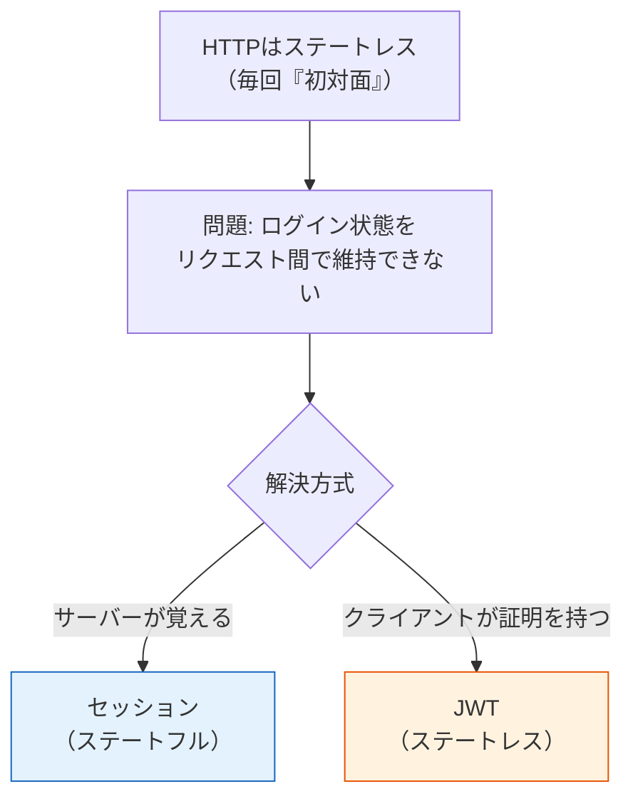
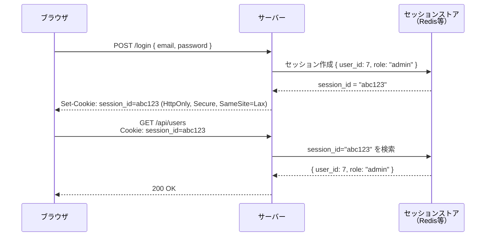
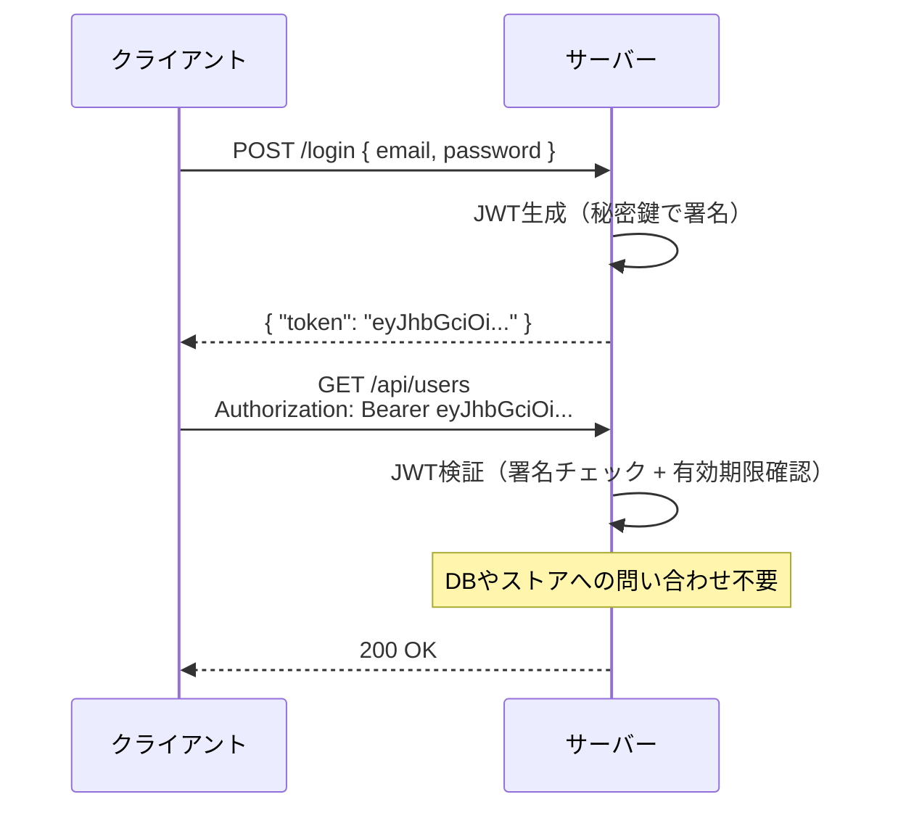
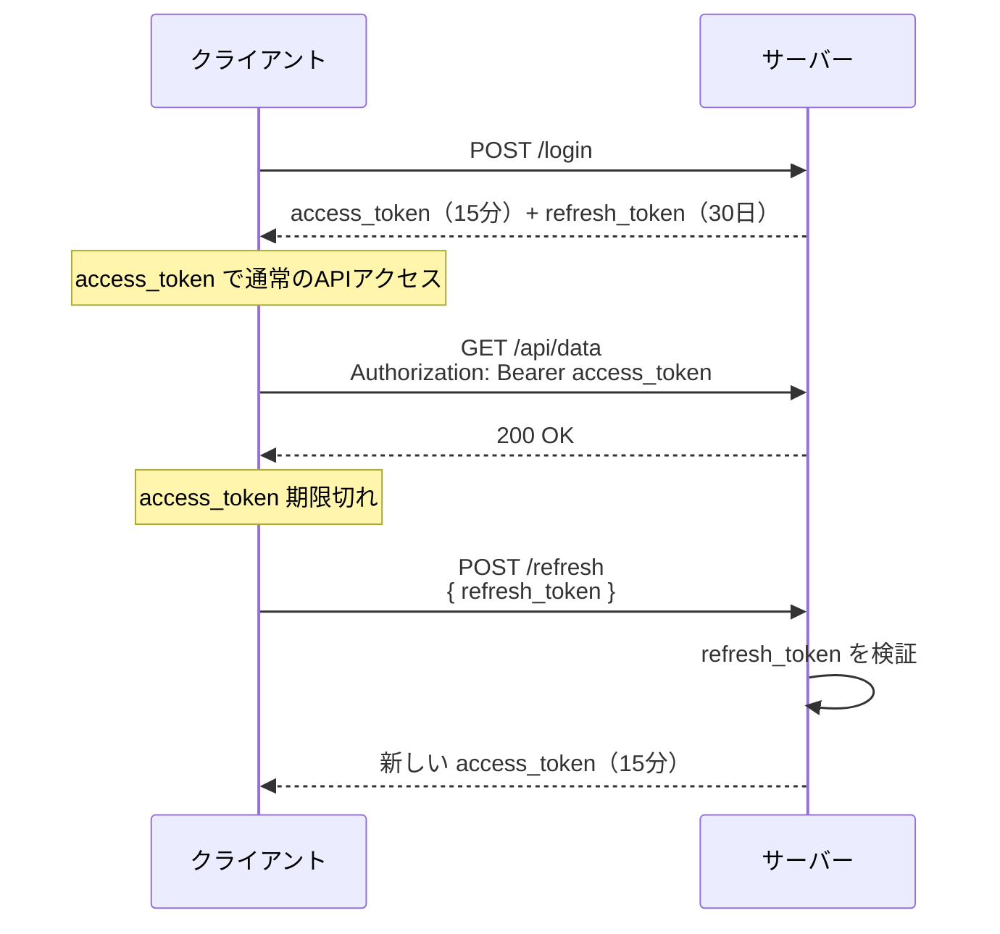
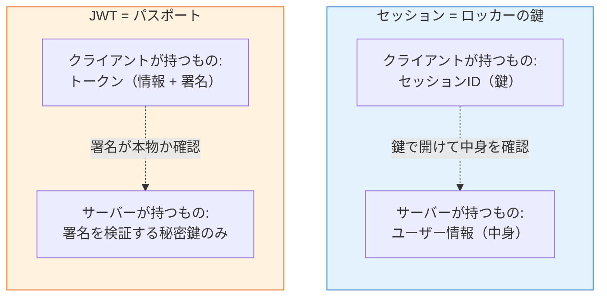

# セッションとJWT（Session vs JSON Web Token）

> **一言で言うと:** セッションは「サーバーが状態を覚えておく」ステートフル方式、JWTは「クライアントが署名付き身分証を持ち歩く」ステートレス方式。どちらもHTTPのステートレス性を補って「認証済みの状態」を維持するための実装手段であり、優劣ではなくアーキテクチャ要件で選択する。

## なぜ認証に「状態の維持」が必要なのか

[[HTTP-HTTPS]]はステートレスなプロトコルであり、サーバーは各リクエストを独立した「初対面」として扱う。認証でログインに成功しても、次のリクエストでサーバーはその事実を覚えていない。

毎回パスワードを送るのは非現実的（UXの問題）かつ危険（漏洩機会の増大）なので、「一度認証したらその証明を持ち続ける」仕組みが必要になる。その実装方式が**セッション**と**JWT**である。



## セッションとは何か

セッション（Session）とは、**サーバー側に保持される一時的な状態データ**のこと。HTTPのステートレス性を補い、「さっきログインしたユーザーと同じ人だ」とリクエスト間で記憶を維持する仕組みである。

動作原理:

1. ログイン成功時、サーバーがランダムなセッションID（例: `abc123`）を生成する
2. このIDをキーとして、ユーザー情報（`user_id`、`role` 等）をサーバー側のストア（メモリ、Redis、DB等）に保存する
3. セッションIDをCookieでブラウザに渡す
4. 以降のリクエストでブラウザがCookieを自動送信し、サーバーはIDをキーにストアを参照してユーザーを特定する

セッションID自体には意味がない（ただのランダム文字列）。情報の実体はすべてサーバー側にあるため、**ステートフル**と呼ばれる。



### セッションストアの選択肢（→ [[MemcachedとRedis]]）

| ストア | 特徴 | 適したケース |
|--------|------|-------------|
| メモリ（プロセス内） | 最速だがサーバー再起動で消失。複数台で共有不可 | 開発環境、単一プロセスの小規模アプリ |
| Redis | 高速なインメモリKVS。TTLで自動期限切れ。複数サーバーから参照可能 | 本番環境の標準的な選択肢 |
| RDB（PostgreSQL等） | 永続的だがI/Oコストが高い | セッションデータの永続化が必要な場合 |

## JWTとは何か

JWT（JSON Web Token）は、**クライアント側にユーザー情報を含んだ署名付きトークン**である。サーバーはトークンを発行した後、状態を保持しない。

JWTは3つのパートから構成される:

```
eyJhbGciOiJIUzI1NiJ9.eyJ1c2VyX2lkIjo3LCJyb2xlIjoiYWRtaW4iLCJleHAiOjE3MTE2NDMyMDB9.SflKxwRJ...
├── Header ──────────┤├── Payload ──────────────────────────────────────────────┤├── Signature ──┤
```

| パート | 内容 | 例 |
|--------|------|-----|
| Header | アルゴリズムとトークンタイプ | `{"alg": "HS256", "typ": "JWT"}` |
| Payload | ユーザー情報と有効期限（**クレーム**） | `{"user_id": 7, "role": "admin", "exp": 1711643200}` |
| Signature | Header + Payload を秘密鍵で署名した値 | 改ざん検知に使用 |

各パートはBase64URLエンコードされ、ドット（`.`）で連結される。Payloadは**暗号化されていない**（誰でもデコードできる）。Signatureは秘密鍵を知っているサーバーだけが生成・検証できるため、Payloadの**改ざん防止**として機能する。

サーバーはトークンを受け取ると、署名を検証し、有効期限を確認するだけでユーザーを特定できる。ストアへの問い合わせが不要なため、**ステートレス**と呼ばれる。



### アクセストークンとリフレッシュトークン

JWTは即時無効化が困難なため、有効期限を短くする必要がある。しかし有効期限が短すぎると頻繁な再ログインが必要になる。この問題を解決するのが**2トークン方式**:



| トークン | 有効期限 | 保存場所 | 用途 |
|---------|---------|---------|------|
| アクセストークン | 短い（15分〜1時間） | メモリ or `HttpOnly` Cookie | API認証 |
| リフレッシュトークン | 長い（数日〜数週間） | `HttpOnly` Cookie | アクセストークンの再発行 |

リフレッシュトークンはサーバー側でDB/Redisに保存し、無効化可能にすることが多い。これはセッションの仕組みを部分的に再導入している形になる。

## 本質的な違い — 「鍵」と「身分証明書」



- **セッション**はロッカーの鍵のようなもの。鍵（ID）を見せれば中身（ユーザー情報）をサーバーが取り出す。鍵を無効にすれば即座にアクセスを遮断できるが、ロッカー（ストア）をサーバーが管理し続ける必要がある
- **JWT**はパスポートのようなもの。所持者の情報が書かれていて、署名（偽造防止スタンプ）で正当性を確認できる。発行後は参照先が不要だが、一度発行すると有効期限まで取り消せない

## 比較表

| 観点 | セッション | JWT |
|------|----------|-----|
| 状態の保持場所 | サーバー側（Redis、DB等） | クライアント側（トークン自体に含む） |
| スケーラビリティ | セッションストアの共有が必要 | サーバー間で共有不要（秘密鍵のみ共有） |
| 即時無効化 | ストアから削除すれば即座に無効 | 有効期限まで無効化できない（ブラックリスト方式を除く） |
| ペイロード | サーバー側に保持（サイズ制限なし） | トークンに埋め込み（肥大化に注意） |
| セキュリティリスク | セッションハイジャック（Cookie窃取） | トークン漏洩（localStorage保存時のXSSリスク） |
| 適した用途 | SSR、伝統的Webアプリ | SPA、モバイルアプリ、マイクロサービス間通信 |
| CSRF耐性 | Cookie自動送信のためCSRF対策が必要 | Authorizationヘッダ送信なら自動送信されずCSRFに強い |

## コード例

### Express（Node.js）— セッション認証

```javascript
const express = require('express');
const session = require('express-session');

const app = express();
app.use(express.json());
app.use(session({
  secret: process.env.SESSION_SECRET,
  resave: false,
  saveUninitialized: false,
  cookie: {
    httpOnly: true,
    secure: true,
    sameSite: 'lax',
    maxAge: 24 * 60 * 60 * 1000,
  },
}));

app.post('/login', async (req, res) => {
  // パスワード照合（省略）
  req.session.userId = 7;
  req.session.role = 'member';
  res.json({ message: 'Logged in' });
});

app.post('/logout', (req, res) => {
  req.session.destroy(() => {
    res.clearCookie('connect.sid');
    res.json({ message: 'Logged out' });
  });
});

// 認証ミドルウェア
function requireAuth(req, res, next) {
  if (!req.session.userId) {
    return res.status(401).json({ error: 'Authentication required' });
  }
  next();
}

app.get('/api/me', requireAuth, (req, res) => {
  res.json({ userId: req.session.userId, role: req.session.role });
});

app.listen(3000);
```

### Go（Chi）— JWT認証

```go
package main

import (
	"encoding/json"
	"net/http"
	"os"
	"strings"
	"time"

	"github.com/go-chi/chi/v5"
	"github.com/golang-jwt/jwt/v5"
)

var jwtSecret = []byte(os.Getenv("JWT_SECRET"))

type Claims struct {
	UserID int64  `json:"user_id"`
	Role   string `json:"role"`
	jwt.RegisteredClaims
}

func issueToken(userID int64, role string) (string, error) {
	claims := Claims{
		UserID: userID,
		Role:   role,
		RegisteredClaims: jwt.RegisteredClaims{
			ExpiresAt: jwt.NewNumericDate(time.Now().Add(1 * time.Hour)),
			IssuedAt:  jwt.NewNumericDate(time.Now()),
		},
	}
	return jwt.NewWithClaims(jwt.SigningMethodHS256, claims).SignedString(jwtSecret)
}

func authenticate(next http.Handler) http.Handler {
	return http.HandlerFunc(func(w http.ResponseWriter, r *http.Request) {
		h := r.Header.Get("Authorization")
		if !strings.HasPrefix(h, "Bearer ") {
			http.Error(w, `{"error":"authentication required"}`, http.StatusUnauthorized)
			return
		}
		claims := &Claims{}
		token, err := jwt.ParseWithClaims(strings.TrimPrefix(h, "Bearer "), claims,
			func(t *jwt.Token) (any, error) { return jwtSecret, nil },
			jwt.WithValidMethods([]string{"HS256"}),
		)
		if err != nil || !token.Valid {
			http.Error(w, `{"error":"invalid token"}`, http.StatusUnauthorized)
			return
		}
		// claimsをcontextに格納してハンドラに渡す（省略）
		next.ServeHTTP(w, r)
	})
}

func main() {
	r := chi.NewRouter()
	r.Post("/login", func(w http.ResponseWriter, r *http.Request) {
		token, _ := issueToken(7, "member")
		json.NewEncoder(w).Encode(map[string]string{"token": token})
	})
	r.With(authenticate).Get("/api/me", func(w http.ResponseWriter, r *http.Request) {
		w.Write([]byte(`{"message":"authenticated"}`))
	})
	http.ListenAndServe(":3000", r)
}
```

## よくある落とし穴

### 1. JWTを `localStorage` に保存する

`localStorage` はJavaScriptからアクセスできるため、XSS脆弱性があるとトークンが即座に窃取される。`HttpOnly` Cookieに保存すればJSからアクセスできないため、XSSによるトークン窃取を防げる。

### 2. JWTのPayloadに機密情報を含める

JWTのPayloadはBase64URLエンコードされているだけで**暗号化されていない**。誰でもデコードして内容を読める。パスワード、メールアドレス、電話番号などをPayloadに含めてはならない。

### 3. JWTの署名アルゴリズムに `none` を許可する

ライブラリによっては `alg: "none"` を受け入れてしまう実装がある。これにより署名なしトークンが正当として扱われる。検証時にアルゴリズムを明示的に指定する（`{ algorithms: ["HS256"] }`）。

### 4. セッションIDの推測可能性

セッションIDが連番や短いランダム文字列だと、ブルートフォースで他人のセッションを乗っ取れる。暗号論的に安全な乱数生成器（`crypto.randomBytes` 等）で十分な長さのIDを生成する。フレームワークのデフォルト実装は通常これを満たしている。

### 5. セッション固定攻撃への無対策

ログイン前のセッションIDがログイン後も引き継がれると、攻撃者が事前に仕込んだセッションIDでログイン後のセッションを乗っ取れる。ログイン成功時には必ずセッションIDを再生成する。

## 関連トピック

- [[認証と認可]] — 親トピック。セッション/JWTは認証の「実装手段」であり、認可は別の仕組み
- [[HTTP-HTTPS]] — Cookieの仕組み、Authorizationヘッダ、HTTPSによる通信暗号化
- [[CORS]] — Cookie送信時の `credentials: 'include'` とCORS設定の関係
- [[ルーティングとミドルウェア]] — 認証チェックはミドルウェアとして実装する
