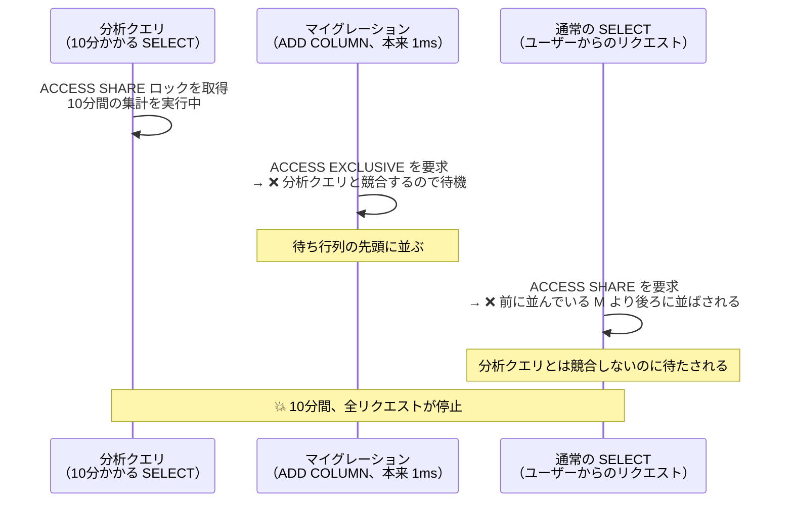
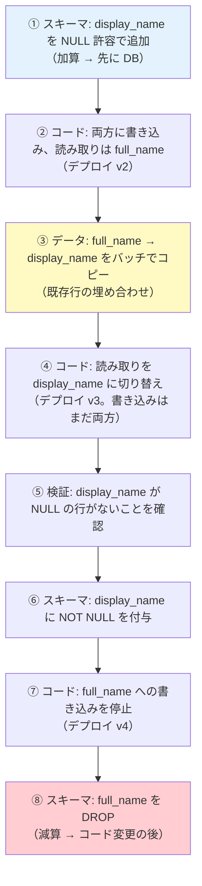

# ゼロダウンタイムマイグレーション（Zero-Downtime Migration）

> **一言で言うと:** 無停止のスキーマ変更とは「**ロックを取らないこと**」ではなく、「**取るロックを一瞬で手放し、待たされている間に他を巻き込まないこと**」であり、加えて **ローリングデプロイ中に新旧コードが同時に動く**という前提にスキーマを合わせ続けることである。

## 危険なのは「重い ALTER」だけではない

「大きなテーブルへの `ALTER TABLE` は時間がかかるので危険」— これは正しいが、実務で本当に多い事故はもっと厄介な形で起きる。**一瞬で終わるはずの DDL が、サービス全体を止める**というパターンである。

まずロックの仕組みを押さえる必要がある。

> [!info] 用語ミニ辞典
> - **DDL（Data Definition Language）** — `CREATE` / `ALTER` / `DROP` など、データそのものではなく**構造**を変える SQL 文
> - **ロック（Lock）** — 同じデータに複数の処理が同時に触れて壊れないよう、一時的に占有する仕組み。「どの操作同士が同時に動けるか」がロックの種類ごとに決まっている（→ [[ロック]]）
> - **ACCESS EXCLUSIVE ロック** — PostgreSQL で最も強いテーブルロック。**読み取りすら**ブロックする。多くの `ALTER TABLE` がこれを取る
> - **メタデータロック（MDL）** — MySQL におけるテーブル定義の保護ロック。DDL 実行中はテーブル定義が変わらないことを保証する

### PostgreSQL: 主な DDL が取るロック

| 操作 | ロックの強さ | 同時に読める？ | 同時に書ける？ |
|---|---|---|---|
| `SELECT` | ACCESS SHARE | ✅ | ✅ |
| `INSERT` / `UPDATE` / `DELETE` | ROW EXCLUSIVE | ✅ | ✅ |
| `CREATE INDEX`（通常） | SHARE | ✅ | ❌ |
| `CREATE INDEX CONCURRENTLY` | SHARE UPDATE EXCLUSIVE | ✅ | ✅ |
| `ALTER TABLE ADD COLUMN` | **ACCESS EXCLUSIVE** | ❌ | ❌ |
| `ALTER TABLE SET NOT NULL` | **ACCESS EXCLUSIVE** | ❌ | ❌ |
| `DROP TABLE` / `TRUNCATE` | **ACCESS EXCLUSIVE** | ❌ | ❌ |

`ADD COLUMN` は PostgreSQL 11 以降なら**メタデータの書き換えだけで完了する**（既存行を1行も触らない）。ロックを取る時間はミリ秒単位である。それなら安全そうに見える。

### 本当の危険 — ロック待ち行列

ところが、次のような事故が実際に起きる。



**ポイントは、ロックが「待ち行列」であること。** ACCESS EXCLUSIVE を要求した DDL が待機に入ると、その**後ろに並んだすべてのクエリがブロックされる**。DDL 自体は1ミリ秒で終わるのに、前を塞いでいる長時間クエリが終わるまで、サービス全体が止まる。

これは MySQL でも同様に起きる。DDL がメタデータロックを待っている間、後続のクエリが `Waiting for table metadata lock` で滞留する。

### 対策 — `lock_timeout` と再試行

答えは「**待たない**」ことである。ロックがすぐ取れなければ諦め、少し待ってやり直す。

```sql
-- PostgreSQL: このセッションでは 3 秒以上ロックを待たない
SET lock_timeout = '3s';

ALTER TABLE users ADD COLUMN status VARCHAR(20);
-- ロックが取れなければ即座にエラーで終了する。
-- 「サービスを止めたまま待ち続ける」より、失敗して再実行する方が安全
```

```sql
-- MySQL 8.0: 同様に待ち時間を制限する
SET SESSION lock_wait_timeout = 3;

ALTER TABLE users ADD COLUMN status VARCHAR(20), ALGORITHM=INSTANT;
```

実運用では、これをリトライループで包む。「3秒待って取れなければ諦め、10秒後に再挑戦」を数回繰り返せば、長時間クエリの合間を縫って一瞬でロックを取得できる。Rails の `strong_migrations` や各種マイグレーションツールが `lock_timeout` の自動設定を推奨しているのは、この理屈による。

**「マイグレーションを流す前に、長時間実行中のクエリがないか確認する」**という運用も併せて必要になる。

```sql
-- PostgreSQL: 実行中の長時間クエリを探す
SELECT pid, now() - query_start AS duration, state, left(query, 80) AS query
FROM pg_stat_activity
WHERE state <> 'idle' AND now() - query_start > interval '30 seconds'
ORDER BY duration DESC;
```

## ローリングデプロイという第二の制約

スキーマ変更が無停止でも、**アプリケーションのデプロイ中に新旧のコードが同時に動く**という現実が別の制約を生む。

```mermaid
gantt
    dateFormat HH:mm
    axisFormat %H:%M
    title ローリングデプロイ中の共存期間
    section スキーマ
    旧スキーマ           :done, s1, 00:00, 10m
    新スキーマ           :active, s2, 00:10, 30m
    section アプリケーション
    旧コード（v1）        :done, a1, 00:00, 25m
    新コード（v2）        :active, a2, 00:15, 25m
```



図の 00:15〜00:25 の10分間、**v1 と v2 が同じ DB に対して同時に動いている**。この期間中、スキーマは両方のコードから見て正しく動く必要がある。

ここから、順序に関する明快なルールが導かれる。

| 変更の種類 | 例 | 適用順序 | 理由 |
|---|---|---|---|
| **加算的（additive）** | カラム追加、テーブル追加、インデックス追加 | **スキーマ → コード** | 旧コードは新しいカラムを知らないが、無視するだけで壊れない |
| **減算的（subtractive）** | カラム削除、テーブル削除、NOT NULL 追加 | **コード → スキーマ** | 旧コードがまだそのカラムを参照している間に消すと、旧コードが即死する |

**加算は先に DB、減算は先にアプリ。** この1行が Expand-Contract パターンの本質であり、カラムのリネームが「削除 + 追加」ではなく5〜6段階の手順になる理由でもある。

### カラムリネームの完全な手順

`full_name` を `display_name` に変えたい、という要求を分解する。



**冗長に見えるが、どの段階で止めても、どのバージョンのコードが動いていてもサービスは壊れない。** ここが重要で、無停止マイグレーションは「速く終わらせる技術」ではなく「**いつでも中断・巻き戻しできる状態を保ち続ける技術**」である。

実務では ⑦ と ⑧ の間に**数日から数週間**空けることが多い。旧カラムを残しておけば、問題が起きたときにコードだけ切り戻せる。`DROP COLUMN` は最後の最後、それも「もう戻らない」と確信できてから実行する。

## 各操作の安全な書き方

### NOT NULL 制約を全行スキャンなしで付ける（PostgreSQL）

`ALTER TABLE ... SET NOT NULL` は ACCESS EXCLUSIVE ロックを取ったまま**全行をスキャン**する。数千万行では長時間の停止になる。

PostgreSQL 12 以降には、これを回避する方法がある。

```sql
-- Step 1: CHECK 制約を NOT VALID で追加する。
--   NOT VALID = 「既存行は検証しない、以後の書き込みだけチェックする」
--   既存行を読まないので一瞬で完了する
ALTER TABLE users
  ADD CONSTRAINT users_status_not_null CHECK (status IS NOT NULL) NOT VALID;

-- Step 2: 既存行を検証する。
--   VALIDATE CONSTRAINT が取るのは SHARE UPDATE EXCLUSIVE で、
--   読み書きをブロックしない。時間はかかるがサービスは動き続ける
ALTER TABLE users VALIDATE CONSTRAINT users_status_not_null;

-- Step 3: NOT NULL を付ける。
--   PostgreSQL 12 以降は「検証済みの CHECK 制約」を根拠に全行スキャンを省略するため、
--   ACCESS EXCLUSIVE を取る時間がミリ秒で済む
ALTER TABLE users ALTER COLUMN status SET NOT NULL;

-- Step 4: 役目を終えた CHECK 制約を落とす（NOT NULL と重複するため）
ALTER TABLE users DROP CONSTRAINT users_status_not_null;
```

同じ考え方は外部キー制約にも使える。`ADD FOREIGN KEY ... NOT VALID` → `VALIDATE CONSTRAINT` の2段階に分ければ、長時間ロックを避けられる。

**「重い検証を、ロックの弱い操作に切り出す」** — これが PostgreSQL における無停止 DDL の共通パターンである。

### インデックスを無停止で追加する

```sql
-- PostgreSQL
CREATE INDEX CONCURRENTLY idx_users_status ON users (status);
```

`CONCURRENTLY` には知っておくべき癖がいくつかある。

- **トランザクションブロックの中では実行できない。** マイグレーションツールが自動で `BEGIN...COMMIT` で包む場合、明示的に無効化する必要がある（Rails の `disable_ddl_transaction!`、golang-migrate の `-- +migrate NoTransaction` 等）
- **テーブルを2回スキャンする**ため、通常の `CREATE INDEX` より時間がかかる
- **失敗すると `INVALID` 状態のインデックスが残る。** これは検索に使われないのにインデックス更新コストだけ発生する厄介な状態で、`DROP INDEX CONCURRENTLY` で消してから再実行する

```sql
-- 失敗して INVALID になったインデックスを探す
SELECT indexrelid::regclass AS index_name
FROM pg_index
WHERE NOT indisvalid;
```

MySQL 8.0 では `ALGORITHM=INPLACE, LOCK=NONE` を明示する。指定しておけば、オンラインで実行できない場合にエラーで止まってくれる（黙ってテーブルコピーが始まって停止する事故を防げる）。

```sql
-- MySQL: オンラインで実行できないなら失敗させる
ALTER TABLE users ADD INDEX idx_users_status (status), ALGORITHM=INPLACE, LOCK=NONE;
```

### MySQL の INSTANT DDL

MySQL 8.0 には、テーブルを一切読み書きせずデータディクショナリの更新だけで完了する `ALGORITHM=INSTANT` がある。8.0.12 で末尾へのカラム追加、8.0.29 で任意位置への追加とカラム削除に対応した。

```sql
-- 明示的に INSTANT を要求する。
-- INSTANT で実行できない操作ならエラーになるので、
-- 「重い操作だと気付かないまま本番で流す」事故を防げる
ALTER TABLE users ADD COLUMN status VARCHAR(20) DEFAULT NULL, ALGORITHM=INSTANT;
```

**アルゴリズムを明示することが安全策になる**という発想は、PostgreSQL の `lock_timeout` と同じ思想である。「暗黙のうちに危険な経路を選ばれないよう、先に宣言しておく」。

### オンラインスキーマ変更ツール

INSTANT / INPLACE でも対応できない変更（カラムの型変更、主キーの変更など）には、専用ツールを使う。

| ツール | 仕組み | 特徴 |
|---|---|---|
| **pt-online-schema-change**（Percona） | 新スキーマのシャドウテーブルを作り、**トリガー**で変更を同期しながらデータをコピー、最後にリネームで入れ替え | 実績が長い。トリガーが本番の書き込みに負荷を乗せる |
| **gh-ost**（GitHub） | シャドウテーブルへの同期を**バイナリログの読み取り**で行う（トリガー不使用） | 本番テーブルへの追加負荷が小さい。負荷に応じて自動スロットリング可能 |
| **pg_repack**（PostgreSQL） | データコピー中は SHARE UPDATE EXCLUSIVE で読み書きを許し、**開始時と最後の入れ替え時のみ短時間の ACCESS EXCLUSIVE** を取る | 主に肥大化したテーブルの再構築用（→ [[VACUUM]]）。「排他ロックなし」ではない点に注意 — この一瞬のロックも前述のロック待ち行列を作りうるので、`lock_timeout` の考慮は同じく必要 |

gh-ost がトリガーを避けた理由を理解しておくと応用が効く。トリガー方式では、本番の `INSERT` / `UPDATE` のたびにシャドウテーブルへの書き込みが**同じトランザクション内で同期的に**発生する。つまり移行作業の負荷が、そのままユーザーのレイテンシに乗る。バイナリログを読む方式なら、コピー処理は本番トランザクションの外側で非同期に進むため、負荷が分離される。**「本番の処理経路に作業を割り込ませない」** という設計判断である。

## バックフィルを安全に流す

既存行を埋めるデータマイグレーションは、スキーマ変更より長時間かかることが多い。ここでの要点は3つある。

1. **バッチ分割** — 一括 `UPDATE` は長時間トランザクションを作り、ロック・WAL 肥大・レプリケーション遅延を同時に引き起こす
2. **キーセット方式で範囲を進める** — `OFFSET` はスキップする行を毎回読み直すため、後半になるほど遅くなる（→ [[カーソルベースページネーション]]）
3. **レプリケーション遅延で速度を調整する** — 書き込みを詰め込むとレプリカが追いつけず、読み取り専用レプリカを使う機能が古いデータを返し始める（→ [[レプリケーションとレプリケーション遅延]]）

### Python — レプリケーション遅延を見ながら進めるバックフィル

```python
import time
import psycopg

BATCH_SIZE = 1_000
MAX_REPLICA_LAG_SECONDS = 5.0


def replica_lag(conn) -> float:
    """全レプリカのうち最も遅れているものの遅延秒数を返す（プライマリ側から見る）。

    replay_lag は「プライマリでコミットされた変更が、そのスタンバイで
    再生されるまでにかかっている時間」。PostgreSQL 10 以降で利用できる。

    よくある誤りは `now() - reply_time` で測ること。reply_time は
    「スタンバイが最後に応答を返した時刻」で、スタンバイは遅延の有無に関わらず
    定期的に応答するため、この値はほぼ常に1秒未満になる。
    それをしきい値判定に使うと、スロットリングが一度も発動しない。
    """
    row = conn.execute("""
        SELECT COALESCE(MAX(EXTRACT(EPOCH FROM replay_lag)), 0)
        FROM pg_stat_replication
        WHERE state = 'streaming'
    """).fetchone()
    # 注: 書き込みが完全に止まると replay_lag は更新されず NULL になりうる。
    #     バックフィル中は書き込みが続くので実用上は問題にならないが、
    #     監視用途に流用するなら pg_wal_lsn_diff によるバイト差分も併用する
    return float(row[0])


def backfill_display_name(conninfo: str) -> int:
    """full_name の値を display_name にコピーする。

    設計上の要点:
      - autocommit=True にして、1バッチ = 1トランザクションに保つ。
        全体を1トランザクションにすると長時間ロック + WAL 肥大を招く
      - 主キーの範囲で進める（OFFSET は使わない）
      - レプリカの遅延を見て自分でブレーキをかける
      - 途中で止めても、再実行すれば続きから進む（冪等）
    """
    last_id = 0
    total = 0

    with psycopg.connect(conninfo, autocommit=True) as conn:
        while True:
            # WHERE display_name IS NULL で「まだ埋めていない行」だけを対象にする。
            # これにより中断・再実行しても二重処理にならない
            rows = conn.execute("""
                UPDATE users
                SET display_name = full_name
                WHERE id IN (
                    SELECT id FROM users
                    WHERE id > %s AND display_name IS NULL
                    ORDER BY id
                    LIMIT %s
                )
                RETURNING id
            """, (last_id, BATCH_SIZE)).fetchall()

            if not rows:
                break

            last_id = max(r[0] for r in rows)
            total += len(rows)
            print(f"backfilled={total} last_id={last_id}", flush=True)

            # レプリカが追いつくまで待つ。
            # ここを省くと、読み取りレプリカを見ているユーザーに古いデータが返り始める
            lag = replica_lag(conn)
            if lag > MAX_REPLICA_LAG_SECONDS:
                print(f"レプリカ遅延 {lag:.1f}s — 待機します", flush=True)
                time.sleep(min(lag, 30))
            else:
                time.sleep(0.05)  # 通常時も少し空けて I/O を譲る

    return total
```

### TypeScript — Expand フェーズの両書き（dual write）

```typescript
/**
 * Expand-Contract の②〜④で動くコード。
 * この版のアプリは「両方に書き、旧カラムを読む」状態にある。
 *
 * 重要なのは、この関数が動いている間に v1（旧コード）も並行して動いている
 * ことを前提にしている点。v1 は full_name にしか書かないため、
 * display_name が NULL の行が新たに生まれ続ける。
 * だからバックフィル(③)は「一度流して終わり」ではなく、
 * ④のデプロイ完了後にもう一度流して取りこぼしを埋める必要がある。
 */
async function updateUserName(userId: number, name: string): Promise<void> {
  await db.user.update({
    where: { id: userId },
    data: {
      full_name: name,     // 旧カラム — v1 のコードがまだ読んでいる
      display_name: name,  // 新カラム — 移行先
    },
  });
}

/** 読み取り側は、移行の段階に応じて切り替える */
function readDisplayName(user: { full_name: string | null; display_name: string | null }): string {
  // ②〜③の段階: 旧カラムを正とする
  // ④以降:      display_name を正とし、フォールバックで旧カラムを見る
  //
  // COALESCE 相当のフォールバックを一時的に置くと、
  // バックフィル未完了の行があっても壊れない（切り替えのリスクを下げる）
  return user.display_name ?? user.full_name ?? "";
}
```

**このコードのコメントが示している非自明な点**が、Expand-Contract で最も見落とされる箇所である。バックフィルを流している最中も、旧コードは旧カラムにしか書かない。**「バックフィルは、新コードが全インスタンスに行き渡った後にもう一度流す」** — この2回目を忘れると、切り替え後に NULL のレコードが残る。

## 実行前チェックリスト

| 確認項目 | なぜ必要か |
|---|---|
| `lock_timeout` / `lock_wait_timeout` を設定したか | ロック待ちが後続クエリを巻き込むのを防ぐ |
| 長時間実行中のクエリがないか確認したか | 待ち行列の先頭を塞いでいる原因を潰す |
| 加算的変更か減算的変更かを判定し、順序を決めたか | ローリングデプロイ中の新旧コード共存に耐えるため |
| インデックス作成に `CONCURRENTLY` / `LOCK=NONE` を付けたか | 書き込みブロックを避ける |
| バックフィルはバッチ分割 + 進捗ログ + 中断再開可能か | 長時間トランザクションとレプリカ遅延を避ける |
| ロールバック手順は Forward Fix で描けているか | `down` はデータ損失を伴い、本番では現実的でないことが多い |
| ステージングで**本番相当の行数**を用意して試したか | 1万行では一瞬の操作が、5000万行では止まる |
| 減算的変更の実行を、コード切り替えから十分空けたか | 問題発生時にコードだけ切り戻せる余地を残す |

## AI実装のアンチパターン

| アンチパターン | なぜ問題か | レビュー観点 / 対策 |
|---|---|---|
| `lock_timeout` を設定しないマイグレーションを生成する | 一瞬で終わる DDL でも、ロック待ちで後続クエリを全部止める。**最も見落とされる事故要因** | すべての DDL マイグレーションの冒頭に `SET lock_timeout` を入れ、リトライ前提で運用 |
| `CREATE INDEX CONCURRENTLY` をトランザクションブロックの中に置く | 実行時エラーになる。マイグレーションツールが自動で `BEGIN` を付ける場合に頻発 | ツールごとのトランザクション無効化指定（`disable_ddl_transaction!` 等）とセットで生成する |
| `CONCURRENTLY` の失敗時に残る INVALID インデックスを考慮しない | 検索に使われないのに更新コストだけ発生する。再実行も名前衝突で失敗する | `pg_index` の `indisvalid` を確認し、`DROP INDEX CONCURRENTLY` してから再実行 |
| `SET NOT NULL` を一発で実行する | ACCESS EXCLUSIVE を取ったまま全行スキャン。数千万行で長時間停止 | `CHECK ... NOT VALID` → `VALIDATE CONSTRAINT` → `SET NOT NULL` の3段階（PostgreSQL 12+） |
| 「スキーマ変更 → 即デプロイ」を1手順として提案する | ローリングデプロイ中の新旧コード共存を考慮していない。減算的変更で旧コードが即死する | 加算は DB 先行、減算はコード先行。順序をレビュー項目に入れる |
| バックフィルを新コードのデプロイ完了前に1回だけ流す | 旧コードが書き続ける行を取りこぼし、切り替え後に NULL が残る | 全インスタンスの切り替え完了後にもう一度流し、NULL 件数がゼロであることを確認 |
| バックフィルを `OFFSET` ベースのページングで生成する | 後半になるほどスキップ分の読み込みが増えて劇的に遅くなる | 主キーの範囲（キーセット方式）で進める |
| レプリケーション遅延を無視してバックフィルを全速で流す | レプリカが追いつけず、読み取りレプリカ経由のユーザーに古いデータが返る | 遅延を計測してスロットリングする |
| MySQL で `ALGORITHM` / `LOCK` を明示せずに `ALTER TABLE` を生成する | INSTANT で済むはずの操作が、条件次第でテーブルコピーに落ちても気付けない | `ALGORITHM=INSTANT` / `INPLACE, LOCK=NONE` を明示し、無理ならエラーで止める |
| `DROP COLUMN` をリネーム手順の最終ステップとして同一デプロイに含める | 切り戻しの余地が消える。問題が出たらデータごと失われる | 十分な観察期間（数日〜数週間）を空けてから、独立したマイグレーションで実行 |

→ レイヤー横断のアンチパターン索引: [[_anti-patterns/_index|AIアンチパターン索引]] / [[_anti-patterns/レイヤー別/Layer3|Layer 3 アンチパターン集]]

## 参考リソース

- **Web**: PostgreSQL 公式ドキュメント「Explicit Locking」— ロックモードの競合表が載っている一次情報 — https://www.postgresql.org/docs/current/explicit-locking.html
- **Web**: MySQL 公式ドキュメント「Online DDL Operations」— 操作ごとに INSTANT / INPLACE が使えるかの一覧 — https://dev.mysql.com/doc/refman/8.0/en/innodb-online-ddl-operations.html
- **Web**: strong_migrations（Rails gem） — 危険なマイグレーションを検出して安全な手順を提示する。**ルール一覧を読むだけでも教材になる** — https://github.com/ankane/strong_migrations
- **Web**: gh-ost — https://github.com/github/gh-ost
- **書籍**: 『Designing Data-Intensive Applications』（Martin Kleppmann）第4章 — スキーマ進化と前方 / 後方互換性

## 関連トピック

- [[マイグレーション]] — 親トピック。バージョン管理、イミュータブル原則、Expand-Contract の概要
- [[ロック]] — ロックモードの競合関係と待ち行列の基礎
- [[トランザクション]] — 長時間トランザクションがなぜ危険か
- [[インデックス設計の判断基準]] — そもそもそのインデックスが必要かの判断
- [[レプリケーションとレプリケーション遅延]] — バックフィルのスロットリング基準になる指標
- [[カーソルベースページネーション]] — バッチ処理を `OFFSET` ではなくキーセットで進める理由
- [[VACUUM]] — 大量 UPDATE 後の肥大化と、その回収
- [[データ書き込みの冪等性設計]] — 中断・再実行できるバックフィルを書くための前提
