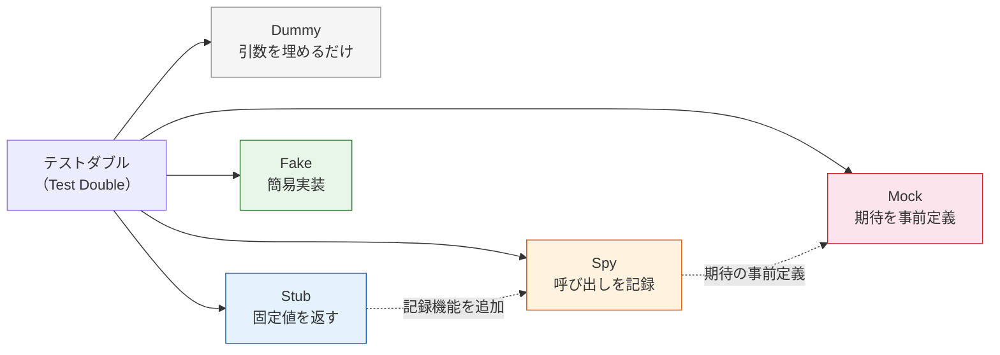
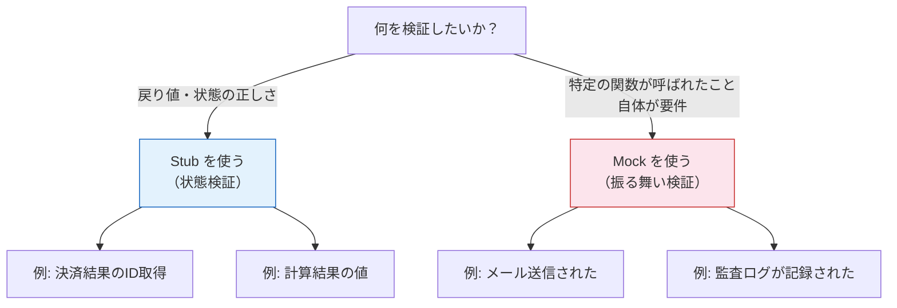

# テストダブル（Test Double）

> **一言で言うと:** テスト時に本物の依存オブジェクトを代替する「影武者」の総称。Gerard Meszaros が *xUnit Test Patterns* (2007) で体系化した5種類（Dummy, Stub, Spy, Mock, Fake）があり、目的に応じて使い分けることでテストを高速・安定・独立に保つ。

## 概念

### テストダブルとは何か

テスト対象のコード（SUT: System Under Test）が外部依存（DB、外部API、メール送信など）を持つとき、本物の依存を使うとテストが遅く・不安定になる。テストダブルはこの依存を「テスト用の代役」に差し替える技法。

名前は映画のスタントダブル（Stunt Double）に由来する。本物の俳優の代わりに危険なシーンを演じるスタントマンのように、本物の依存の代わりにテストシーンを演じる。

### 5種類の分類

Gerard Meszaros の分類に Martin Fowler の "Mocks Aren't Stubs" (2004、2007年改訂) の視点を加えて整理する。

| 種類 | 英語名 | 目的 | 検証方法 | 実装コスト |
|------|--------|------|----------|-----------|
| ダミー | Dummy | 引数を埋めるだけ。実際には使われない | なし | 極低 |
| スタブ | Stub | 事前に決められた値を返す | 状態検証（State Verification） | 低 |
| スパイ | Spy | 呼び出しを記録し、後から検証可能にする | 状態検証 + 呼び出し履歴 | 低〜中 |
| モック | Mock | 期待する呼び出しを事前に定義し、満たされなければ失敗 | 振る舞い検証（Behavior Verification） | 低〜中 |
| フェイク | Fake | 本物の簡易実装（インメモリDBなど） | 状態検証 | 高 |



## コード例: 決済サービスのテストダブル

すべての言語で「外部決済サービス（Payment Gateway）」を題材に、各テストダブルの使い方を示す。

### TypeScript（Vitest）

```typescript
// --- プロダクションコード ---
interface PaymentGateway {
  charge(amount: number, currency: string): Promise<{ id: string; status: string }>;
}

class OrderService {
  constructor(private gateway: PaymentGateway) {}

  async placeOrder(amount: number): Promise<string> {
    const result = await this.gateway.charge(amount, "JPY");
    if (result.status !== "succeeded") {
      throw new Error("Payment failed");
    }
    return result.id;
  }
}

// --- テストコード ---
import { describe, it, expect, vi } from "vitest";

describe("OrderService", () => {
  // Stub: 固定値を返す
  it("成功時にトランザクションIDを返す", async () => {
    const stubGateway: PaymentGateway = {
      charge: vi.fn().mockResolvedValue({ id: "tx_123", status: "succeeded" }),
    };

    const service = new OrderService(stubGateway);
    const txId = await service.placeOrder(1000);

    // 状態検証: 戻り値を確認する
    expect(txId).toBe("tx_123");
  });

  // Mock: 呼び出しを検証する
  it("正しい通貨で決済APIを呼ぶ", async () => {
    const mockGateway: PaymentGateway = {
      charge: vi.fn().mockResolvedValue({ id: "tx_456", status: "succeeded" }),
    };

    const service = new OrderService(mockGateway);
    await service.placeOrder(2000);

    // 振る舞い検証: 正しい引数で呼ばれたかを確認する
    expect(mockGateway.charge).toHaveBeenCalledWith(2000, "JPY");
    expect(mockGateway.charge).toHaveBeenCalledTimes(1);
  });

  // Stub: 失敗ケース
  it("決済失敗時にエラーを投げる", async () => {
    const stubGateway: PaymentGateway = {
      charge: vi.fn().mockResolvedValue({ id: "tx_789", status: "failed" }),
    };

    const service = new OrderService(stubGateway);
    await expect(service.placeOrder(3000)).rejects.toThrow("Payment failed");
  });
});
```

### Go

Go ではモックライブラリを使わず、インターフェースを満たす構造体を自作するのが標準的なスタイル。

```go
// --- プロダクションコード ---
package order

import (
	"context"
	"fmt"
)

type ChargeResult struct {
    ID     string
    Status string
}

type PaymentGateway interface {
    Charge(ctx context.Context, amount int, currency string) (ChargeResult, error)
}

type OrderService struct {
    gateway PaymentGateway
}

func NewOrderService(gw PaymentGateway) *OrderService {
    return &OrderService{gateway: gw}
}

func (s *OrderService) PlaceOrder(ctx context.Context, amount int) (string, error) {
    result, err := s.gateway.Charge(ctx, amount, "JPY")
    if err != nil {
        return "", err
    }
    if result.Status != "succeeded" {
        return "", fmt.Errorf("payment failed: %s", result.Status)
    }
    return result.ID, nil
}

// --- テストコード ---
package order_test

import (
    "context"
    "testing"
)

// Stub: 固定値を返す
type StubGateway struct {
    Result ChargeResult
    Err    error
}

func (s *StubGateway) Charge(ctx context.Context, amount int, currency string) (ChargeResult, error) {
    return s.Result, s.Err
}

// Spy: 呼び出しを記録する
type SpyGateway struct {
    StubGateway
    CalledWith struct {
        Amount   int
        Currency string
    }
    CallCount int
}

func (s *SpyGateway) Charge(ctx context.Context, amount int, currency string) (ChargeResult, error) {
    s.CalledWith.Amount = amount
    s.CalledWith.Currency = currency
    s.CallCount++
    return s.Result, s.Err
}

func TestPlaceOrder_Success(t *testing.T) {
    // Stub を使った状態検証
    stub := &StubGateway{
        Result: ChargeResult{ID: "tx_123", Status: "succeeded"},
    }
    svc := NewOrderService(stub)

    txID, err := svc.PlaceOrder(context.Background(), 1000)
    if err != nil {
        t.Fatalf("unexpected error: %v", err)
    }
    if txID != "tx_123" {
        t.Errorf("got %q, want %q", txID, "tx_123")
    }
}

func TestPlaceOrder_CallsGateway(t *testing.T) {
    // Spy を使った呼び出し検証
    spy := &SpyGateway{
        StubGateway: StubGateway{
            Result: ChargeResult{ID: "tx_456", Status: "succeeded"},
        },
    }
    svc := NewOrderService(spy)

    _, _ = svc.PlaceOrder(context.Background(), 2000)

    if spy.CalledWith.Amount != 2000 {
        t.Errorf("amount: got %d, want %d", spy.CalledWith.Amount, 2000)
    }
    if spy.CalledWith.Currency != "JPY" {
        t.Errorf("currency: got %q, want %q", spy.CalledWith.Currency, "JPY")
    }
}
```

### Python（unittest.mock）

```python
# --- プロダクションコード ---
from dataclasses import dataclass
from abc import ABC, abstractmethod


@dataclass
class ChargeResult:
    id: str
    status: str


class PaymentGateway(ABC):
    @abstractmethod
    def charge(self, amount: int, currency: str) -> ChargeResult:
        ...


class OrderService:
    def __init__(self, gateway: PaymentGateway) -> None:
        self._gateway = gateway

    def place_order(self, amount: int) -> str:
        result = self._gateway.charge(amount, "JPY")
        if result.status != "succeeded":
            raise RuntimeError("Payment failed")
        return result.id


# --- テストコード ---
from unittest.mock import MagicMock, patch
import pytest


def test_place_order_success():
    """Stub: 固定値を返して状態検証"""
    mock_gw = MagicMock(spec=PaymentGateway)
    mock_gw.charge.return_value = ChargeResult(id="tx_123", status="succeeded")

    service = OrderService(mock_gw)
    tx_id = service.place_order(1000)

    assert tx_id == "tx_123"


def test_place_order_calls_gateway():
    """Mock: 呼び出しを振る舞い検証"""
    mock_gw = MagicMock(spec=PaymentGateway)
    mock_gw.charge.return_value = ChargeResult(id="tx_456", status="succeeded")

    service = OrderService(mock_gw)
    service.place_order(2000)

    mock_gw.charge.assert_called_once_with(2000, "JPY")


def test_place_order_failure():
    """Stub: 失敗レスポンスでエラー検証"""
    mock_gw = MagicMock(spec=PaymentGateway)
    mock_gw.charge.return_value = ChargeResult(id="tx_789", status="failed")

    service = OrderService(mock_gw)
    with pytest.raises(RuntimeError, match="Payment failed"):
        service.place_order(3000)
```

### PHP（PHPUnit）

```php
// --- プロダクションコード ---
interface PaymentGateway
{
    public function charge(int $amount, string $currency): ChargeResult;
}

class ChargeResult
{
    public function __construct(
        public readonly string $id,
        public readonly string $status,
    ) {}
}

class OrderService
{
    public function __construct(private PaymentGateway $gateway) {}

    public function placeOrder(int $amount): string
    {
        $result = $this->gateway->charge($amount, 'JPY');
        if ($result->status !== 'succeeded') {
            throw new \RuntimeException('Payment failed');
        }
        return $result->id;
    }
}

// --- テストコード ---
use PHPUnit\Framework\TestCase;

class OrderServiceTest extends TestCase
{
    // Stub: createStub() は呼び出し検証を行わない
    public function testPlaceOrderReturnsTransactionId(): void
    {
        $stub = $this->createStub(PaymentGateway::class);
        $stub->method('charge')
             ->willReturn(new ChargeResult('tx_123', 'succeeded'));

        $service = new OrderService($stub);
        $txId = $service->placeOrder(1000);

        // 状態検証
        $this->assertSame('tx_123', $txId);
    }

    // Mock: createMock() + expects() で呼び出しを検証
    public function testPlaceOrderCallsGatewayWithCorrectArgs(): void
    {
        $mock = $this->createMock(PaymentGateway::class);
        $mock->expects($this->once())
             ->method('charge')
             ->with(2000, 'JPY')
             ->willReturn(new ChargeResult('tx_456', 'succeeded'));

        $service = new OrderService($mock);
        $service->placeOrder(2000);
        // expects() が自動的に検証する
    }

    public function testPlaceOrderThrowsOnFailure(): void
    {
        $stub = $this->createStub(PaymentGateway::class);
        $stub->method('charge')
             ->willReturn(new ChargeResult('tx_789', 'failed'));

        $service = new OrderService($stub);

        $this->expectException(\RuntimeException::class);
        $service->placeOrder(3000);
    }
}
```

## Stub vs Mock の使い分け

テストダブルの中で最も重要な区別は Stub と Mock の違い。これは Martin Fowler が "Mocks Aren't Stubs" で明確にした。

| 観点 | Stub（状態検証） | Mock（振る舞い検証） |
|------|-----------------|---------------------|
| 検証対象 | SUT の**戻り値や状態** | SUT が依存を**どう呼んだか** |
| テストの関心 | 「何が返ったか」 | 「何を呼んだか」 |
| 実装変更への耐性 | 高い（内部の呼び出し順序が変わっても壊れない） | 低い（リファクタリングでテストが壊れやすい） |
| 適するケース | ビジネスロジックの結果検証 | 副作用の発生確認（メール送信、ログ記録など） |

**原則: 状態検証を優先する。** 振る舞い検証は「副作用そのものが要件であるケース」にのみ使う。



## Fake の価値

Fake はテストダブルの中で最も実装コストが高いが、最も信頼性が高い。

### Fake が有効な場面

| Fake の対象 | 実装例 | メリット |
|------------|--------|---------|
| データベース | インメモリ SQLite / HashMap ベースのリポジトリ | SQL の正しさは検証できないが、CRUD ロジックを高速にテスト |
| メッセージキュー | インメモリキュー（配列にpush/shift） | 非同期処理のフローを同期的にテスト |
| ファイルストレージ | インメモリファイルシステム | I/O なしで高速にテスト |
| 外部API | 本物と同じインターフェースのローカルサーバー | ネットワーク不要で安定したテスト |

### Fake の運用コスト

Fake は「本物の振る舞いを正しく模倣し続ける」責任がある。本物のAPIが変わったのに Fake が古い振る舞いのままだと、テストは通るが本番で壊れる。この問題を防ぐには:

- **Contract Test（契約テスト）** — 本物と Fake の両方に同じテストスイートを実行し、振る舞いの一致を保証する
- **本物の SDK/クライアントが提供する Fake を使う** — AWS の `moto`（Python）、GCP の `fake-gcs-server` など

## 落とし穴

### 1. モックの過剰使用 — 実装への密結合

最も多い失敗パターン。内部の実装詳細をモックで検証すると、リファクタリングのたびにテストが壊れる。

```typescript
// 悪い例: 内部の呼び出し順序を検証している
expect(mockRepo.findById).toHaveBeenCalledBefore(mockRepo.save);
expect(mockRepo.save).toHaveBeenCalledWith(expect.objectContaining({ status: "active" }));

// 良い例: 最終的な状態を検証する
const result = await service.activate(userId);
expect(result.status).toBe("active");
```

**対策:** モックは「境界」（外部サービス、I/O）に対してのみ使い、内部のクラス間連携はモックしない。[[SOLID原則]]の依存性逆転を守り、境界にインターフェースを置く。

### 2. テストダブルが本物と乖離する

スタブやモックは「プログラマが想定した振る舞い」を返すだけで、本物のサービスが実際に返す値とは異なる場合がある。

```python
# 危険: 本物の Stripe API は amount=0 でエラーを返すが、スタブは成功を返す
mock_gw.charge.return_value = ChargeResult(id="tx_000", status="succeeded")
```

**対策:**
- インテグレーションテストで本物の依存と結合テストを行う
- Contract Test で Fake と本物の振る舞いを同期する
- テストダブルの戻り値は本物のレスポンスをコピーして作る

### 3. テストダブルのメンテナンスコスト

テストダブルが増えると、インターフェース変更時に大量のダブルを修正する必要がある。

**対策:**
- テストダブルはテストユーティリティとして共通化し、1箇所で管理する
- [[DIコンテナ]]を活用してテスト用の依存解決を一元化する
- ヘルパー関数で Stub/Fake の生成を集約する

### 4. MagicMock の spec なし利用（Python 固有）

```python
# 悪い例: spec なしだと存在しないメソッド呼び出しもエラーにならない
mock = MagicMock()
mock.chargee(1000, "JPY")  # typo だが MagicMock は何でも受け入れる

# 良い例: spec を指定すると存在しないメソッドで AttributeError
mock = MagicMock(spec=PaymentGateway)
mock.chargee(1000, "JPY")  # AttributeError: Mock object has no attribute 'chargee'
```

## 関連トピック

- [[テスト戦略]] — テストダブルはテストピラミッドの各レベルで使われるが、特にユニットテストで重要
- [[SOLID原則]] — 依存性逆転の原則（DIP）がテストダブルの差し替えを可能にする設計の基盤
- [[DIコンテナ]] — テスト時に本物の依存をテストダブルに差し替える仕組みを提供する

## 参考リソース

- *xUnit Test Patterns: Refactoring Test Code* — Gerard Meszaros (2007)
- Martin Fowler, ["Mocks Aren't Stubs"](https://martinfowler.com/articles/mocksArentStubs.html) (2004、2007年改訂)
- *Unit Testing: Principles, Practices, and Patterns* — Vladimir Khorikov (2020)
