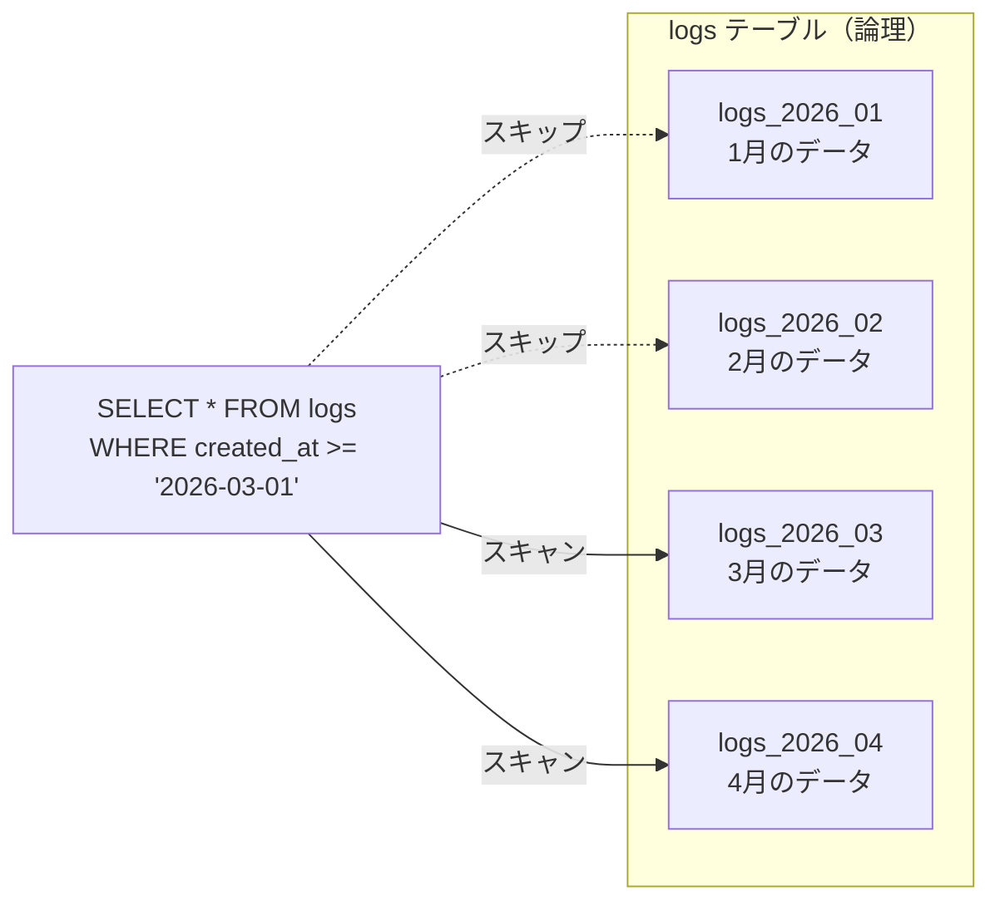
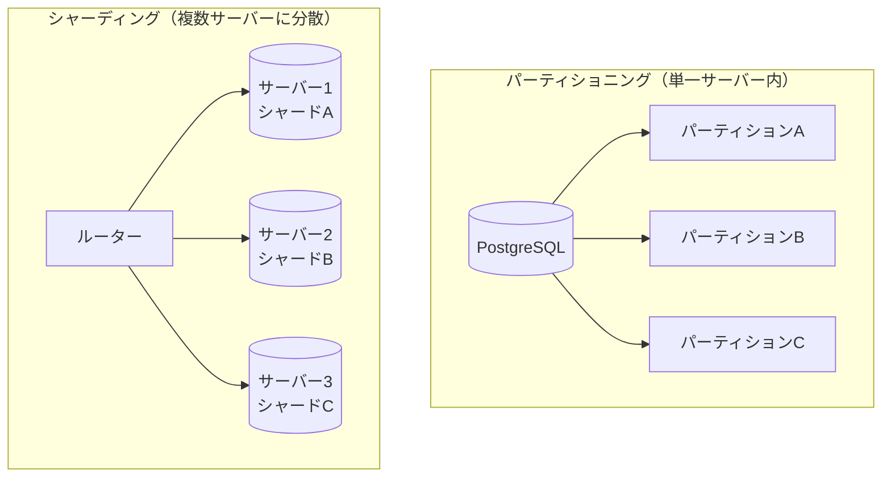
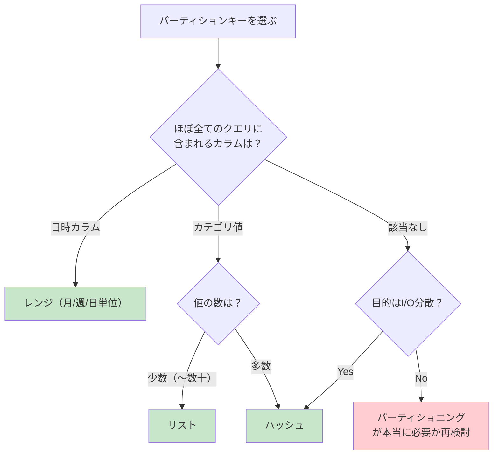

# テーブルパーティショニング（Table Partitioning）

> **一言で言うと:** 1つの論理テーブルを複数の物理的な区画（パーティション）に分割し、大規模テーブルのクエリ性能・運用効率を改善する手法。アプリケーションからは通常のテーブルと同じように見えるため、透過的にスケールできる。

## なぜパーティショニングが必要か

テーブルが数千万〜数億行を超えると、[[インデックス設計の判断基準|インデックスを適切に設計]]していても以下の問題が顕在化する:

| 問題 | 原因 | パーティショニングによる解決 |
|------|------|--------------------------|
| フルスキャンの遅延 | インデックスが効かないクエリで全行を走査 | 不要なパーティションをスキップ（パーティションプルーニング） |
| インデックス肥大化 | B+Tree の深さが増し、ランダムI/Oが増大 | 各パーティションのインデックスが小さく収まる |
| VACUUM / メンテナンスの長時間化 | テーブル全体をロック or スキャンする必要 | パーティション単位でメンテナンス可能 |
| データアーカイブの困難 | 古いデータの削除に大量の DELETE が必要 | パーティションを DROP または DETACH するだけ |
| バックアップ・リストアの巨大化 | テーブル全体が対象 | パーティション単位で部分バックアップ可能 |

## パーティショニングの種類

### 1. レンジパーティショニング（Range Partitioning）

カラムの値の**範囲**でデータを分割する。時系列データに最適。



```sql
-- PostgreSQL: レンジパーティショニング
CREATE TABLE logs (
    id BIGINT GENERATED ALWAYS AS IDENTITY,
    message TEXT NOT NULL,
    level VARCHAR(10) NOT NULL,
    created_at TIMESTAMPTZ NOT NULL
) PARTITION BY RANGE (created_at);

-- 月別パーティションを作成
CREATE TABLE logs_2026_01 PARTITION OF logs
    FOR VALUES FROM ('2026-01-01') TO ('2026-02-01');
CREATE TABLE logs_2026_02 PARTITION OF logs
    FOR VALUES FROM ('2026-02-01') TO ('2026-03-01');
CREATE TABLE logs_2026_03 PARTITION OF logs
    FOR VALUES FROM ('2026-03-01') TO ('2026-04-01');

-- 各パーティションにインデックスを作成
-- （PostgreSQL 11+ ではパーティションテーブルにインデックスを作ると自動で子にも作られる）
CREATE INDEX idx_logs_created_at ON logs (created_at);
```

```sql
-- MySQL: レンジパーティショニング
CREATE TABLE logs (
    id BIGINT AUTO_INCREMENT,
    message TEXT NOT NULL,
    level VARCHAR(10) NOT NULL,
    created_at DATETIME NOT NULL,
    PRIMARY KEY (id, created_at)  -- パーティションキーを主キーに含める必要がある
) PARTITION BY RANGE (YEAR(created_at) * 100 + MONTH(created_at)) (
    PARTITION p2026_01 VALUES LESS THAN (202602),
    PARTITION p2026_02 VALUES LESS THAN (202603),
    PARTITION p2026_03 VALUES LESS THAN (202604),
    PARTITION p_future VALUES LESS THAN MAXVALUE
);
```

**適用場面**: ログ、イベント、注文履歴、アクセスログ、監査証跡

### 2. リストパーティショニング（List Partitioning）

カラムの**離散的な値のリスト**でデータを分割する。

```sql
-- PostgreSQL: リージョン別にパーティショニング
CREATE TABLE customers (
    id BIGINT GENERATED ALWAYS AS IDENTITY,
    name VARCHAR(100) NOT NULL,
    email VARCHAR(255) NOT NULL,
    region VARCHAR(20) NOT NULL
) PARTITION BY LIST (region);

CREATE TABLE customers_asia PARTITION OF customers
    FOR VALUES IN ('jp', 'kr', 'cn', 'sg');
CREATE TABLE customers_eu PARTITION OF customers
    FOR VALUES IN ('de', 'fr', 'gb', 'nl');
CREATE TABLE customers_us PARTITION OF customers
    FOR VALUES IN ('us', 'ca', 'mx');
```

**適用場面**: テナント分離、リージョン分割、ステータス別管理

### 3. ハッシュパーティショニング（Hash Partitioning）

カラム値のハッシュ値に基づいてデータを**均等に**分散する。特定のキーに偏りがない場合に有効。

```sql
-- PostgreSQL: ハッシュパーティショニング
CREATE TABLE sessions (
    id UUID NOT NULL DEFAULT gen_random_uuid(),
    user_id BIGINT NOT NULL,
    data JSONB NOT NULL,
    expires_at TIMESTAMPTZ NOT NULL
) PARTITION BY HASH (user_id);

-- 4つのパーティションに均等分散
CREATE TABLE sessions_p0 PARTITION OF sessions FOR VALUES WITH (MODULUS 4, REMAINDER 0);
CREATE TABLE sessions_p1 PARTITION OF sessions FOR VALUES WITH (MODULUS 4, REMAINDER 1);
CREATE TABLE sessions_p2 PARTITION OF sessions FOR VALUES WITH (MODULUS 4, REMAINDER 2);
CREATE TABLE sessions_p3 PARTITION OF sessions FOR VALUES WITH (MODULUS 4, REMAINDER 3);
```

**適用場面**: セッション、キャッシュ、I/O分散が目的の場合

### 種類の比較

| 種類 | 分割基準 | プルーニング | データ偏り | 運用性 | 主なユースケース |
|------|---------|------------|-----------|--------|----------------|
| **レンジ** | 値の範囲 | 範囲クエリで強力 | 期間により偏る可能性 | DROP/DETACHで古いデータを即座に削除 | 時系列データ |
| **リスト** | 離散値のリスト | 完全一致で有効 | 値ごとの件数差に注意 | 特定の値グループを分離可能 | テナント・リージョン |
| **ハッシュ** | ハッシュ値 | 等値条件のみ有効 | 均等分散 | パーティション追加時にリバランスが必要 | I/O分散 |

## パーティションプルーニング（Partition Pruning）

パーティショニングの最大のメリットは**パーティションプルーニング**（不要なパーティションのスキップ）である。クエリの WHERE 句にパーティションキーが含まれている場合、オプティマイザが自動的に対象パーティションだけをスキャンする。

```sql
-- パーティションプルーニングが効くクエリ
EXPLAIN ANALYZE
SELECT * FROM logs
WHERE created_at >= '2026-03-01' AND created_at < '2026-04-01';

-- 出力例（PostgreSQLの場合）:
-- Append (actual rows=... loops=1)
--   ->  Seq Scan on logs_2026_03  (actual rows=... loops=1)
--         Filter: (created_at >= ... AND created_at < ...)
-- ↑ logs_2026_01, logs_2026_02 はスキャンされない
```

```sql
-- ❌ パーティションプルーニングが効かないクエリ
-- パーティションキーに関数を適用すると、プルーニングが無効になる
SELECT * FROM logs WHERE DATE(created_at) = '2026-03-15';
-- → 全パーティションをスキャンしてしまう

-- ✅ 範囲条件に書き換える
SELECT * FROM logs
WHERE created_at >= '2026-03-15' AND created_at < '2026-03-16';
```

## パーティショニング vs シャーディング

パーティショニングとシャーディング（Sharding）は混同されやすいが、根本的に異なる概念である。



| 観点 | パーティショニング | シャーディング |
|------|-------------------|--------------|
| **データの物理配置** | 同一サーバー内の複数の物理テーブル | 複数サーバーに分散 |
| **透過性** | アプリケーションからは1テーブルに見える | アプリケーション or ミドルウェアでルーティングが必要 |
| **トランザクション** | 通常のトランザクションがそのまま使える | 分散トランザクション（2PC）が必要になる場合がある |
| **スケール対象** | I/O分散、メンテナンス効率 | 書き込みスループット、ストレージ容量 |
| **複雑性** | 低い（DB機能で完結） | 高い（アプリケーション層の設計変更が必要） |
| **クロスパーティションJOIN** | 可能（DB内部で処理） | 困難（ネットワーク越しのデータ結合） |

> 実務での指針: まずパーティショニングで対処し、単一サーバーの限界に達した場合にのみシャーディングを検討する。RDB のシャーディングは運用の複雑性が非常に高いため、書き込みスケールが必要なら[[NoSQL]]の採用も視野に入れる。

## コード例

### TypeScript（Prisma）: パーティション対応のクエリ

```typescript
import { PrismaClient } from "@prisma/client";

const prisma = new PrismaClient();

// ✅ パーティションプルーニングが効くクエリ
// WHERE 句にパーティションキー（created_at）の範囲条件を含める
async function getLogsForMonth(year: number, month: number) {
  const start = new Date(year, month - 1, 1);
  const end = new Date(year, month, 1);

  return prisma.log.findMany({
    where: {
      createdAt: {
        gte: start,
        lt: end,
      },
    },
    orderBy: { createdAt: "desc" },
    take: 100,
  });
}

// ❌ パーティションプルーニングが効かない例
// Prisma の日付フィルタでも、DB側で関数適用されると全スキャンになる
// → 必ず範囲条件（gte/lt）を使い、DATE()関数ではなく範囲で絞る
```

### Go: パーティション自動作成のメンテナンスジョブ

```go
package main

import (
	"context"
	"database/sql"
	"fmt"
	"time"
)

// 翌月のパーティションを事前に作成する
// cron で毎月実行: 0 0 25 * * （25日に翌月分を作成）
func createNextMonthPartition(ctx context.Context, db *sql.DB, table string) error {
	now := time.Now()
	next := time.Date(now.Year(), now.Month()+1, 1, 0, 0, 0, 0, time.UTC)
	afterNext := next.AddDate(0, 1, 0)

	partitionName := fmt.Sprintf("%s_%s", table, next.Format("2006_01"))

	// パーティションが既に存在するかチェック
	var exists bool
	err := db.QueryRowContext(ctx, `
		SELECT EXISTS (
			SELECT 1 FROM pg_class WHERE relname = $1
		)`, partitionName).Scan(&exists)
	if err != nil {
		return fmt.Errorf("check partition existence: %w", err)
	}
	if exists {
		return nil // 既に作成済み
	}

	query := fmt.Sprintf(
		`CREATE TABLE %s PARTITION OF %s FOR VALUES FROM ('%s') TO ('%s')`,
		partitionName, table,
		next.Format("2006-01-02"),
		afterNext.Format("2006-01-02"),
	)

	_, err = db.ExecContext(ctx, query)
	if err != nil {
		return fmt.Errorf("create partition %s: %w", partitionName, err)
	}

	return nil
}

// 古いパーティションをデタッチしてアーカイブする
func archiveOldPartition(ctx context.Context, db *sql.DB, table, partitionName string) error {
	// DETACH: 親テーブルから切り離すが、データは残る
	_, err := db.ExecContext(ctx, fmt.Sprintf(
		"ALTER TABLE %s DETACH PARTITION %s",
		table, partitionName,
	))
	if err != nil {
		return fmt.Errorf("detach partition: %w", err)
	}

	// デタッチしたテーブルは独立テーブルとして残る
	// → pg_dump で個別にバックアップ後、DROP TABLE で削除
	return nil
}
```

### Python: パーティション運用状況の監視

```python
import psycopg

def check_partition_health(conninfo: str, parent_table: str) -> None:
    """各パーティションの行数とサイズを一覧表示する"""
    query = """
        SELECT
            c.relname AS partition_name,
            pg_size_pretty(pg_relation_size(c.oid)) AS size,
            s.n_live_tup AS row_count,
            s.last_vacuum,
            s.last_autovacuum
        FROM pg_inherits i
        JOIN pg_class p ON i.inhparent = p.oid
        JOIN pg_class c ON i.inhrelid = c.oid
        LEFT JOIN pg_stat_user_tables s ON s.relid = c.oid
        WHERE p.relname = %s
        ORDER BY c.relname
    """

    with psycopg.connect(conninfo) as conn:
        rows = conn.execute(query, (parent_table,)).fetchall()
        print(f"{'Partition':<30} {'Size':>10} {'Rows':>12} {'Last Vacuum'}")
        print("-" * 80)
        for row in rows:
            name, size, count, vacuum, auto_vacuum = row
            last = vacuum or auto_vacuum or "never"
            print(f"{name:<30} {size:>10} {count or 0:>12,} {last}")
```

## パーティションキーの選択指針

パーティションキーの選択はパーティショニングの成否を決定する最も重要な設計判断である。



**選択時のチェックリスト:**

1. **ほぼ全てのクエリの WHERE 句に含まれるか** — 含まれないとプルーニングが効かず、逆に全パーティションスキャンで遅くなる
2. **データが均等に分散するか** — 特定パーティションにデータが集中すると効果が薄い
3. **パーティション数は適切か** — PostgreSQL では数百パーティションまでが実用的（数千を超えるとプランニング時間が増大）
4. **主キーにパーティションキーを含められるか** — PostgreSQL ではユニーク制約にパーティションキーを含める必要がある

## PostgreSQL と MySQL のパーティション機能比較

| 機能 | PostgreSQL（Declarative, 10+） | MySQL（InnoDB） |
|------|-------------------------------|----------------|
| レンジ | ✅ | ✅ |
| リスト | ✅ | ✅ |
| ハッシュ | ✅（11+） | ✅（5.1+） |
| 複合パーティション（サブパーティション） | ✅ 多段の宣言的パーティションで実現 | ✅ RANGE-HASH/RANGE-KEY のみ |
| パーティションプルーニング | ✅ 自動 | ✅ 自動 |
| インデックスの自動継承 | ✅（11+） | パーティションごとのローカルインデックス |
| DETACH PARTITION | ✅ CONCURRENTLY オプションあり（14+） | ✅ `ALTER TABLE ... EXCHANGE PARTITION` で類似操作 |
| ユニーク制約 | パーティションキーを含める必要あり | パーティションキーを含める必要あり |
| 外部キー参照 | パーティションテーブルを**参照する**外部キーも、パーティションテーブル**から**の外部キーもともに可（12+） | パーティションテーブルでの外部キーは不可 |
| デフォルトパーティション | ✅（11+） | RANGE: `MAXVALUE`（5.1+）、LIST: DEFAULT なし（全値を明示的に定義） |

## よくある落とし穴

### 1. パーティションキーが WHERE 句に含まれないクエリ

パーティショニングの最大の罠。パーティションキーを含まないクエリは**全パーティションをスキャン**する。パーティション数が多いとパーティショニングなしの場合よりも遅くなる。

```sql
-- logs を created_at でパーティショニングした場合

-- ❌ パーティションキーなし → 全パーティションをスキャン
SELECT * FROM logs WHERE level = 'ERROR' ORDER BY id DESC LIMIT 10;

-- ✅ パーティションキーを含める → プルーニングが効く
SELECT * FROM logs
WHERE level = 'ERROR' AND created_at >= NOW() - INTERVAL '7 days'
ORDER BY created_at DESC LIMIT 10;
```

### 2. パーティションの作成忘れ

レンジパーティショニングで、新しい期間のパーティションを事前に作成しておかないと、INSERT がエラーになる（PostgreSQL のデフォルトパーティションがない場合）。

```sql
-- PostgreSQL: デフォルトパーティションを作成しておく（保険）
CREATE TABLE logs_default PARTITION OF logs DEFAULT;

-- ただしデフォルトに大量のデータが溜まると
-- 新パーティション作成時にデフォルトからの移動が発生して遅い
-- → cron ジョブで事前にパーティションを作成するのが正解
```

### 3. 小さなテーブルへの不要なパーティショニング

数万〜数十万行程度のテーブルにパーティショニングを導入すると、プランニングのオーバーヘッドやメタデータ管理のコストで逆に遅くなる。目安として**数百万行を超えてから**検討する。

### 4. ユニーク制約にパーティションキーを含め忘れる

PostgreSQL・MySQL ともにパーティションテーブルのユニーク制約（主キー含む）にはパーティションキーを含める必要がある。

```sql
-- ❌ エラー: パーティションキー (created_at) が主キーに含まれていない
CREATE TABLE logs (
    id BIGINT GENERATED ALWAYS AS IDENTITY PRIMARY KEY,
    message TEXT NOT NULL,
    created_at TIMESTAMPTZ NOT NULL
) PARTITION BY RANGE (created_at);
-- ERROR: unique constraint on partitioned table must include all partitioning columns

-- ✅ 主キーにパーティションキーを含める
CREATE TABLE logs (
    id BIGINT GENERATED ALWAYS AS IDENTITY,
    message TEXT NOT NULL,
    created_at TIMESTAMPTZ NOT NULL,
    PRIMARY KEY (id, created_at)
) PARTITION BY RANGE (created_at);
```

### 5. 外部キー制約の制限を見落とす

MySQL ではパーティションテーブルに外部キーを一切使用できない。PostgreSQL では 12 以降で両方向（参照する側・される側）の外部キーがサポートされているが、それ以前のバージョンでは使えない。MySQL 環境で外部キーが必要な場合は、アプリケーション層で整合性を担保する設計が必要になる。

## 関連トピック

- [[RDB]] — パーティショニングが解決するRDBの大規模テーブル問題
- [[インデックス設計の判断基準]] — パーティショニングの前にまずインデックス最適化を検討
- [[VACUUM]] — パーティション単位のVACUUMによる運用効率化
- [[NoSQL]] — 書き込みスケールが必要ならシャーディング前提のNoSQLも選択肢
- [[レプリケーションとレプリケーション遅延]] — レプリケーション × パーティショニングの併用パターン
- [[マイグレーション]] — 既存テーブルのパーティション化はマイグレーション設計が重要
