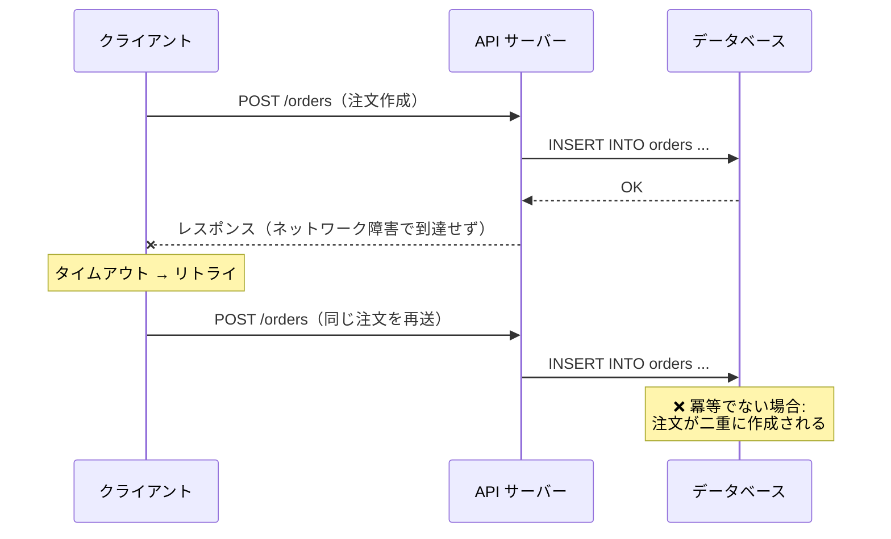
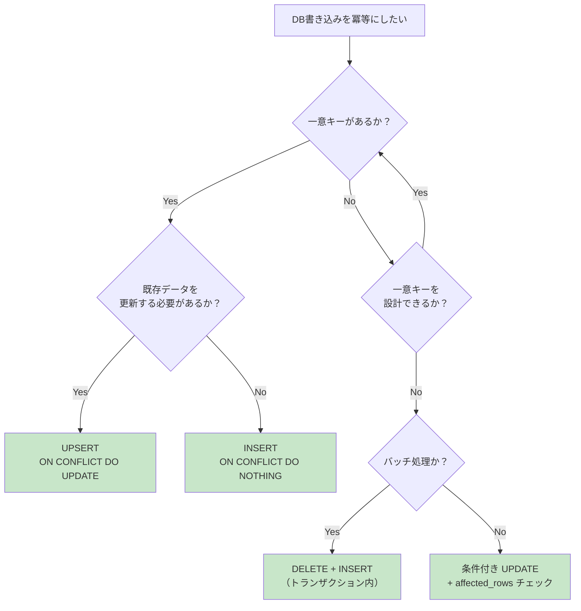
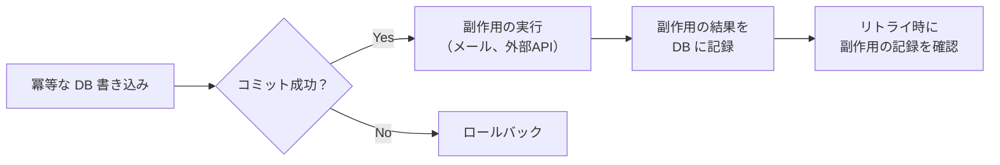

# データ書き込みの冪等性設計（Idempotent Write Design）

> **一言で言うと:** 冪等性（Idempotency）とは「同じ操作を何回実行しても結果が変わらない」性質。データパイプライン、API ハンドラ、メッセージコンシューマーでの DB 書き込みを冪等に設計することで、リトライ・重複実行・障害復旧を安全に行える。

## なぜ冪等性が必要か

分散システムでは「操作が正確に1回だけ実行される」ことを保証するのは極めて困難である（exactly-once の困難さ）。実際に発生するシナリオ:



| 発生シーン | 原因 | 冪等でない場合の結果 |
|-----------|------|-------------------|
| API リトライ | ネットワークタイムアウト、ロードバランサの再送 | 注文・決済・通知の重複 |
| メッセージキューの再配信 | コンシューマーのクラッシュ、ACK 喪失 | データの二重処理 |
| バッチジョブの再実行 | ジョブスケジューラの障害復旧 | 集計値の二重カウント |
| [[マイグレーション]]の再適用 | デプロイ失敗後の再デプロイ | スキーマ変更エラー |

## SQL レベルの冪等性パターン

### パターン1: UPSERT（INSERT ... ON CONFLICT）

最も基本的な冪等性パターン。一意制約に基づいて「存在すれば更新、なければ挿入」を1文で実現する。

```sql
-- PostgreSQL: ON CONFLICT で冪等な UPSERT
INSERT INTO products (sku, name, price, updated_at)
VALUES ('WIDGET-001', 'ウィジェット', 1500, NOW())
ON CONFLICT (sku) DO UPDATE SET
    name = EXCLUDED.name,
    price = EXCLUDED.price,
    updated_at = EXCLUDED.updated_at;

-- 何回実行しても products テーブルの状態は同じ
```

```sql
-- MySQL 8.0.19+: 行エイリアス構文で同等の操作
-- （VALUES() 関数は 8.0.20 で非推奨、将来削除予定）
INSERT INTO products (sku, name, price, updated_at)
VALUES ('WIDGET-001', 'ウィジェット', 1500, NOW())
AS new_row
ON DUPLICATE KEY UPDATE
    name = new_row.name,
    price = new_row.price,
    updated_at = new_row.updated_at;
```

### パターン2: INSERT ... ON CONFLICT DO NOTHING

重複を無視して挿入を試みる。「少なくとも1回挿入されればよい」場合に使う。

```sql
-- イベントログの重複排除
INSERT INTO processed_events (event_id, payload, processed_at)
VALUES ('evt_abc123', '{"type": "order.created"}', NOW())
ON CONFLICT (event_id) DO NOTHING;

-- 既に処理済みのイベントは無視される
```

### パターン3: 条件付き UPDATE（楽観的冪等性）

状態遷移を伴う更新で、現在の状態を WHERE 条件に含めることで二重実行を防ぐ。

```sql
-- 注文ステータスを "pending" → "confirmed" に更新
-- 既に "confirmed" なら WHERE に合致せず、UPDATE は 0 行影響
UPDATE orders
SET status = 'confirmed', confirmed_at = NOW()
WHERE id = 12345 AND status = 'pending';

-- affected_rows が 0 なら「既に処理済み」と判断できる
```

### パターン4: DELETE + INSERT（Replace パターン）

複雑な更新ロジックの代わりに、対象データを削除して再挿入する。[[トランザクション]]内で実行することが前提。

```sql
-- 日次集計の再計算: トランザクションで DELETE → INSERT
BEGIN;

DELETE FROM daily_sales_summary
WHERE date = '2026-04-12';

INSERT INTO daily_sales_summary (date, product_id, total_quantity, total_revenue, order_count)
SELECT
    DATE(created_at),
    product_id,
    SUM(quantity),
    SUM(quantity * unit_price),
    COUNT(*)
FROM order_items
WHERE DATE(created_at) = '2026-04-12'
GROUP BY DATE(created_at), product_id;

COMMIT;

-- 何回実行しても同じ集計結果になる
```

## パターンの比較と使い分け

| パターン | 前提条件 | 適用場面 | 注意点 |
|---------|---------|---------|--------|
| **UPSERT** | 一意制約がある | マスタデータ同期、外部 API データの取り込み | 一意キーの設計が重要 |
| **DO NOTHING** | 一意制約がある | イベントの重複排除、ログの冪等挿入 | 挿入が無視されてもエラーにならない |
| **条件付き UPDATE** | 状態遷移が定義されている | ステータス更新、ワークフロー遷移 | affected_rows の確認が必要 |
| **DELETE + INSERT** | トランザクションが使える | バッチ集計、サマリーテーブルの再構築 | 中間状態でデータが見えなくなる期間がある |



## 冪等キー（Idempotency Key）の設計

冪等性を実現するには「この操作は以前と同じか？」を判定するための**冪等キー**が必要。冪等キーの設計はシステムの正確性を左右する。

### 冪等キーの選択肢

| 種類 | 例 | 特徴 |
|------|-----|------|
| **ビジネスキー** | 注文番号、SKU、メールアドレス | ビジネスルールで一意性が保証される。最も自然 |
| **クライアント生成 UUID** | `X-Idempotency-Key: 550e8400-...` | API クライアントが生成。サーバー側で追跡テーブルが必要 |
| **入力のハッシュ** | `SHA-256(user_id + product_id + amount)` | 同じ入力 → 同じキー。意図的な再注文と区別できない場合がある |
| **外部システムの ID** | Stripe の `payment_intent_id`、Webhook の `event_id` | 外部システムが一意性を保証。重複排除に最適 |

### 冪等キー追跡テーブル

API レベルで冪等性を保証する場合、リクエストごとの処理結果を追跡するテーブルを使う。

```sql
CREATE TABLE idempotency_keys (
    key VARCHAR(255) PRIMARY KEY,
    user_id BIGINT NOT NULL,
    status VARCHAR(20) NOT NULL DEFAULT 'processing',
    -- CHECK制約で有効な状態遷移を保証
    response_code INT,
    response_body JSONB,
    created_at TIMESTAMPTZ NOT NULL DEFAULT NOW(),
    expires_at TIMESTAMPTZ NOT NULL DEFAULT NOW() + INTERVAL '24 hours',
    CONSTRAINT chk_status CHECK (status IN ('processing', 'completed', 'failed'))
);

-- 有効期限切れのキーを定期削除するためのインデックス
CREATE INDEX idx_idempotency_keys_expires ON idempotency_keys (expires_at)
    WHERE status != 'processing';
```

## コード例

### TypeScript: API ハンドラの冪等性保証

```typescript
import { PrismaClient, Prisma } from "@prisma/client";

const prisma = new PrismaClient();

// 冪等な注文作成 API ハンドラ
async function createOrder(
  idempotencyKey: string,
  userId: number,
  items: { productId: number; quantity: number }[]
) {
  // 1. 冪等キーの既存チェック（トランザクション外の早期リターン）
  // ※ これはパフォーマンス最適化。安全性はトランザクション内の
  //    upsert の一意制約で保証されるため、ここでの TOCTOU は問題にならない
  const existing = await prisma.idempotencyKey.findUnique({
    where: { key: idempotencyKey },
  });

  if (existing?.status === "completed") {
    // 既に成功済み → 保存されたレスポンスを返す（冪等）
    return existing.responseBody;
  }

  if (existing?.status === "processing") {
    // 並行リクエストが処理中 → 409 Conflict
    throw new Error("Request is already being processed");
  }

  // 2. 冪等キーを "processing" で登録 + 注文作成をトランザクションで実行
  //    一意制約により、並行リクエストが同時にここに到達しても片方はエラーになる
  const order = await prisma.$transaction(async (tx) => {
    // 冪等キーを登録（重複時は一意制約で弾かれる）
    await tx.idempotencyKey.upsert({
      where: { key: idempotencyKey },
      create: {
        key: idempotencyKey,
        userId,
        status: "processing",
        expiresAt: new Date(Date.now() + 24 * 60 * 60 * 1000),
      },
      update: { status: "processing" },
    });

    // 注文を作成
    const newOrder = await tx.order.create({
      data: {
        userId,
        items: {
          create: items.map((item) => ({
            productId: item.productId,
            quantity: item.quantity,
          })),
        },
      },
      include: { items: true },
    });

    // 冪等キーを "completed" に更新し、レスポンスを保存
    await tx.idempotencyKey.update({
      where: { key: idempotencyKey },
      data: {
        status: "completed",
        responseBody: newOrder as unknown as Prisma.JsonObject,
        responseCode: 201,
      },
    });

    return newOrder;
  });

  return order;
}
```

### Go: バッチジョブの冪等な実行

```go
package main

import (
	"context"
	"database/sql"
	"fmt"
	"time"
)

// 日次売上集計バッチ — 何回実行しても同じ結果になる
func aggregateDailySales(ctx context.Context, db *sql.DB, date time.Time) error {
	dateStr := date.Format("2006-01-02")

	tx, err := db.BeginTx(ctx, nil)
	if err != nil {
		return fmt.Errorf("begin tx: %w", err)
	}
	defer tx.Rollback()

	// DELETE + INSERT で冪等性を担保
	_, err = tx.ExecContext(ctx,
		"DELETE FROM daily_sales_summary WHERE date = $1", dateStr)
	if err != nil {
		return fmt.Errorf("delete existing summary: %w", err)
	}

	_, err = tx.ExecContext(ctx, `
		INSERT INTO daily_sales_summary (date, product_id, total_quantity, total_revenue, order_count)
		SELECT
			DATE(created_at),
			product_id,
			SUM(quantity),
			SUM(quantity * unit_price),
			COUNT(*)
		FROM order_items
		WHERE DATE(created_at) = $1
		GROUP BY DATE(created_at), product_id`, dateStr)
	if err != nil {
		return fmt.Errorf("insert summary: %w", err)
	}

	return tx.Commit()
}

// メッセージコンシューマーの冪等な処理
func processEvent(ctx context.Context, db *sql.DB, eventID string, payload []byte) error {
	// INSERT ... ON CONFLICT DO NOTHING で重複を排除
	result, err := db.ExecContext(ctx, `
		INSERT INTO processed_events (event_id, payload, processed_at)
		VALUES ($1, $2, NOW())
		ON CONFLICT (event_id) DO NOTHING`, eventID, payload)
	if err != nil {
		return fmt.Errorf("record event: %w", err)
	}

	rowsAffected, _ := result.RowsAffected()
	if rowsAffected == 0 {
		// 既に処理済み → スキップ
		return nil
	}

	// 初回のみビジネスロジックを実行
	return handlePayload(ctx, db, payload)
}

func handlePayload(ctx context.Context, db *sql.DB, payload []byte) error {
	// ビジネスロジックの実装
	return nil
}
```

### Python: ETL パイプラインの冪等な UPSERT

```python
import psycopg
from psycopg.rows import dict_row


def sync_products_from_api(conninfo: str, products: list[dict]) -> int:
    """外部 API から取得した商品データを冪等に同期する"""
    query = """
        INSERT INTO products (sku, name, price, category, updated_at)
        VALUES (%(sku)s, %(name)s, %(price)s, %(category)s, NOW())
        ON CONFLICT (sku) DO UPDATE SET
            name = EXCLUDED.name,
            price = EXCLUDED.price,
            category = EXCLUDED.category,
            updated_at = EXCLUDED.updated_at
        WHERE products.name != EXCLUDED.name
           OR products.price != EXCLUDED.price
           OR products.category != EXCLUDED.category
    """
    # WHERE 句で実際に変更がある場合のみ UPDATE を実行
    # → updated_at が無意味に更新されるのを防ぐ

    upserted = 0
    with psycopg.connect(conninfo, row_factory=dict_row) as conn:
        with conn.cursor() as cur:
            for product in products:
                cur.execute(query, product)
                upserted += cur.rowcount
        conn.commit()

    return upserted
```

## 実務での使用シーン

| シーン | 冪等性パターン | 冪等キー |
|--------|-------------|---------|
| 決済処理（Stripe Webhook） | `processed_events` + `DO NOTHING` | Stripe の `event.id` |
| ユーザー登録 API | UPSERT on `email` | メールアドレス |
| 商品マスタの外部同期 | UPSERT on `sku` | SKU コード |
| 日次レポート生成 | DELETE + INSERT | 日付 |
| メール送信キューの消費 | `processed_events` + `DO NOTHING` | メッセージ ID |
| 在庫の増減操作 | 条件付き UPDATE + バージョンチェック | 操作 ID + 楽観ロック |

## よくある落とし穴

### 1. AUTO_INCREMENT / IDENTITY に依存した冪等性

自動採番の ID は挿入のたびに新しい値が生成されるため、冪等キーとして使えない。冪等性にはビジネス上の一意キー（メールアドレス、SKU、外部イベント ID 等）が必要。

```sql
-- ❌ 冪等でない: 同じユーザーが2回登録される
INSERT INTO users (name, email) VALUES ('太郎', 'taro@example.com');
-- 2回実行 → id=1 と id=2 の重複ユーザー

-- ✅ 冪等: email の UNIQUE 制約 + ON CONFLICT
INSERT INTO users (name, email) VALUES ('太郎', 'taro@example.com')
ON CONFLICT (email) DO UPDATE SET name = EXCLUDED.name;
-- 何回実行しても 1 レコード
```

### 2. UPSERT の一意キーが不適切

一意制約が正しく設計されていないと、UPSERT が意図しない動作をする。複合キーが必要な場合に単一カラムの制約で代用すると、別の操作を同一視してしまう。

```sql
-- ❌ product_id だけでは「同じ商品の異なる日の集計」を区別できない
CREATE UNIQUE INDEX idx_summary_product ON daily_sales_summary (product_id);

-- ✅ 日付 + 商品の複合キーで一意性を正しく定義
CREATE UNIQUE INDEX idx_summary_date_product ON daily_sales_summary (date, product_id);
```

### 3. 冪等キーの有効期限を設定しない

冪等キー追跡テーブルが際限なく肥大化する。24〜72時間程度の有効期限を設定し、定期的にパージする。

```sql
-- 有効期限切れの冪等キーを削除
DELETE FROM idempotency_keys
WHERE expires_at < NOW() AND status != 'processing';
```

### 4. トランザクション外での冪等キーチェック

冪等キーのチェックとビジネスロジックの実行がトランザクション外にあると、チェックと実行の間に同じリクエストが割り込む可能性がある（TOCTOU 問題: Time of Check to Time of Use）。

```typescript
// ❌ チェックと実行が別トランザクション → 競合の可能性
const exists = await db.idempotencyKey.findUnique({ where: { key } });
if (exists) return exists.response;
// ← ここで別リクエストが同じキーで処理を開始できてしまう
await db.order.create({ ... });

// ✅ チェックと実行を同一トランザクション内で行う
await db.$transaction(async (tx) => {
  await tx.idempotencyKey.create({ data: { key, status: "processing" } });
  // 一意制約により、競合リクエストはここでエラー
  const order = await tx.order.create({ ... });
  await tx.idempotencyKey.update({ where: { key }, data: { status: "completed" } });
});
```

### 5. 副作用のある操作を冪等にし忘れる

DB 書き込みを冪等にしても、同じトランザクション内で発生するメール送信や外部 API 呼び出しは冪等にならない。副作用は DB コミット後に実行し、独自の重複排除を実装する必要がある。



## 関連トピック

- [[RDB]] — 冪等な書き込みの基盤となるトランザクションと制約
- [[トランザクション]] — 冪等キーチェックとビジネスロジックをアトミックに実行するために不可欠
- [[マイグレーション]] — `IF NOT EXISTS` / `IF EXISTS` による冪等なスキーマ変更
- [[正規化と非正規化の判断基準]] — サマリーテーブルの再計算は DELETE + INSERT の冪等パターンで実現
