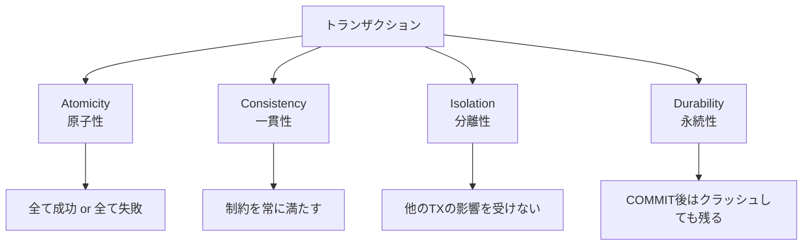

# トランザクション（Transaction）

> **一言で言うと:** 複数のDB操作を「全部成功するか、全部なかったことにするか」の単位にまとめる仕組み。送金で「引き落としだけ成功して入金が失敗」を防ぐ。

## 概念

### ACID 特性

トランザクションが保証する4つの性質:



| 特性 | 保証する内容 | 防ぐ問題 |
|------|-------------|---------|
| **Atomicity（原子性）** | 操作は全て実行されるか、1つも実行されないか | 中途半端な状態のデータ |
| **Consistency（一貫性）** | トランザクション前後でDB制約（NOT NULL, FK, UNIQUE 等）が維持される | 不正なデータの混入 |
| **Isolation（分離性）** | 同時実行中のトランザクションが互いに干渉しない | [[並行性の基本概念]]の競合状態 |
| **Durability（永続性）** | COMMIT されたデータはシステム障害後も消えない | 電源断やクラッシュでのデータ消失 |

### トランザクションのライフサイクル

```
BEGIN → 操作1 → 操作2 → ... → COMMIT（確定）
                                   or
                               ROLLBACK（取り消し）
```

COMMIT するまでは、途中で障害が起きても全ての変更が自動的に取り消される（ロールバック）。

## 分離レベルと並行性の問題

複数のトランザクションが同時に動くと、以下の問題が発生しうる:

| 問題 | 何が起きるか | 例 |
|------|-------------|-----|
| **Dirty Read** | 他のTXがまだ COMMIT していない変更が見える | TX-A が更新中の値を TX-B が読み、TX-A が ROLLBACK → TX-B は存在しないデータを使っている |
| **Non-repeatable Read** | 同じ TX 内で同じ行を2回読むと値が変わっている | TX-A が残高を読む → TX-B が残高を更新して COMMIT → TX-A が再度読むと値が変わっている |
| **Phantom Read** | 同じ条件で2回検索すると行数が変わっている | TX-A が `WHERE age > 20` で検索 → TX-B が新しい行を INSERT して COMMIT → TX-A が再検索すると行が増えている |

### 分離レベルの選択

| 分離レベル | Dirty Read | Non-repeatable Read | Phantom Read | 使いどころ |
|-----------|-----------|-------------------|-------------|-----------|
| READ UNCOMMITTED | 発生 | 発生 | 発生 | ほぼ使わない |
| **READ COMMITTED** | 防止 | 発生 | 発生 | **PostgreSQL デフォルト**。一般的な Web アプリに十分 |
| **REPEATABLE READ** | 防止 | 防止 | SQL標準では発生しうる※ | **MySQL(InnoDB) デフォルト**。同一TX内の読み取り一貫性が必要な場合 |
| SERIALIZABLE | 防止 | 防止 | 防止 | 金融系など厳密な整合性が必要な場面。性能は最も低い |

※ SQL標準上は REPEATABLE READ で Phantom Read が発生しうるが、PostgreSQL（スナップショット分離）と MySQL InnoDB（ギャップロック）ではいずれもデフォルトで防止される。

## コード例

### SQL — 基本的なトランザクション

```sql
-- 送金: 口座Aから口座Bへ1000円を移動
BEGIN;

UPDATE accounts SET balance = balance - 1000 WHERE id = 1;
UPDATE accounts SET balance = balance + 1000 WHERE id = 2;

-- 残高がマイナスになっていないかチェック
-- （CHECK制約でもできるが、ここではアプリ側で判断する例）
DO $$
BEGIN
    IF (SELECT balance FROM accounts WHERE id = 1) < 0 THEN
        RAISE EXCEPTION '残高不足';
    END IF;
END $$;

COMMIT;
-- 例外が発生した場合は自動的に ROLLBACK される
```

### TypeScript — アプリケーション層でのトランザクション管理

```typescript
import { Pool } from "pg";

const pool = new Pool({ connectionString: "postgres://..." });

// 注文作成: 在庫の減算と注文レコードの作成を原子的に実行
async function createOrder(userId: number, productId: number, qty: number) {
  const client = await pool.connect();
  try {
    await client.query("BEGIN");

    // 行ロック: FOR UPDATE で他のTXが同じ行を更新するのを待たせる
    const { rows } = await client.query(
      "SELECT stock FROM products WHERE id = $1 FOR UPDATE",
      [productId]
    );
    if (rows[0].stock < qty) {
      throw new Error("在庫不足");
    }

    await client.query(
      "UPDATE products SET stock = stock - $1 WHERE id = $2",
      [qty, productId]
    );

    await client.query(
      "INSERT INTO orders (user_id, product_id, quantity) VALUES ($1, $2, $3)",
      [userId, productId, qty]
    );

    await client.query("COMMIT");
  } catch (e) {
    await client.query("ROLLBACK");
    throw e;
  } finally {
    client.release(); // コネクションをプールに返す
  }
}
```

### Go — `database/sql` のトランザクション

```go
package main

import (
	"context"
	"database/sql"
	"fmt"
	_ "github.com/lib/pq"
)

func transfer(db *sql.DB, from, to int, amount int64) error {
	tx, err := db.BeginTx(context.Background(), nil)
	if err != nil {
		return err
	}
	// defer でパニック時にも ROLLBACK を保証
	defer tx.Rollback()

	// 口座Aから引き落とし
	var balance int64
	err = tx.QueryRow("SELECT balance FROM accounts WHERE id = $1 FOR UPDATE", from).Scan(&balance)
	if err != nil {
		return err
	}
	if balance < amount {
		return fmt.Errorf("残高不足: %d < %d", balance, amount)
	}

	_, err = tx.Exec("UPDATE accounts SET balance = balance - $1 WHERE id = $2", amount, from)
	if err != nil {
		return err
	}

	// 口座Bに入金
	_, err = tx.Exec("UPDATE accounts SET balance = balance + $1 WHERE id = $2", amount, to)
	if err != nil {
		return err
	}

	return tx.Commit() // 成功時のみ COMMIT
}
```

## ロック戦略

### 悲観的ロック（Pessimistic Locking）

「他のTXと競合するだろう」と想定し、操作前にロックを取る。

```sql
-- SELECT ... FOR UPDATE: 読み取り時に行ロックを取得
-- 他のTXは同じ行の FOR UPDATE / UPDATE / DELETE が待たされる
SELECT * FROM products WHERE id = 42 FOR UPDATE;
UPDATE products SET stock = stock - 1 WHERE id = 42;
COMMIT;
```

### 楽観的ロック（Optimistic Locking）

「競合はめったに起きない」と想定し、更新時に競合を検出する。

```sql
-- version カラムで競合を検出
-- 読み取り時のバージョンと更新時のバージョンが一致しなければ、
-- 他のTXが先に更新している → 0行更新 → アプリ側でリトライ
UPDATE products
SET stock = stock - 1, version = version + 1
WHERE id = 42 AND version = 5;
-- affected rows = 0 なら競合発生 → リトライ
```

| | 悲観的ロック | 楽観的ロック |
|---|---|---|
| 前提 | 競合が頻繁に起きる | 競合はまれ |
| 仕組み | 事前にロックを取る | 更新時に競合を検出 |
| 長所 | 確実に排他制御できる | ロック待ちが発生しない |
| 短所 | ロック待ちでスループット低下 | 競合時はリトライが必要 |
| 向く場面 | 在庫管理、座席予約 | ユーザープロフィール更新、CMS 記事編集 |

## よくある落とし穴

1. **トランザクションを長時間保持する** — ユーザーの入力待ちをトランザクション内に含めると、ロックが長時間保持されて他のリクエストが待たされる。トランザクションは「できるだけ短く」。
2. **`SELECT ... FOR UPDATE` を忘れて楽観的ロックのつもりが何もロックしていない** — 単なる `SELECT` はロックを取らない。競合を防ぐなら明示的にロックするか、version チェックを入れる。
3. **デッドロック** — TX-A が行1 → 行2 の順でロックし、TX-B が行2 → 行1 の順でロックすると、互いに待ち合う。ロック順序を統一するか、タイムアウトを設定する。
4. **暗黙的なオートコミット** — 多くの DB クライアントは `BEGIN` なしの SQL を自動的にコミットする。複数の操作を原子的にしたい場合は必ず `BEGIN` を明示する。
5. **ORM がトランザクション境界を隠す** — ORM のメソッドチェーンがいつ COMMIT されるかを把握していないと、意図しないタイミングで確定される。

## 関連トピック

- [[RDB]] — 親トピック。ACID 特性はRDBの核心
- [[並行性の基本概念]] — 分離レベルは並行制御の DB 層での実装
- [[ロック]] — 行ロック、テーブルロック、デッドロック
- [[Resources/Study/Layer3-データ永続化/インデックス|インデックス]] — ロックの粒度とインデックスの関係
- [[コネクションプール]] — トランザクションはコネクション単位で管理される
