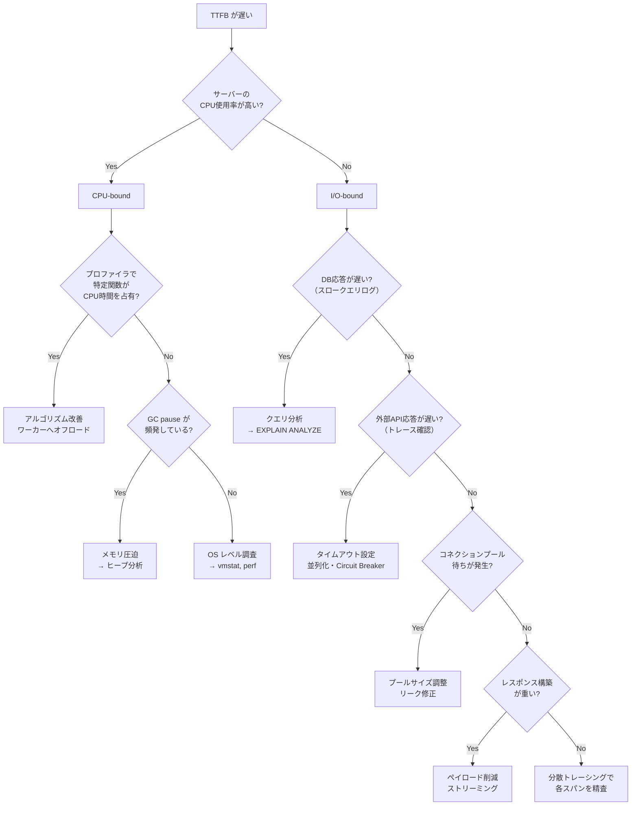
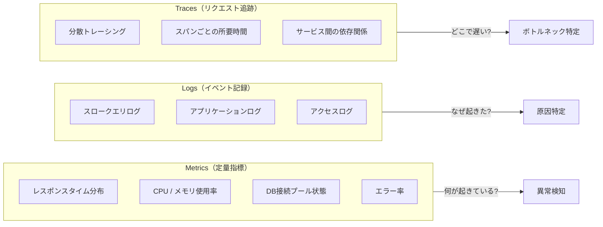
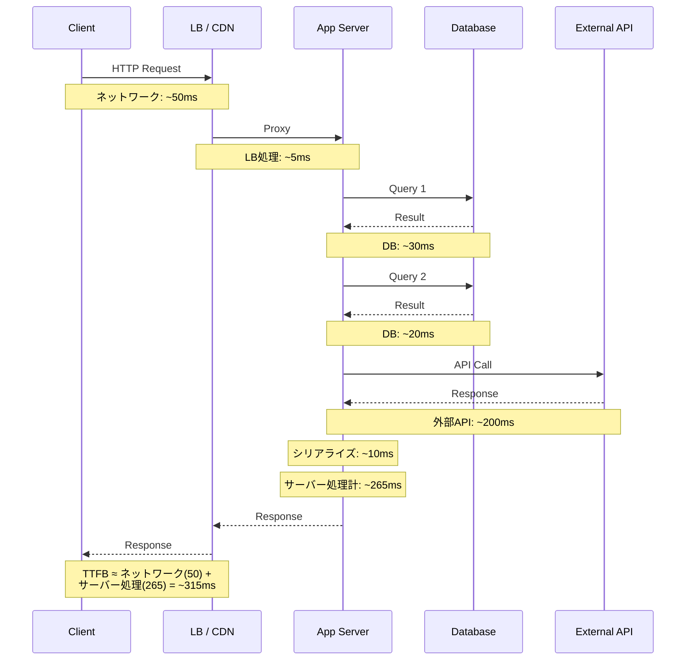

# バックエンドパフォーマンス切り分けガイド（Backend Performance Diagnosis Guide）

> **一言で言うと:** 「ページが遅い」と報告されたとき、バックエンド側で **何を見て・どう切り分け・どう改善するか** を体系化した実践フレームワーク。推測ではなくメトリクスと再現可能な手順でボトルネックを特定する。

## 初動トリアージ

「遅い」という報告だけでは動けない。まず **3つの軸** で状況を絞り込む:

| 軸 | 確認すること | 確認方法 |
|---|---|---|
| **いつから？** | 急に遅くなったのか、徐々にか、常にか | APM のタイムライン、デプロイ履歴、障害アラート |
| **どこが？** | 全エンドポイントか、特定の画面・APIか | エンドポイント別レスポンスタイム分布 |
| **誰が？** | 全ユーザーか、特定の条件（地域・データ量）か | ユーザーセグメント別メトリクス |

### フロントエンド起因かバックエンド起因かの判別

**TTFB（Time To First Byte）** が切り分けの鍵になる。TTFB はブラウザがリクエストを送ってからサーバーが最初の1バイトを返すまでの時間で、[[CoreWebVitals]] の構成要素でもある。

- **TTFB が大きい（> 600ms）** → バックエンド起因の可能性が高い → **このガイドのスコープ**
- **TTFB は小さいが表示が遅い** → フロントエンド起因（JS実行、レンダリング、リソース読み込み）

### パーセンタイルで見る

平均値だけを見ると問題を見逃す。[[SLI-SLO-SLA]] で定義される目標値と照らし合わせて、**p50（中央値）・p95・p99** を確認する:

| パーセンタイル | 意味 | 典型的な目標 |
|---|---|---|
| p50 | ユーザーの半数が体験する速度 | < 200ms |
| p95 | 20人に1人が体験する速度 | < 500ms |
| p99 | 100人に1人が体験する速度 | < 1000ms |

p50 は正常なのに p99 だけ悪い場合、特定条件（大量データを持つユーザー、特定のクエリパス）でのみ問題が発生している。

## 診断フローチャート

初動で「バックエンド起因」と判断したら、以下のフローで原因カテゴリを絞り込む:



## ボトルネック別 詳細診断と改善

### 1. DB クエリ

Web アプリケーションで最も多いボトルネック。[[インデックス設計の判断基準]] と合わせて確認する。

**診断手順:**
1. スロークエリログを有効化（MySQL: `slow_query_log`、PostgreSQL: `log_min_duration_statement`）
2. 遅いクエリに `EXPLAIN ANALYZE` を実行し、フルテーブルスキャン（Seq Scan）やソートのコストを確認
3. アプリケーション側で N+1 クエリが発生していないかログやAPMのクエリカウントで確認

**典型パターンと改善:**

| パターン | 症状 | 改善 |
|---|---|---|
| N+1 クエリ | リスト表示で数百のクエリが発行 | JOIN / IN句 / DataLoader でバッチ取得 |
| Missing Index | フルテーブルスキャンが発生し走査行数が大きい（PostgreSQL: Seq Scan / MySQL: type=ALL + rows_examined） | 適切なインデックス追加 |
| `SELECT *` | 不要な大量カラムを転送 | 必要なカラムだけ SELECT |
| ロック競合 | 特定テーブルで待ち時間が長い | トランザクション範囲の見直し |

### 2. 外部 API 呼び出し

外部サービスへの HTTP リクエストがボトルネックになるケース。[[フォールバックとグレースフルデグラデーション]] の設計が重要。

**診断手順:**
1. 分散トレーシングで外部 API スパンの所要時間を確認
2. 複数の外部呼び出しが直列になっていないか確認
3. タイムアウトが設定されているか確認（未設定 = 無限待ち）

**改善パターン:**
- **直列 → 並列化** — 独立した外部呼び出しを `Promise.all` / `asyncio.gather` / `errgroup` で同時実行
- **タイムアウト設定** — 全外部呼び出しに明示的なタイムアウトを設定する（推奨: 3-5秒）
- **Circuit Breaker** — 障害中の外部サービスへの呼び出しを一時的に遮断し、フォールバック値を返す
- **[[非同期処理とメッセージキュー|非同期化]]** — レスポンスに不要な外部呼び出しはキューに逃がす

### 3. CPU-bound 処理

[[計算量-BigO]] の改善が最も効果的。[[プロセスとスレッド]] の知識でオフロード先を判断する。

**診断手順:**
1. プロファイラでホットスポットを特定（Node.js: `--prof` / clinic.js、Python: `cProfile` / py-spy、Go: `pprof`）
2. [[ロードアベレージとCPU負荷]] で CPU-bound であることを確認（CPU 使用率高 + I/O wait 低）
3. アルゴリズムの計算量を確認

**改善パターン:**
- アルゴリズム改善（O(n²) → O(n log n) 等）
- 結果のキャッシュ（[[キャッシュ書き込み戦略とTTL設計]] 参照）
- ワーカースレッド / 別プロセスへのオフロード（Node.js: `worker_threads`、Python: `multiprocessing`）

### 4. メモリ圧迫と GC

[[メモリリーク]] や大量のオブジェクト生成が GC（Garbage Collection）を頻発させ、アプリケーション全体が停止する（Stop-the-World）。

**診断手順:**
1. メモリ使用量の推移を監視（時間とともに増加し続けていればリーク）
2. GC pause time を確認（Node.js: `--trace-gc`、Go: `GODEBUG=gctrace=1`、JVM: `-Xlog:gc`）
3. ヒープダンプを取得し、保持されているオブジェクトを分析

**改善パターン:**
- リークしているオブジェクト参照の解放（イベントリスナーの除去、キャッシュの上限設定）
- ストリーミング処理への切り替え（大量データを一括でメモリに載せない）
- [[メモリ管理]] の GC チューニング（ヒープサイズ、GC アルゴリズム選択）

### 5. コネクションプール枯渇

[[コネクションプール]] の接続数が上限に達すると、新しいリクエストは接続が空くまで待たされる。

**診断手順:**
1. プールのメトリクスを確認（active / idle / waiting の数）
2. waiting が常に > 0 なら枯渇状態
3. active が多いのに idle がゼロ → プールサイズ不足 or 接続リーク

**改善パターン:**
- プールサイズの適正化（HikariCP の指針: `connections = (物理コア数 × 2) + effective_spindle_count`。SSD 環境では spindle = 0 として `コア数 × 2` が目安。HT スレッドは含めない）
- 接続リークの修正（トランザクション終了後の接続返却を確認）
- クエリの高速化による接続保持時間の短縮

### 6. レスポンス構築

巨大な JSON レスポンスのシリアライゼーションやデータ整形がボトルネックになるケース。

**診断手順:**
1. レスポンスサイズを確認（数 MB 以上なら要注意）
2. シリアライゼーションにかかる時間をトレースで確認
3. 不要なフィールドが含まれていないか確認

**改善パターン:**
- **フィールド選択** — GraphQL の field selection や REST の sparse fieldsets で必要なフィールドだけ返す
- **[[ページネーション]]** — 大量データを分割して返す
- **[[ストリームレスポンス]]** — 全データの構築完了を待たずに逐次送信する
- **[[HTTP圧縮]]** — gzip/Brotli で転送サイズを削減する

## ツールと計測技法

[[モニタリング]] のオブザーバビリティ3本柱（Metrics・Logs・Traces）をボトルネック診断に活用する:



| カテゴリ | ツール例 | 何が分かるか |
|---|---|---|
| APM 全般 | Datadog, New Relic, Grafana | エンドポイント別レスポンスタイム、エラー率 |
| DB クエリ | `EXPLAIN ANALYZE`, `pg_stat_statements`, slow query log | クエリ実行計画、実行時間、呼び出し回数 |
| CPU プロファイリング | `pprof`(Go), `cProfile`/py-spy(Python), clinic.js(Node) | ホットスポット、関数ごとの CPU 時間 |
| メモリ分析 | ヒープダンプ, `--inspect`(Node), `tracemalloc`(Python) | メモリリーク、オブジェクト保持パターン |
| 分散トレーシング | OpenTelemetry, Jaeger, Zipkin | リクエストの経路と各スパンの所要時間 |
| 接続プール | DB ドライバのメトリクス（active/idle/waiting） | 枯渇、リーク |

## レイテンシ分解

1つの HTTP リクエストがどこで時間を消費しているかを可視化する。分散トレーシングのスパンとして各区間を記録する:



この例ではサーバー処理 265ms のうち外部 API が 200ms（75%）を占めており、並列化やキャッシュの最優先対象であることが分かる。

## コード例

### TypeScript（Node.js）— 計測ミドルウェアとスロークエリ検知

```typescript
import { Request, Response, NextFunction } from "express";
import { PrismaClient } from "@prisma/client";

// リクエスト計測ミドルウェア
function latencyMiddleware(req: Request, res: Response, next: NextFunction) {
  const start = performance.now();

  res.on("finish", () => {
    const duration = performance.now() - start;
    const label = `${req.method} ${req.route?.path ?? req.path}`;

    // 構造化ログとして出力（APM が自動収集する形式）
    console.log(
      JSON.stringify({
        type: "http_request",
        method: req.method,
        path: req.route?.path ?? req.path,
        status: res.statusCode,
        duration_ms: Math.round(duration),
        slow: duration > 500,
      })
    );

    if (duration > 500) {
      console.warn(`[SLOW] ${label}: ${Math.round(duration)}ms`);
    }
  });

  next();
}

// Prisma スロークエリ検知
const prisma = new PrismaClient({
  log: [
    { emit: "event", level: "query" },
  ],
});

prisma.$on("query", (e) => {
  if (e.duration > 100) {
    console.warn(
      JSON.stringify({
        type: "slow_query",
        query: e.query,
        params: e.params,
        duration_ms: e.duration,
      })
    );
  }
});
```

### Python（FastAPI）— 外部 API 並列化の before/after

```python
import asyncio
import time
import httpx
from fastapi import FastAPI, Request

app = FastAPI()

# リクエスト計測ミドルウェア
@app.middleware("http")
async def latency_middleware(request: Request, call_next):
    start = time.perf_counter()
    response = await call_next(request)
    duration_ms = (time.perf_counter() - start) * 1000
    response.headers["X-Response-Time"] = f"{duration_ms:.0f}ms"
    if duration_ms > 500:
        print(f"[SLOW] {request.method} {request.url.path}: {duration_ms:.0f}ms")
    return response

# --- アンチパターン: 直列呼び出し ---
async def fetch_dashboard_slow(user_id: str) -> dict:
    async with httpx.AsyncClient(timeout=5.0) as client:
        # 3つの独立した API を順番に呼ぶ → 合計 ~900ms
        profile = await client.get(f"https://api.example.com/users/{user_id}")
        orders = await client.get(f"https://api.example.com/orders?user={user_id}")
        notifications = await client.get(f"https://api.example.com/notifications?user={user_id}")
    return {
        "profile": profile.json(),
        "orders": orders.json(),
        "notifications": notifications.json(),
    }

# --- 改善: 並列呼び出し ---
async def fetch_dashboard_fast(user_id: str) -> dict:
    async with httpx.AsyncClient(timeout=5.0) as client:
        # 独立した API を同時に呼ぶ → 合計 ~300ms（最遅の1つ分）
        profile, orders, notifications = await asyncio.gather(
            client.get(f"https://api.example.com/users/{user_id}"),
            client.get(f"https://api.example.com/orders?user={user_id}"),
            client.get(f"https://api.example.com/notifications?user={user_id}"),
        )
    return {
        "profile": profile.json(),
        "orders": orders.json(),
        "notifications": notifications.json(),
    }
```

### Go — pprof 有効化とコネクションプール監視

```go
package main

import (
	"database/sql"
	"encoding/json"
	"log"
	"net/http"
	"net/http/pprof"
	"time"

	_ "github.com/lib/pq"
)

// コネクションプール状態を JSON で返すハンドラ
func poolStatsHandler(db *sql.DB) http.HandlerFunc {
	return func(w http.ResponseWriter, r *http.Request) {
		stats := db.Stats()
		json.NewEncoder(w).Encode(map[string]any{
			"max_open":       stats.MaxOpenConnections,
			"open":           stats.OpenConnections,
			"in_use":         stats.InUse,
			"idle":           stats.Idle,
			"wait_count":     stats.WaitCount,     // プール枯渇で待った累計回数
			"wait_duration":  stats.WaitDuration.String(), // 累計待ち時間
			"max_idle_closed": stats.MaxIdleClosed,
		})
	}
}

// リクエスト計測ミドルウェア
func latencyMiddleware(next http.Handler) http.Handler {
	return http.HandlerFunc(func(w http.ResponseWriter, r *http.Request) {
		start := time.Now()
		next.ServeHTTP(w, r)
		duration := time.Since(start)

		if duration > 500*time.Millisecond {
			log.Printf("[SLOW] %s %s: %s", r.Method, r.URL.Path, duration)
		}
	})
}

func main() {
	db, err := sql.Open("postgres", "postgres://localhost/myapp?sslmode=disable")
	if err != nil {
		log.Fatal(err)
	}

	// コネクションプールの設定
	db.SetMaxOpenConns(25)
	db.SetMaxIdleConns(10)
	db.SetConnMaxLifetime(5 * time.Minute)

	mux := http.NewServeMux()
	mux.HandleFunc("/debug/pool", poolStatsHandler(db))

	// カスタム ServeMux には pprof ハンドラを明示的に登録する
	// （blank import は DefaultServeMux にしか登録されない）
	mux.HandleFunc("/debug/pprof/", pprof.Index)
	mux.HandleFunc("/debug/pprof/cmdline", pprof.Cmdline)
	mux.HandleFunc("/debug/pprof/profile", pprof.Profile)
	mux.HandleFunc("/debug/pprof/symbol", pprof.Symbol)
	mux.HandleFunc("/debug/pprof/trace", pprof.Trace)

	log.Println("listening on :8080")
	log.Println("  pprof: http://localhost:8080/debug/pprof/")
	log.Println("  pool:  http://localhost:8080/debug/pool")
	http.ListenAndServe(":8080", latencyMiddleware(mux))
}
```

**pprof の使い方:**

```bash
# CPU プロファイル（30秒間）を取得して解析
go tool pprof http://localhost:8080/debug/pprof/profile?seconds=30

# ヒープメモリの使用状況を確認
go tool pprof http://localhost:8080/debug/pprof/heap

# Web UI でフレームグラフを表示
go tool pprof -http=:9090 http://localhost:8080/debug/pprof/profile?seconds=30
```

## よくある落とし穴

### 1. APM を入れていない状態で推測で改善を始める

「たぶんDBが遅い」で闇雲にインデックスを追加しても、実際のボトルネックが外部 API 呼び出しなら効果ゼロ。**まず計測基盤（APM / 構造化ログ / 分散トレーシング）を整備する**のが最優先。

### 2. p50（中央値）だけ見て p99 を無視する

中央値が 100ms でも p99 が 5秒なら、100人に1人が5秒待っている。テールレイテンシは特定のデータ量・クエリパスで発生することが多く、負荷テストでは見つけにくい。

### 3. キャッシュで根本原因を隠す

N+1 クエリや非効率なアルゴリズムをキャッシュで覆い隠すと、キャッシュが切れた瞬間に大量リクエストが DB を直撃する（Cache Stampede）。キャッシュは改善の上に重ねるもので、問題の隠蔽に使ってはいけない。

### 4. 本番とローカルの差を無視する

ローカルでは「速い」のに本番で遅い原因: データ量が桁違い、同時接続による競合、ネットワークレイテンシ、コンテナのリソース制限。**本番相当のデータ量で負荷テストを行う**ことが不可欠。

### 5. 1箇所直して満足する

ボトルネックを1つ解消すると、次のボトルネックが露出する（ボトルネックの移動）。改善後は必ず再計測し、次の改善対象を確認するサイクルを回す。

### 6. 負荷テストなしで「改善した」と判断する

単一リクエストの速度が改善しても、同時接続100本のときに改善が保たれるとは限らない。`wrk`、`k6`、`vegeta` などで並行リクエスト時の振る舞いを検証する。

## 関連トピック

- [[パフォーマンス最適化]] — 親トピック。計測駆動の最適化サイクルと改善カテゴリの全体像
- [[モニタリング]] — オブザーバビリティ3本柱（Metrics / Logs / Traces）が診断の基盤
- [[CoreWebVitals]] — TTFB を含むフロントエンド指標。バックエンド/フロントエンドの境界
- [[SLI-SLO-SLA]] — パフォーマンス目標の定量定義
- [[コネクションプール]] — DB 接続プール枯渇の診断と改善
- [[メモリリーク]] — メモリ圧迫と GC 問題の詳細
- [[ロードアベレージとCPU負荷]] — CPU-bound の判断指標
- [[インデックス設計の判断基準]] — DB クエリ最適化の判断フレームワーク
- [[フォールバックとグレースフルデグラデーション]] — 外部 API 障害時の Circuit Breaker 設計
- [[非同期処理とメッセージキュー]] — レスポンスに不要な重い処理のオフロード
- [[ページネーション]] — レスポンスサイズ削減の基本手法
- [[ストリームレスポンス]] — 巨大レスポンスの逐次送信
