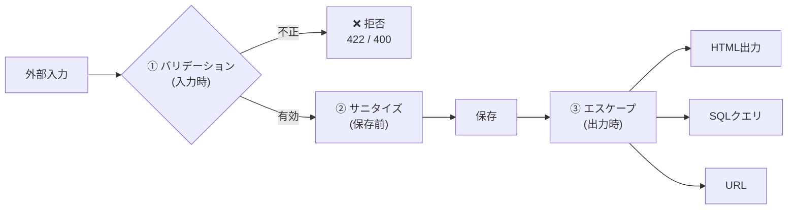
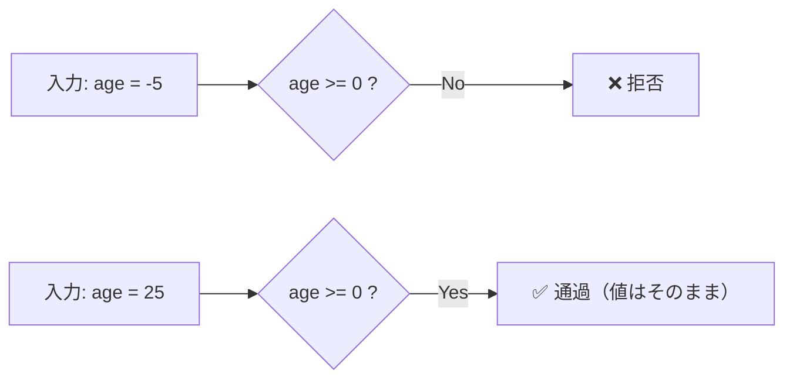
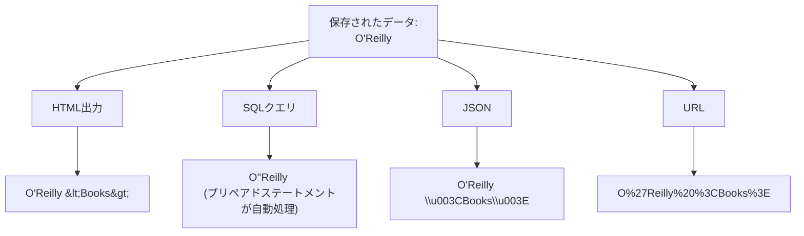
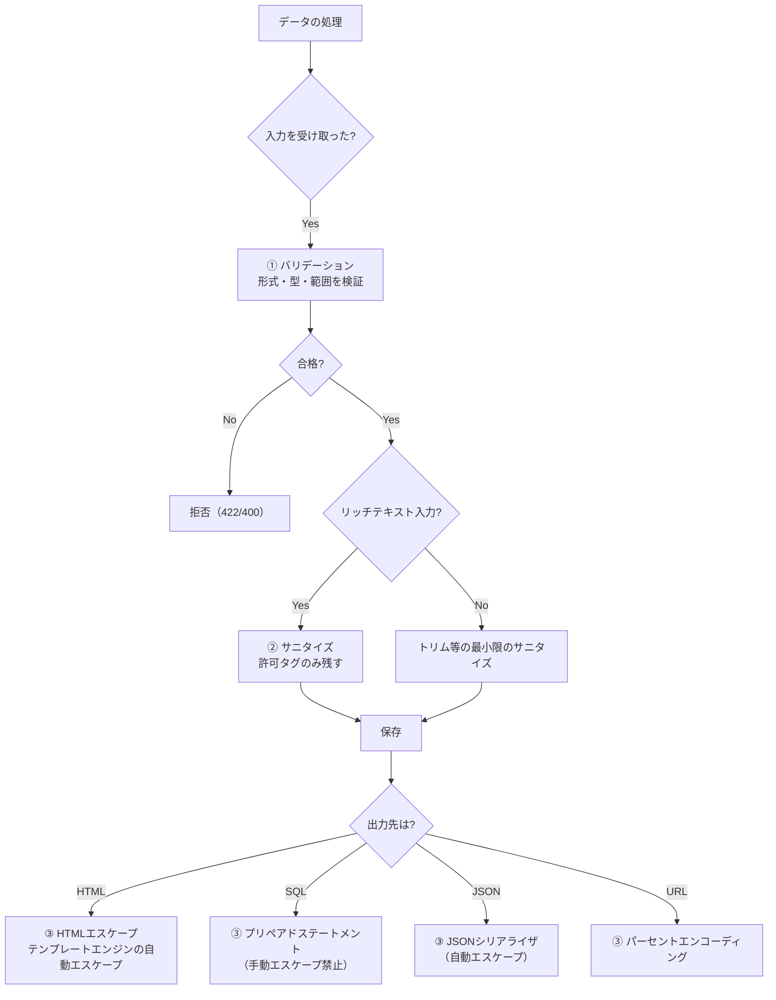

# バリデーション・サニタイズ・エスケープ（Validation, Sanitization, Escaping）

> **一言で言うと:** バリデーションは「不正なデータを拒否する」、サニタイズは「データを安全な形に変換する」、エスケープは「出力先の文脈に合わせて特殊文字を無害化する」。この3つは補完的な関係にあり、それぞれ適用すべきタイミングと目的が異なる。

## 3つの概念の関係



| 概念 | 目的 | タイミング | 操作 | 例 |
|------|------|-----------|------|---|
| バリデーション | 不正なデータを弾く | **入力時** | 検証（変換しない） | メール形式チェック、範囲チェック |
| サニタイズ | データを安全な形に整える | **保存前** | 変換・除去 | HTMLタグ除去、先頭末尾の空白トリム |
| エスケープ | 出力先での誤解釈を防ぐ | **出力時** | 特殊文字の変換 | `<` → `&lt;`、`'` → `\'` |

**核心的な違い:** バリデーションは「門前払い」、サニタイズは「持ち物検査で危険物を取り上げる」、エスケープは「出口で安全な姿に変装させる」。

## バリデーション — 入力の門番

バリデーションはデータを**変換せず**、正しいか正しくないかを判定する。不正ならリクエスト全体を拒否する。



バリデーションの鉄則は**許可リスト（Allowlist）アプローチ**。「何を禁止するか」ではなく「何を許可するか」を定義する。

```
❌ 拒否リスト: <script>, <iframe>, javascript: を禁止
   → 新しい攻撃ベクトル（等）を見逃す

✅ 許可リスト: 英数字、ハイフン、アンダースコアのみ許可
   → 未知の攻撃も自動的にブロック
```

## サニタイズ — データの浄化

サニタイズはデータを**変換して**安全な形にする。元のデータが一部失われることを許容する。

| サニタイズの種類 | 入力 | 出力 | 用途 |
|---|---|---|---|
| トリム（Trim） | `"  hello  "` | `"hello"` | 先頭末尾の空白除去 |
| HTMLタグ除去 | `"<b>hello</b>"` | `"hello"` | ユーザー入力からHTMLを除去 |
| 正規化 | `"Ｈｅｌｌｏ"` | `"Hello"` | 全角→半角変換 |
| URLデコード | `"%3Cscript%3E"` | `"<script>"` | エンコードされた入力の正規化（→ その後にバリデーション） |

**サニタイズの危険性:** サニタイズは「データを変えてしまう」ため、意図しない変換が発生しうる。例えば、HTMLタグ除去で `"2 < 3"` が `"2 "` になったり、ユーザーが意図的に入力した `<code>` タグが消えたりする。サニタイズはバリデーションの**代替ではなく補助**として使うべき。

## エスケープ — 出力先に応じた無害化

エスケープはデータの**意味を保ったまま**、出力先のコンテキストで特殊文字として誤解釈されないように変換する。



**出力コンテキストごとに異なるエスケープが必要** — これがエスケープの最も重要なポイント。HTMLエスケープとSQLエスケープは全く異なる規則であり、間違ったコンテキストのエスケープを適用すると防御が機能しない。

| コンテキスト | エスケープ対象 | 手段 |
|---|---|---|
| HTML本文 | `<`, `>`, `&`, `"`, `'` | HTMLエスケープ（`&lt;` 等） |
| HTML属性 | 上記 + スペース等 | 属性値を引用符で囲む + HTMLエスケープ |
| JavaScript文字列 | `'`, `"`, `\`, 改行 | JSONエンコード or JSエスケープ |
| SQL | `'`, `\` | **プリペアドステートメント**（手動エスケープは非推奨） |
| URL | 非ASCII、特殊文字 | パーセントエンコーディング |
| CSS | `(`, `)`, `;` | CSSエスケープ |

## コード例

### TypeScript — 3段階の防御

```typescript
import express from 'express';
import { z } from 'zod';
import createDOMPurify from 'dompurify';
import { JSDOM } from 'jsdom';

const app = express();
app.use(express.json());

const DOMPurify = createDOMPurify(new JSDOM('').window as any);

// ① バリデーション: 入力時に型と形式を検証
const CommentSchema = z.object({
  author: z.string().min(1).max(50),
  body: z.string().min(1).max(5000),
});

app.post('/comments', (req, res) => {
  // ① バリデーション — 不正なら拒否
  const parsed = CommentSchema.safeParse(req.body);
  if (!parsed.success) {
    return res.status(422).json({ error: 'Validation failed' });
  }

  // ② サニタイズ — HTMLタグを安全なものだけ残す
  const sanitizedBody = DOMPurify.sanitize(parsed.data.body, {
    ALLOWED_TAGS: ['b', 'i', 'em', 'strong', 'a'],
    ALLOWED_ATTR: ['href'],
  });
  const author = parsed.data.author.trim(); // 空白トリム

  // 保存（プリペアドステートメントがSQLエスケープを自動処理）
  // db.query('INSERT INTO comments (author, body) VALUES ($1, $2)', [author, sanitizedBody]);

  // ③ エスケープ — JSONレスポンスではJSON.stringifyが自動エスケープ
  res.status(201).json({ author, body: sanitizedBody });
});

// HTMLテンプレートに出力する場合は、テンプレートエンジンが自動エスケープ
// EJS: <%= variable %>  → HTMLエスケープ済み
// EJS: <%- variable %>  → エスケープなし（サニタイズ済みHTMLの出力用）

app.listen(3000);
```

### Go — 入力バリデーション + 出力エスケープ

```go
package main

import (
	"encoding/json"
	"html"
	"html/template"
	"net/http"
	"strings"

	"github.com/go-playground/validator/v10"
	"github.com/microcosm-cc/bluemonday"
)

var validate = validator.New()

// HTMLサニタイザー（許可リストベース）
var sanitizer = bluemonday.UGCPolicy()

type CommentInput struct {
	Author string `json:"author" validate:"required,max=50"`
	Body   string `json:"body" validate:"required,max=5000"`
}

func createComment(w http.ResponseWriter, r *http.Request) {
	var input CommentInput

	// JSONデコード
	if err := json.NewDecoder(r.Body).Decode(&input); err != nil {
		http.Error(w, `{"error":"invalid JSON"}`, http.StatusBadRequest)
		return
	}

	// ① バリデーション
	if err := validate.Struct(input); err != nil {
		w.WriteHeader(http.StatusUnprocessableEntity)
		json.NewEncoder(w).Encode(map[string]string{"error": "validation failed"})
		return
	}

	// ② サニタイズ
	input.Author = strings.TrimSpace(input.Author)
	input.Body = sanitizer.Sanitize(input.Body) // 安全なHTMLタグのみ残す

	// 保存（省略。プリペアドステートメント使用）

	// ③ エスケープ — 出力先に応じる
	// JSON出力: encoding/jsonが自動エスケープ
	w.Header().Set("Content-Type", "application/json")
	json.NewEncoder(w).Encode(input)
}

// HTMLテンプレートに出力する場合
var tmpl = template.Must(template.New("comment").Parse(
	`<div class="comment">
		<strong>{{.Author}}</strong>
		<p>{{.Body}}</p>
	</div>`))
// html/template は自動的にHTMLエスケープする
// .Author が "O'Reilly <script>" → "O&#39;Reilly &lt;script&gt;" に変換

// 手動エスケープが必要な場面
func manualEscape() {
	userInput := `<script>alert("XSS")</script>`

	// HTMLコンテキスト
	htmlSafe := html.EscapeString(userInput)
	_ = htmlSafe // &lt;script&gt;alert(&#34;XSS&#34;)&lt;/script&gt;

	// URLコンテキスト（net/urlパッケージを使用）
	// url.QueryEscape(userInput)
}

func main() {
	http.HandleFunc("/comments", createComment)
	http.ListenAndServe(":3000", nil)
}
```

### Python — Django / FastAPIでの防御

```python
import html
from urllib.parse import quote

import bleach
from pydantic import BaseModel, Field


class CommentInput(BaseModel):
    author: str = Field(min_length=1, max_length=50)
    body: str = Field(min_length=1, max_length=5000)


def process_comment(raw_input: dict) -> dict:
    # ① バリデーション — Pydanticが型と制約を検証
    comment = CommentInput(**raw_input)

    # ② サニタイズ — 許可リストベースのHTMLサニタイズ
    sanitized_body = bleach.clean(
        comment.body,
        tags=["b", "i", "em", "strong", "a"],
        attributes={"a": ["href"]},
        strip=True,
    )
    author = comment.author.strip()

    # 保存（省略。ORMがプリペアドステートメントを使用）

    return {"author": author, "body": sanitized_body}


# ③ エスケープ — 出力コンテキストに応じて適用
user_input = '<script>alert("XSS")</script>'

# HTMLコンテキスト
html_safe = html.escape(user_input)
# → &lt;script&gt;alert(&quot;XSS&quot;)&lt;/script&gt;

# URLコンテキスト
url_safe = quote(user_input)
# → %3Cscript%3Ealert%28%22XSS%22%29%3C/script%3E

# Djangoテンプレート: {{ variable }} は自動HTMLエスケープ
# Jinja2: {{ variable }} も自動HTMLエスケープ（autoescape有効時）
```

## どのタイミングで何を使うか — 判断フローチャート



## よくある落とし穴

### 1. サニタイズでセキュリティを担保しようとする

「入力からHTMLタグを除去すればXSSは防げる」という考えは不十分。サニタイズは新しい攻撃ベクトルを見逃す可能性がある。XSS防御の本体は**出力時のエスケープ**（テンプレートエンジンの自動エスケープ、CSP）であり、サニタイズは補助的な防御層にすぎない。

### 2. 入力時にエスケープしてDBに保存する

入力時にHTMLエスケープした文字列（`&lt;script&gt;`）をDBに保存すると、HTML以外のコンテキスト（API JSON、メール、PDF）で出力するときにエスケープ済み文字がそのまま表示されてしまう。**エスケープは出力時に、出力先のコンテキストに応じて適用する**のが原則。

```
❌ 入力時エスケープ
   入力: <b>Hello</b>
   DB保存: &lt;b&gt;Hello&lt;/b&gt;
   HTML出力: &lt;b&gt;Hello&lt;/b&gt;  ← 二重エスケープで壊れる
   JSON出力: "&lt;b&gt;Hello&lt;/b&gt;"  ← エスケープ文字がそのまま見える

✅ 出力時エスケープ
   入力: <b>Hello</b>
   DB保存: <b>Hello</b>  ← 生データのまま
   HTML出力: &lt;b&gt;Hello&lt;/b&gt;  ← テンプレートエンジンが自動エスケープ
   JSON出力: "<b>Hello</b>"  ← JSONシリアライザが適切に処理
```

### 3. 手動でSQLエスケープする

文字列結合 + 手動エスケープでSQLを組み立てるのは、エスケープの漏れや文字セットの違いで突破される。プリペアドステートメント（パラメタライズドクエリ）で**構造的に**SQLインジェクションを防ぐ。

```python
# ❌ 手動エスケープ — 突破されるリスクがある
query = f"SELECT * FROM users WHERE name = '{name.replace(chr(39), chr(39)+chr(39))}'"

# ✅ プリペアドステートメント — 構造的に安全
cursor.execute("SELECT * FROM users WHERE name = %s", (name,))
```

### 4. 二重サニタイズ / 二重エスケープ

ミドルウェアとハンドラの両方でサニタイズを実行したり、サニタイズ済みデータをテンプレートエンジンがさらにエスケープしたりすると、`&amp;lt;` のような二重エスケープが発生する。サニタイズとエスケープの適用ポイントを明確にし、各段階で1回だけ処理する。

### 5. `innerHTML` や `dangerouslySetInnerHTML` の安易な使用

ReactやVueでHTMLをそのまま描画するAPIは、サニタイズ済みのHTMLを表示するために存在する。サニタイズされていないユーザー入力をこれらに渡すとXSSが発生する。使用する場合は必ずDOMPurifyやbleach等でサニタイズしてから渡す。

## AIによる実装のアンチパターン

| アンチパターン | なぜ問題か | 対策 |
|---|---|---|
| 入力時にHTMLエスケープしてDBに保存 | 出力コンテキストが変わると二重エスケープやエスケープ文字の露出が起きる | 生データを保存し、出力時にコンテキストに応じてエスケープ |
| 正規表現による自作HTMLサニタイザー | HTMLの構文解析は正規表現では不可能。難読化された攻撃を見逃す | DOMPurify、bluemonday、bleach等の実績あるライブラリを使用 |
| `strip_tags()` のみでXSS対策 | 属性値内のイベントハンドラ（`onload`等）を見逃す可能性がある | 許可リストベースのサニタイザーを使用 |
| バリデーションとサニタイズを混同して片方だけ実装 | サニタイズは「変換」なので不正データを通過させうる。バリデーションは「拒否」なので安全 | 目的に応じて使い分け。セキュリティにはバリデーション + 出力時エスケープ |

## 関連トピック

- [[バリデーション]] — 親トピック。バリデーションの全体設計と層構造
- [[エラーハンドリング]] — バリデーションエラーの構造化レスポンス設計
- [[CORS]] — ブラウザのセキュリティモデルとエスケープの関係
- [[パスワードハッシュ]] — 入力データの変換という点でサニタイズと似ているが、目的は機密性

## 参考リソース

- OWASP XSS Prevention Cheat Sheet — コンテキスト別エスケープルールの網羅的なガイド
- DOMPurify GitHub — ブラウザ/Node.js向けHTMLサニタイザーの業界標準
- bluemonday GoDoc — Go向け許可リストベースHTMLサニタイザー
