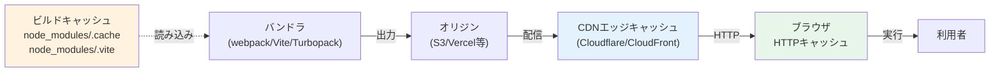
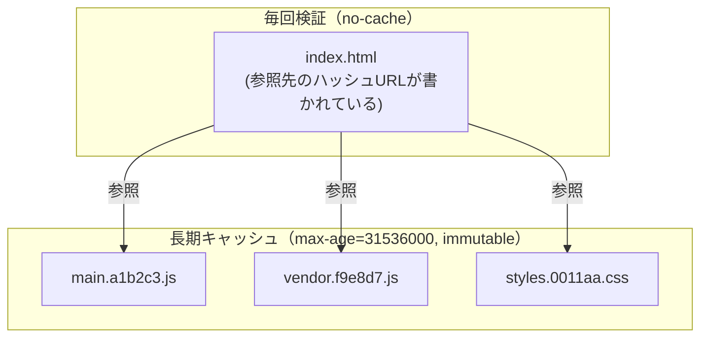
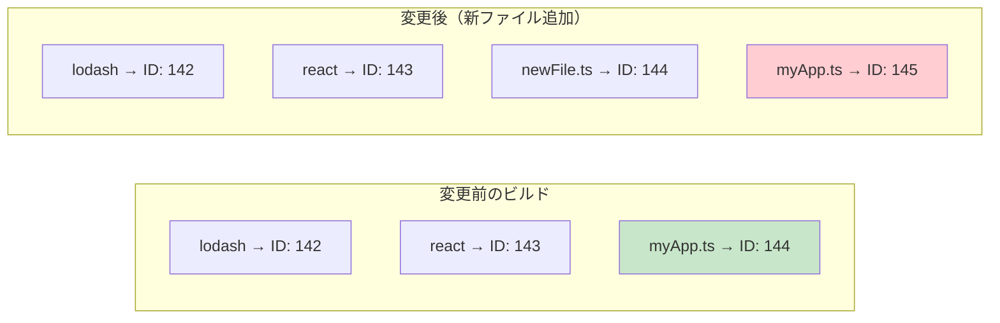
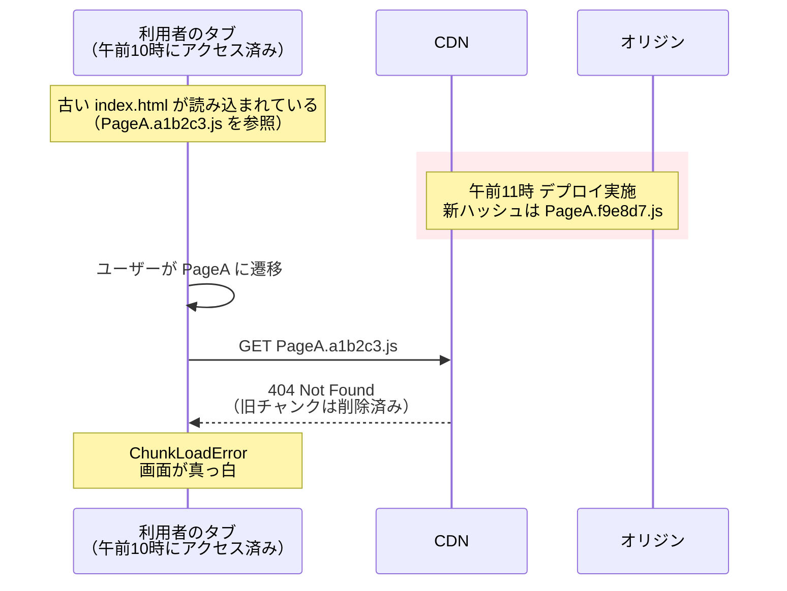

# バンドラのキャッシュ問題（Bundler Caching Pitfalls）

> **一言で言うと:** バンドラの出力 JS/CSS は「ブラウザ/CDNに長期キャッシュさせる」ことで初回以降の表示を高速化する設計だが、**①更新したのに古いコードが表示される** ②**変更していないファイルまでキャッシュが捨てられる** ③**デプロイ直後の利用者が動的 import に失敗する** という3種類の事故が定番で起きる。原因は「ファイル名ハッシュ」「モジュールID」「Cache-Control ヘッダ」「ビルドキャッシュ」の4要素の絡み合いにある。

## なぜキャッシュ問題は難しいか — 3層のキャッシュが重なる

JS バンドラを使う Web アプリでは、コードが利用者に届くまでに少なくとも3層のキャッシュが介在する。



| 層 | 何をキャッシュするか | 主な事故 |
|---|---|---|
| ビルドキャッシュ | 前回ビルド時のモジュール変換結果 | 依存更新が反映されず「再起動したら直った」 |
| CDN エッジ | 配信済みのバンドルファイル | 古いチャンクが残存し続ける／デプロイ直後に古い HTML から新ハッシュを参照できない |
| ブラウザ HTTP キャッシュ | リソースを `Cache-Control` の指示で保持 | ハッシュ無し URL を長期キャッシュさせて更新が届かない |

このうち **ブラウザと CDN のキャッシュ問題が「本番事故」になりやすい**ため、まずそちらを掘り下げる。

## コア戦略 — 「不変なURL」と「短命なエントリポイント」の2分法

長期キャッシュを安全に成立させる戦略は、結局のところ次の1行に集約される。

> **コンテンツが変われば URL も変わる**（hashed assets）／ **エントリポイントの HTML は毎回確認する**（never cache）



- ハッシュ付きファイルは内容と1対1なので、**間違って古いものが返ることがない** → `Cache-Control: public, max-age=31536000, immutable`
- HTML は「新しいハッシュ名を伝える唯一の経路」なので、ここをキャッシュすると更新が止まる → `Cache-Control: no-cache`（または `max-age=0, must-revalidate`）

ここで使うハッシュ名の付け方を理解していないと、この戦略は破綻する。

## ハッシュ名の3種類 — `[contenthash]` / `[chunkhash]` / `[hash]`

webpack のテンプレート文字列で語られるが、概念は他のバンドラでも同じ。

| ハッシュ種類 | 計算対象 | 何が変わるとハッシュが変わるか | 用途 |
|---|---|---|---|
| `[contenthash]` | 出力ファイル単体の内容 | そのファイル自体の内容が変わったとき | **本番ファイル名はこれ一択** |
| `[chunkhash]` | チャンクに含まれるモジュール群 | チャンク内のどれか1つでも変わると変わる | CSS が JS と一蓮托生になり過剰再キャッシュ |
| `[hash]` / `[fullhash]` | ビルド全体 | **全ビルドで毎回変わる** | 使ってはいけない（長期キャッシュが成立しない） |

webpack 5 では `[hash]` は `[fullhash]` に改名され、`[hash]` 使用時は `"[hash]" is now "[fullhash]"` という deprecation warning が出る。意味は同じ「ビルド全体ハッシュ」なので、改名後の名前でも本番ファイル名には使ってはいけない点は変わらない。

```javascript
// webpack — 本番設定の正解
output: {
  filename: '[name].[contenthash:8].js',          // OK
  chunkFilename: '[name].[contenthash:8].js',     // OK（lazy chunk）
  assetModuleFilename: 'assets/[hash:8][ext]',    // OK（asset modules の hash は contenthash 相当）
}
// ❌ filename: '[name].[hash].js'  → 1文字直すだけで全アセットが無効化される
```

Vite / Rollup は `output.entryFileNames: '[name].[hash].js'` のように書くが、ここでの `[hash]` は内部実装が **contenthash 相当**なので問題ない（webpack の `[hash]` だけが歴史的に「ビルドハッシュ」を指す）。

## 落とし穴の本丸 — モジュールIDの不安定性

「contenthash を使っているのに、変更していないチャンクのハッシュまで変わる」。これは webpack 育ちの誰もが一度は踏む地雷で、原因は**モジュールID**にある。



webpack は内部で各モジュールに数値IDを付与し、ランタイムから `__webpack_require__(144)` のように呼び出す。**新しいモジュールが追加されると以降のIDがずれる**ため、ファイル中身が同一でも参照IDが書き換わり、結果として contenthash が変わる。

**対策（webpack 5 の本番モードでは既定で有効）:**

```javascript
optimization: {
  moduleIds: 'deterministic',   // モジュールパスから安定IDを生成
  chunkIds: 'deterministic',    // チャンクIDも同様
  runtimeChunk: 'single',       // ランタイム部分を別ファイルに切り出す
}
```

`runtimeChunk: 'single'` がポイント。**webpack のランタイムには各チャンクの contenthash を含むマニフェストが埋め込まれている**ため、別チャンクのハッシュが変わるたびにランタイム自身も書き換わる。これをエントリと同居させると、無関係なチャンクの変更がエントリチャンクの contenthash まで連鎖的に変えてしまう。**ランタイムを `runtime.[contenthash].js` に切り出すと、この連鎖が runtime ファイル1つで止まり、エントリチャンクが安定する**。

Vite/Rollup ではモジュールIDではなくモジュールパスを直接参照する設計のため、この問題は基本的に発生しない。Turbopack も同様で「Rust 製でモジュール解決が決定論的」という設計上の利点として宣伝される部分でもある。

## デプロイ直後の地雷 — Stale Chunk 問題（ChunkLoadError）

長期キャッシュ戦略が正しく動いていても残る、最も気付きにくい問題がこれ。



すでにページを開いていた利用者は、デプロイ後に動的 import (`React.lazy` / `import('./PageA')`) でチャンクを取得しようとして失敗する。CDN から旧チャンクが purge されると即座にエラー化する。

**対策の組み合わせ:**

| 対策 | 仕組み | 注意点 |
|---|---|---|
| 旧チャンクを残す | デプロイ後も旧ファイルを N 日間オリジンに保持 | ストレージコストとの兼ね合い。Vercel/Netlify はこれをデフォルトで実装 |
| エラー時にリロード | `import()` を try/catch し、ChunkLoadError なら `location.reload()` | フォーム入力中のユーザーは入力が消える |
| バージョントークン埋め込み | API レスポンスや Service Worker でビルドIDを通知し、ミスマッチなら警告UI | UX設計が必要 |
| Service Worker のオフライン対応 | キャッシュ済みアセットから提供 | SW 自身の更新戦略が別途必要 |

Next.js / Remix / SvelteKit のような統合フレームワークは、これらを組み合わせた挙動をデフォルトで提供している。素の SPA で webpack/Vite を直接使う場合は自前で実装が必要。

```typescript
// React の lazy import で ChunkLoadError をリロードで回復させる例
import { lazy } from 'react';

function lazyWithRetry<T extends React.ComponentType<unknown>>(
  factory: () => Promise<{ default: T }>,
) {
  return lazy(async () => {
    try {
      const mod = await factory();
      // 成功したらフラグをクリアして、次回のデプロイでも同じ仕組みが効くようにする
      sessionStorage.removeItem('chunk-reload');
      return mod;
    } catch (err) {
      // バンドラごとにメッセージが違うため複数パターンを許容する
      // - webpack: "Loading chunk N failed"
      // - Vite/Rollup: "Failed to fetch dynamically imported module"
      // - Safari: "Importing a module script failed"
      const msg = err instanceof Error ? err.message : '';
      const isChunkError =
        /Loading chunk .* failed|Failed to fetch dynamically imported module|Importing a module script failed/.test(msg);
      if (isChunkError && !sessionStorage.getItem('chunk-reload')) {
        sessionStorage.setItem('chunk-reload', '1');
        window.location.reload();
      }
      throw err;
    }
  });
}

const PageA = lazyWithRetry(() => import('./PageA'));
```

`sessionStorage` でリロード回数を抑止しないと、本物の障害（オリジンダウン）で**無限リロードループ**になる。AI生成コードで頻出するバグ。逆に成功時にフラグを消し忘れると、次回デプロイ時に「1回しかリロードできない」状態が引き継がれてしまうため、成功パスでの `removeItem` も忘れない。

## チャンク分割とキャッシュ寿命の最適化

長期キャッシュを最大限活かすには「変わらないコードは別チャンクに切り出す」設計が要る。

```javascript
// webpack — vendor とアプリケーションを分離する典型構成
optimization: {
  splitChunks: {
    chunks: 'all',
    cacheGroups: {
      // node_modules は別チャンクに（変更頻度が低い）
      vendor: {
        test: /[\\/]node_modules[\\/]/,
        name: 'vendor',
        priority: 10,
      },
      // 巨大ライブラリは更にさらに細分化
      react: {
        test: /[\\/]node_modules[\\/](react|react-dom)[\\/]/,
        name: 'react',
        priority: 20,
      },
    },
  },
  runtimeChunk: 'single',
}
```

- アプリコード変更 → `main.[hash].js` だけ更新、`vendor.[hash].js` と `react.[hash].js` は使い回し
- `react` を上げて `vendor` を 18→19 にしただけ → `react.[hash].js` だけ更新

ただし**チャンクを細かく分け過ぎると HTTP リクエストが増えて初回表示が遅くなる**トレードオフがある。HTTP/2 多重化があっても無料ではない。「変更頻度が大きく違うもの同士を分ける」という基準で分割する。

## 開発時のキャッシュ問題 — ビルドキャッシュとブラウザキャッシュの両方

本番のキャッシュ戦略とは別に、開発中は「キャッシュが残っていて変更が反映されない」という別種の事故がある。

### ビルドキャッシュの腐敗

| ツール | キャッシュ場所 | 腐敗の症状 |
|---|---|---|
| webpack | `node_modules/.cache/webpack/` | 依存更新後に「型が見つからない」「export が無いと言われる」 |
| Vite | `node_modules/.vite/` | `optimizeDeps` の結果が古く、新APIを使えない |
| Turbopack（Next.js） | `.next/cache/` | Server Component の更新が反映されない |
| Turborepo（モノレポタスクランナー、Turbopack とは別物） | `.turbo/` | 上流タスクの再実行が省略され、古い結果が使われる |
| SWC / Babel | `node_modules/.cache/` | プラグイン設定変更が無視される |

`.turbo/` は Vercel のモノレポタスクランナー Turborepo のキャッシュであり、バンドラ Turbopack のものではない。名前が紛らわしいが別ツール。

`package.json` の依存を変えたのにビルドが古い挙動をするときは、まず該当キャッシュディレクトリを消す。Vite の場合は `vite --force` でも同じことができる。

```bash
# 困ったらまずやる "fresh build" の定型
rm -rf node_modules/.cache node_modules/.vite .next/cache
# モノレポで Turborepo を併用しているなら追加で
rm -rf .turbo
```

`package.json` のロックファイル変更検知でこれらを自動で無効化するのが理想だが、検知漏れは現実的に発生する。

### 開発サーバのブラウザキャッシュ

`vite dev` や `webpack-dev-server` が出すレスポンスにも `Cache-Control` が付く。DevTools の **Network タブで Disable cache を有効に**しておかないと、HMR が一見動いていても古いモジュールが使われ続けることがある。「ハードリロードしたら直った」現象の半分はこれ。

## コード例

### Vite — 本番ビルドのファイル名とチャンク分割

```typescript
// vite.config.ts
import { defineConfig } from 'vite';

export default defineConfig({
  build: {
    rollupOptions: {
      output: {
        // [hash] は Rollup では contenthash 相当。安全に長期キャッシュ可能
        entryFileNames: 'assets/[name]-[hash].js',
        chunkFileNames: 'assets/[name]-[hash].js',
        assetFileNames: 'assets/[name]-[hash][extname]',
        manualChunks(id) {
          // node_modules を別チャンクに分けてキャッシュ寿命を伸ばす
          if (id.includes('node_modules')) {
            if (id.includes('react')) return 'react';
            return 'vendor';
          }
        },
      },
    },
  },
});
```

### CDN/サーバ側の Cache-Control 設定

```nginx
# Nginx の例 — index.html だけ no-cache、それ以外は immutable
location = /index.html {
    add_header Cache-Control "no-cache" always;
}

location ~* \.(?:js|css|woff2|png|jpg|svg)$ {
    # ファイル名にハッシュが入っている前提
    add_header Cache-Control "public, max-age=31536000, immutable" always;
}
```

`immutable` は「再検証すらするな」という指示（RFC 8246）。Firefox は実装上 HTTPS 接続でのみ `immutable` を尊重する仕様になっており、本番運用は CDN 経由の HTTPS 配信が前提となる（HTTP/2 以降では事実上 HTTPS が必須なのでこれは自然に満たされる）。`immutable` 非対応ブラウザでは `max-age` のみが効くが、ハッシュ付き URL なら実害はない。SPA ホスティング系（Vercel/Netlify/Cloudflare Pages）ではこれをデフォルトで設定済み。

### Service Worker での「壊れない更新」パターン

```typescript
// service-worker.ts — Workbox 風の最小例
import { precacheAndRoute, cleanupOutdatedCaches } from 'workbox-precaching';

// ビルド時に注入される manifest（[{url: 'main.a1b2c3.js', revision: null}, ...]）
// revision が null なのは URL 自体にハッシュが入っているため
declare const self: ServiceWorkerGlobalScope & {
  __WB_MANIFEST: Array<{ url: string; revision: string | null }>;
};

precacheAndRoute(self.__WB_MANIFEST);
cleanupOutdatedCaches(); // 古いチャンクを掃除
```

Service Worker 自体のキャッシュ更新タイミング（`skipWaiting()` をいつ呼ぶか）も別問題として存在する。即時切替するとタブを跨いだ整合性が崩れ、待つと更新が届かない。これは UX 設計の判断が必要。

## よくある落とし穴

### 1. `[hash]` と `[contenthash]` を混同する

webpack の `[hash]` は**ビルド全体のハッシュ**。たった1文字直しただけで全ファイルのキャッシュが無効化される。本番出力には必ず `[contenthash]` を使う。Vite/Rollup の `[hash]` は内部的に contenthash 相当なので別物。

### 2. `index.html` を CDN で長期キャッシュしてしまう

「全部キャッシュすれば速い」と CDN 設定で `*` に max-age を効かせると、新しいハッシュ付きファイル名を伝える経路が断たれて、デプロイしても誰にも届かない。HTML は `no-cache`、それ以外は `immutable` の二分法を必ず守る。

### 3. CDN 配信なのに `Vary: Accept-Encoding` を忘れる

[[HTTP圧縮|HTTP 圧縮]]側の落とし穴と同じだが、`Vary` 無しだと圧縮済みレスポンスが非対応クライアントに返って壊れる。バンドラ自体の問題ではないが、長期キャッシュとセットで設計すべき項目。

### 4. Service Worker でハッシュ無しURLをキャッシュしてしまう

`/api/*` のような動的レスポンスを SW で先回りキャッシュすると、デプロイしても新しい API レスポンスが届かなくなる。**SW の precache はハッシュ付き静的アセットだけ**にするのが原則。

### 5. CI で `node_modules/.cache` を共有して事故る

CI のキャッシュ機構（GitHub Actions の `actions/cache` 等）で webpack persistent cache を保存することは可能だが、**Node のバージョンや OS が変わるとキャッシュが壊れる**。キャッシュキーに `node-version` と `lockfile hash` を含めないと「ローカルでは通るのに CI でだけ謎エラー」が出る。

### 6. Source map の URL がキャッシュされない

`//# sourceMappingURL=main.js.map` で参照される `.map` ファイルもハッシュ付き名前にしないと、本番のソースマップが古い JS と対応しなくなる。webpack の `devtool: 'source-map'` は contenthash と組み合わせて自動で正しい名前を出すが、独自に `SourceMapDevToolPlugin` を使っているとここで事故りやすい。

## AIによる実装のアンチパターン

| アンチパターン | なぜ問題か | 対策 |
|---|---|---|
| `output.filename: '[name].[hash].js'` を webpack で生成する | ビルドハッシュなので変更1行で全キャッシュが無効化される | `[contenthash]` を使う |
| ChunkLoadError で無条件 `location.reload()` | 障害時に無限リロードループ | `sessionStorage` で1回限りにする |
| `index.html` も含めて `Cache-Control: max-age=...` を効かせる | デプロイが届かない | HTML は no-cache、ハッシュ付きは immutable |
| Service Worker で全 URL を `cache.put` する | 動的レスポンスが古いまま固定化 | precache はハッシュ付き静的のみに限定 |
| キャッシュ問題のデバッグで `rm -rf node_modules` を即実行 | 大半は `.cache` だけで足りる。再 install で別の問題を踏む | まず `.cache` `.vite` `.next/cache` だけ消す |
| `Cache-Control: no-store` を全アセットに付ける（過剰防御） | ブラウザキャッシュが完全に効かず体感速度が落ちる | ハッシュ付きなら immutable で安全 |

## 実務での使用シーン

- **本番デプロイの設計レビュー** — 「HTML が no-cache か？」「JS が immutable か？」「ChunkLoadError 対策はあるか？」の3点チェック
- **Vercel/Netlify からのセルフホスト移行** — それまで気付かなかったキャッシュ設計を CDN 側で再現する必要が出る
- **CDN コスト削減** — 安定したハッシュ付き URL は CDN ヒット率を上げ、転送量とオリジン負荷を下げる
- **段階リリース・カナリアデプロイ** — 旧バージョン保持期間の設計が ChunkLoadError 対策と直結
- **Core Web Vitals 改善** — [[CoreWebVitals|LCP]] への寄与は「2回目以降の訪問で何バイト再ダウンロードされるか」に強く依存

## 関連トピック

- [[HTML-CSS-JS]] — 親トピック。`<script>` の読み込みと実行モデル
- [[モジュールバンドラ-webpackとTurbopack]] — バンドラ自体の世代交代と設計思想
- [[キャッシュ書き込み戦略とTTL設計]] — アプリ層キャッシュとの考え方の対比（アプリ層は「不整合の制御」、フロントの長期キャッシュは「不変URL前提の最適化」）
- [[HTTP圧縮]] — `Vary: Accept-Encoding` の設計が長期キャッシュとセットで必要
- [[CoreWebVitals]] — キャッシュ戦略がLCP/INPに与える影響
- [[CDN]] — エッジキャッシュの purge 戦略と旧チャンク保持

## 参考リソース

- [webpack — Caching guide](https://webpack.js.org/guides/caching/) — `contenthash` / `runtimeChunk` / `splitChunks` の組み合わせの公式解説
- [Vite — Building for Production](https://vite.dev/guide/build.html) — ファイル名テンプレートと `manualChunks` の使い方
- [web.dev — HTTP Cache](https://web.dev/articles/http-cache) — ブラウザキャッシュの基本と immutable の使いどころ
- [MDN — Cache-Control](https://developer.mozilla.org/ja/docs/Web/HTTP/Headers/Cache-Control)
