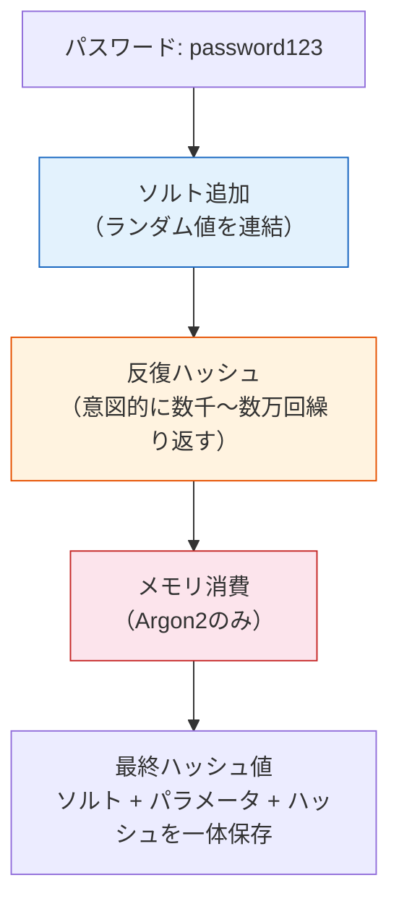
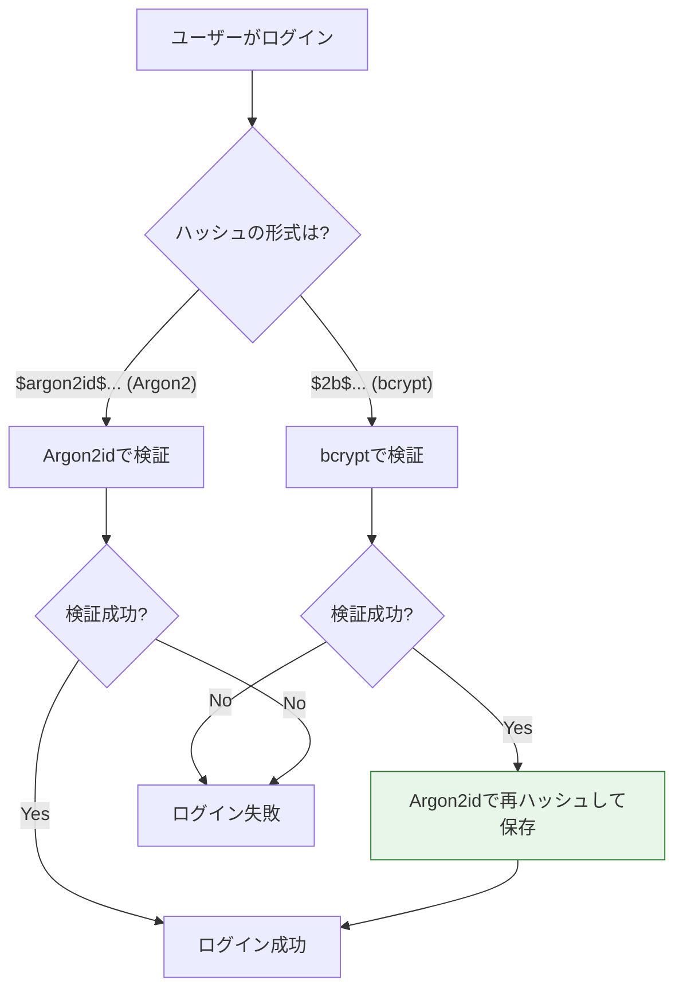

# パスワードハッシュ（Password Hashing）

> **一言で言うと:** パスワードを保存する際は、復号可能な暗号化ではなく**一方向のハッシュ化**を行う。さらに汎用ハッシュ（SHA-256等）ではなく、bcryptやArgon2のような**意図的に遅い**専用関数を使うことで、漏洩時のブルートフォース攻撃のコストを引き上げる。

## なぜ「普通のハッシュ」ではダメなのか

### 平文保存の問題

パスワードを平文で保存すると、DBが漏洩した時点で全ユーザーのパスワードがそのまま流出する。ユーザーはパスワードを使い回す傾向があるため、1つのサービスの漏洩が他サービスへの攻撃に直結する。

### 汎用ハッシュ（SHA-256等）の問題

SHA-256は**速すぎる**。これは暗号学的ハッシュ関数としては正しい設計だが、パスワード保護には逆効果。

```
SHA-256の速度: 数十億ハッシュ/秒（GPU使用時）
→ 8文字の英数字パスワード（約2180億通り）を総当たりするのに数分〜数時間
```

さらに、同じパスワードは常に同じハッシュ値になるため、**レインボーテーブル**（事前計算済みのハッシュ→パスワード対応表）で逆引きできる。

### パスワード専用ハッシュ関数の設計原則



| 対策 | 目的 |
|------|------|
| **ソルト（Salt）** | ユーザーごとにランダムな値を付与。同じパスワードでも異なるハッシュになり、レインボーテーブルを無効化 |
| **ストレッチング（反復）** | ハッシュ計算を意図的に遅くし、総当たり攻撃のコストを引き上げる |
| **メモリハード性** | 大量のメモリを要求することで、GPU/ASIC による並列攻撃を困難にする（Argon2） |

## bcrypt

1999年にNiels ProvosとDavid Mazièresが設計した、Blowfish暗号を基にしたパスワードハッシュ関数。最も広く使われている。

### ハッシュ値のフォーマット

```
$2b$10$N9qo8uLOickgx2ZMRZoMyeIjZAgcfl7p92ldGxad68LJZdL17lhWy
│  │  │                      │
│  │  │                      └─ ハッシュ値（31文字）
│  │  └─ ソルト（22文字 = 128ビット）
│  └─ コストファクター（2^10 = 1024回の反復）
└─ アルゴリズム識別子（2b = 最新のbcrypt）
```

ソルト・コストファクター・ハッシュ値が**1つの文字列に一体化**されているため、別途ソルトを管理する必要がない。

### コストファクターの選び方

コストファクター $n$ は $2^n$ 回の反復を意味する。大きいほど遅く（安全）なるが、ログイン時のレスポンスタイムに影響する。

| コスト | 概算時間（一般的なサーバー） | 用途 |
|--------|--------------------------|------|
| 10 | 約100ms | 最低限（開発環境、テスト） |
| 12 | 約300ms | 一般的なWebアプリケーション |
| 14 | 約1秒 | 高セキュリティ要件 |

**目安:** ログインリクエスト1回あたり 250ms〜1秒に収まるコストを選ぶ。ハードウェアの性能向上に合わせて定期的にコストを引き上げる。

### bcryptの制約

- **入力が72バイトに切り詰められる** — 73バイト以上のパスワードは72バイト目以降が無視される。実用上は問題になりにくいが、パスフレーズの長さに上限があることは知っておくべき
- **CPUバウンドのみ** — メモリ使用量が固定のため、GPU/FPGAによる並列攻撃への耐性はArgon2より低い

## Argon2

2015年のPassword Hashing Competition（PHC）で優勝した最新のパスワードハッシュ関数。bcryptの後継として推奨されている。

### 3つのバリアント

| バリアント | 特徴 | 用途 |
|-----------|------|------|
| **Argon2d** | GPU耐性が高い（data-dependent メモリアクセス） | バックエンドでのパスワードハッシュ（サイドチャネル攻撃の懸念がない環境） |
| **Argon2i** | サイドチャネル攻撃に強い（data-independent メモリアクセス） | 暗号鍵導出など、サイドチャネル攻撃が懸念される環境 |
| **Argon2id** | Argon2dとArgon2iのハイブリッド | **推奨デフォルト** — 両方の利点を兼ね備える |

### パラメータ

```
$argon2id$v=19$m=65536,t=3,p=4$c29tZXNhbHQ$hash...
│        │    │              │  │            │
│        │    │              │  └─ ソルト     └─ ハッシュ値
│        │    │              └─ 並列度（p=4スレッド）
│        │    └─ メモリ（m=65536KB = 64MB）, 反復（t=3回）
│        └─ バージョン
└─ アルゴリズム
```

| パラメータ | 意味 | 推奨値（OWASP 2024） |
|-----------|------|---------------------|
| `m`（memory） | 使用メモリ量（KB） | 19456（19MB）以上 |
| `t`（time） | 反復回数 | 2以上 |
| `p`（parallelism） | 並列スレッド数 | 1 |

Argon2の核心は**メモリハード性**にある。大量のメモリを要求することで、GPU（メモリ帯域幅が制約）やASIC（専用チップ）による大規模並列攻撃のコストを大幅に引き上げる。bcryptがCPU時間だけで攻撃コストを上げるのに対し、Argon2はCPU時間 + メモリの両方で防御する。

## bcrypt vs Argon2 比較

| 観点 | bcrypt | Argon2id |
|------|--------|----------|
| 設計年 | 1999年 | 2015年 |
| 攻撃コスト調整 | CPU時間のみ（コストファクター） | CPU時間 + メモリ + 並列度 |
| GPU/ASIC耐性 | 中程度 | **高い**（メモリハード） |
| 入力長制限 | 72バイト | なし |
| エコシステム | ほぼ全言語で成熟したライブラリ | 主要言語でサポート済み（一部環境でネイティブ依存） |
| OWASP推奨 | 第2推奨 | **第1推奨** |
| 採用実績 | 圧倒的に多い（長い歴史） | 増加中 |

**結論:** 新規プロジェクトではArgon2idを第一選択とし、Argon2のネイティブ依存が問題になる環境（一部のサーバーレス環境等）ではbcryptを使う。既存プロジェクトでbcryptを使っている場合、急いで移行する必要はない — bcryptは適切なコストファクターで依然として安全。

## コード例

### Go — bcryptとArgon2idの比較

```go
package main

import (
	"crypto/rand"
	"crypto/subtle"
	"encoding/base64"
	"fmt"
	"log"

	"golang.org/x/crypto/argon2"
	"golang.org/x/crypto/bcrypt"
)

// --- bcrypt ---

func bcryptHash(password string) (string, error) {
	hash, err := bcrypt.GenerateFromPassword([]byte(password), 12) // コスト12
	return string(hash), err
}

func bcryptVerify(password, hash string) bool {
	err := bcrypt.CompareHashAndPassword([]byte(hash), []byte(password))
	return err == nil
}

// --- Argon2id ---

func argon2idHash(password string) (string, error) {
	salt := make([]byte, 16)
	if _, err := rand.Read(salt); err != nil {
		return "", err
	}

	// OWASP推奨パラメータ
	hash := argon2.IDKey([]byte(password), salt, 2, 19*1024, 1, 32)

	// ソルト + ハッシュをBase64で保存
	return fmt.Sprintf("$argon2id$v=19$m=%d,t=%d,p=%d$%s$%s",
		19*1024, 2, 1,
		base64.RawStdEncoding.EncodeToString(salt),
		base64.RawStdEncoding.EncodeToString(hash),
	), nil
}

func argon2idVerify(password, encoded string) bool {
	// encodedからパラメータ・ソルト・ハッシュをパース（簡略化）
	var m, t uint32
	var p uint8
	var saltB64, hashB64 string
	fmt.Sscanf(encoded, "$argon2id$v=19$m=%d,t=%d,p=%d$%s$%s", &m, &t, &p, &saltB64, &hashB64)

	salt, _ := base64.RawStdEncoding.DecodeString(saltB64)
	expectedHash, _ := base64.RawStdEncoding.DecodeString(hashB64)
	computedHash := argon2.IDKey([]byte(password), salt, t, m, p, uint32(len(expectedHash)))

	// 定数時間比較でタイミング攻撃を防止
	return subtle.ConstantTimeCompare(expectedHash, computedHash) == 1
}

func main() {
	password := "secure-password-123"

	// bcrypt
	bHash, _ := bcryptHash(password)
	fmt.Println("bcrypt hash:", bHash)
	fmt.Println("bcrypt verify:", bcryptVerify(password, bHash))

	// Argon2id
	aHash, _ := argon2idHash(password)
	fmt.Println("argon2id hash:", aHash)
	fmt.Println("argon2id verify:", argon2idVerify(password, aHash))
}
```

### TypeScript（Node.js）— bcryptとArgon2

```typescript
import bcrypt from 'bcrypt';
import * as argon2 from 'argon2';

const password = 'secure-password-123';

// --- bcrypt ---
const bcryptHash = await bcrypt.hash(password, 12);
console.log('bcrypt hash:', bcryptHash);
console.log('bcrypt verify:', await bcrypt.compare(password, bcryptHash));

// --- Argon2id ---
const argon2Hash = await argon2.hash(password, {
  type: argon2.argon2id,
  memoryCost: 19456,   // 19MB
  timeCost: 2,
  parallelism: 1,
});
console.log('argon2id hash:', argon2Hash);
console.log('argon2id verify:', await argon2.verify(argon2Hash, password));

// ❌ 絶対にやってはいけない
// import { createHash } from 'crypto';
// createHash('sha256').update(password).digest('hex');
// → 高速すぎて総当たり攻撃に無力。ソルトもない。
```

### Python — bcryptとArgon2

```python
import bcrypt
from argon2 import PasswordHasher

password = "secure-password-123"

# --- bcrypt ---
salt = bcrypt.gensalt(rounds=12)
bcrypt_hash = bcrypt.hashpw(password.encode(), salt)
print("bcrypt verify:", bcrypt.checkpw(password.encode(), bcrypt_hash))

# --- Argon2id ---
ph = PasswordHasher(
    time_cost=2,
    memory_cost=19456,
    parallelism=1,
    type=argon2.Type.ID,
)
argon2_hash = ph.hash(password)
print("argon2id verify:", ph.verify(argon2_hash, password))
```

## コスト移行戦略

既存のbcryptハッシュをArgon2idに移行する場合、全ユーザーに再ログインを強制する必要はない。**ログイン時に段階的に移行**できる:



ハッシュ文字列のプレフィックス（`$2b$` vs `$argon2id$`）でアルゴリズムを判別できるため、両方式の共存が可能。

## よくある落とし穴

### 1. SHA-256 + 自前ソルトで「十分」と考える

ソルトを付けてもSHA-256は速すぎる。GPU1台で毎秒数十億回のハッシュが可能で、8文字のパスワードなら短時間で破られる。パスワード専用関数（bcrypt/Argon2）は1回のハッシュに数百ミリ秒かかるよう設計されており、総当たりのコストが桁違いに高い。

### 2. bcryptのコストファクターを固定したまま放置する

ハードウェアの性能は年々向上する。2015年にコスト10で十分だったものが、2026年のGPUでは不十分かもしれない。年に一度はベンチマークを取り、ログイン時に250ms〜1秒かかるコストに調整すべき。

### 3. ペッパー（Pepper）の誤用

ペッパー（全ユーザー共通の秘密値をパスワードに付加する手法）は、DBが漏洩してもアプリケーションサーバーの秘密が無事なら保護になる。ただしペッパーの管理を誤ると全ユーザーのログインが不能になるため、導入には慎重さが必要。

### 4. パスワード長の上限を短く設定する

bcryptは72バイトの制限があるが、それ以外の理由でパスワード長を短く制限するのは誤り。パスフレーズ（長いフレーズ型パスワード）を許容することで、ユーザーのセキュリティを向上させる。

## 関連トピック

- [[認証と認可]] — 親トピック。パスワードハッシュは認証フローの基盤
- [[セッションとJWT]] — 認証成功後の状態維持手段。パスワード照合はログイン時のみ
- [[暗号アルゴリズム]] — ハッシュ関数と暗号化の違い。パスワードには暗号化ではなくハッシュを使う理由

## 参考リソース

- OWASP Password Storage Cheat Sheet — パスワードハッシュの推奨パラメータ
- Password Hashing Competition — Argon2が優勝した選考過程
- 「体系的に学ぶ安全なWebアプリケーションの作り方」（徳丸浩著）— パスワード保存の章
