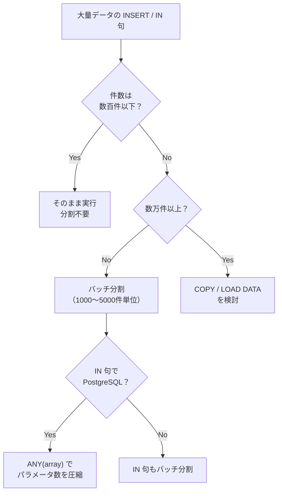

# パラメータ数制限とバッチ分割（Bind Parameter Limits）

> **一言で言うと:** プリペアドステートメントのプレースホルダ（`$1`, `?`）には上限がある。大量データの INSERT や巨大な `IN` 句を書くとき、この上限を意識してクエリを分割しなければ実行時エラーになる。

## なぜ問題になるか

プリペアドステートメント（Prepared Statement）は[[SQLインジェクション]]を防ぐ基本手法であり、値を直接 SQL に埋め込まず、プレースホルダで渡す。しかし、プレースホルダの数には **DB ごとに上限** がある。

```sql
-- 100件のユーザーを一括挿入（3カラム × 100行 = 300パラメータ）
INSERT INTO users (name, email, role) VALUES
  ($1, $2, $3),
  ($4, $5, $6),
  ...
  ($298, $299, $300);
```

行数が増えるとパラメータ数は `カラム数 × 行数` で線形に増加し、上限に達する。

## 各 DB のパラメータ上限

| DB | 上限 | 根拠 |
|---|---|---|
| **PostgreSQL** | **65,535**（`$1` 〜 `$65535`） | プロトコルの Bind メッセージでパラメータ数を2バイト整数で表現しており、符号なし（unsigned）として解釈されるため上限は 65,535 |
| **MySQL** | **明文化されたハード上限なし** | 1ステートメントあたりのプレースホルダ数に公式なハード上限はない。実質的には `max_allowed_packet`（デフォルト 64MB、MySQL 8.0+）によるクエリ全体のサイズ制限が上限となる |
| **SQLite** | **32,766**（デフォルト、3.32.0+） | `SQLITE_MAX_VARIABLE_NUMBER` コンパイルオプションで変更可能。3.32.0 未満ではデフォルト 999 |

### PostgreSQL の 65,535 制限の計算例

```
カラム数: 5（name, email, role, created_at, updated_at）
上限パラメータ数: 65,535
最大行数: 65,535 ÷ 5 = 13,107 行/クエリ
```

実務では余裕を持って **1,000〜5,000行** 程度でバッチ分割するのが一般的。パフォーマンスの観点でも、1クエリに数万行を詰め込むよりバッチ分割したほうが安定する。

## コード例

### TypeScript — バッチ分割ユーティリティ

```typescript
import { Pool } from "pg";

const pool = new Pool({ connectionString: "postgres://..." });

async function bulkInsertUsers(
  users: { name: string; email: string; role: string }[]
) {
  const COLUMNS = 3; // name, email, role
  const MAX_PARAMS = 65535;
  const BATCH_SIZE = Math.floor(MAX_PARAMS / COLUMNS); // 21,845

  for (let i = 0; i < users.length; i += BATCH_SIZE) {
    const batch = users.slice(i, i + BATCH_SIZE);
    const values: unknown[] = [];
    const placeholders: string[] = [];

    for (let j = 0; j < batch.length; j++) {
      const offset = j * COLUMNS;
      placeholders.push(`($${offset + 1}, $${offset + 2}, $${offset + 3})`);
      values.push(batch[j].name, batch[j].email, batch[j].role);
    }

    await pool.query(
      `INSERT INTO users (name, email, role) VALUES ${placeholders.join(", ")}`,
      values
    );
  }
}
```

### Go — バッチ分割

```go
package main

import (
	"context"
	"database/sql"
	"fmt"
	"strings"

	_ "github.com/lib/pq"
)

type User struct {
	Name  string
	Email string
	Role  string
}

func bulkInsertUsers(ctx context.Context, db *sql.DB, users []User) error {
	const columns = 3
	const maxParams = 65535
	const batchSize = maxParams / columns // 21845

	for i := 0; i < len(users); i += batchSize {
		end := i + batchSize
		if end > len(users) {
			end = len(users)
		}
		batch := users[i:end]

		placeholders := make([]string, len(batch))
		args := make([]interface{}, 0, len(batch)*columns)

		for j, u := range batch {
			base := j * columns
			placeholders[j] = fmt.Sprintf("($%d, $%d, $%d)", base+1, base+2, base+3)
			args = append(args, u.Name, u.Email, u.Role)
		}

		query := fmt.Sprintf(
			"INSERT INTO users (name, email, role) VALUES %s",
			strings.Join(placeholders, ", "),
		)
		_, err := db.ExecContext(ctx, query, args...)
		if err != nil {
			return fmt.Errorf("batch insert at offset %d: %w", i, err)
		}
	}
	return nil
}
```

### PHP — PDO でのバッチ分割

```php
function bulkInsertUsers(PDO $pdo, array $users): void
{
    $columns = 3; // name, email, role
    $maxParams = 65535;
    $batchSize = intdiv($maxParams, $columns);

    foreach (array_chunk($users, $batchSize) as $batch) {
        $placeholders = [];
        $values = [];

        foreach ($batch as $i => $user) {
            $base = $i * $columns + 1;
            $placeholders[] = "(:p{$base}, :p" . ($base + 1) . ", :p" . ($base + 2) . ")";
            $values["p{$base}"] = $user['name'];
            $values['p' . ($base + 1)] = $user['email'];
            $values['p' . ($base + 2)] = $user['role'];
        }

        $sql = 'INSERT INTO users (name, email, role) VALUES '
             . implode(', ', $placeholders);
        $stmt = $pdo->prepare($sql);
        $stmt->execute($values);
    }
}
```

## IN 句でも同じ問題が起きる

`WHERE id IN ($1, $2, ..., $N)` のような動的 IN 句でもパラメータ数が膨張する。

```typescript
// ❌ 7万件のIDを IN 句に渡すとパラメータ上限を超える
const ids: number[] = getTargetIds(); // 70,000件
const result = await pool.query(
  `SELECT * FROM users WHERE id IN (${ids.map((_, i) => `$${i + 1}`).join(", ")})`,
  ids
);

// ✅ 対策1: バッチ分割
const BATCH = 10000;
const allResults = [];
for (let i = 0; i < ids.length; i += BATCH) {
  const batch = ids.slice(i, i + BATCH);
  const params = batch.map((_, j) => `$${j + 1}`).join(", ");
  const { rows } = await pool.query(
    `SELECT * FROM users WHERE id IN (${params})`,
    batch
  );
  allResults.push(...rows);
}

// ✅ 対策2: ANY(array) を使う（PostgreSQL 限定）
// 配列型は1つのパラメータで渡せるため上限に引っかからない
const { rows } = await pool.query(
  `SELECT * FROM users WHERE id = ANY($1)`,
  [ids] // 配列を1パラメータとして渡す
);
```

### PostgreSQL の `ANY(array)` — パラメータ数を1に圧縮

PostgreSQL では配列型（`INTEGER[]` など）をネイティブにサポートしているため、`= ANY($1)` で**配列全体を1パラメータ**として渡せる。これはパラメータ数制限を回避する最も簡潔な方法。

```sql
-- IN 句: パラメータ N 個
SELECT * FROM users WHERE id IN ($1, $2, $3, ..., $N);

-- ANY: パラメータ 1 個（配列として渡す）
SELECT * FROM users WHERE id = ANY($1);  -- $1 = '{1,2,3,...,N}'
```

ただし、配列のサイズが非常に大きい場合はパーサのメモリ使用量やクエリプラン最適化の面で注意が必要。数万件程度なら実用上問題ない。

## よくある落とし穴

1. **パラメータ数を事前に計算していない** — 開発時は少量データで動くが、本番データが増えると突然 `bind message has X parameters but...` エラーで落ちる。データ量の見積もりとバッチサイズの設定は設計時に行う。

2. **ORM が生成する IN 句を放置** — ORM の `whereIn` や `findByIds` が内部的にパラメータ展開する場合、渡すIDの数が増えると上限に達する。ORM のドキュメントでバッチ処理のサポートを確認する。

3. **バッチ分割時にトランザクション境界を忘れる** — バッチを分割するとき、全バッチを1つの[[トランザクション]]で囲まないと途中で失敗した場合にデータの不整合が起きる。ただし、トランザクションが長くなりすぎるとロック競合のリスクも増えるため、要件に応じて判断する。

4. **COPY / LOAD DATA の存在を忘れる** — 万単位の一括挿入であれば、`INSERT` のバッチ分割よりも PostgreSQL の `COPY` や MySQL の `LOAD DATA INFILE` を使うほうが桁違いに速い。パラメータ制限も無関係になる。

```sql
-- PostgreSQL: COPY（標準入力やファイルから高速ロード）
COPY users (name, email, role) FROM STDIN WITH (FORMAT csv);

-- MySQL: LOAD DATA（ファイルから高速ロード）
LOAD DATA INFILE '/tmp/users.csv'
INTO TABLE users
FIELDS TERMINATED BY ','
(name, email, role);
```

5. **MySQL の `max_allowed_packet` を見落とす** — MySQL はパラメータ数だけでなく、クエリ全体のバイトサイズにも制限がある（デフォルト 64MB）。大量データの INSERT ではこちらが先に制限になることもある。

## 実務での判断フロー



## 関連トピック

- [[RDB]] — 親トピック。プリペアドステートメントは SQL の基本操作
- [[SQLインジェクション]] — プリペアドステートメントが防御の基本手段
- [[トランザクション]] — バッチ分割時のトランザクション境界の設計
- [[コネクションプール]] — 大量の INSERT はコネクションプールの枯渇にも注意
- [[PostgreSQLとMySQLの比較]] — `ANY(array)` は PostgreSQL 固有の機能

## 参考リソース

- [PostgreSQL Protocol — Extended Query](https://www.postgresql.org/docs/current/protocol-message-formats.html) — Bind メッセージの仕様
- [SQLite Limits](https://www.sqlite.org/limits.html#max_variable_number) — `SQLITE_MAX_VARIABLE_NUMBER` の説明
- [PostgreSQL COPY](https://www.postgresql.org/docs/current/sql-copy.html) — 大量データの高速ロード
