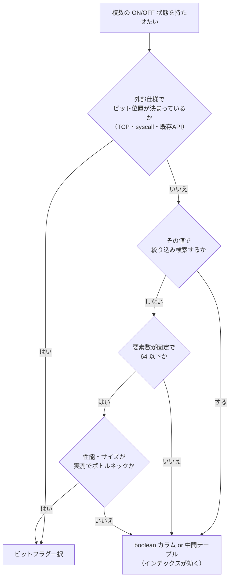

# ビットフラグとビット演算（Bit Flags / Bitwise Operations）

> **一言で言うと:** 整数1つの各桁（ビット）を「ON/OFF のスイッチ」として使い、複数の真偽値の集合を1つの数値で表現・演算する技法。`chmod 755` も TCP の SYN/ACK も正規表現の `re.IGNORECASE | re.MULTILINE` も、すべてこの仕組みで動いている。

## 前提：ビットとは何か

**ビット（bit, binary digit）** はコンピュータが扱う情報の最小単位で、`0` か `1` のどちらかしか取らない。整数はメモリ上では2進数（binary）として、このビットの並びで表現されている。

たとえば10進数の `5` は、8ビットで書くと `0000 0101` である。右端から数えて0番目のビットと2番目のビットが `1`（立っている、set）で、残りは `0`（落ちている、clear）だ。

| ビット位置 | 7 | 6 | 5 | 4 | 3 | 2 | 1 | 0 |
|---|---|---|---|---|---|---|---|---|
| 桁の重み（10進） | 128 | 64 | 32 | 16 | 8 | 4 | 2 | 1 |
| 10進数 `5` の中身 | 0 | 0 | 0 | 0 | 0 | 1 | 0 | 1 |

各桁の重みは `2⁰, 2¹, 2², ...` と2倍ずつ増えていく。ここで重要なのは、**どの桁の組み合わせを取っても、それを作れる数値の組み合わせはただ1通りしかない**ということだ。`5` は「4 + 1」以外の作り方がない。この一意性こそが、ビットフラグが成立する数学的な根拠である。

## ビットフラグとは

**ビットフラグ（bit flag）** とは、整数の各ビット位置に「意味」を割り当て、その ON/OFF で複数の状態を1つの値に詰め込む設計手法を指す。**ビットマスク（bitmask）** とも呼ばれる（厳密には、フラグ = 意味を割り当てたビット、マスク = 特定のビットだけを取り出すために使う値、という使い分けをすることが多いが、実務では混用されている）。

たとえばファイルへの権限を表現したいとする。

| ビット位置 | 2 | 1 | 0 |
|---|---|---|---|
| 重み | 4 | 2 | 1 |
| 意味 | READ（読み取り） | WRITE（書き込み） | EXECUTE（実行） |

このとき「読み取りと書き込みができる」状態は `4 + 2 = 6`（2進数で `110`）という**1つの整数**で表せる。逆に `6` という数値を見れば、READ と WRITE が立っていて EXECUTE が落ちていることが一意に復元できる。

`chmod 755` の `7` はまさにこれで、`4(r) + 2(w) + 1(x) = 7` を意味している。`5` は `4(r) + 1(x) = 5` で「読めるし実行できるが書けない」。Unix のパーミッション表記が8進数（0〜7）なのは、**3ビットがちょうど8進数1桁に対応するから**である。10進数だと桁とビットの対応が崩れて読めなくなる。

```mermaid
flowchart LR
    subgraph Flags["フラグ定義（それぞれ 2 の冪）"]
        R["READ = 4<br/>0b100"]
        W["WRITE = 2<br/>0b010"]
        X["EXEC = 1<br/>0b001"]
    end
    R --> OR["OR 演算で合成<br/>READ &#124; WRITE"]
    W --> OR
    OR --> V["6<br/>0b110"]
    V --> AND["AND 演算で判定<br/>6 &amp; WRITE → 2（≠0 なので ON）"]
```



## ビット演算子の一覧

ビットフラグを操作するのが**ビット演算（bitwise operation）** で、2つの数値を「同じ位置のビットどうし」で計算する。

| 演算子 | 名称 | 動作 | 用途 |
|---|---|---|---|
| `&` | AND（論理積） | 両方が1なら1 | フラグが立っているかの**判定**、特定ビットの**抽出** |
| `\|` | OR（論理和） | どちらかが1なら1 | フラグを**立てる**、複数フラグの**合成** |
| `^` | XOR（排他的論理和） | 異なれば1 | フラグの**トグル（反転）**、差分の検出 |
| `~` | NOT（ビット反転） | 0と1を入れ替える | マスクの反転（`&` と組んでフラグを**落とす**） |
| `<<` | 左シフト | ビットを左にずらす | フラグ定数の定義（`1 << 3`） |
| `>>` | 右シフト | ビットを右にずらす | 詰め込んだ値の取り出し |

`&&`（論理AND）と `&`（ビットAND）は**まったく別物**である。`&&` は「真偽値2つの論理判定」、`&` は「ビット単位の計算」。この2つを取り違えるのはビット演算に不慣れなうちの典型的なバグ源で、後述の演算子優先順位の落とし穴とも絡む。

### 4つの基本操作

覚えるべきイディオムは4つしかない。フラグ値を `flags`、対象フラグを `F` とする。

| やりたいこと | 書き方 | 理屈 |
|---|---|---|
| 立っているか判定 | `(flags & F) !== 0` | `F` のビット以外はすべて0になるので、結果が0でなければ立っている |
| 立てる | `flags \| F` | `F` の位置を1で上書きする（他の桁は元のまま） |
| 落とす | `flags & ~F` | `~F` は `F` の位置だけが0のマスク。AND を取ると `F` の桁だけ0になる |
| 反転する | `flags ^ F` | XOR は「同じなら0、違うなら1」なので、`F` の桁だけひっくり返る |

「落とす」が `& ~F` になる理由は、一度ゆっくり追う価値がある。`F = 0b010` のとき `~F = 0b...11101`。これを `flags` と AND すると、1になっている桁（= `F` 以外の全桁）は元の値がそのまま残り、0になっている桁（= `F` の桁）だけが強制的に0になる。つまり `~` は「この桁だけ通さないフィルタ」を作る操作である。

> **Go だけは書き方が違う** — Go には `~` 演算子が存在しない（`~` は Go 1.18 以降、ジェネリクスの型制約で型集合を書くときにだけ使う記号である）。Go の単項ビット反転は `^F`、そして「落とす」には専用の **AND NOT 演算子 `&^`** が用意されている。上の表を Go で書くと `flags &^ F` になる。1つの演算子で済むぶん、`& ~` の組み合わせより意図が明確で書き間違えにくい。

## コード例

### TypeScript — 通知設定の購読フラグ

Web アプリでよくあるのは「メール通知」「プッシュ通知」「SMS 通知」のような ON/OFF の組み合わせだ。

```typescript
// 各フラグは必ず「2 の冪」にする。1 << n と書くと桁がずれない
const Notify = {
  None:  0,
  Email: 1 << 0, // 1  (0b0001)
  Push:  1 << 1, // 2  (0b0010)
  Sms:   1 << 2, // 4  (0b0100)
  Web:   1 << 3, // 8  (0b1000)
} as const;

type NotifyFlags = number;

// 合成: OR で束ねる
let prefs: NotifyFlags = Notify.Email | Notify.Push; // 3 (0b0011)

// 判定: AND した結果が 0 でなければ立っている
const wantsPush = (f: NotifyFlags) => (f & Notify.Push) !== 0;
wantsPush(prefs); // true（prefs = 3 = 0b0011 なので Push のビットが立っている）

// 追加: OR で立てる（すでに立っていても壊れない = 冪等）
prefs |= Notify.Sms;      // 7 (0b0111)

// 削除: AND ~ で落とす
prefs &= ~Notify.Email;   // 6 (0b0110)

// トグル: XOR で反転
prefs ^= Notify.Web;      // 14 (0b1110)

// 「いずれかを含むか」と「すべてを含むか」は書き方が違う
const hasAny = (f: NotifyFlags, mask: NotifyFlags) => (f & mask) !== 0;
const hasAll = (f: NotifyFlags, mask: NotifyFlags) => (f & mask) === mask;

hasAny(prefs, Notify.Email | Notify.Push); // true（Push だけ立っている）
hasAll(prefs, Notify.Email | Notify.Push); // false（Email が落ちている）

// デバッグ時は必ず「人間が読める形」に戻せるようにしておく
const describe = (f: NotifyFlags) =>
  Object.entries(Notify)
    .filter(([, v]) => v !== 0 && (f & v) === v)
    .map(([k]) => k);

describe(prefs); // ["Push", "Sms", "Web"]
```

`hasAny` と `hasAll` の区別は実務で最も間違えやすい箇所だ。`flags & (READ | WRITE)` は「READ **または** WRITE を持つ」の判定であって、「両方持つ」ではない。両方を要求するなら `=== mask` まで書く必要がある。権限チェックでこれを間違えると、片方の権限しかないユーザーが両方必要な操作を通してしまう。

もう一つ、権限チェックで踏みやすい穴がある。**`hasAll(flags, 0)` は常に `true` を返す**（`f & 0` は必ず 0 で、それが `mask` の 0 と一致してしまう）。必要権限のマスクをループや設定値から動的に組み立てる設計だと、「組み立てに失敗してマスクが空になった」ときに**全ユーザーが無条件で通過する**。マスクが 0 でないことを別途チェックするか、`requiredMask === 0` を明示的に拒否する分岐を置く。

### Go — iota による定義とデバッグ表示

Go では `iota`（定数ブロック内で0から自動採番される識別子）とシフトを組み合わせるのが定番だ。

```go
package main

import (
	"fmt"
	"math/bits"
	"strings"
)

type Permission uint8

const (
	Read    Permission = 1 << iota // 1 << 0 = 1
	Write                          // 1 << 1 = 2（iota が自動で増える）
	Execute                        // 1 << 2 = 4
	Delete                         // 1 << 3 = 8
)

// Has は「すべて含むか」を判定する（AND の結果がマスクと一致）
func (p Permission) Has(mask Permission) bool { return p&mask == mask }

// String() を実装しておくと fmt.Println でそのまま読める形になる
func (p Permission) String() string {
	names := []struct {
		bit  Permission
		name string
	}{{Read, "read"}, {Write, "write"}, {Execute, "exec"}, {Delete, "delete"}}

	var out []string
	for _, n := range names {
		if p&n.bit != 0 {
			out = append(out, n.name)
		}
	}
	if len(out) == 0 {
		return "none"
	}
	return strings.Join(out, "|")
}

func main() {
	p := Read | Write
	fmt.Println(p)                       // read|write
	fmt.Println(p.Has(Read))             // true
	fmt.Println(p.Has(Read | Execute))   // false — Execute が落ちているので「すべて含む」ではない
	fmt.Println((p & (Read | Execute)) != 0) // true — こちらは「いずれかを含む」判定

	p &^= Write // ← Go 特有: AND NOT 演算子で Write を落とす（他言語の p &= ~Write に相当）
	// Go には ~ が無いので、あえて分解して書くなら p &= ^Write（単項 ^ が反転）
	fmt.Println(p)                       // read

	fmt.Println(bits.OnesCount8(uint8(p))) // 1 — 立っているビット数（popcount）
}
```

`bits.OnesCount`（**popcount**、population count = 立っているビットの個数）は、多くの CPU が専用命令を持つほど基本的な操作で、「ユーザーが何個の機能を有効にしているか」の集計などに使える。Go の `math/bits` はこの CPU 命令に落ちる。

### Python — enum.Flag で型安全に書く

Python では手書きの整数定数ではなく、標準ライブラリの `enum.Flag` を使うのが現代的な書き方だ（Python 3.6 以降）。

```python
from enum import Flag, auto

class Permission(Flag):
    READ = auto()     # 1
    WRITE = auto()    # 2
    EXECUTE = auto()  # 4
    # auto() が 2 の冪を自動で割り当ててくれるので、手で 1,2,4,8... と書く必要がない

p = Permission.READ | Permission.WRITE

print(p)                          # Permission.READ|WRITE — 表示が読める
print(Permission.WRITE in p)      # True — in 演算子が使える
print(bool(p & Permission.EXECUTE))  # False
print(p & ~Permission.READ)       # Permission.WRITE

# DB に保存するときは .value で整数に、復元は Permission(値) で戻す
stored = p.value        # 3
restored = Permission(stored)  # Permission.READ|WRITE
```

`enum.Flag` の利点は、**生の整数を持ち回らずに済む**ことにある。手書きの `int` 定数だと、通知フラグを権限フラグの変数に代入しても型エラーにならず静かに壊れる。`Flag` なら異なる Flag クラス同士の `|` は `TypeError` になる。標準ライブラリの `re.IGNORECASE | re.MULTILINE` もこの仕組み（`re.RegexFlag` は `IntFlag`）で作られている。

## なぜこの技法が生まれ、今も残っているのか

ビットフラグが定着した直接の理由は、1970年代のメモリ制約である。当時のミニコンピュータは主記憶が数十〜数百キロバイトしかなく、真偽値1つに1バイト（8ビット）使うのは贅沢だった。Unix のファイルモードが 12ビット（rwx × 3 + setuid/setgid/sticky）に押し込まれているのは、その時代の設計判断がそのまま残っているためだ。

しかし「メモリが安くなったから不要になった」わけではない。現代でも次の理由で選ばれ続けている。

- **プロトコルの仕様がビット単位で決まっている** — TCP ヘッダのフラグ（SYN, ACK, FIN, RST など）は規格上ビット位置が固定されており、実装側に選択の余地がない → [[TCPフラグとコネクション状態遷移]]
- **システムコールの引数が固定長** — `open(path, O_WRONLY | O_CREAT | O_APPEND)` のように、複数のオプションを1つの `int` 引数で渡す設計が OS の API に定着している → [[ファイルディスクリプタ]]
- **判定が CPU 命令1〜2個で終わる** — `flags & MASK` は分岐もメモリアクセスも増やさない。権限チェックのように毎リクエスト何度も走る処理では効いてくる
- **キャッシュ効率** — 64個の真偽値が8バイトに収まるため、1本のキャッシュラインに乗る。配列やハッシュで持つより桁違いに局所性が高い → [[メモリ階層とキャッシュ]]
- **集合演算を語単位でまとめて処理できる** — 「AとBの共通要素」が `a & b` の1命令で求まる。要素数が64個を超えて配列に持つ場合でも、64個ぶんを1命令で処理できるためループ回数が要素数の64分の1になる（計算量の次数が下がるわけではなく、定数倍が劇的に効く類の高速化である）。ビット集合（bitset）による大規模な集合演算は、検索エンジンの転置インデックスの絞り込みなどで今も現役である

### なぜ「boolean カラムを並べる」ではダメだったのか、そして今はどちらが正しいか

データベース設計の文脈では、ビットフラグの代替として **(a) boolean カラムを機能ごとに並べる**、**(b) 中間テーブルに1行ずつ持つ** という選択肢がある。

| 方式 | 追加時のコスト | 検索性 | 可読性 | 上限 |
|---|---|---|---|---|
| ビットフラグ（1整数カラム） | 定数を1つ増やすだけ（スキーマ変更なし） | **低い**（インデックスが効かない） | **低い**（`22` を見ても意味が読めない） | 32/64個程度 |
| boolean カラムを並べる | `ALTER TABLE` が必要 | 高い（列ごとにインデックス可） | 高い | 実質的に列数の上限 |
| 中間テーブル | 行を足すだけ | 高い | 高い | なし |

「スキーマ変更なしにフラグを増やせる」というビットフラグの利点は、**`ALTER TABLE` が数時間のロックを意味した時代には決定的だった**。しかし PostgreSQL 11 以降はデフォルト値付きの列追加が全行の書き換えを伴わずメタデータ更新だけで完了し（10 以前はテーブル全体を書き直していた）、MySQL も 8.0 の `ALGORITHM=INSTANT` で同様の即時追加ができる。この利点は現在では大きく目減りしている。

そのため今日の一般的な指針はこうなる。



要するに、**「仕様で決まっている」か「実測で効くと分かった」場合以外、アプリケーションのドメインデータをビットフラグで持つのは可読性の対価に見合わない**。逆に、プロトコル実装・OS 連携・大規模な集合演算では今も第一選択である。

## よくある落とし穴

### 1. 演算子の優先順位（C 系言語の歴史的な地雷）

```javascript
// ❌ 意図と違う解釈をされる
if (flags & READ !== 0) { ... }
// 実際は flags & (READ !== 0) と解釈される
//   → READ !== 0 は true → 数値 1 に変換 → flags & 1 を評価してしまう

// ✅ 括弧を付ける
if ((flags & READ) !== 0) { ... }
```

C・C++・Java・JavaScript・TypeScript・PHP では `&` の優先順位が `==` / `!==` より**低い**。直感に反するこの仕様には、はっきりした歴史的経緯がある。

C の前身である B 言語（およびそのさらに前身の BCPL）には `&&` / `||` が存在せず、`&` と `|` が文脈によって使い分けられていた。`if` や `while` の条件部という「真偽値が期待される文脈（truth-value context）」では今の `&&` / `||` として、それ以外の式では今のビット演算として解釈される、という仕様である。後に Alan Snyder の提案で `&&` / `||` が独立した演算子として追加され、ビット演算と短絡評価がようやく分離された。

このとき `&` の優先順位を `==` より上に引き上げるべきだったのだが、既にその書き方に依存したコードが大量に存在したため、Ritchie は「`&` と `&&` を分離するだけにとどめ、既存の演算子を追い越す位置には動かさないほうが安全だ」と判断した。彼自身、後年これを振り返って「**今にして思えば優先順位を変えておくべきだった**」と明言している。50年後の我々が括弧を書かされ続けているのは、この一度の後方互換判断の帰結である。

> **設計の教訓として読む** — 「既存コードを壊さないための妥協」は、その場では合理的でも、言語のように寿命の長いインターフェースでは**永久に返済され続ける技術的負債**になる。API やスキーマの初期設計で「今なら直せる歪み」に気づいたときの判断材料として、この事例は覚えておく価値がある。

Go と Python はこの反省を踏まえ、比較演算子より `&` を高い優先順位にしているため括弧なしでも意図通りに動く。ただし**言語をまたぐと挙動が変わる箇所なので、常に括弧を書く**のが安全な習慣である（本ドキュメントの Go 例も、この方針に合わせて括弧を明示している）。

### 2. JavaScript のビット演算は32ビット符号付きに丸められる

```javascript
// JS の Number は 64ビット浮動小数点だが、ビット演算の前に 32ビット符号付き整数へ変換される
console.log(1 << 30);        // 1073741824  — ここまでは期待通り
console.log(1 << 31);        // -2147483648 — 符号ビットに食い込んで負数になる
console.log(1 << 32);        // 1           — シフト量が 32 で割った余りになる（0 ビットシフト）
console.log(2 ** 31 | 0);    // -2147483648

// 32ビットを超えるフラグが必要なら BigInt を使う
const FLAG_40 = 1n << 40n;
console.log((0n | FLAG_40) !== 0n); // true
```

同じ理由で、**`~` の結果は負数として表示される**。これは「壊れている」のではなく、32ビットの最上位ビット（符号ビット）まで反転した結果を符号付き整数として解釈しているだけで、ビットパターン自体は期待通りである。

```javascript
console.log(~1);         // -2  — 0b...11111110。符号ビットが立つので負数に見える
console.log(6 & ~1);     // 6   — それでも「落とす」演算の結果は正しい
console.log((~1) >>> 0); // 4294967294 — 符号なしで見たいときは >>> 0 を通す
console.log((~1 >>> 0).toString(2)); // "11111111111111111111111111111110"
```

`>>>`（符号なし右シフト）は JS で唯一、結果を**符号なし32ビット整数**として返す演算子で、シフト量 0 でも「符号なしとして解釈し直す」効果だけが残る。フラグのデバッグ出力で2進数を確認したいときの定番イディオムなので覚えておきたい。

「フラグが32個を超えたら壊れる」というのは JS では現実的な制約である。`Number.MAX_SAFE_INTEGER`（2⁵³−1）まで数値としては扱えるのに、**ビット演算だけ32ビットで頭打ち**という非対称性が事故を生む。Go なら `uint64`、Python なら整数が任意精度なので上限がない、という言語差も押さえておきたい。

### 3. フラグ値を2の冪以外にしてしまう

```typescript
// ❌ 連番で振ってしまう典型的なミス
const BAD = { A: 1, B: 2, C: 3, D: 4 };
// C = 3 は 0b011 で A|B と同じ値。C を立てたつもりが A と B も立つ
(BAD.A | BAD.B) === BAD.C; // true — 区別がつかない

// ✅ 必ず 1 << n（または enum.auto / iota）で定義する
const GOOD = { A: 1 << 0, B: 1 << 1, C: 1 << 2, D: 1 << 3 };
```

意図的に複合フラグを定義する場合（`ALL = READ | WRITE | EXECUTE` = 7 など）は問題ないが、それは**単独フラグと明確に区別できる名前**にすること。

### 4. DB のビット演算検索はインデックスが効かない

```sql
-- ❌ flags 列に B-Tree インデックスがあっても使われない（全行スキャン）
SELECT * FROM users WHERE flags & 4 = 4;
```

インデックスは「列の値そのもの」で整列された構造なので、列に関数や演算を適用した結果では引けない（→ [[インデックス設計の判断基準]]）。回避するなら PostgreSQL の**式インデックス**か**部分インデックス**を張る。

```sql
-- 特定フラグの検索が頻繁なら、その条件だけのインデックスを作る
CREATE INDEX idx_users_sms_enabled ON users (id) WHERE (flags & 4) = 4;
```

ただしフラグを1つ増やすたびにインデックスを増やすことになり、結局「boolean カラムを並べたほうが素直だった」という結論になりやすい。**検索条件になる属性はビットフラグにしない**、が実務上の判断基準になる。

### 5. 廃止したフラグのビット位置を再利用する

`1 << 3` に割り当てていた機能を廃止し、後から別の機能に `1 << 3` を再割り当てると、**DB に残っている古いレコードが新機能を有効にした状態として読まれる**。ビットフラグは値そのものが永続化されるため、コード側の定義変更が過去データの意味を書き換えてしまう。

対策は単純で、**廃止したビット位置は欠番として恒久的に残す**（`// bit 3: reserved (旧 SMS通知, 2025-06 廃止)` とコメントを置く）。これはプロトコル設計で「予約ビット（reserved bits）」を絶対に再利用しないのと同じ規律である。

### 6. `open()` の `O_RDONLY` はビットフラグではない

```c
// O_RDONLY = 0, O_WRONLY = 1, O_RDWR = 2 — この3つは「2ビットの数値フィールド」
// ❌ 常に false になる（0 との AND は必ず 0）
if (flags & O_RDONLY) { ... }

// ✅ アクセスモードはマスクで切り出して比較する
if ((flags & O_ACCMODE) == O_RDONLY) { ... }
```

`O_CREAT` や `O_APPEND` は独立したビットフラグだが、アクセスモードの3値だけは**排他的な選択肢を2ビットに詰めた数値フィールド**として定義されている。**1つの整数の中でビットフラグ領域と数値フィールド領域が同居している**のは実務でよくある構造で、「この整数のどこからどこまでがフラグか」を仕様で確認する習慣が要る。

## AI実装のアンチパターン

| アンチパターン | なぜ問題か | レビュー観点 / 対策 |
|---|---|---|
| **要件がないのにビットフラグ化する** — 通知設定3つに `1 << n` を導入し、DB に整数1列で保存する | 可読性と検索性を失う対価に見合う節約（数バイト）しか得られない。運用でクエリを書く人が `flags = 22` を読めない | 「なぜ boolean 列ではなくビットフラグか」を説明させる。仕様上の制約か実測がなければ boolean 列に戻す |
| **生の整数定数を手書きする** — `enum.Flag` / `iota` / `1 << n` を使わず `READ = 1; WRITE = 2; EXEC = 3` と書く | 2の冪でない値が混入し、フラグ同士が衝突する。人力採番はフラグが増えるほど間違える | 言語標準の仕組み（`enum.Flag`, `iota`, `1 << n`）を使うよう指示する |
| **括弧のない判定** — `if flags & READ != 0` を C 系言語で書く | 言語によって解釈が変わる。テストが「たまたま」通ってしまうケースがある | 判定は必ず `(flags & F) != 0` の形に統一。ヘルパー関数 `has(flags, F)` に閉じ込めるのがより安全 |
| **32ビット超えを考慮しない JS 実装** — フラグが増えていく前提のコードで `1 << 33` を書く | JS ではシフト量が 32 で剰余され、`1 << 33` は `2` になる。無言で別フラグと衝突する | フラグ数の上限を明示させる。32を超える可能性があるなら BigInt か別方式に変更 |
| **デバッグ表示を用意しない** — 数値のまま扱い、`String()` / `describe()` を書かない | 障害調査時にログの `flags: 46` から状態が読めず、切り分けに時間がかかる | 「フラグ名の配列に戻す関数」を必ずセットで書かせる |

→ レイヤー横断のアンチパターン索引: [[_anti-patterns/_index|AIアンチパターン索引]]

## 実務での使用シーン

- **ファイル権限・システムコール** — `chmod`, `open(2)`, `mmap(2)` のオプション → [[Linux基本操作]]
- **ネットワークプロトコル** — TCP のフラグビット、TLS の暗号スイート選択 → [[TCPフラグとコネクション状態遷移]]
- **正規表現エンジン** — `re.IGNORECASE | re.MULTILINE`（Python）、`RegExp` のフラグ内部表現
- **DB の集合演算** — 検索エンジン（Elasticsearch, Lucene）やカラムナ DB では、条件に一致する行 ID の集合をビット列で保持し AND/OR で高速に絞り込む。巨大かつ疎な集合には **Roaring Bitmap** という圧縮ビットマップが広く使われている
- **MySQL の `SET` 型** — 内部的にビットフラグとして格納される専用の列型。ただし最大64要素という制約があり、これはまさに `BIGINT` のビット数に由来する
- **フィーチャーフラグ** — 少数固定の機能トグルを1整数で持つ実装。ただし現代のフィーチャーフラグ基盤は動的追加を前提とするため、ビットフラグ方式は減っている

## 関連トピック

- [[データ構造とアルゴリズム]] — 親トピック。ビットフラグは「小さく固定された集合」に対する Set の代替表現
- [[ハッシュテーブル]] — 要素数が可変・非固定ならこちら。ビットフラグは「種類が固定で少数」の場合の特殊解
- [[メモリ階層とキャッシュ]] — ビット集合がなぜ速いかの根拠（局所性）
- [[TCPフラグとコネクション状態遷移]] — 実プロトコルにおけるビットフラグの実例
- [[ファイルディスクリプタ]] — `open(2)` のフラグ引数と絡む
- [[インデックス設計の判断基準]] — ビット演算検索がインデックスを使えない理由

## 参考リソース

- [Bit Twiddling Hacks](https://graphics.stanford.edu/~seander/bithacks.html) — ビット演算の定石集（popcount, 最下位ビット抽出など）
- [Python `enum.Flag` 公式ドキュメント](https://docs.python.org/3/library/enum.html#enum.Flag)
- [Go `math/bits` パッケージ](https://pkg.go.dev/math/bits) — popcount, 先頭0ビット数などの標準実装
- [MDN: ビット AND (`&`)](https://developer.mozilla.org/ja/docs/Web/JavaScript/Reference/Operators/Bitwise_AND) — オペランドが32ビット符号付き整数に変換される規則の記述
- [MDN: 符号なし右シフト (`>>>`)](https://developer.mozilla.org/ja/docs/Web/JavaScript/Reference/Operators/Unsigned_right_shift) — `>>> 0` で符号なし解釈に戻すイディオムの根拠
- Dennis M. Ritchie, [*The Development of the C Language*](https://www.nokia.com/bell-labs/about/dennis-m-ritchie/chist.pdf) — `&` の優先順位の経緯を含む C 言語設計史の一次資料（旧 bell-labs.com の URL は現在ここへリダイレクトされる）
- [Dennis Ritchie on & | vs. ==](https://www.lysator.liu.se/c/dmr-on-or.html) — 優先順位問題だけを扱った Ritchie 本人の書簡。「今にして思えば変えるべきだった」の出典
