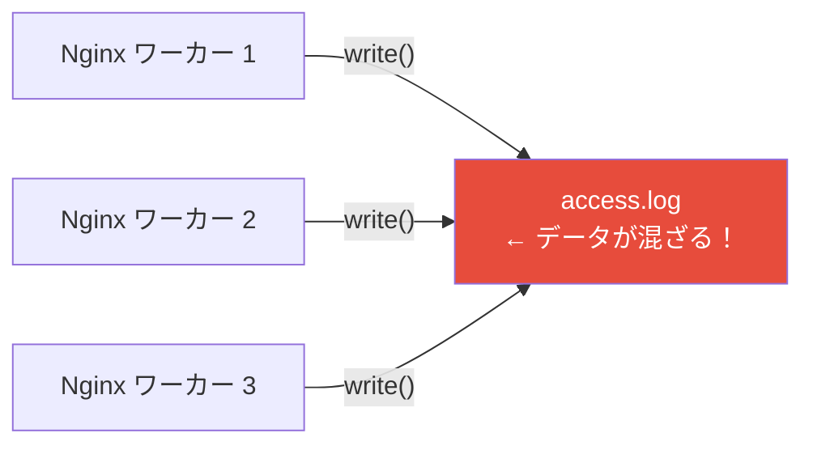
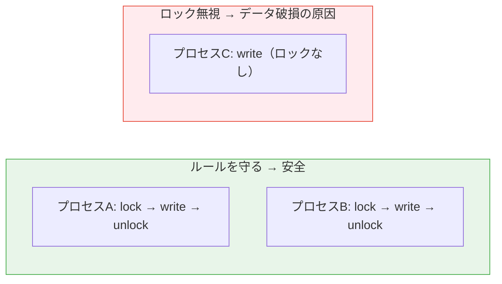

# ファイルの排他制御

> **一言で言うと:** 複数のプロセスが同じファイルに同時にアクセスするとき、データの破損や不整合を防ぐための仕組み。メモリ上の[[ロック]]（Mutex など）がスレッド間の制御であるのに対し、ファイルロックはプロセス間の制御であり、OS のカーネルが仲介する点が異なる。

## 概念

### なぜファイルレベルの排他制御が必要か

Webアプリケーションの実運用では、複数のプロセスが同じファイルに同時にアクセスする場面が頻繁に発生する。



メモリ上の Mutex は**同一プロセス内のスレッド間**でしか機能しない。別プロセスのメモリ空間は隔離されているため、あるプロセスの Mutex を別プロセスから操作することはできない。ファイルの排他制御にはカーネルが仲介する**ファイルロック**が必要になる。

### 排他制御が不要なケース

すべてのファイル操作に排他制御が必要なわけではない：
- **読み取りのみ** — 設定ファイルの読み込みなど、書き込みがなければ競合しない
- **プロセスごとに別ファイル** — ログをプロセスIDで分ける（`app.1234.log`）方式なら競合しない
- **`O_APPEND` での追記** — POSIX では `O_APPEND` フラグ付きの `write()` はオフセットの移動と書き込みがアトミックに行われることが保証される。実用上、一般的なファイルシステムでは小さな書き込み（数KB程度）はデータが混在せずに処理される

## ファイルロックの種類

### アドバイザリロック（Advisory Lock）

ロックの取得・確認は各プロセスの**自主的な協力**に依存する方式。ロックを無視して読み書きすることも可能。UNIX 系 OS のファイルロックはほぼすべてこの方式。



「アドバイザリ」と聞くと頼りなく感じるが、実用上はこれで十分。対象ファイルにアクセスするプログラムを自分で管理できる（＝すべてのプログラムにロック取得を義務付けられる）場合、強制ロックは不要。

### 強制ロック（Mandatory Lock）

OS がカーネルレベルでロックを強制し、ロックを取得していないプロセスの `read()` / `write()` をブロックまたは拒否する方式。

**Linux での状況:** 技術的にはサポートされている（`mount -o mand` + ファイルの SGID ビット設定）が、以下の理由で実質使われない：
- パフォーマンスが大幅に低下する
- 競合状態の完全な防止は保証されない
- Linux カーネル 5.15 以降では非推奨（deprecated）
- NFS など分散ファイルシステムでは動作しない

**結論:** 実務ではアドバイザリロックを使う。

## ファイルロックの API

### flock() — BSD 由来のシンプルなロック

ファイル全体をロックする。最もシンプルで使いやすい。

```python
import fcntl

# 排他ロック（Exclusive Lock）— 書き込み用
f = open('/tmp/data.txt', 'r+')
fcntl.flock(f.fileno(), fcntl.LOCK_EX)  # 他のロック保持者がいればブロック
try:
    data = f.read()
    f.seek(0)
    f.write(process(data))
    f.truncate()
finally:
    fcntl.flock(f.fileno(), fcntl.LOCK_UN)  # ロック解放
    f.close()
```

```python
# 共有ロック（Shared Lock）— 読み取り用
f = open('/tmp/data.txt', 'r')
fcntl.flock(f.fileno(), fcntl.LOCK_SH)  # 他の共有ロックとは共存可能
try:
    data = f.read()
finally:
    fcntl.flock(f.fileno(), fcntl.LOCK_UN)
    f.close()
```

| 既存のロック | 新たな LOCK_SH | 新たな LOCK_EX |
|:---:|:---:|:---:|
| なし | 取得可能 | 取得可能 |
| LOCK_SH | 取得可能 | ブロック |
| LOCK_EX | ブロック | ブロック |

```python
# ノンブロッキングモード — ロック取得できなければ即座にエラー
import errno

try:
    fcntl.flock(f.fileno(), fcntl.LOCK_EX | fcntl.LOCK_NB)
except IOError as e:
    if e.errno == errno.EWOULDBLOCK:
        print("他のプロセスがロック中、リトライまたは中断")
```

### fcntl() によるレコードロック — POSIX 準拠の範囲ロック

ファイルの**特定のバイト範囲**だけをロックできる。データベースエンジンが内部的に使う粒度の細かいロック。

```python
import fcntl

f = open('/tmp/database.dat', 'r+')

# バイト 100〜199 の範囲を排他ロック
# lockf() は内部的に fcntl() の POSIX レコードロックを使うが、
# struct flock のレイアウト（プラットフォーム依存）を意識せずに使える
fcntl.lockf(f.fileno(), fcntl.LOCK_EX, 100, 100, 0)  # offset=100, len=100

# ... バイト 100〜199 を読み書き ...

# ロック解放
fcntl.lockf(f.fileno(), fcntl.LOCK_UN, 100, 100, 0)
f.close()
```

### flock() vs fcntl() の違い

| 観点 | flock() | fcntl() |
|------|---------|---------|
| ロック粒度 | ファイル全体 | バイト範囲（レコード単位） |
| 標準 | BSD 由来 | POSIX 標準 |
| NFS サポート | 不完全（実装依存） | サポートあり |
| fork() 時 | 子プロセスに**継承されない** | 子プロセスに**継承される** |
| dup() 時 | 複製した fd でも同一ロック | fd ごとに独立したロック |
| 使いやすさ | シンプル | 複雑 |

**選択指針:** 単一ファイルの排他制御なら `flock()`。バイト範囲ロックや NFS 環境なら `fcntl()`。

## ロックファイルパターン

ファイルロック API を直接使う以外に、**ロックファイル（Lock File）**を作成する方式もある。ファイルの存在自体をロックのシグナルとして使う。

### mkdir によるロック

`mkdir` はアトミックな操作であるため、ロックの取得に使える。

```bash
#!/bin/bash
LOCKDIR="/tmp/myapp.lock"

# ロック取得（mkdir はアトミック）
if mkdir "$LOCKDIR" 2>/dev/null; then
    trap 'rm -rf "$LOCKDIR"' EXIT  # 終了時に必ず削除
    echo "ロック取得成功"
    # ... 処理 ...
else
    echo "他のプロセスが実行中"
    exit 1
fi
```

### O_CREAT | O_EXCL によるロック

`open()` に `O_CREAT | O_EXCL` フラグを渡すと、ファイルが存在しない場合のみ作成に成功する（アトミック）。

```python
import os, errno

LOCKFILE = '/tmp/myapp.pid'

def acquire_lock():
    try:
        fd = os.open(LOCKFILE, os.O_CREAT | os.O_EXCL | os.O_WRONLY, 0o644)
        os.write(fd, str(os.getpid()).encode())  # PID を記録
        os.close(fd)
        return True
    except OSError as e:
        if e.errno == errno.EEXIST:
            return False  # 既にロック済み
        raise

def release_lock():
    os.unlink(LOCKFILE)
```

### PID ファイル

デーモンプロセスの二重起動防止に使われる伝統的なパターン。

```python
import os, sys, fcntl

PIDFILE = '/var/run/myapp.pid'

def ensure_single_instance():
    """二重起動を防止する"""
    fp = open(PIDFILE, 'w')
    try:
        fcntl.flock(fp.fileno(), fcntl.LOCK_EX | fcntl.LOCK_NB)
    except IOError:
        print("既に起動しています")
        sys.exit(1)

    fp.write(str(os.getpid()))
    fp.flush()
    # fp を閉じない（閉じるとロックが解放される）
    # プロセス終了時に OS が自動的にロックを解放する
    return fp  # 参照を保持してGCされないようにする
```

## Node.js / JavaScript での排他制御

Node.js には `flock()` の直接的な API がないため、npm パッケージまたは自前実装を使う。

```javascript
const fs = require('fs');
const { open } = require('fs/promises');

// ロックファイルパターン（O_CREAT | O_EXCL 相当）
async function withLock(lockPath, fn) {
  let lockFd;
  try {
    // wx = O_CREAT | O_EXCL: ファイルが存在しなければ作成、存在すればエラー
    lockFd = await open(lockPath, 'wx');
    await fn();
  } finally {
    if (lockFd) {
      await lockFd.close();
      await fs.promises.unlink(lockPath);
    }
  }
}

// 使用例
await withLock('/tmp/myapp.lock', async () => {
  const data = await fs.promises.readFile('/tmp/shared.json', 'utf8');
  const obj = JSON.parse(data);
  obj.count += 1;
  await fs.promises.writeFile('/tmp/shared.json', JSON.stringify(obj));
});
```

## ファイルロック vs 他の排他制御手段

| 手段 | スコープ | 適した場面 |
|------|---------|-----------|
| Mutex / セマフォ | 同一プロセス内のスレッド間 | メモリ上の共有データ |
| ファイルロック（flock/fcntl） | 同一マシンのプロセス間 | 共有ファイルの読み書き、デーモンの二重起動防止 |
| ロックファイル（mkdir/O_EXCL） | 同一マシンのプロセス間 | シェルスクリプト、シンプルな排他制御 |
| 分散ロック（Redis/ZooKeeper） | 複数マシン間 | マイクロサービス環境での排他制御 |
| データベースの行ロック | 複数マシン間 | トランザクション内のデータ整合性 |

ファイルロックは**同一マシン内**でのみ有効。複数サーバーにスケールアウトした環境では Redis の `SETNX` や ZooKeeper のエフェメラルノードなど、分散ロックの仕組みが必要になる。

## 落とし穴

### 1. NFS 上の flock() は信用できない

`flock()` は NFS v2/v3 でローカルロック（クライアント内のプロセス間のみ）に変換されることがある。NFS 環境では `fcntl()` ベースのロックか、別のロック機構（Redis など）を使う。

### 2. ロックファイルの削除忘れ（ステイルロック）

プロセスがクラッシュするとロックファイルが残り続け、永遠にロックされた状態になる。対策：
- **flock() を使う** — プロセス終了時に OS が自動解放する
- **PID を記録してバリデーション** — ロックファイル内の PID のプロセスが生存しているか確認する

```bash
# ステイルロックの検出
LOCKFILE="/tmp/myapp.pid"
if [ -f "$LOCKFILE" ]; then
    PID=$(cat "$LOCKFILE")
    if ! kill -0 "$PID" 2>/dev/null; then
        echo "ステイルロック検出、削除します"
        rm "$LOCKFILE"
    fi
fi
```

### 3. ロック取得→ファイル操作の間の TOCTOU

「ファイルが存在するか確認 → 作成」のような 2 段階操作は、チェックと操作の間に他のプロセスが割り込む可能性がある（TOCTOU: Time-of-Check to Time-of-Use）。`O_CREAT | O_EXCL` のようなアトミック操作で 1 ステップにまとめる。

### 4. デッドロック

複数のファイルを異なる順序でロックすると[[デッドロック]]が発生する。

```
プロセス A: lock(file1) → lock(file2)  ← file2 を待つ
プロセス B: lock(file2) → lock(file1)  ← file1 を待つ
→ 永遠に待ち続ける
```

**対策:** 複数ファイルをロックする場合は、全プロセスで**同じ順序**（例: ファイルパスの辞書順）でロックを取得する。

## 参考リソース

- *Advanced Programming in the UNIX Environment*（W. Richard Stevens）— Chapter 14: Advanced I/O（File Locking）
- Linux man pages: `flock(2)`, `fcntl(2)`, `open(2)`（O_EXCL フラグ）
- *The Linux Programming Interface*（Michael Kerrisk）— Chapter 55: File Locking
