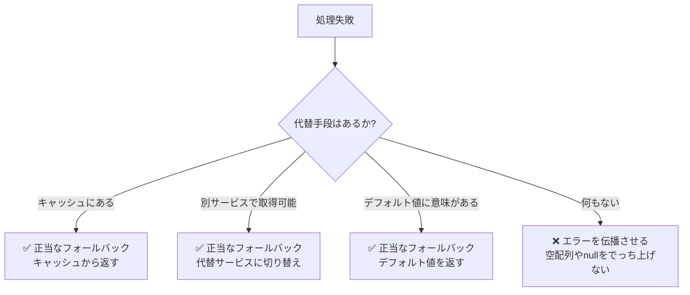
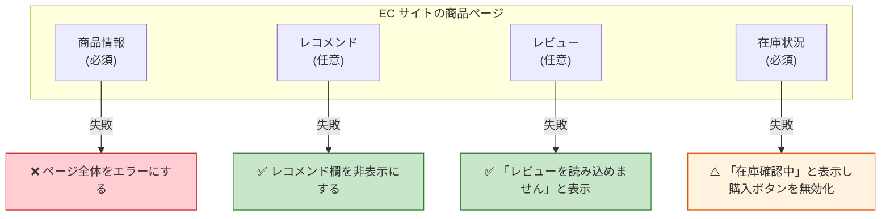
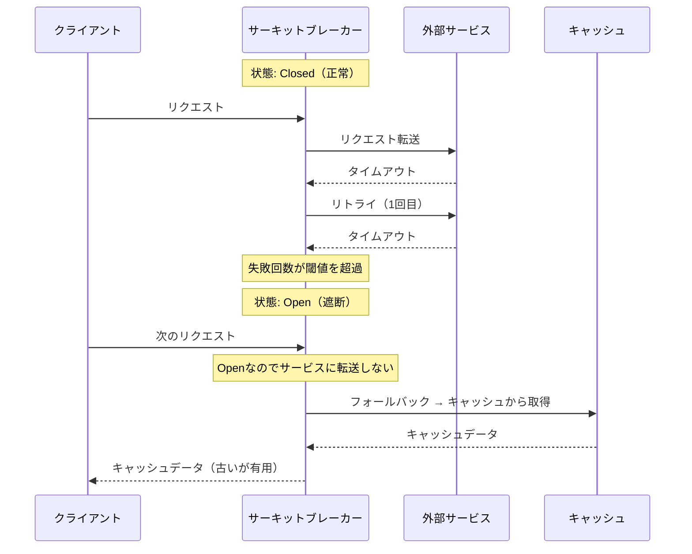

# フォールバックとグレースフルデグラデーション（Fallback & Graceful Degradation）

> **一言で言うと:** フォールバックとは、主要な処理が失敗したときに代替手段に切り替えること。グレースフルデグラデーション（Graceful Degradation）とは、システムの一部が壊れても全体としては動き続ける設計。両者は「壊れたときに全崩壊させない」という同じ目標を持つが、フォールバックは個別の代替手段、グレースフルデグラデーションはシステム全体の戦略を指す。

## フォールバックの本質 — 「代替」であって「でっち上げ」ではない

フォールバックの正当性は**代替手段が意味のある値を返せるかどうか**で決まる。



### 正当なフォールバック vs 偽フォールバック

| パターン | 例 | 判定 |
|---------|---|------|
| キャッシュからの古いデータ | レコメンドAPIが落ちた → 前回のレコメンド結果を表示 | ✅ ユーザーに古いが有用な情報を提供 |
| デフォルト設定への切り替え | ユーザー設定の取得に失敗 → システムデフォルト設定で動作 | ✅ 機能を維持できる |
| 代替サービスへの切り替え | 主要決済プロバイダがダウン → 副系プロバイダへ切り替え | ✅ ビジネス機能を継続 |
| 機能の無効化 | チャット機能のサーバーが落ちた → チャットUIを非表示にする | ✅ 他の機能は使い続けられる |
| 空配列を返す | 注文一覧の取得に失敗 → `[]` を返す | ❌ 「注文がない」と「取得できなかった」の区別がつかない |
| nullを返す | ユーザー情報の取得に失敗 → `null` を返す | ❌ 後続処理でnull参照エラーが起き、本来のエラーが隠蔽される |
| ハードコードした値 | 為替レートの取得に失敗 → `1 USD = 110 JPY` を返す | ❌ 古いレートで決済が実行される危険性 |

**判定基準:** フォールバック値を使って処理を続行した結果、ユーザーやビジネスに**実害が出ないか**。実害の可能性があるなら、エラーを正直に伝播させる方が安全。

## グレースフルデグラデーションの設計

グレースフルデグラデーションは、マイクロサービスやAPI連携で「依存先の一部が壊れてもシステム全体は動き続ける」ことを目標とする。



設計の核心は、各機能を**必須（Critical）** と **任意（Optional）** に分類すること。必須機能が失敗したらエラーを返し、任意機能が失敗したらその部分だけ劣化させる。

## フォールバックと関連パターンの関係

フォールバックは単独で使うこともあるが、リトライやサーキットブレーカー（Circuit Breaker）と組み合わせることで効果を発揮する。



| パターン | 役割 | 単独で使えるか |
|---------|------|---------------|
| リトライ（Retry） | 一時的な障害から回復する | ✅ ネットワークエラー等の一過性障害に有効 |
| サーキットブレーカー | 障害中のサービスへの呼び出しを遮断し、負荷を防ぐ | ✅ 障害の連鎖（カスケード障害）を防ぐ |
| フォールバック | 代替手段で処理を継続する | ✅ だが多くの場合リトライ/CB と組み合わせる |
| タイムアウト | 応答がない場合に処理を打ち切る | ✅ 全ての外部呼び出しに必須 |

典型的な組み合わせ: **タイムアウト → リトライ（指数バックオフ） → サーキットブレーカー → フォールバック**

## コード例

### TypeScript — フォールバック付きのサービス呼び出し

```typescript
interface Product {
  id: string;
  name: string;
  recommendations: string[];
}

// キャッシュストア（デモ用のインメモリ実装）
const cache = new Map<string, { data: unknown; expiry: number }>();

function getCache<T>(key: string): T | null {
  const entry = cache.get(key);
  if (!entry) return null;
  // 期限切れでも返す（stale cache as fallback）
  return entry.data as T;
}

function setCache(key: string, data: unknown, ttlMs: number): void {
  cache.set(key, { data, expiry: Date.now() + ttlMs });
}

// レコメンドAPIの呼び出し — フォールバック付き
async function getRecommendations(productId: string): Promise<string[]> {
  const cacheKey = `reco:${productId}`;

  try {
    const res = await fetch(`https://reco-api.example.com/products/${productId}`, {
      signal: AbortSignal.timeout(3000), // 3秒タイムアウト
    });
    if (!res.ok) throw new Error(`API returned ${res.status}`);
    const data = await res.json() as string[];

    // 成功時にキャッシュを更新
    setCache(cacheKey, data, 60_000);
    return data;
  } catch (err) {
    console.warn(`Recommendation API failed for ${productId}:`, err);

    // フォールバック: キャッシュから古いデータを返す
    const cached = getCache<string[]>(cacheKey);
    if (cached) {
      console.info(`Serving stale cache for ${productId}`);
      return cached;
    }

    // キャッシュもない場合: 空配列ではなくエラーを伝播させるか、
    // この機能が「任意」なら空配列を返す（UIがレコメンド欄を非表示にする）
    return []; // レコメンドは任意機能なので、空で許容
  }
}

// 商品情報の取得 — 必須機能なのでフォールバックしない
async function getProduct(productId: string): Promise<Product> {
  const res = await fetch(`https://api.example.com/products/${productId}`, {
    signal: AbortSignal.timeout(5000),
  });
  if (!res.ok) throw new Error(`Product API returned ${res.status}`);

  const product = await res.json() as Omit<Product, 'recommendations'>;

  // 任意機能は個別にフォールバック
  const recommendations = await getRecommendations(productId);

  return { ...product, recommendations };
}
```

### Go — サーキットブレーカー + フォールバック

```go
package main

import (
	"errors"
	"fmt"
	"sync"
	"time"
)

// 簡易サーキットブレーカー
type CircuitBreaker struct {
	mu            sync.Mutex
	failCount     int
	threshold     int
	openUntil     time.Time
	halfOpenAfter time.Duration
}

func NewCircuitBreaker(threshold int, halfOpenAfter time.Duration) *CircuitBreaker {
	return &CircuitBreaker{threshold: threshold, halfOpenAfter: halfOpenAfter}
}

var ErrCircuitOpen = errors.New("circuit breaker is open")

func (cb *CircuitBreaker) Execute(fn func() (any, error), fallback func() (any, error)) (any, error) {
	cb.mu.Lock()
	if cb.failCount >= cb.threshold && time.Now().Before(cb.openUntil) {
		cb.mu.Unlock()
		// Open状態 → サービスを呼ばずフォールバック
		return fallback()
	}
	cb.mu.Unlock()

	result, err := fn()
	cb.mu.Lock()
	defer cb.mu.Unlock()

	if err != nil {
		cb.failCount++
		if cb.failCount >= cb.threshold {
			cb.openUntil = time.Now().Add(cb.halfOpenAfter)
		}
		// 失敗時もフォールバックを試みる
		cb.mu.Unlock()
		fbResult, fbErr := fallback()
		cb.mu.Lock()
		return fbResult, fbErr
	}

	cb.failCount = 0 // 成功でリセット
	return result, nil
}

// 使用例
func main() {
	cb := NewCircuitBreaker(3, 30*time.Second)

	// 外部APIの呼び出し（ここでは常に失敗するデモ）
	callAPI := func() (any, error) {
		return nil, errors.New("connection timeout")
	}

	// フォールバック: キャッシュから返す
	fallback := func() (any, error) {
		return map[string]string{"source": "cache", "data": "stale recommendations"}, nil
	}

	for i := 0; i < 5; i++ {
		result, err := cb.Execute(callAPI, fallback)
		if err != nil {
			fmt.Printf("Attempt %d: error = %v\n", i+1, err)
		} else {
			fmt.Printf("Attempt %d: result = %v\n", i+1, result)
		}
	}
}
```

### Python — 機能単位のグレースフルデグラデーション

```python
import logging
from dataclasses import dataclass, field

logger = logging.getLogger(__name__)


@dataclass
class ProductPage:
    """商品ページの各セクションを独立して取得し、
    任意セクションの失敗は個別にデグレードする"""
    product: dict                       # 必須
    reviews: list[dict] = field(default_factory=list)
    recommendations: list[str] = field(default_factory=list)
    degraded_sections: list[str] = field(default_factory=list)


def fetch_product(product_id: str) -> dict:
    """必須機能 — 失敗したら例外をそのまま伝播"""
    # DB/APIから取得（省略）
    return {"id": product_id, "name": "サンプル商品", "price": 3000}


def fetch_reviews(product_id: str) -> list[dict]:
    """任意機能 — 失敗してもページは表示できる"""
    raise ConnectionError("Review service unavailable")


def fetch_recommendations(product_id: str) -> list[str]:
    """任意機能"""
    raise TimeoutError("Recommendation service timeout")


def build_product_page(product_id: str) -> ProductPage:
    # 必須機能: 失敗したらそのまま例外を上げる
    product = fetch_product(product_id)
    page = ProductPage(product=product)

    # 任意機能: 個別にフォールバック
    try:
        page.reviews = fetch_reviews(product_id)
    except Exception as e:
        logger.warning("Reviews unavailable for %s: %s", product_id, e)
        page.degraded_sections.append("reviews")

    try:
        page.recommendations = fetch_recommendations(product_id)
    except Exception as e:
        logger.warning("Recommendations unavailable for %s: %s", product_id, e)
        page.degraded_sections.append("recommendations")

    return page


page = build_product_page("prod-42")
print(f"Product: {page.product['name']}")
print(f"Reviews: {len(page.reviews)}件")
print(f"Degraded: {page.degraded_sections}")
# Output:
# Product: サンプル商品
# Reviews: 0 件
# Degraded: ['reviews', 'recommendations']
```

## よくある落とし穴

### 1. フォールバックが本来のエラーを隠蔽する

フォールバックを使うと処理が「成功」として完了するため、エラーの存在がモニタリングに現れにくくなる。フォールバックが発動した事実は必ずログ・メトリクスに記録し、「フォールバック発動率」をアラートの対象にすること。

### 2. フォールバックの連鎖で無限ループ

プライマリ → セカンダリ → プライマリ... のようにフォールバック先が循環参照していると、障害時に無限ループが発生する。フォールバックの深さは最大2段程度に制限する。

### 3. キャッシュフォールバックのデータ鮮度を無視する

キャッシュから古いデータを返すフォールバックは有用だが、「どれだけ古いデータまで許容するか」を明示的に決めておかないと、数日前のデータを返し続ける事態になる。stale-while-revalidate パターンでは、許容する古さの上限を設定する。

### 4. 必須機能にフォールバックを適用してしまう

決済処理や在庫更新のような整合性が必須の処理にフォールバック値を返すのは危険。「決済APIが落ちたので0円で処理する」のようなフォールバックは当然ありえない。必須機能はエラーを正直に返し、リトライまたはユーザーへの通知で対応する。

## AIによる実装のアンチパターン

| アンチパターン | なぜ問題か | 対策 |
|---|---|---|
| `catch { return [] }` — 空配列でっち上げ | 「データがない」と「取得に失敗した」の区別が消える | エラーを伝播させるか、明示的にdegraded状態を返す |
| 全てのAPI呼び出しにフォールバックを付ける | 必須機能のエラーが隠蔽され、データ不整合が発生する | 機能をCritical/Optionalに分類し、Optionalのみフォールバック |
| フォールバックにログを書かない | 障害が発生しているのに誰も気づかない | フォールバック発動時は必ずログ + メトリクスを記録 |
| タイムアウトなしでフォールバック判定 | 外部サービスの応答を無限に待ち続け、フォールバックに到達しない | 全ての外部呼び出しにタイムアウトを設定する |

## 関連トピック

- [[エラーハンドリング]] — 親トピック。フォールバックはエラー発生後の回復戦略の一つ
- [[キャッシュ戦略]] — キャッシュは最も一般的なフォールバック先。stale-while-revalidate パターン
- [[API設計-REST-GraphQL]] — GraphQLのPartial Response（部分的成功）はグレースフルデグラデーションと相性が良い
