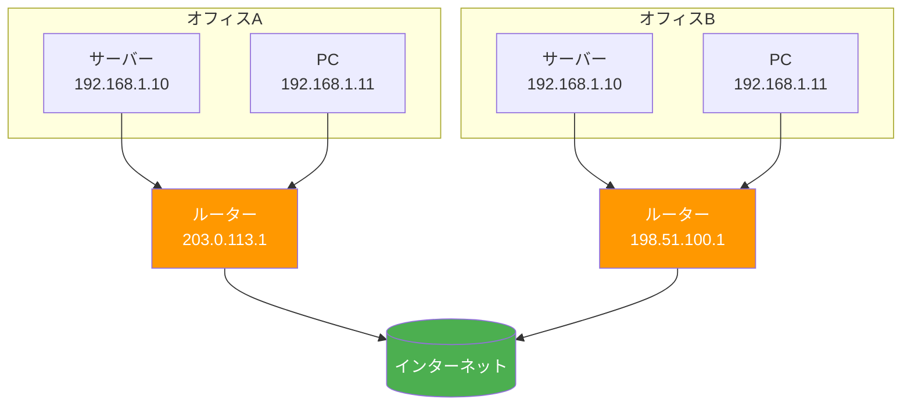

# プライベートIPとパブリックIP（Private and Public IP Addresses）

> **一言で言うと:** パブリックIPはインターネット上で一意なアドレス、プライベートIPはローカルネットワーク内だけで通用するアドレス。この区別がNATの存在理由であり、IPv4アドレス枯渇を乗り越えた仕組みの土台になっている。

## なぜ2種類に分かれているのか

IPv4 のアドレス空間は約43億個しかない。すべてのデバイスにグローバルに一意なアドレスを割り当てると足りないため、「インターネットに出ないローカル通信用のアドレス」を別途確保し、各ネットワーク内で自由に再利用できるようにした。これが RFC 1918（1996年）で定義された**プライベートアドレス**である。



オフィスAとBは同じ `192.168.1.x` を使っているが、インターネット上では別々のパブリックIP（`203.0.113.1` / `198.51.100.1`）として識別される。この変換を行うのが[[IPv4がなぜ今も使われるのか|NAT]]である。

## パブリックIP（Global / Public IP）

インターネット上で**世界に1つだけ**のアドレス。ICANN を頂点とする管理組織（RIR → ISP）から割り当てられる。

| 管理組織 | 地域 |
|---------|------|
| APNIC | アジア太平洋 |
| ARIN | 北米 |
| RIPE NCC | ヨーロッパ・中東・中央アジア |
| AFRINIC | アフリカ |
| LACNIC | 中南米 |

### 特徴

- インターネット上のルーターが宛先を特定できる
- Webサーバー、DNSサーバーなど**外部からアクセスされるサービス**に必要
- 数が有限であり、取得・維持にコストがかかる
- 固定IP（Static）と動的IP（Dynamic / DHCP）がある

```bash
# 自分のパブリックIPを確認する
curl -s https://ifconfig.me
# 203.0.113.5

# または
curl -s https://api.ipify.org
```

## プライベートIP（Private / Local IP）

RFC 1918 で「インターネットにルーティングしない」と定められたアドレス範囲。ローカルネットワーク内でのみ有効。

| CIDR表記 | アドレス範囲 | アドレス数 | 主な用途 |
|----------|------------|-----------|---------|
| `10.0.0.0/8` | 10.0.0.0 〜 10.255.255.255 | 約1,677万 | クラウドVPC、大規模企業 |
| `172.16.0.0/12` | 172.16.0.0 〜 172.31.255.255 | 約104万 | Docker デフォルトネットワーク |
| `192.168.0.0/16` | 192.168.0.0 〜 192.168.255.255 | 約65,000 | 家庭・小規模オフィス |

### 特徴

- 異なるネットワークで同じアドレスを自由に再利用できる
- インターネットに直接出られない（NATが必要）
- DHCP サーバーが自動的に割り当てるのが一般的

```bash
# 自分のプライベートIPを確認する（Linux）
ip addr show | grep "inet "
# inet 127.0.0.1/8 scope host lo
# inet 192.168.1.10/24 brd 192.168.1.255 scope global eth0

# macOS
ifconfig en0 | grep "inet "
# inet 192.168.1.10 netmask 0xffffff00 broadcast 192.168.1.255
```

## 特殊なアドレス範囲

プライベートIP以外にも予約されたアドレス範囲がある。Web開発者が遭遇しやすいものを整理する。

| アドレス範囲 | 用途 | 遭遇する場面 |
|------------|------|-------------|
| `127.0.0.0/8` | ループバック（自分自身） | `localhost` への接続 |
| `169.254.0.0/16` | リンクローカル（DHCP失敗時の自動割当） | DHCP障害のトラブルシュート |
| `100.64.0.0/10` | CGNAT 用（RFC 6598） | ISP が NAT を二重にかける環境 |
| `0.0.0.0` | 「すべてのインターフェース」 | サーバーのバインドアドレス |
| `255.255.255.255` | ブロードキャスト | DHCP ディスカバリ |
| `192.0.2.0/24`, `198.51.100.0/24`, `203.0.113.0/24` | ドキュメント用（RFC 5737） | 技術文書での例示 |

### `0.0.0.0` と `127.0.0.1` の違い

開発中に混同しやすいポイント:

```
127.0.0.1  → 自分自身への通信（ループバック）
0.0.0.0    → サーバー側で「すべてのネットワークインターフェースで受け付ける」
```

```javascript
// Node.js の例
import { createServer } from 'node:http';
const server = createServer((req, res) => res.end('OK'));

// 127.0.0.1 でリッスン → 同じマシンからのみアクセス可能
server.listen(3000, '127.0.0.1');

// 0.0.0.0 でリッスン → 同じネットワーク内の他のマシンからもアクセス可能
server.listen(3000, '0.0.0.0');
```

Docker コンテナ内でサーバーを起動するとき、`127.0.0.1` にバインドするとコンテナ外からアクセスできない。`0.0.0.0` にバインドする必要がある。

```dockerfile
# ❌ コンテナ外からアクセスできない
CMD ["node", "server.js", "--host", "127.0.0.1"]

# ✅ コンテナのポートフォワーディングが機能する
CMD ["node", "server.js", "--host", "0.0.0.0"]
```

## CIDR表記の読み方

IPアドレスの範囲をサブネットマスクで表現する記法。ネットワーク設計やセキュリティグループの設定で頻出する。

```
192.168.1.0/24
           ^^^
           先頭24ビットがネットワーク部 → 残り8ビット（256個）がホスト部

10.0.0.0/8
         ^
         先頭8ビットがネットワーク部 → 残り24ビット（約1,677万個）がホスト部

203.0.113.5/32
            ^^
            32ビットすべてがネットワーク部 → ホストは1台のみ（特定のIPを指す）
```

```python
import ipaddress

# CIDR からネットワーク情報を取得
network = ipaddress.ip_network("192.168.1.0/24")
print(f"ネットワークアドレス: {network.network_address}")  # 192.168.1.0
print(f"ブロードキャスト:     {network.broadcast_address}")  # 192.168.1.255
print(f"使用可能ホスト数:     {network.num_addresses - 2}")  # 254
print(f"サブネットマスク:     {network.netmask}")            # 255.255.255.0

# あるIPがネットワーク範囲内かチェック
print(ipaddress.ip_address("192.168.1.50") in network)  # True
print(ipaddress.ip_address("192.168.2.50") in network)  # False
```

```go
package main

import (
	"fmt"
	"net"
)

func main() {
	// CIDR からネットワーク範囲を解析
	_, network, _ := net.ParseCIDR("192.168.1.0/24")
	fmt.Println("ネットワーク:", network)  // 192.168.1.0/24

	// IP がネットワーク範囲内かチェック
	ip := net.ParseIP("192.168.1.50")
	fmt.Println("範囲内:", network.Contains(ip))  // true
}
```

### AWS セキュリティグループでの CIDR 使用例

```
# 特定の IP のみ SSH を許可
ポート 22 : 203.0.113.5/32     ← 1台のみ

# オフィスネットワーク全体を許可
ポート 443 : 198.51.100.0/24   ← 256台分の範囲

# 全世界に公開（Webサーバー用）
ポート 443 : 0.0.0.0/0         ← すべての IPv4 アドレス
ポート 443 : ::/0              ← すべての IPv6 アドレス
```

## よくある落とし穴

### 1. 開発環境で `localhost` 前提のコードを本番にそのまま持っていく

開発中は `localhost:3000` で動くが、本番では別マシンのサービスと通信する。環境変数でホストを外部化すべき。

### 2. プライベートIPをセキュリティ境界として信頼する

「プライベートネットワーク内だから安全」という前提は危険。内部ネットワークに侵入された場合（ラテラルムーブメント）、プライベートIPであっても認証・暗号化が必要。ゼロトラストの考え方が重要。

### 3. Docker のデフォルトネットワーク範囲と社内ネットワークの衝突

Docker は `172.17.0.0/16` をデフォルトで使用する。これが社内ネットワークの `172.16.0.0/12` と重なり、VPN 接続時に特定のホストにアクセスできなくなるトラブルがある。`/etc/docker/daemon.json` でアドレスプールを変更して回避する。

## 関連トピック

- [[TCP-IP]] — 親トピック。IPアドレッシングの全体像
- [[IPv4がなぜ今も使われるのか]] — NATとCGNATによるIPv4延命の詳細
- [[DNS]] — ドメイン名をパブリックIPに解決する仕組み
