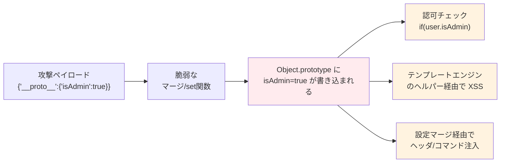
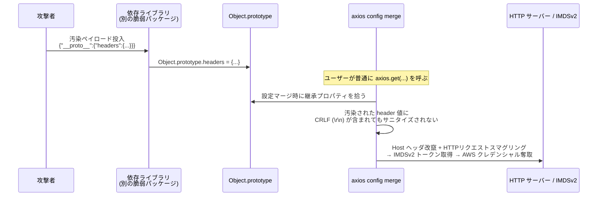

# プロトタイプ汚染（Prototype Pollution）

> **一言で言うと:** JavaScriptの `Object.prototype` に外部入力経由でプロパティを注入することで、**アプリ内の全オブジェクトの既定値を書き換えてしまう**攻撃。単体ではクラッシュ程度だが、他ライブラリの挙動と組み合わさることで XSS・認証バイパス・RCE にエスカレートする「**ガジェット（gadget）型**」脆弱性の代表例。

## なぜ独立した攻撃カテゴリなのか

JavaScriptのオブジェクトは [[JSにおけるprototype|プロトタイプチェーン]]で親を辿る。`({}).toString` が存在するのは、空オブジェクト自身ではなく `Object.prototype` にメソッドがあり、チェーンで見えているからに他ならない。

つまり `Object.prototype.isAdmin = true` を一度書き込めば、アプリケーション内の**`isAdmin` を持たない全てのオブジェクト**が `isAdmin === true` を返す状態になる。



この「汚染 → 別コンポーネントの挙動変化」という 2 段構成こそがプロトタイプ汚染の本質で、**ガジェット（攻撃を増幅する部品）** と呼ばれる。単独では `Object.prototype` に要らないキーが増えるだけだが、他ライブラリがちょうどそのキーを "未設定時のオプション" として読み取ると、一気に任意コード実行にまで到達する。

## 典型的な侵入口

| 侵入口 | 具体例 | なぜ危険か |
|---|---|---|
| **再帰的ディープマージ** | `lodash.merge`, `deepmerge`, 自作 config マージ | ネストを辿る際に `__proto__` キーを普通のプロパティとして扱いがち |
| **Dot-path で setter** | `lodash.set(obj, "a.b.c", v)`, `object-path` | `set(obj, "__proto__.isAdmin", true)` で直接到達 |
| **クエリ文字列パーサー** | 古い `qs`, `Express` の `req.query` | `?__proto__[isAdmin]=true` を自動でネスト化 |
| **JSON.parse した結果をそのままマージ** | `{"__proto__":{...}}` は JSON では `__proto__` が単なる文字列キーとしてパースされ、結果オブジェクトの own property として入る | `for...in` や `Object.assign` で踏むと伝播 |

JSONそのものは仕様上 `__proto__` を普通の文字列キーとして扱う。問題は**パース後のオブジェクトを既存オブジェクトにマージする処理**の側にある。

## コード例

### 汚染が起きる瞬間

```javascript
function badMerge(target, src) {
  for (const k in src) {
    if (src[k] && typeof src[k] === 'object') {
      badMerge(target[k] ??= {}, src[k]);  // target.__proto__ はアクセサで Object.prototype を返すので
                                           // ??= は代入をスキップし、Object.prototype 側を直接マージしてしまう
    } else {
      target[k] = src[k];
    }
  }
}

badMerge({}, JSON.parse('{"__proto__":{"isAdmin":true}}'));

console.log(({}).isAdmin);  // true ← 以降、全ての素のオブジェクトが "admin" に見える
```

### 認可チェックが崩壊する例

```typescript
type User = { id: string; isAdmin?: boolean };

function canDelete(user: User): boolean {
  return user.isAdmin === true;
}

// 通常ユーザー — isAdmin プロパティを自身は持たない
const alice: User = { id: 'alice' };
console.log(canDelete(alice));  // 汚染前: false

// 別経路でプロトタイプ汚染が発生
(Object.prototype as any).isAdmin = true;

console.log(canDelete(alice));  // 汚染後: true ← 認可バイパス
```

### 防御: `Object.create(null)` / `Map`

```javascript
// ① プロトタイプを持たない「純粋辞書」を使う
const dict = Object.create(null);
dict.__proto__ = 'hello';         // これはもはやアクセサではなく普通のキー
console.log(Object.getPrototypeOf(dict));  // null — 汚染しても他には波及しない

// ② Map を使う（推奨）
const m = new Map();
m.set('__proto__', 'hello');      // 完全に安全

// ③ JSON.parse でも reviver や allowlist で __proto__ / constructor / prototype を弾く
//    reviver が undefined を返したキーは結果オブジェクトから除去されるため、
//    __proto__ own property 自体が消え、後段のマージでも汚染が発生しない
const safe = JSON.parse(input, (k, v) => {
  if (k === '__proto__' || k === 'constructor' || k === 'prototype') return undefined;
  return v;
});
```

### Python との対比 — なぜ JS 固有なのか

同じ動的言語でも Python では等価の攻撃は基本成立しない:

```python
# Python: dict は独立したハッシュテーブル。共有される "prototype" がない
a = {}
b = {}
# a.__proto__ のような「親辞書へのリンク」は存在しない
# Python にも a.__class__（= dict クラス）経由のメソッド解決はあるが、
# インスタンス辞書 __dict__ とクラス階層は分離されており、
# 1つの dict インスタンスを触っても他の dict インスタンスには波及しない
```

Python のオブジェクト継承は**クラス側**で完結しており、インスタンス辞書（`__dict__`）は独立している。JS の `[[Prototype]]` のように「インスタンス単位で親オブジェクトを差し替えられ、かつその親が組み込み型と共有されている」構造だからこそ、プロトタイプ汚染という攻撃カテゴリが成立する。

## 実例: axios CVE-2026-40175

2026 年に公開された axios v1.15.0 未満が対象の Critical 脆弱性（Critical 相当の深刻度）は、**プロトタイプ汚染を RCE / クラウドアカウント乗っ取りに昇華させるガジェット**として axios 自身が機能してしまうという、教科書的なケース。

### 攻撃チェーン



ポイントは次の 3 点:

1. **axios 単体には直接の "汚染 sink" はない** — プロトタイプ汚染は別ライブラリで起こす必要があり、axios はその汚染を増幅・配送する経路にすぎない
2. **config マージがプロトタイプチェーン越しのプロパティを素直にコピーしていた** — `for...in` 相当の列挙で `Object.prototype.headers` 等が流入
3. **マージ後のヘッダ値に対する CRLF (`\r\n`) 検証が欠けていた** — 結果として攻撃者はリクエスト分割・ヘッダ注入を行える。これが AWS の IMDSv2 に届くと危険で、IMDSv2 のSSRF耐性は「カスタムヘッダ `X-aws-ec2-metadata-token-ttl-seconds` 付きの `PUT` でトークンを取得する」という要求に支えられているため、通常の GET 型 SSRF では突破できない。しかし CRLF 注入でリクエストを分割し任意ヘッダを付けられると、この前提が崩れ、**サーバー内部から**トークンを取得して AWS クレデンシャルを奪取できる

### 修正（axios 1.15.0）

- config マージ時に `__proto__` / `constructor` / `prototype` をブロックリストで弾く
- マージ後のヘッダ値に対して CRLF を含む制御文字の検証を追加

### 実務での対応手順

```bash
# 1. 直接依存だけでなく推移的依存（transitive deps）を含めて確認
npm ls axios

# 2. 1.15.0 以上に固定（メジャー据え置きで上げられる）
#    ^ はシェルによって特殊文字扱いされるためクォート必須
npm install 'axios@^1.15.0'

# 3. package-lock.json を再生成して全ツリーを更新
rm package-lock.json && npm install

# 4. 継続監視
npm audit --production
```

`npm ls axios` で間接依存として 1.14 以下が残る場合、`overrides`（npm）/ `resolutions`（yarn/pnpm）フィールドで強制的にバージョンを上書きする必要がある。

## よくある落とし穴

### 1. 「JSON.parse は安全」という誤解
`JSON.parse('{"__proto__":{...}}')` は**エラーにならない**。仕様上 `__proto__` はただの文字列キーであり、パース結果のオブジェクトには `__proto__` という名前の own property が存在する。問題はその後の**マージ処理**で発動する。

### 2. `lodash.merge` / `lodash.defaultsDeep` は過去に何度も修正されている
CVE-2018-16487、CVE-2019-10744、CVE-2020-8203 など。古い lodash を推移的依存で引き込んでいないか `npm ls lodash` で確認する。

### 3. `Object.freeze(Object.prototype)` は副作用が大きい
グローバル対策として `Object.freeze(Object.prototype)` を実行するアイデアがあるが、一部ライブラリ（古い polyfill など）が `Object.prototype` に書き込むことを前提にしており、アプリが起動直後に例外で止まる事例がある。**小さなアプリ限定の最終手段**で、まずは入力側の弾きを優先する。

### 4. クライアントサイドだけの問題ではない
「サーバーサイドにはプロトタイプがないから関係ない」は誤り。Node.js もまったく同じ JS エンジン（V8）で動いており、むしろサーバー側ではファイル書き込みや `child_process.exec` 経由のコマンド実行に直結するため影響が大きい。

### 5. TypeScript は防げない
`Record<string, unknown>` のような型注釈は実行時の `__proto__` 書き換えを止めない。型システムと実行時ガードは別問題である。

## AIによる実装のアンチパターン

| アンチパターン | なぜ問題か | 対策 |
|---|---|---|
| `Object.assign(target, JSON.parse(userInput))` をそのまま書く | ネストを浅く扱うので比較的マシだが、`__proto__` キーが own property として入ってくるケースでは依然危険 | キーの allowlist、または `Object.create(null)` をターゲットにする |
| 自作 deepMerge を `for...in` で書く | プロトタイプチェーン上のプロパティを拾う上に、`__proto__` キー経由の汚染も素通しする | `Object.keys` で列挙しつつキー名を弾く |
| `lodash.set(obj, userPath, value)` をパス検証なしで使う | `__proto__.isAdmin` がそのまま通る | パス文字列の allowlist、または `Map` を使う設計に変更 |
| 「大丈夫、`hasOwnProperty` でチェックしている」 | `hasOwnProperty` 自体もプロトタイプ汚染で差し替えられる可能性がある | `Object.prototype.hasOwnProperty.call(obj, k)` で呼ぶ、または `Object.hasOwn(obj, k)`（ES2022+）を使う |

## 実務での使用シーン（防御観点）

- **Express / Fastify の入力パース**: クエリ文字列を `qs` 経由でネスト化する設定は必要最小限に。`?a[b]=1` のような深い構造を許す必要がないなら `query parser` を `simple` に変更
- **テンプレートエンジン経由の XSS エスカレーション**: Handlebars、Pug、EJS などでユーザーオプションを汚染経由で渡すと、内部ヘルパー経由で任意 JS 実行に繋がる例が過去に複数報告されている
- **依存監視**: [[サプライチェーンセキュリティ]]の文脈で `npm audit` / `Dependabot` / `Snyk` を CI に組み込み、axios のような広く使われるパッケージの Critical 報告を取り逃さない体制を作る
- **静的解析**: ESLint プラグイン `eslint-plugin-security`、Semgrep ルールで `merge`/`set`/`defaultsDeep` の危険な使い方を検出

## 関連トピック

- [[XSS]] — 親トピック。プロトタイプ汚染は XSS の一変種ではなく、XSS / 認証バイパス / RCE を**生み出すガジェット**として機能する
- [[JSにおけるprototype]] — 攻撃が成立する言語機構の詳細
- [[SQLインジェクション]] — 「データとコードの混同」という構造的共通点
- [[サプライチェーンセキュリティ]] — 推移的依存を経由する攻撃チェーンの前提
- [[CSRF]] / [[CORS]] — ヘッダ注入から派生する周辺攻撃の文脈

## 参考リソース

- [CVE-2026-40175 - NVD](https://nvd.nist.gov/vuln/detail/CVE-2026-40175)
- [CVE-2026-40175 解説記事（cve.news）](https://www.cve.news/cve-2026-40175/)
- [OWASP: Prototype Pollution](https://owasp.org/www-community/vulnerabilities/Prototype_Pollution)
- PortSwigger Research: "Server-side prototype pollution: Black-box detection without the DoS" — Gareth Heyes
- Snyk Blog: "Prototype pollution attacks in Node.js applications"
