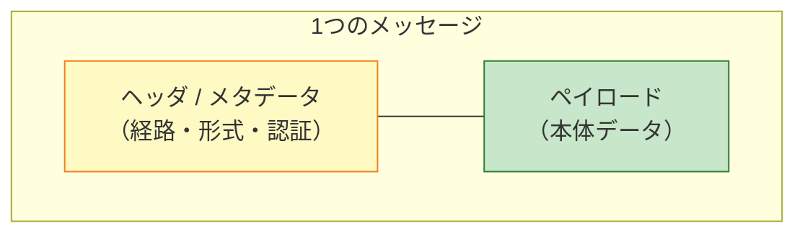
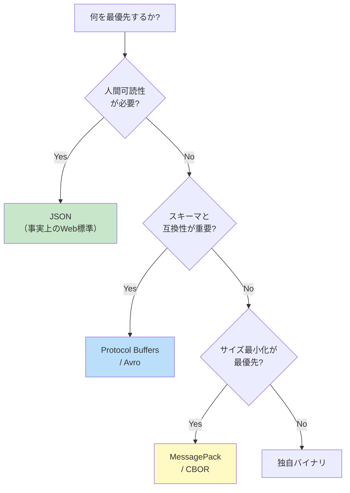

# ペイロード（Payload）

> **一言で言うと:** ペイロードとは「運搬される本体データ」のこと。配送に必要な[[HTTP-HTTPS|ヘッダ・封筒・経路情報]]と区別される、**受信側が実際に処理したい中身**を指す。HTTP ボディ・JWT の中段・Webhook の本体・メッセージキューのメッセージ本体・攻撃文字列まで、レイヤーをまたいで同じ語が使われる多義語であり、文脈ごとに「何がペイロードか」が変わる。

## 用語の由来 — 「貨物」のメタファー

`payload` は元来、航空・海運の「**運賃を生む積荷（the load that pays）**」を指す語。輸送そのもののために必要な機体重量や燃料は payload ではなく、「運賃の対象となる積荷だけ」が payload である。

通信の文脈に転用された結果、次の対比が生まれた。



- **ヘッダ**: 配送のために必要な情報（宛先・サイズ・コンテンツタイプ・署名）
- **ペイロード**: 配送そのものの目的である中身（JSON 本文・トークンのクレーム・メッセージ本体）

この「**封筒と中身を分ける**」発想は、後述するすべての文脈で共通する。

## レイヤーごとの「ペイロード」

同じ語でも、どのレイヤーで使うかによって指すものが変わる。Web エンジニアが日常的に出会うペイロードは下表のとおり。

| 文脈 | 何がペイロードか | ヘッダ側に置かれるもの |
|---|---|---|
| TCP/IP パケット | TCP セグメントのデータ部 | 送信元/宛先 IP、ポート、TCP フラグ |
| HTTP メッセージ | リクエスト/レスポンスのボディ | `Content-Type`、`Authorization`、`Cache-Control` |
| JWT | 中段の `payload`（クレーム） | ヘッダ（`alg`, `typ`） / 署名 |
| Webhook | POST されてくる JSON 本体 | `X-Signature`、`X-Event-Type` |
| メッセージキュー | メッセージ本文 | ルーティングキー、属性、TTL |
| GraphQL | レスポンスの `data` フィールド | `errors`、`extensions` |
| セキュリティ攻撃 | 攻撃文字列そのもの（SQLi 文字列、XSS スクリプト、シェルコード） | — |

特に **GraphQL の `errors` がペイロードかヘッダか** は感覚を狂わせやすい。HTTP のヘッダ/ボディの区分とは独立に、GraphQL レスポンスの中で**さらに「メタ情報（`errors`, `extensions`）」と「中身（`data`）」を分けている**。これを「入れ子のヘッダ・ペイロード構造」と捉えると見通しが立つ。

## HTTP ペイロードの構造と限界

HTTP のリクエスト/レスポンスは下記のように分かれている。

```
POST /api/users HTTP/1.1                 ← リクエストライン
Host: api.example.com                    ┐
Content-Type: application/json           │
Content-Length: 38                       │ ヘッダ
Authorization: Bearer eyJhbGciOi...      │
                                         ┘
                                         ← 空行（CRLF×2）
{"name":"Alice","email":"alice@x.com"}   ← ペイロード（ボディ・38 bytes）
```

ヘッダはペイロードの**配送に必要なメタデータ**を運び、ペイロードは**業務上の意味を持つデータ**を運ぶ。両者の境界は仕様で厳密に定められており、空行が区切り役になる。

### サイズ制限の実体

「HTTP ペイロードの上限はどこで決まるのか」は実務で頻出するが、**仕様上の上限はない**。実際の制限は以下のレイヤーで個別に課される。

| レイヤー | デフォルトの目安 | 設定例 |
|---|---|---|
| Nginx | `client_max_body_size 1m` | `client_max_body_size 10m;` |
| Express（body-parser） | `100kb` | `express.json({ limit: '1mb' })` |
| AWS API Gateway | 10 MB（REST/HTTP API 共通）。ただし Lambda プロキシ統合経由では 6 MB に制限 | サービス側で固定 |
| Cloudflare Workers | 100 MB（リクエスト） | プランで変動 |
| クラウド LB | プロバイダ依存 | ALB は基本上限なし |

つまり「アップロードが 413 で失敗する」は、これらどれか一つに引っかかっている可能性がある。**どこで切られたかはエラーレスポンスを返したコンポーネントに依存する**。

## ペイロード形式の選択



| 形式 | サイズ効率 | スキーマ | 用途 |
|---|---|---|---|
| **JSON** | 低（テキスト） | 任意（[[OpenAPIとスキーマ駆動開発\|OpenAPI]] / JSON Schema） | Web API の事実上の標準 |
| **XML** | 低（テキスト・タグが冗長） | XSD | レガシー、SOAP、SAML |
| **Protocol Buffers** | 高（バイナリ） | `.proto` 必須 | gRPC、社内マイクロサービス間 |
| **MessagePack** | 高（バイナリ） | 任意 | JSON 互換のバイナリ版、リアルタイム通信 |
| **Avro** | 高 | スキーマ埋め込み | Kafka、データ基盤 |
| **multipart/form-data** | 内容依存（バイナリ可） | フィールド単位 | ファイルアップロード（他形式と異なりラッピング方式） |

実務の判断軸は「**社外公開 API → JSON、社内マイクロサービス → Protocol Buffers / Avro、ファイルアップロード → multipart**」の三段構えで覚えておけばまず外さない。

## エンベロープ vs フラット — レスポンスペイロードの設計

REST API のレスポンスペイロードは、データを直接返すか、メタデータと一緒にラップするかで二派に分かれる。

```json
// ❌ 過剰なエンベロープ — メタが多すぎる
{
  "success": true,
  "code": 0,
  "message": "OK",
  "timestamp": "2026-05-03T10:00:00Z",
  "version": "1.2.3",
  "data": { "id": 1, "name": "Alice" }
}

// ✅ フラット — リソースを直接返す
{ "id": 1, "name": "Alice" }

// ✅ 最小限のエンベロープ — コレクションでページ情報が必要な場合
{
  "data": [{ "id": 1, "name": "Alice" }],
  "meta": { "page": 1, "total": 42 }
}
```

過剰なエンベロープは [[エラーハンドリング|HTTP ステータスコード]] の存在意義を奪う（`success: true/false` を見ないとエラーが分からない API になる）。**`success` フィールドが要るほど階層が必要になった時点で、HTTP ステータスコードの設計を見直すサイン**である。

## コード例

### TypeScript — ペイロードのサイズ制限と検証（Express）

```typescript
import express from 'express';
import { z } from 'zod';

const app = express();

// ペイロードサイズの明示的な上限設定
app.use(express.json({ limit: '1mb' }));

// スキーマで構造を定義（ペイロードの「契約」）
// Zod v4 系（2025-05〜）の記法。v3 系では z.string().email() / error.flatten() を使う
const CreateUserPayload = z.object({
  name: z.string().min(1).max(100),
  email: z.email(),
  age: z.number().int().min(0).max(150).optional(),
});

app.post('/api/users', (req, res) => {
  const result = CreateUserPayload.safeParse(req.body);
  if (!result.success) {
    return res.status(422).json({ errors: z.treeifyError(result.error) });
  }
  const user = createUser(result.data);
  res.status(201).location(`/api/users/${user.id}`).json(user);
});

// payload-too-large は 413 で返る
app.use((err: any, _req: any, res: any, next: any) => {
  if (err.type === 'entity.too.large') {
    return res.status(413).json({ error: 'Payload too large' });
  }
  next(err);
});
```

### Python — JWT ペイロードのデコードと検証

```python
import jwt
from datetime import datetime, timedelta, timezone

SECRET = "your-secret-key"

# JWT のペイロード（クレーム）— ヘッダや署名とは別物
claims = {
    "sub": "user-42",                                       # 主体
    "iat": datetime.now(timezone.utc),                      # 発行時刻
    "exp": datetime.now(timezone.utc) + timedelta(hours=1), # 有効期限
    "scope": ["read:users", "write:posts"],
}

token = jwt.encode(claims, SECRET, algorithm="HS256")
# token = "eyJhbGc...（ヘッダ）.eyJzdWI...（ペイロード）.signature"

# ペイロードは Base64URL エンコードされているだけで暗号化されていない
# → 機密情報を入れてはいけない（→ [[セッションとJWT]]）
header_b64, payload_b64, signature = token.split(".")

# 検証付きデコード（署名チェックを必ず行う）
decoded = jwt.decode(token, SECRET, algorithms=["HS256"])
print(decoded["sub"])  # user-42
```

### Go — Webhook ペイロードの署名検証

```go
package main

import (
	"crypto/hmac"
	"crypto/sha256"
	"encoding/hex"
	"io"
	"net/http"
)

const webhookSecret = "whsec_xxx"

// Webhook ペイロードの改ざん検知 — HMAC-SHA256 でヘッダの署名と照合する
func verifyPayload(payload []byte, signature string) bool {
	mac := hmac.New(sha256.New, []byte(webhookSecret))
	mac.Write(payload)
	expected := hex.EncodeToString(mac.Sum(nil))
	// タイミング攻撃を避けるため hmac.Equal を使う
	return hmac.Equal([]byte(expected), []byte(signature))
}

func handleWebhook(w http.ResponseWriter, r *http.Request) {
	// 巨大ペイロードでメモリを食い潰されないよう上限を設定
	r.Body = http.MaxBytesReader(w, r.Body, 1<<20) // 1 MiB
	body, err := io.ReadAll(r.Body)
	if err != nil {
		http.Error(w, "payload too large", http.StatusRequestEntityTooLarge)
		return
	}

	if !verifyPayload(body, r.Header.Get("X-Signature")) {
		http.Error(w, "invalid signature", http.StatusUnauthorized)
		return
	}

	// 検証通過後にビジネスロジックに渡す
	processEvent(body)
	w.WriteHeader(http.StatusOK)
}

func processEvent(_ []byte) {}
```

## よくある落とし穴

### 1. ペイロードサイズ上限の「どこで切られるか」を理解していない

Nginx・アプリサーバー・LB・CDN の各層に独立した上限がある。`413 Payload Too Large` を見たら、まず**どの層から返ってきた 413 か**を特定する（Nginx のエラーページか、アプリのカスタム JSON か）。エラーボディの形式で発信元が分かることが多い。

### 2. JWT のペイロードを「暗号化されている」と誤解する

JWT のペイロードは Base64URL エンコードされているだけで、**誰でもデコードして読める**。署名は改ざん防止のためであり、秘匿のためではない（→ [[セッションとJWT]]、[[認証と認可]]）。個人情報・パスワードを入れてはいけない。

### 3. Webhook ペイロードを読む前に署名検証していない

`X-Signature` ヘッダの照合をボディ処理の**前**に行わないと、攻撃者が偽の Webhook を送り込める。また、フレームワークがボディを自動でパースしてしまうと、検証用の生バイト列が手に入らず署名計算が合わなくなることがある（Express の場合は `bodyParser.raw()` で生バイトを保持する必要がある）。

### 4. メッセージキューに巨大ペイロードを直接載せる

SQS / Kafka / RabbitMQ には個別の最大メッセージサイズ制限がある（SQS は 256 KB、Kafka は `message.max.bytes` のデフォルトで約 1 MB）。**メッセージには ID や S3 の URL のみを入れ、本体データはオブジェクトストレージに置く**のが定石（Claim Check パターン）。MQ そのもののアンチパターン全般は [[非同期処理とメッセージキュー]] を参照。

### 5. レスポンスペイロードに DB の内部構造をそのまま流す

`SELECT * FROM users` の結果をそのまま JSON にすると、内部のスネークケースカラム名・廃止予定フィールド・パスワードハッシュまで露出しうる。**API のペイロードは「契約」であり、DB スキーマと独立に整形する**（Resource / Serializer / DTO の役割）。

### 6. 攻撃ペイロードと業務ペイロードを区別せずログに残す

セキュリティの文脈では「攻撃ペイロード」（SQLi 文字列・XSS スクリプト）も payload と呼ばれる。業務リクエストのペイロードをそのままログに記録すると、攻撃文字列がログ閲覧画面で実行されたり（[[SQLインジェクションとXSS|XSS via ログビューア]]）、ハッシュ化前のパスワードが残ったりする。**ログに出すペイロードは事前にサニタイズ・マスクする**（→ [[バリデーションとサニタイズとエスケープ]]）。

## AI による実装のアンチパターン

| アンチパターン | なぜ問題か | 対策 |
|---|---|---|
| 全リクエストのペイロード上限を未設定にする | 数 GB の悪意あるアップロードでメモリ枯渇 / DoS の温床 | エンドポイントごとに `limit` を明示。デフォルトに頼らない |
| すべてのレスポンスを `{success, data, error}` でラップする | HTTP ステータスコードと二重管理になり、クライアントのエラーハンドリングが冗長化 | フラットに返し、エラーは適切なステータスコードと[[エラーハンドリング\|エラー本文]]で表現 |
| Webhook 受信時に `body-parser` でパース → 署名検証 | パース後のオブジェクトから生バイト列を復元できず、署名が一致しなくなる | 生バイト用ミドルウェア（`raw`）で受け、検証後にパース |
| JWT に user オブジェクト全体を詰める | トークン肥大で Cookie/ヘッダ上限に到達。個人情報の漏洩リスク | `sub`（ID）と `scope` のみ。詳細は別途 API で取得 |
| ペイロードのサイズや件数に上限を設けず ORM に流す | 1 リクエストで百万件 INSERT が走り DB が詰まる | 配列フィールドに `max` を、合計サイズに `Content-Length` ベースの上限を設定 |

## 実務での使用シーン

- **画像アップロード API**: `multipart/form-data` でファイル本体をペイロードに、メタデータ（タグ・キャプション）を別フィールドに分離
- **GraphQL の `data` / `errors`**: レスポンスペイロード内で「成功した部分」と「失敗した部分」を併走させる（部分的成功の表現）
- **Stripe / GitHub Webhook**: `X-Signature` ヘッダ + JSON ペイロードの組み合わせで、改ざん不可能なイベント通知（→ [[StripeによるSaaS決済実装]]）
- **Kafka メッセージ**: ペイロードに業務イベント、ヘッダにトレース ID やテナント ID を配置して横断的関心事を分離
- **APM / 構造化ログ**: リクエストペイロードのフィンガープリント（ハッシュ）を記録し、本体は再現不可な形で残す

## 関連トピック

- [[API設計-REST-GraphQL]] — 親トピック。ペイロードはリクエスト/レスポンスの「契約」の中核
- [[HTTP-HTTPS]] — HTTP メッセージ構造（ヘッダ vs ボディの分離）
- [[セッションとJWT]] — JWT のペイロード（クレーム）と署名の役割分担
- [[非同期処理とメッセージキュー]] — メッセージペイロードの設計と Claim Check パターン
- [[バリデーション]] / [[バリデーションとサニタイズとエスケープ]] — 受信ペイロードの検証戦略
- [[エラーハンドリング]] — エラー時のレスポンスペイロード設計
- [[StripeによるSaaS決済実装]] — Webhook ペイロードの署名検証の実例
- [[OpenAPIとスキーマ駆動開発]] — ペイロード構造をスキーマで契約化する手法
- [[SQLインジェクションとXSS]] — 攻撃ペイロードという別の意味
