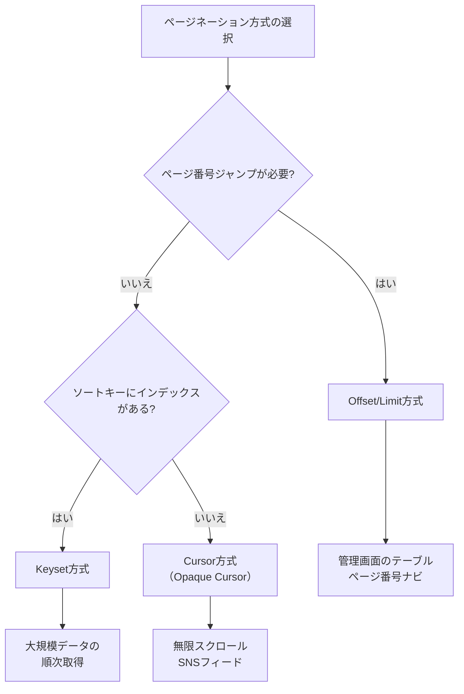

# ページネーション（Pagination）

> **一言で言うと:** 大量データを一度に返さず、小さな塊に分割して取得する仕組み。全件取得が引き起こすレスポンス肥大化・メモリ逼迫・レイテンシ増大を防ぐ、API設計の基本要素。

## なぜ全件取得は破綻するのか

ユーザーテーブルに100万件のレコードがあるとき、`SELECT * FROM users` を実行して全件をJSONで返すと何が起きるか。

| 観点 | 影響 |
|------|------|
| レスポンスサイズ | 1件500Byteとすると約500MB。モバイル回線では転送に数分かかる |
| サーバーメモリ | 100万件分のオブジェクトをメモリに展開する必要がある |
| DB負荷 | テーブルフルスキャン → 他のクエリもブロックされる |
| クライアント | 巨大なJSONのパースでUIがフリーズする |
| [[計算量-BigO\|計算量]] | データ量 n に対してレスポンスサイズ・処理時間が O(n) で線形増加。n が10倍になれば全てが10倍遅くなる |

ページネーションは「必要な分だけ取得する」ことで、1リクエストあたりのコストを O(n) → O(1)（固定ページサイズ）に抑える。

## 3つの方式と比較



### 1. Offset/Limit方式

最も直感的な方式。「n件飛ばしてm件取る」をSQLの `OFFSET` / `LIMIT` で実現する。

```sql
-- 3ページ目（1ページ20件）
SELECT * FROM posts ORDER BY id DESC LIMIT 20 OFFSET 40;
```

```
API: GET /posts?page=3&per_page=20
```

**利点:**
- 任意のページへジャンプ可能（「5ページ目を見る」）
- 実装が最もシンプル
- `total_count` と組み合わせてページ数を表示できる

**欠点:**
- `OFFSET` が大きくなるほど遅くなる（DBが先頭からn行をスキャンする必要がある）
- ページ間でデータの挿入・削除があると重複や欠落が発生する

### 2. Keyset方式（Seek方式）

ソートキーの値を条件にして「この値より後/前のデータ」を取得する。`OFFSET` を使わずインデックスで直接目的の位置に到達するため、データ量に関係なく高速。

```sql
-- 前回の最後のレコード: id=1042
SELECT * FROM posts WHERE id > 1042 ORDER BY id ASC LIMIT 21;
```

**利点:**
- ページの深さに関係なく O(log n) で目的の位置に到達（[[B-TreeとB+Tree]] のツリー探索）
- データの挿入・削除による重複・欠落が発生しない

**欠点:**
- 任意のページへのジャンプができない
- ソートキーにインデックスが必要
- 複合ソートキーの場合、WHERE句が複雑になる

### 3. Cursor方式（Opaque Cursor）

Keyset方式のカーソル値をBase64等でエンコードし、クライアントに「不透明なトークン」として渡す。内部実装を隠蔽する点がKeyset方式との違い。詳細は [[カーソルベースページネーション]] を参照。

```
API: GET /posts?cursor=eyJpZCI6MTA0Mn0&limit=20
レスポンス: { data: [...], next_cursor: "eyJpZCI6MTA2Mn0", has_more: true }
```

**利点:** Keyset方式の利点に加え、カーソルの内部構造を変更してもAPIの互換性を保てる
**欠点:** Keyset方式と同じ制約。カーソルのエンコード/デコード処理が追加される

### 方式比較表

| 観点 | Offset/Limit | Keyset | Cursor (Opaque) |
|------|-------------|--------|-----------------|
| 任意ページジャンプ | 可能 | 不可 | 不可 |
| 大量データの性能 | O(n) で劣化 | O(log n) で安定 | O(log n) で安定 |
| データ整合性 | 挿入/削除で重複・欠落 | 安定 | 安定 |
| 実装の複雑さ | 低い | 中程度 | やや高い |
| API互換性 | 高い | 低い（内部キー露出） | 高い |
| 適したUI | ページ番号ナビ | 順次取得 | 無限スクロール |

## コード例

### TypeScript: 3方式の実装比較

```typescript
import { Pool } from 'pg';

const pool = new Pool();

// --- 1. Offset/Limit方式 ---
async function listByOffset(page: number, perPage: number) {
  const offset = (page - 1) * perPage;
  const { rows: data } = await pool.query(
    'SELECT * FROM posts ORDER BY id DESC LIMIT $1 OFFSET $2',
    [perPage, offset]
  );
  const { rows: [{ count }] } = await pool.query('SELECT COUNT(*) FROM posts');
  return { data, page, per_page: perPage, total: Number(count) };
}

// --- 2. Keyset方式 ---
async function listByKeyset(lastId: number | null, limit: number) {
  const query = lastId
    ? 'SELECT * FROM posts WHERE id < $1 ORDER BY id DESC LIMIT $2'
    : 'SELECT * FROM posts ORDER BY id DESC LIMIT $1';
  const params = lastId ? [lastId, limit + 1] : [limit + 1];
  const { rows } = await pool.query(query, params);

  const hasMore = rows.length > limit;
  const data = hasMore ? rows.slice(0, limit) : rows;
  return { data, next_id: hasMore ? data.at(-1)!.id : null, has_more: hasMore };
}

// --- 3. Cursor方式（Opaque） ---
function encodeCursor(id: number): string {
  return Buffer.from(JSON.stringify({ id })).toString('base64url');
}
function decodeCursor(cursor: string): number {
  return JSON.parse(Buffer.from(cursor, 'base64url').toString()).id;
}

async function listByCursor(cursor: string | null, limit: number) {
  const lastId = cursor ? decodeCursor(cursor) : null;
  const result = await listByKeyset(lastId, limit);
  return {
    data: result.data,
    next_cursor: result.next_id ? encodeCursor(result.next_id) : null,
    has_more: result.has_more,
  };
}
```

### Python: Django REST Framework のページネーション設定

```python
# settings.py — プロジェクト全体のデフォルト設定
REST_FRAMEWORK = {
    # Offset方式をデフォルトに
    "DEFAULT_PAGINATION_CLASS": "rest_framework.pagination.LimitOffsetPagination",
    "PAGE_SIZE": 20,
}

# views.py — ビュー単位でカーソル方式に切り替え
from rest_framework.pagination import CursorPagination
from rest_framework.generics import ListAPIView
from .models import Post
from .serializers import PostSerializer


class PostCursorPagination(CursorPagination):
    page_size = 20
    ordering = "-created_at"  # ソートキー（インデックス必須）
    cursor_query_param = "cursor"


class PostListView(ListAPIView):
    queryset = Post.objects.all()
    serializer_class = PostSerializer
    pagination_class = PostCursorPagination  # このビューだけカーソル方式
```

## よくある落とし穴

1. **ページネーションを後から追加する困難** — 最初に `GET /users` がページネーションなしで全件を返すAPIとしてリリースされると、後からページネーションを追加するのは破壊的変更になる。コレクションを返すエンドポイントは**最初からページネーション付きで設計する**のが鉄則。

2. **`COUNT(*)` のコスト** — Offset方式で「全X件中Y件を表示」とするために毎回 `COUNT(*)` を実行すると、大きなテーブルではこれ自体がボトルネックになる。PostgreSQLでは `COUNT(*)` がテーブルフルスキャンになる（MVCCの制約）。概算値で十分なら `pg_class.reltuples` を使う手もある。

3. **`per_page` の上限を設けない** — クライアントが `?per_page=1000000` を指定すると事実上の全件取得になる。サーバー側で上限（例: 100件）を強制する。

4. **Offset方式の「最終ページ問題」** — 10万件のデータに対して `?page=5000&per_page=20` を要求されると、DBは99,980行をスキャンしてから20行を返す。悪意あるクライアントや検索エンジンのクローラによって意図せず負荷が集中する。

## 関連トピック

- [[API設計-REST-GraphQL]] — 親トピック。ページネーションはAPI設計において最初に決めるべき設計要素の一つ
- [[カーソルベースページネーション]] — Cursor方式の詳細な実装パターン（Relay Connection仕様、複合ソートキー、各言語の実装例）
- [[計算量-BigO]] — 全件取得が O(n) である理由と、ページネーションが O(1) に抑える仕組み
- [[パフォーマンス最適化]] — ページネーションはデータ量に起因するパフォーマンス問題の基本的な解決策
- [[B-TreeとB+Tree]] — Keyset/Cursor方式が O(log n) で動作する理由はインデックスのツリー構造に由来する
