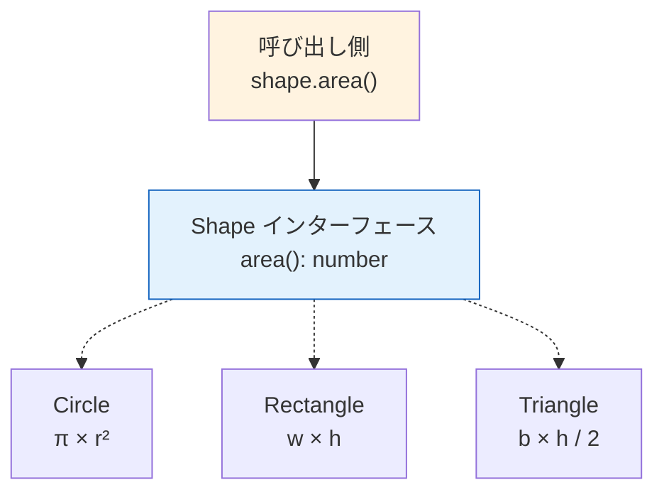
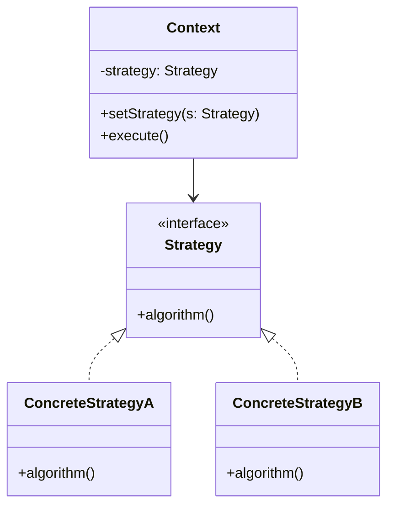
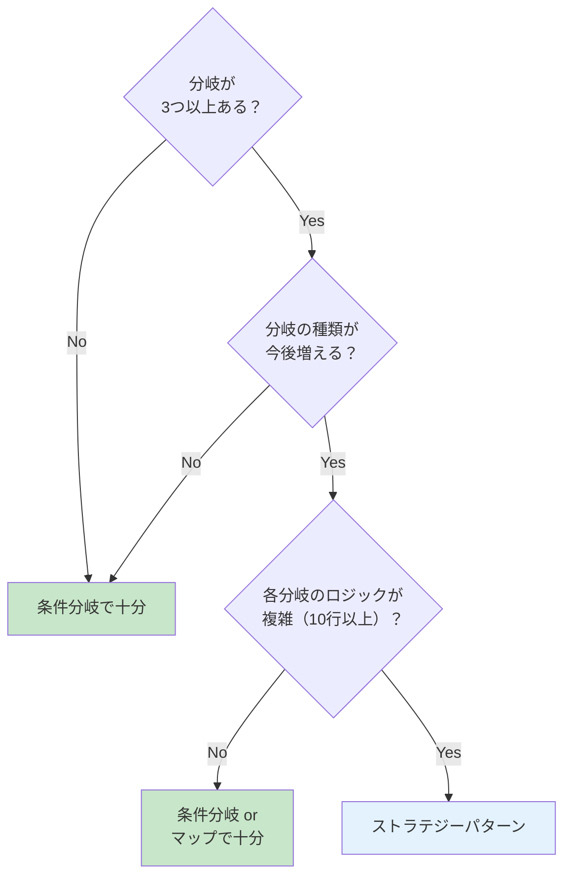

# ポリモーフィズムとストラテジーパターン（Polymorphism & Strategy Pattern）

> **一言で言うと:** ポリモーフィズム（多態性）は「同じインターフェースで異なる振る舞いを実行できる」性質。ストラテジーパターンはこれを活用し、アルゴリズムや振る舞いをオブジェクトとして差し替え可能にするデザインパターン。[[SOLID原則]]の開放閉鎖原則（OCP）を実現する最も基本的な手法。

## 概念

### ポリモーフィズムとは

ポリモーフィズム（Polymorphism）は「多くの形態」を意味するギリシャ語に由来する。同じメソッド呼び出しに対して、実行時のオブジェクトの型に応じて異なる振る舞いが実行される仕組み。



**ポリモーフィズムの種類:**

| 種類 | 説明 | 例 |
|------|------|-----|
| サブタイプ多態性 | インターフェースや親クラスを通じた振る舞いの差し替え | `interface Shape` を実装する各図形 |
| パラメトリック多態性 | ジェネリクスによる型の抽象化 | `Array<T>`, `Promise<T>` |
| アドホック多態性 | 関数オーバーロード、演算子オーバーロード | `+` が数値の加算にも文字列結合にもなる |

本ドキュメントでは、設計パターンとして最も重要な**サブタイプ多態性**を中心に扱う。

### ストラテジーパターンとは

GoF デザインパターンの1つ。**振る舞い（アルゴリズム）をオブジェクトとしてカプセル化**し、実行時に差し替え可能にする。



**ストラテジーパターンが解決する問題:**

```typescript
// ❌ 条件分岐の増殖 — 新しい種類を追加するたびに既存コードを修正（OCP 違反）
function calculateShipping(method: string, weight: number): number {
  if (method === "standard") return weight * 100;
  if (method === "express") return weight * 300 + 500;
  if (method === "overnight") return weight * 500 + 1000;
  // ↑ 新しい配送方法を追加するたびにこの関数を修正する
  throw new Error(`Unknown method: ${method}`);
}

// ✅ ストラテジーパターン — 新しい種類はクラスを追加するだけ（OCP 準拠）
interface ShippingStrategy {
  calculate(weight: number): number;
}

class StandardShipping implements ShippingStrategy {
  calculate(weight: number) { return weight * 100; }
}

class ExpressShipping implements ShippingStrategy {
  calculate(weight: number) { return weight * 300 + 500; }
}

// 新しい配送方法の追加 = 新しいクラスの追加。既存コードの修正は不要
class OvernightShipping implements ShippingStrategy {
  calculate(weight: number) { return weight * 500 + 1000; }
}

function calculateShipping(strategy: ShippingStrategy, weight: number): number {
  return strategy.calculate(weight);
}
```

## コード例

### TypeScript — 決済処理のストラテジー

```typescript
// 決済戦略のインターフェース
interface PaymentStrategy {
  pay(amount: number): Promise<PaymentResult>;
  readonly name: string;
}

// 各決済方法の実装
class CreditCardPayment implements PaymentStrategy {
  readonly name = "credit_card";
  constructor(private paymentMethodId: string) {}

  async pay(amount: number): Promise<PaymentResult> {
    const intent = await stripe.paymentIntents.create({
      amount,
      currency: "jpy",
      payment_method: this.paymentMethodId,
      confirm: true,
    });
    return { success: true, transactionId: intent.id };
  }
}

class BankTransferPayment implements PaymentStrategy {
  readonly name = "bank_transfer";

  async pay(amount: number): Promise<PaymentResult> {
    const transfer = await bankApi.createTransfer({ amount, currency: "jpy" });
    return { success: true, transactionId: transfer.id };
  }
}

// 使用側 — どの決済方法かを知らなくてよい
class CheckoutService {
  async checkout(order: Order, payment: PaymentStrategy): Promise<void> {
    const result = await payment.pay(order.total);
    await this.orderRepo.updatePayment(order.id, result);
  }
}
```

### Go — インターフェースによる暗黙的ポリモーフィズム

Go のインターフェースは**暗黙的に満たされる**（`implements` 宣言が不要）。これにより、既存の型に対して後からインターフェースを定義できる。

```go
package main

import "fmt"

// インターフェース定義
type Notifier interface {
	Notify(userID string, message string) error
}

// メール通知
type EmailNotifier struct {
	SMTPHost string
}

func (e *EmailNotifier) Notify(userID string, message string) error {
	fmt.Printf("Email to %s: %s\n", userID, message)
	return nil
}

// Slack通知
type SlackNotifier struct {
	WebhookURL string
}

func (s *SlackNotifier) Notify(userID string, message string) error {
	fmt.Printf("Slack to %s: %s\n", userID, message)
	return nil
}

// 使用側 — Notifier インターフェースにのみ依存
type OrderService struct {
	notifier Notifier
}

func (o *OrderService) Complete(orderID string) error {
	// ... 注文処理 ...
	return o.notifier.Notify("user-123", "注文が完了しました")
}

func main() {
	// 実行時にストラテジーを差し替え
	service := &OrderService{notifier: &SlackNotifier{WebhookURL: "https://..."}}
	service.Complete("order-1")
}
```

### PHP — ストラテジーパターンとDIの組み合わせ

```php
// 割引戦略のインターフェース
interface DiscountStrategy
{
    public function calculate(int $amount): int;
    public function name(): string;
}

class PercentageDiscount implements DiscountStrategy
{
    public function __construct(private float $rate) {}

    public function calculate(int $amount): int
    {
        return (int) ($amount * $this->rate);
    }

    public function name(): string { return 'percentage'; }
}

class CouponDiscount implements DiscountStrategy
{
    public function __construct(private int $value) {}

    public function calculate(int $amount): int
    {
        return min($this->value, $amount); // 商品金額を超えない
    }

    public function name(): string { return 'coupon'; }
}

// 複数のストラテジーを組み合わせる
class CompositeDiscount implements DiscountStrategy
{
    /** @param DiscountStrategy[] $strategies */
    public function __construct(private array $strategies) {}

    public function calculate(int $amount): int
    {
        $total = 0;
        foreach ($this->strategies as $strategy) {
            $total += $strategy->calculate($amount - $total);
        }
        return $total;
    }

    public function name(): string { return 'composite'; }
}
```

### Python — ファーストクラス関数によるストラテジー

Python では関数がファーストクラスオブジェクトのため、クラスを定義せずに関数そのものをストラテジーとして使える。

```python
from typing import Callable

# ストラテジーを関数として定義（クラス不要）
def sort_by_price(products: list[dict]) -> list[dict]:
    return sorted(products, key=lambda p: p["price"])

def sort_by_rating(products: list[dict]) -> list[dict]:
    return sorted(products, key=lambda p: p["rating"], reverse=True)

def sort_by_name(products: list[dict]) -> list[dict]:
    return sorted(products, key=lambda p: p["name"])

# 使用側 — 関数を受け取るだけ
SortStrategy = Callable[[list[dict]], list[dict]]

def display_products(products: list[dict], sort: SortStrategy) -> None:
    for p in sort(products):
        print(f"{p['name']}: ¥{p['price']} ({p['rating']}★)")

# 実行時にストラテジーを選択
products = [
    {"name": "A", "price": 1000, "rating": 4.5},
    {"name": "B", "price": 500, "rating": 4.8},
]
display_products(products, sort_by_rating)
```

## ポリモーフィズム vs 条件分岐 — どちらを選ぶか

ストラテジーパターンが常に正解ではない。[[YAGNI]] の原則に従い、条件分岐が適切な場面もある。



**条件分岐が適切な場面:**
- 分岐が 2-3 個で、今後増えない
- 各分岐のロジックが数行程度
- ドメインロジックではなくインフラ層の単純な振り分け

**ストラテジーパターンが適切な場面:**
- 分岐の種類が今後増えることが見込まれる
- 各分岐のロジックが十分に複雑
- 分岐ごとに異なるテストが必要

## よくある落とし穴

### 1. 2分岐でストラテジーパターンを適用する

```typescript
// ❌ 過剰 — 分岐が2つしかないのにインターフェース + 2クラスは過剰設計
interface Formatter { format(date: Date): string; }
class JapaneseFormatter implements Formatter { /* ... */ }
class EnglishFormatter implements Formatter { /* ... */ }

// ✅ 十分 — シンプルな条件分岐で解決
function formatDate(date: Date, locale: "ja" | "en"): string {
  return date.toLocaleDateString(locale === "ja" ? "ja-JP" : "en-US");
}
```

### 2. ストラテジーの選択ロジックが散在する

ストラテジーの「選択」はアプリケーションの1箇所（ファクトリや DI コンテナの設定）に集約する。各所で `if (type === "A") new StrategyA()` のようなコードが散らばると、OCP の恩恵が失われる。

### 3. 型の網羅性チェックを忘れる

TypeScript では `switch` + `never` 型で、全ケースを網羅していることをコンパイル時に保証できる。

```typescript
type ShippingMethod = "standard" | "express" | "overnight";

function createStrategy(method: ShippingMethod): ShippingStrategy {
  switch (method) {
    case "standard": return new StandardShipping();
    case "express": return new ExpressShipping();
    case "overnight": return new OvernightShipping();
    default:
      // ShippingMethod に新しい値が追加されるとコンパイルエラーになる
      const _exhaustive: never = method;
      throw new Error(`Unknown method: ${_exhaustive}`);
  }
}
```

## AIによる実装のアンチパターン

| アンチパターン | なぜ問題か | 対策 |
|---|---|---|
| 全ての条件分岐をストラテジーパターンに変換 | 2分岐の単純なロジックまでインターフェース化すると、ファイル数とコード量が爆増する | 3分岐以上かつ今後増える見込みがある場合のみ適用 |
| 「念のため」全ストラテジーにフォールバックを追加 | フォールバックが実行されるケースが存在しないなら[[YAGNI|YAGNI 違反]] | 型システムで網羅性を保証し、到達不能コードは書かない |
| Abstract Factory でストラテジーを生成 | ストラテジーの生成にファクトリ階層まで構築すると、追跡困難になる | シンプルなファクトリ関数 or DI コンテナで十分 |

## 関連トピック

- [[SOLID原則]] — OCP（開放閉鎖原則）の実現手段としてのストラテジーパターン。DIP（依存性逆転の原則）はポリモーフィズムが前提
- [[DIコンテナ]] — ストラテジーの選択と注入を管理する仕組み
- [[コンポジションover継承]] — ストラテジーパターンはコンポジション（委譲）の具体的な適用例
- [[YAGNI]] — ストラテジーパターンの適用タイミングの判断基準
- [[テスト戦略]] — ポリモーフィズムにより、テスト時にモック実装を注入できる

## 参考リソース

- *Design Patterns* — GoF（Strategy パターンの原典）
- *Head First Design Patterns* — Eric Freeman 他（ストラテジーパターンを最初に解説する構成で有名）
- *Refactoring* — Martin Fowler（"Replace Conditional with Polymorphism" リファクタリングパターン）
