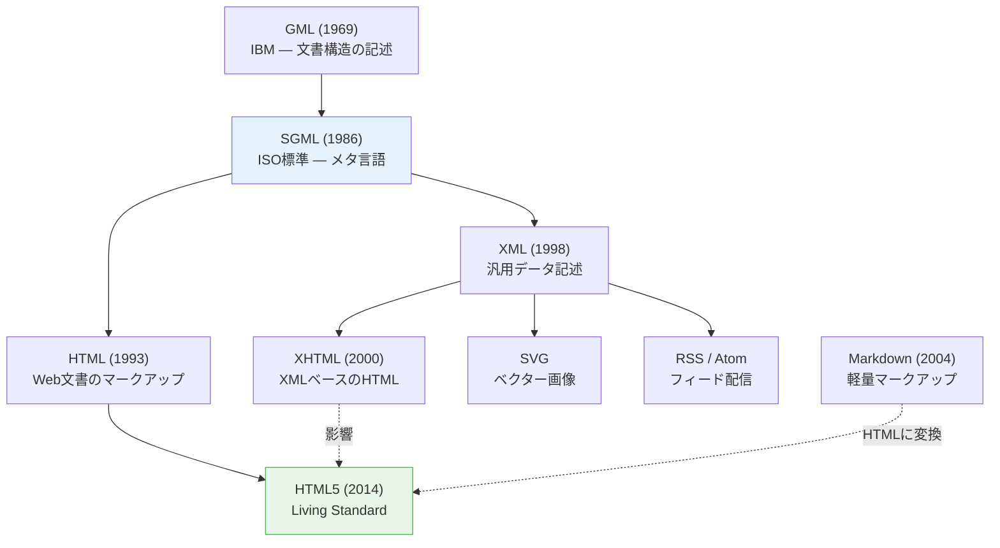

# マークアップ言語とHTML（Markup Language & HTML）

> **一言で言うと:** マークアップ言語とは「文書の構造や意味をタグで注釈する言語」であり、HTMLはその中でもWebブラウザが解釈することに特化した**セマンティックマークアップ言語**である。プログラミング言語ではなく「文書に意味を与える言語」だが、Webの基盤としての重要性はどの言語にも劣らない。

## マークアップ言語とは何か

マークアップ（markup）の語源は印刷業界の「原稿への注釈書き込み」。テキストに**メタ情報（構造・意味・表示方法）**を付加するのがマークアップ言語の本質である。

```
── 生のテキスト ──
Webの歴史
Tim Berners-Leeが1989年に提案した。

── マークアップされたテキスト ──
<h1>Webの歴史</h1>
<p><em>Tim Berners-Lee</em>が<time datetime="1989">1989年</time>に提案した。</p>
```

マークアップは「見た目の指定」ではなく「意味の付与」である。`<h1>` は「大きな文字」ではなく「最上位の見出し」、`<em>` は「イタリック体」ではなく「強調」を意味する。

## マークアップ言語の系譜



### 主要なマークアップ言語の比較

| 言語 | 用途 | 構文の厳密さ | 特徴 |
|------|------|-------------|------|
| **SGML** | メタ言語（言語を定義する言語） | 非常に柔軟 | HTMLとXMLの親。複雑すぎて直接使われることは稀 |
| **HTML** | Web文書の構造 | 寛容（エラー回復あり） | ブラウザが不正なHTMLも「なんとか表示する」 |
| **XML** | 汎用データ記述 | 厳密 | 閉じタグ必須、大文字小文字区別、整形式でなければエラー |
| **XHTML** | XMLベースのHTML | 厳密 | HTMLの寛容さを排し、XML準拠にした試み。HTML5に敗北 |
| **Markdown** | 軽量文書作成 | 非常に緩い | 最終的にHTMLに変換される。READMEやドキュメントで普及 |

## HTMLが他のマークアップ言語と異なる点

### 1. エラー回復（Error Recovery）

HTMLパーサーの最大の特徴は**不正な入力を拒否しない**こと。XMLが1つのタグ閉じ忘れでパースエラーになるのに対し、HTMLブラウザは壊れたマークアップも「最善の推測」で表示する。

```html
<!-- このHTMLは文法的に壊れている -->
<p>段落1
<p>段落2
<div><span>閉じタグなし</div>

<!-- ブラウザのDOM解釈結果 -->
<!-- <p>段落1</p>                    ← 自動で閉じる -->
<!-- <p>段落2</p>                    ← 自動で閉じる -->
<!-- <div><span>閉じタグなし</span></div> ← 推測して閉じる -->
```

これはWebの設計思想として意図的:「ユーザーにコンテンツを見せること」が最優先。しかし、エラー回復に依存したコードはブラウザ間で異なる解釈を生む可能性がある。

### 2. セマンティクス（Semantics）

HTMLの要素は**見た目ではなく意味**を表現する。同じ見た目を実現できても、意味が異なれば使うべき要素が異なる:

```html
<!-- 見た目は同じだが意味が異なる -->
<b>太字テキスト</b>     <!-- 視覚的な太字。意味的な強調なし -->
<strong>重要テキスト</strong>  <!-- 意味的に重要であることを示す -->

<i>イタリック体</i>       <!-- 視覚的なイタリック -->
<em>強調テキスト</em>     <!-- 意味的な強調 -->

<div>コンテナ</div>       <!-- 意味なし。スタイリング用の汎用コンテナ -->
<section>セクション</section>  <!-- 意味的な区切り -->
```

スクリーンリーダーは `<strong>` を音声の強調で読み上げるが、`<b>` は無視する。検索エンジンは `<nav>` をナビゲーション、`<main>` を主要コンテンツとして解釈する。

### 3. Living Standard

HTML5以降、HTMLは**バージョン番号を持たない「Living Standard」**として継続的に更新されている。WHATWG（Web Hypertext Application Technology Working Group）が仕様を管理し、新しい要素や属性が随時追加される。

これは`<!DOCTYPE html>` の簡素さに表れている:

```html
<!-- HTML4 — DTDを指定する長い宣言 -->
<!DOCTYPE HTML PUBLIC "-//W3C//DTD HTML 4.01//EN"
  "http://www.w3.org/TR/html4/strict.dtd">

<!-- HTML5以降 — バージョン番号なし -->
<!DOCTYPE html>
```

## コンテンツモデル — 要素の配置ルール

HTMLの要素は自由に入れ子にできるわけではない。**コンテンツモデル**（Content Model）が各要素に許可される子要素を定義している:

| カテゴリ | 説明 | 代表的な要素 |
|---------|------|-------------|
| Flow content | 本文中に配置される一般的な要素 | `<div>`, `<p>`, `<table>`, `<form>` |
| Phrasing content | テキストレベルの要素 | `<span>`, `<a>`, `<em>`, `<strong>`, `<code>` |
| Heading content | 見出し | `<h1>`〜`<h6>`, `<hgroup>` |
| Sectioning content | 文書の区切り | `<article>`, `<section>`, `<nav>`, `<aside>` |
| Embedded content | 外部リソースの埋め込み | ``, `<video>`, `<iframe>`, `<canvas>` |
| Interactive content | ユーザー操作を受ける | `<a>`, `<button>`, `<input>`, `<select>` |

```html
<!-- ❌ コンテンツモデル違反 -->
<p>
  <div>pの中にdivは置けない</div>
</p>
<!-- ブラウザは <p> を強制的に閉じてしまう -->

<!-- ❌ インタラクティブ要素の入れ子 -->
<a href="/page">
  <button>ボタン</button>
</a>
<!-- aの中にbuttonは配置できない -->

<!-- ✅ 正しい構造 -->
<div>
  <p>divの中にpは問題ない</p>
</div>
```

## コード例

### TypeScript — DOMParserによるHTMLパース

```typescript
// ブラウザのHTMLパーサーを直接使ってマークアップを解析する例
const html = `
  <article>
    <h1>タイトル</h1>
    <p>本文の<em>強調</em>テキスト</p>
  </article>
`;

const parser = new DOMParser();
const doc = parser.parseFromString(html, 'text/html');

// セマンティクスに基づいてコンテンツを抽出
const title = doc.querySelector('h1')?.textContent;     // "タイトル"
const article = doc.querySelector('article');
const emphasis = doc.querySelectorAll('em');              // 強調された部分のみ取得

console.log(`見出し: ${title}`);
console.log(`強調箇所: ${emphasis.length}件`);

// XMLとしてパースすると厳密なエラーチェックが行われる
const xmlDoc = parser.parseFromString(
  '<root><item>閉じタグなし</root>',
  'application/xml'
);
const error = xmlDoc.querySelector('parsererror');
if (error) {
  console.error('XML パースエラー:', error.textContent);
  // HTML なら表示されるが、XML は拒否される
}
```

### Python — HTMLパースとマークアップの操作

```python
from html.parser import HTMLParser


class SemanticAnalyzer(HTMLParser):
    """HTMLのセマンティック要素を分析する"""

    SEMANTIC_TAGS = {'header', 'nav', 'main', 'article', 'section',
                     'aside', 'footer', 'h1', 'h2', 'h3', 'figure'}
    NON_SEMANTIC_TAGS = {'div', 'span'}

    def __init__(self):
        super().__init__()
        self.semantic_count = 0
        self.non_semantic_count = 0

    def handle_starttag(self, tag, attrs):
        if tag in self.SEMANTIC_TAGS:
            self.semantic_count += 1
        elif tag in self.NON_SEMANTIC_TAGS:
            self.non_semantic_count += 1

    def report(self) -> str:
        total = self.semantic_count + self.non_semantic_count
        if total == 0:
            return "構造要素なし"
        ratio = self.semantic_count / total * 100
        return f"セマンティック率: {ratio:.0f}% ({self.semantic_count}/{total})"


# 悪い例のHTML
bad_html = """
<div class="header"><div class="nav"><div>リンク</div></div></div>
<div class="main"><div class="article"><div>本文</div></div></div>
"""

# 良い例のHTML
good_html = """
<header><nav><a href="/">リンク</a></nav></header>
<main><article><p>本文</p></article></main>
"""

for label, html in [("悪い例", bad_html), ("良い例", good_html)]:
    analyzer = SemanticAnalyzer()
    analyzer.feed(html)
    print(f"{label}: {analyzer.report()}")
    # 悪い例: セマンティック率: 0% (0/7)
    # 良い例: セマンティック率: 100% (4/4)
```

### Ruby — NokogiriによるHTML/XMLの違いの実感

```ruby
require 'nokogiri'

# HTMLパーサー — 壊れたマークアップもエラー回復する
broken_markup = '<div><p>段落<p>次の段落</div>'

html_doc = Nokogiri::HTML.fragment(broken_markup)
puts "HTML解釈:"
puts html_doc.to_html
# <div>
#   <p>段落</p>          ← 自動で閉じタグを補完
#   <p>次の段落</p>
# </div>

# XMLパーサー — 同じ入力でエラーになる
begin
  xml_doc = Nokogiri::XML(broken_markup) { |config| config.strict }
  puts xml_doc.errors  # パースエラーが報告される
rescue Nokogiri::XML::SyntaxError => e
  puts "XMLエラー: #{e.message}"
end

# セマンティック要素の検索
semantic_html = <<~HTML
  <article>
    <header><h1>記事タイトル</h1></header>
    <section>
      <h2>セクション1</h2>
      <p>本文</p>
    </section>
    <footer><time datetime="2026-03-29">2026年3月29日</time></footer>
  </article>
HTML

doc = Nokogiri::HTML.fragment(semantic_html)
headings = doc.css('h1, h2, h3')
puts "見出し構造: #{headings.map { |h| "#{h.name}: #{h.text}" }}"
# ["h1: 記事タイトル", "h2: セクション1"]
```

## よくある落とし穴

### 1. HTMLとXMLを混同する

HTMLとXMLは見た目が似ているが、パースルールが根本的に異なる。HTMLは寛容なエラー回復があり、XMLは厳密に整形式（well-formed）でなければならない。XHTML時代の名残で `<br />` と書く習慣があるが、HTML5では `<br>` で十分（ただし `<br />` もエラーにはならない）。

### 2. 「マークアップ言語だから簡単」と見くびる

HTML自体の構文は単純だが、セマンティクス・アクセシビリティ・コンテンツモデル・フォームの挙動・ブラウザ間の差異などを正しく理解するのは奥が深い。フロントエンド開発の品質は、HTMLの理解の深さに直結する。

### 3. Markdownで十分だと思ってHTMLを学ばない

MarkdownはHTMLの簡易記法にすぎず、最終的にHTMLに変換される。Markdownで表現できない構造（フォーム、テーブルの結合セル、`<details>` による折りたたみ等）を実装するにはHTMLの直接記述が必要。

## 関連トピック

- [[HTML-CSS-JS]] — 親トピック。HTML/CSS/JSの責務分離と設計原則
- [[アクセシビリティ]] — セマンティックHTMLがアクセシビリティの基盤
- [[DOMと仮想DOM]] — HTMLがパースされて生成されるDOMの操作と最適化

## 参考リソース

- [HTML Living Standard (WHATWG)](https://html.spec.whatwg.org/) — HTMLの唯一の公式仕様
- [MDN: HTML要素リファレンス](https://developer.mozilla.org/ja/docs/Web/HTML/Element) — 全要素の用途とコンテンツモデルの解説
- 書籍:『HTML解体新書』（太田良典, 中村直樹）— セマンティクスとアクセシビリティの深掘り
