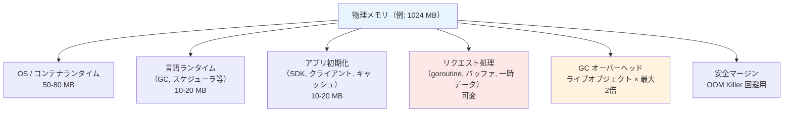
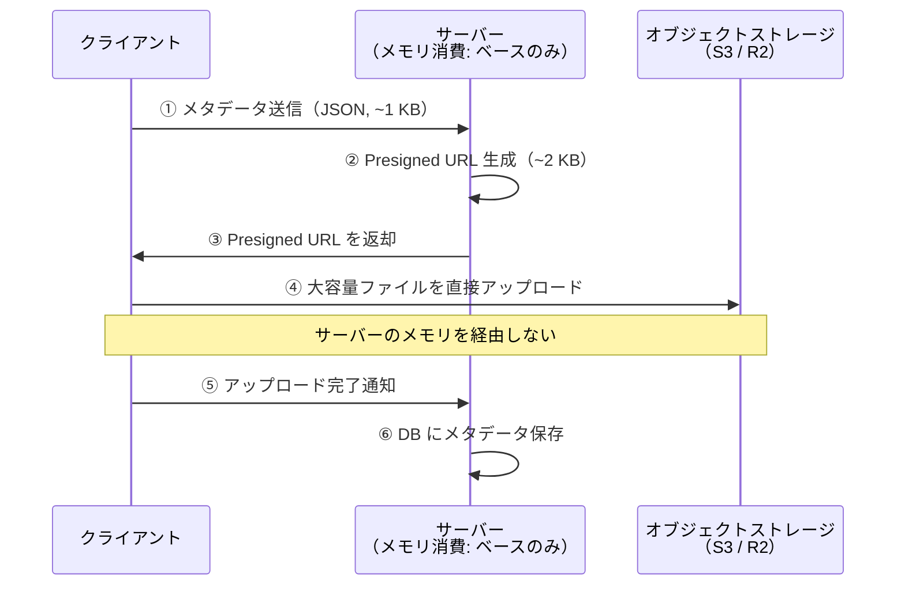

# メモリバジェット分析（Memory Budget Analysis）

> **一言で言うと:** サーバーの物理メモリを「予算」として捉え、ランタイム・アプリ初期化・リクエスト処理・GC オーバーヘッドの各項目に配分することで、OOM（Out of Memory）リスクを事前に見積もる手法。「動くかどうか」ではなく「何が同時に起きたら落ちるか」を定量的に判断できる。

## 概念

### メモリバジェットとは何か

メモリバジェット分析は、アプリケーションのメモリ消費を以下の階層に分解し、利用可能メモリに対する使用率を**机上で見積もる**手法である。



重要なのは**ピーク時の同時消費**を見積もることである。平均値では OOM は防げない。

### なぜ必要か

コンテナ化された現代の Web サービスでは、[[Docker]] の `--memory` や PaaS のプランでメモリ上限が固定される。「とりあえず動かして落ちたらスペックを上げる」ではなく、**事前にどこがボトルネックになるかを見積もり、アーキテクチャレベルで対処する**のがメモリバジェット分析の目的である。

## 分析の手順

### Step 1: ベースメモリを確定する

リクエストが来ていない状態でのメモリ消費を見積もる。

**Go の場合:**

| コンポーネント | 消費量 | 説明 |
|---|---|---|
| Go Runtime（スケジューラ, GC メタデータ, mspan） | 10-20 MB | `runtime.MemStats.Sys` で確認可能 |
| HTTP クライアント / SDK | 5-15 MB | AWS SDK, DB ドライバ等 |
| その他初期化（設定, ロガー等） | 2-5 MB | |
| **合計** | **20-40 MB** | |

**Node.js の場合:**

| コンポーネント | 消費量 | 説明 |
|---|---|---|
| V8 ヒープ初期化 | 20-40 MB | `process.memoryUsage().heapUsed` |
| モジュールロード | 10-30 MB | `require` / `import` した依存の数に比例 |
| **合計** | **30-70 MB** | |

### Step 2: per-request コストを見積もる

通常リクエスト（JSON API）とファイルアップロードでは桁が違う。

通常リクエスト（~20-30 KB）とファイルアップロード（数 MB〜数百 MB）では桁が違うが、さらに見落としやすいのが**画像のデコード後サイズが JPEG サイズの 6-10 倍になる**点である:

```
デコード後メモリ = 幅 × 高さ × 4 bytes（RGBA）

例: iPhone 写真 4032 × 3024
  = 4032 × 3024 × 4
  = 48,770,048 bytes
  ≈ 46.5 MB（元の JPEG は 3-8 MB）
```

### Step 3: GC オーバーヘッドを加算する

GC のある言語では、**ライブオブジェクトの最大 2 倍のヒープ**が必要になる。

**Go（Mark & Sweep）の場合:**
- `GOGC=100`（デフォルト）: 前回 GC 後のヒープと同量の新規確保で次の GC が発火
- つまりライブオブジェクト 50 MB なら、ヒープは最大 100 MB まで膨らむ
- `GOMEMLIMIT`（Go 1.19+）で上限を通知すると、GC がより積極的に動作する

```go
// 環境変数で設定
// GOMEMLIMIT=800MiB

// または runtime で
import "runtime/debug"
debug.SetMemoryLimit(800 * 1024 * 1024)
```

**Node.js（V8 Generational GC）の場合:**
- V8 はヒープ上限に近づくまで GC を積極的に走らせない
- `--max-old-space-size` でヒープ上限を設定（コンテナのメモリ制限より低くする）

### Step 4: シナリオ別にピークを計算する

実際に見積もりを行った例（1 GB メモリのコンテナ、Go アプリ）:

```
利用可能メモリ:                            950 MB
  （1024 MB - OS/コンテナランタイム ~75 MB）
Go Runtime + アプリ初期化:                  30 MB
安全マージン（OOM Killer 回避）:             100 MB
─────────────────────────────────────────
アプリロジックで使える量:                    820 MB
```

| シナリオ | 全ファイル読込 | 処理中ピーク | GC 遅延 | 合計 | 判定 |
|---|---|---|---|---|---|
| 画像 10 枚（逐次） | 100 MB | 105 MB | — | 205 MB | 余裕あり |
| 画像 10 枚（3 並列） | 100 MB | 315 MB | ~100 MB | 515 MB | マージン小 |
| 画像 + 動画（バックエンド経由） | 400 MB | 315 MB | — | 715 MB | OOM 危険 |
| 画像 + 動画（Presigned URL） | 100 MB | 315 MB | — | 415 MB | 余裕あり |

## `[]byte` 全読み込み vs `io.Reader` ストリーミング

メモリバジェットを圧迫する最大の原因は**ファイル全体をメモリに載せる設計**である。

### 問題: `io.ReadAll` / `Buffer` パターン

```go
// ❌ ファイル全体を []byte に読み込む
data, err := io.ReadAll(file) // 100 MB のファイル → 100 MB の []byte

// さらに bytes.Buffer の内部挙動:
// 容量不足のたびに 2 倍のバッファを再確保してコピー
// 100 MB のファイル → 最終バッファ 128 MB
// コピー中の一時的ピーク: 古い 64 MB + 新しい 128 MB = 192 MB
```

### 解決: `io.Reader` ストリーミング

```go
// ✅ ストリーミングでメモリを使わずにアップロード
func UploadStream(ctx context.Context, key string, body io.Reader, size int64, contentType string) error {
    _, err := client.PutObject(ctx, &s3.PutObjectInput{
        Bucket:        aws.String(bucketName),
        Key:           aws.String(key),
        Body:          body,          // io.Reader をそのまま渡す
        ContentLength: aws.Int64(size),
        ContentType:   aws.String(contentType),
    })
    return err
}
// メモリ消費: HTTP 送信バッファ数十 KB のみ（ファイルサイズに依存しない）
```

```typescript
// Node.js でも同様
import { Upload } from "@aws-sdk/lib-storage";
import { createReadStream } from "fs";
import { readFile } from "fs/promises";

// ❌ 全読み込み
const data = await readFile("large-video.mp4"); // 100 MB がメモリに載る

// ✅ ストリーミング
const upload = new Upload({
  client: s3Client,
  params: {
    Bucket: "my-bucket",
    Key: "video.mp4",
    Body: createReadStream("large-video.mp4"), // ストリームで少しずつ読む
  },
});
await upload.done();
```

| 方式 | 100 MB ファイルのメモリ消費 | 特徴 |
|---|---|---|
| `io.ReadAll` / `readFile` | ~128-192 MB | バッファの再確保でピークが膨らむ |
| `io.Reader` / Stream | ~32 KB | ファイルサイズに依存しない |

## Presigned URL: サーバーメモリを使わないアップロード

大きなファイル（動画等）をサーバーのメモリに一切載せずにオブジェクトストレージに直接アップロードする設計パターン。



**バックエンド経由との比較（100 MB 動画 × 3 本）:**

| 方式 | サーバーのメモリ消費 | アップロード速度 |
|---|---|---|
| バックエンド経由 | 300-400 MB | クライアント→サーバー→ストレージ（2 ホップ） |
| Presigned URL | ~数 KB | クライアント→ストレージ（1 ホップ、高速） |

```go
// Presigned URL 生成（Go + AWS SDK v2）
presignClient := s3.NewPresignClient(s3Client)
req, err := presignClient.PresignPutObject(ctx, &s3.PutObjectInput{
    Bucket:      aws.String(bucketName),
    Key:         aws.String(key),
    ContentType: aws.String(contentType),
}, s3.WithPresignExpires(15*time.Minute))
// req.URL をクライアントに返す
```

## メモリ計測の実践

### Go: `runtime.MemStats`

```go
import "runtime"

func logMemStats() {
    var m runtime.MemStats
    runtime.ReadMemStats(&m)
    slog.Info("memory",
        "alloc_mb", m.Alloc/1024/1024,       // 現在のヒープ使用量
        "sys_mb", m.Sys/1024/1024,            // OS から取得した総メモリ
        "heap_objects", m.HeapObjects,         // ヒープ上のオブジェクト数
        "num_gc", m.NumGC,                    // GC 実行回数
    )
}
```

### Node.js: `process.memoryUsage()`

```javascript
const used = process.memoryUsage();
console.log({
  rss: `${Math.round(used.rss / 1024 / 1024)} MB`,
  heapUsed: `${Math.round(used.heapUsed / 1024 / 1024)} MB`,
});
// heapUsed が時間とともに増え続ける → メモリリークの可能性
```

### pprof（Go）によるヒーププロファイル

```go
import _ "net/http/pprof"

// 開発環境のみ
go func() {
    http.ListenAndServe("localhost:6060", nil)
}()
```

```bash
# ヒープダンプ取得
go tool pprof http://localhost:6060/debug/pprof/heap

# アロケーション追跡
go tool pprof -alloc_space http://localhost:6060/debug/pprof/heap
```

## よくある落とし穴

### 1. JPEG サイズでメモリを見積もる

JPEG の圧縮率は 10:1 〜 20:1。5 MB の JPEG を処理すると**デコード後は 47 MB** になる。画像処理パイプラインでは元画像・処理後画像・エンコード結果が同時にメモリに存在し、1 枚で 100 MB を超えることがある。

### 2. GC があれば大丈夫と思う

GC は「参照がなくなったオブジェクト」を**次のサイクルで**回収する。巨大な `[]byte`（100 MB）は参照がなくなっても即座には解放されず、GC トリガー条件（Go の場合はヒープが 2 倍になるまで）を満たすまでメモリに残り続ける。

### 3. 並列処理でスループットを上げようとする

逐次処理のピーク 105 MB が、3 並列にすると 315 MB になる。メモリ制約環境では**並列度を上げるほど OOM リスクが上がる**。スループットの向上はメモリバジェットと相談して並列度を決める必要がある。

### 4. `ParseMultipartForm` の maxMemory を信頼しすぎる

Go の `ParseMultipartForm(maxMemory)` は「メモリに保持する上限」だが、ハンドラで `io.ReadAll` を呼ぶとテンポラリファイルから全データをメモリに読み戻してしまう。maxMemory の設定だけでは安全ではない。

## AIによる実装のアンチパターン

| アンチパターン | なぜ問題か | 対策 |
|---|---|---|
| ファイルアップロードで `io.ReadAll` を使う | ファイルサイズ分のメモリを丸ごと確保する | `io.Reader` / Stream をパイプラインで渡す |
| 画像リサイズで元画像と結果を両方保持する | デコード後の RGBA が数十 MB あり、同時保持でメモリが倍増 | 処理が終わった中間データの参照を速やかに `nil` にする |
| 動画ファイルをバックエンド経由でアップロードする | 数百 MB がサーバーメモリに載る | Presigned URL でクライアントから直接アップロード |
| 並列処理のワーカー数をハードコードする | メモリ制約を考慮せず OOM する | セマフォ（`golang.org/x/sync/semaphore` やバッファ付きチャネル）で並行度を制限し、メモリバジェットに合わせる |

## 関連トピック

- [[メモリ管理]] — ヒープ/スタック、GC の基本概念
- [[メモリリーク]] — 長期運用で顕在化するメモリの問題
- [[メモリ階層とキャッシュ]] — ハードウェアレベルのメモリ構造
- [[ダングリングポインタ]] — 手動メモリ管理の危険性
- [[Docker]] — コンテナのメモリ制限と OOM Killer
- [[コネクションプール]] — 接続管理もメモリバジェットの一部
