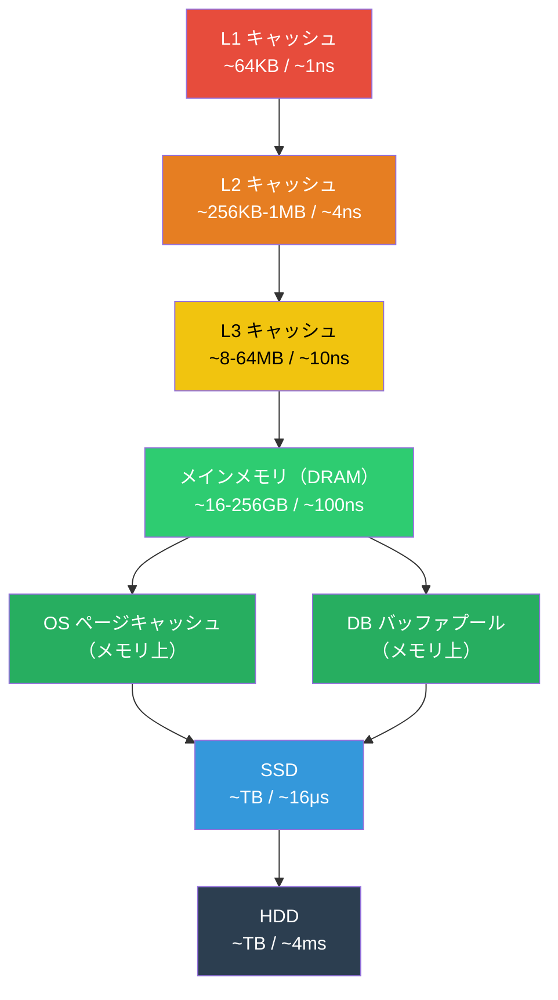
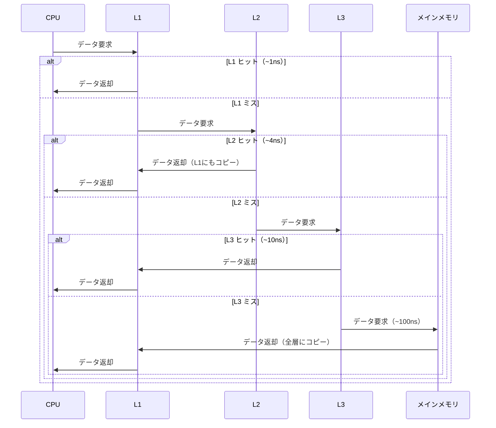
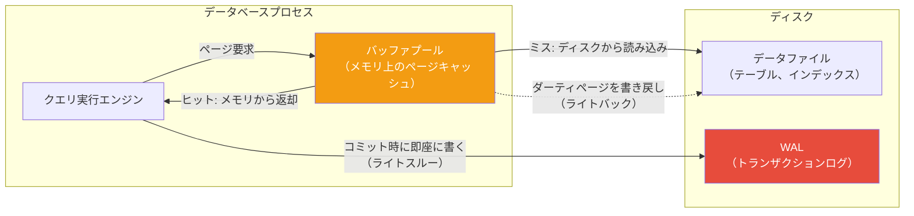

# メモリ階層とキャッシュ（Memory Hierarchy and Caching）

> **一言で言うと:** コンピュータは「小さくて速い記憶」と「大きくて遅い記憶」を多段に積み重ね、頻繁に使うデータを上位層に置くことで速度と容量を両立させている。CPU の L1/L2/L3 キャッシュ、OS のページキャッシュ、DB のバッファプールはすべてこの同じ原理の異なるレイヤーでの適用である。

## メモリ階層の全体像



**核心となる原理 — 参照の局所性（Locality of Reference）：**

キャッシュが効くのは、プログラムのメモリアクセスパターンに偏りがあるから。

- **時間的局所性（Temporal Locality）** — 最近アクセスしたデータは、近いうちにまたアクセスされる可能性が高い（例：ループ内の変数）
- **空間的局所性（Spatial Locality）** — あるアドレスにアクセスしたら、近くのアドレスも間もなくアクセスされる（例：配列の順次走査）

すべてのキャッシュ層は、この局所性を前提として設計されている。

## CPU の L1/L2/L3 キャッシュ

### なぜ CPU にキャッシュが必要か

CPU は 1 クロックサイクル（~0.3ns）で演算できるが、メインメモリ（DRAM）からデータを取得するには約 100ns かかる。キャッシュがなければ、CPU はほとんどの時間をメモリ待ちで浪費する。

| 階層 | 容量（典型値） | レイテンシ | 備考 |
|------|-------------|-----------|------|
| L1 データ | 32-64 KB / コア | ~1 ns（~4 クロック） | コアごとに専用。命令用とデータ用に分離 |
| L2 | 256 KB - 1 MB / コア | ~4 ns（~12 クロック） | コアごとに専用 |
| L3 | 8-64 MB（共有） | ~10 ns（~40 クロック） | 全コアで共有。Intel では LLC（Last Level Cache） |
| メインメモリ | 16-256 GB | ~100 ns（~300 クロック） | DRAM |

### キャッシュの動作原理

CPU がデータを要求すると、L1 → L2 → L3 → メインメモリの順に探索される。上位で見つかれば**キャッシュヒット**、見つからなければ**キャッシュミス**となり下位層から取得する。



### キャッシュライン（Cache Line）

CPU キャッシュはバイト単位ではなく、**キャッシュライン**（通常 64 バイト）単位でデータを転送する。1 バイトだけ必要でも 64 バイトまとめてキャッシュに載る。これは空間的局所性を活用するための設計。

```c
// C — キャッシュラインの影響を体感する例

// ケース1: 連続アクセス（キャッシュフレンドリー）
// 配列の要素は隣接しているため、1回のキャッシュライン読み込みで
// 複数の要素にアクセスできる → 高速
int arr[1024 * 1024];
long long sum = 0;
for (int i = 0; i < 1024 * 1024; i++) {
    sum += arr[i];  // シーケンシャルアクセス
}

// ケース2: ストライドアクセス（キャッシュに非効率）
// 16要素ごと（= 64バイトごと）にアクセスすると
// キャッシュラインの大部分が無駄になる
for (int i = 0; i < 1024 * 1024; i += 16) {
    sum += arr[i];  // 64バイト読み込んで4バイトしか使わない
}
```

### キャッシュと[[ライトバックとライトスルー|書き込み方式]]

CPU キャッシュの書き込みには、[[ライトバックとライトスルー]]で解説した方式がそのまま適用される。

- **ライトバック（現代の CPU の標準）** — L1 に書き込み、メインメモリへの反映は後回し。変更されたキャッシュラインは**ダーティ**としてマークされ、追い出し時にメモリに書き戻す
- **ライトスルー** — L1 とメインメモリに同時に書く。実装がシンプルだが遅い。初期の CPU で使われた

マルチコア環境では、あるコアが書き換えたデータを他のコアが参照する際に**キャッシュコヒーレンシ（Cache Coherence）**が問題になる。MESI プロトコル（Modified / Exclusive / Shared / Invalid）などでコア間のキャッシュ整合性を維持している。

### Web エンジニアが意識すべき場面

CPU キャッシュはハードウェアが自動管理するため、通常はプログラマが直接操作しない。しかし、以下の場面ではキャッシュの挙動がパフォーマンスに直結する。

```go
// Go — 構造体のレイアウトとキャッシュ効率

// Bad: フィールドがバラバラでキャッシュ効率が悪い
// （パディングでメモリを無駄にし、キャッシュラインをまたぎやすい）
type BadLayout struct {
    active bool    // 1 byte + 7 byte padding
    price  float64 // 8 bytes
    count  int32   // 4 bytes + 4 byte padding
    total  float64 // 8 bytes
    flag   bool    // 1 byte + 7 byte padding
}
// sizeof = 40 bytes

// Good: サイズの大きいフィールドから順に並べてパディングを最小化
type GoodLayout struct {
    price  float64 // 8 bytes
    total  float64 // 8 bytes
    count  int32   // 4 bytes
    active bool    // 1 byte
    flag   bool    // 1 byte + 2 byte padding
}
// sizeof = 24 bytes（同じデータで40%削減）
```

```python
# Python — NumPy の行優先 vs 列優先アクセス

import numpy as np
import time

n = 10000
matrix = np.random.rand(n, n)

# 行方向の合計（メモリ上で連続 → キャッシュフレンドリー）
start = time.time()
row_sums = matrix.sum(axis=1)
print(f"行方向: {time.time() - start:.3f}s")

# 列方向の合計（メモリ上で不連続 → キャッシュミスが多い）
start = time.time()
col_sums = matrix.sum(axis=0)
print(f"列方向: {time.time() - start:.3f}s")
# NumPy は C（行優先）レイアウトなので、行方向のほうが速い
```

## データベースのバッファプール（Buffer Pool）

### 概念

バッファプールは、データベースがディスク上のデータページをメモリにキャッシュする仕組み。OS のページキャッシュと役割は似ているが、DB が**自前で管理する**ことで、クエリパターンに最適化されたキャッシュ制御を行う。



### PostgreSQL の shared_buffers

PostgreSQL では `shared_buffers` パラメータでバッファプールのサイズを設定する。デフォルトは 128MB だが、本番環境では**物理メモリの 25% 程度**が推奨される。

```sql
-- PostgreSQL: バッファプールの設定確認
SHOW shared_buffers;           -- バッファプールサイズ
SHOW effective_cache_size;     -- OS キャッシュも含めた推定キャッシュサイズ

-- バッファプールの使用状況を確認（pg_buffercache 拡張が必要）
CREATE EXTENSION IF NOT EXISTS pg_buffercache;
SELECT
    c.relname AS table_name,
    count(*) AS buffers,
    pg_size_pretty(count(*) * 8192) AS buffered_size
FROM pg_buffercache b
JOIN pg_class c ON b.relfilenode = pg_relation_filenode(c.oid)
WHERE b.reldatabase IN (0, (SELECT oid FROM pg_database WHERE datname = current_database()))
GROUP BY c.relname
ORDER BY buffers DESC
LIMIT 10;
```

### MySQL（InnoDB）の Buffer Pool

MySQL/InnoDB では `innodb_buffer_pool_size` でバッファプールサイズを設定する。本番環境では**物理メモリの 50-75%**（専用サーバーでは最大 80%）を割り当てるのが一般的（PostgreSQL より大きいのは、InnoDB が OS のページキャッシュに頼らない設計のため）。

```sql
-- MySQL: バッファプールの設定と状態確認
SHOW VARIABLES LIKE 'innodb_buffer_pool_size';
SHOW STATUS LIKE 'Innodb_buffer_pool%';

-- ヒット率の計算（99% 以上が目標）
SELECT
    (1 - (
        (SELECT VARIABLE_VALUE FROM performance_schema.global_status WHERE VARIABLE_NAME = 'Innodb_buffer_pool_reads')
        /
        (SELECT VARIABLE_VALUE FROM performance_schema.global_status WHERE VARIABLE_NAME = 'Innodb_buffer_pool_read_requests')
    )) * 100 AS hit_rate_pct;
```

### バッファプールと[[ライトバックとライトスルー|書き込み方式]]の関係

データベースのバッファプールは、[[ライトバックとライトスルー]]の「実世界での組み合わせ」そのもの。

| 操作 | 書き込み方式 | 理由 |
|------|-----------|------|
| テーブルデータの更新 | **ライトバック** | バッファプール上で変更し、チェックポイント時にまとめてディスクへ |
| WAL（トランザクションログ） | **ライトスルー** | コミット時に必ず `fsync` でディスクに書く（durability の保証） |
| VACUUM / チェックポイント | バッチ書き出し | ダーティページをまとめてディスクへフラッシュ |

この組み合わせにより、通常の読み書きはメモリ速度で行いつつ、クラッシュ時は WAL から復旧できるという「速度」と「安全性」の両立を実現している。

### なぜ OS のページキャッシュだけでは不十分か

OS のページキャッシュもディスクデータをメモリにキャッシュするが、DB が自前のバッファプールを持つ理由がある。

| 観点 | OS ページキャッシュ | DB バッファプール |
|------|-------------------|-----------------|
| キャッシュ単位 | ページ（4KB） | DB ページ（8KB〜16KB） |
| 退去戦略 | 汎用 LRU | クエリパターンに最適化した LRU（例: フルスキャン時にキャッシュを汚染しない） |
| ダーティページの制御 | OS が任意のタイミングで書き出し | DB がチェックポイントで制御（WAL との整合性を保つ） |
| プリフェッチ | シーケンシャルリード予測 | クエリプランに基づく先読み |
| 二重キャッシュ問題 | — | PostgreSQL は OS キャッシュと二重になる（`O_DIRECT` を使わない設計） |

PostgreSQL は意図的に OS のページキャッシュと二重キャッシュになる設計を採用している（シンプルさ重視）。InnoDB は `O_DIRECT` を使って OS キャッシュをバイパスし、二重キャッシュを回避する。

## Web 開発での実務的な影響

### 1. DB のメモリサイジング

バッファプールのヒット率が低い（< 99%）と、クエリが頻繁にディスクI/O を発生させ、レスポンスタイムが桁違いに遅くなる。

```
ヒット率 99%: 100 ページ要求中 1 回だけディスクアクセス
ヒット率 95%: 100 ページ要求中 5 回ディスクアクセス（ミス回数が5倍）
ヒット率 90%: 100 ページ要求中 10 回ディスクアクセス（ミス回数が10倍）
```

ミス 1 回あたり SSD で ~16μs、HDD で ~4ms のI/O待ちが加算されるため、ミス回数の増加はレスポンスタイムに直結する。

### 2. インデックスとキャッシュの関係

[[インデックス]]はバッファプールに載りやすいサイズであることが重要。インデックスがバッファプールに収まりきらないと、インデックス走査のたびにディスクI/O が発生する。

### 3. ワーキングセット

頻繁にアクセスされるデータの総量（ワーキングセット）がバッファプールより小さければ、ほぼすべてのアクセスがメモリから返される。ワーキングセットがバッファプールを超えると、キャッシュの追い出しが頻発し、性能が急激に劣化する（**クリフ効果**）。

## よくある落とし穴

### 1. shared_buffers を大きくしすぎる

PostgreSQL では `shared_buffers` をメモリの 25% 以上にしても、OS のページキャッシュと競合してかえって遅くなることがある。PostgreSQL は OS キャッシュに頼る設計なので、OS にもメモリを残す必要がある。

### 2. キャッシュヒット率だけを見る

ヒット率 99% でも、残り 1% のミスが秒間数百回あればディスクI/O はボトルネックになる。ヒット率だけでなく、**ミスの絶対数**を監視する。

### 3. 配列のアクセスパターンを無視する

多次元配列を列方向に走査すると、キャッシュラインの恩恵を受けられずに大幅に遅くなる。数値計算やデータ処理では、メモリレイアウト（行優先 / 列優先）を意識する。

### 4. 構造体のパディングを無視する

Go や C で大量の構造体を扱う場合、フィールドの並び順がメモリ使用量とキャッシュ効率に影響する。パフォーマンスクリティカルなコードではフィールドをサイズ降順に並べる。

## 関連トピック

- [[ファイルシステムとIO]] — 親トピック。ページキャッシュとバッファリングの文脈でメモリ階層が登場する
- [[ライトバックとライトスルー]] — キャッシュへの書き込み方式。CPU キャッシュも DB バッファプールもこの方式で動作する
- [[メモリ管理]] — メインメモリの仮想記憶、ページング、メモリ割り当て
- [[インデックス]] — B-Tree インデックスがバッファプールに収まるかどうかがクエリ性能を左右する
- [[VACUUM]] — PostgreSQL のダーティページの書き戻しとチェックポイント処理

## 参考リソース

- *Computer Systems: A Programmer's Perspective*（CS:APP）— Chapter 6: The Memory Hierarchy
- *Operating Systems: Three Easy Pieces* — Chapter 19-23: Virtual Memory
- PostgreSQL ドキュメント — Resource Consumption（`shared_buffers`, `effective_cache_size`）
- MySQL ドキュメント — InnoDB Buffer Pool Configuration
- Brendan Gregg 「Systems Performance」— Memory の章
