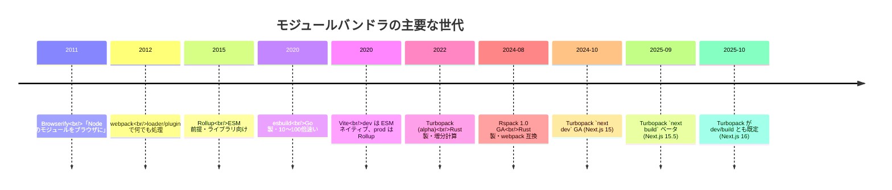
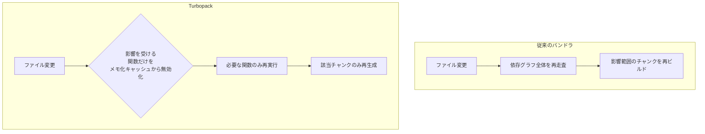

# モジュールバンドラ — webpackとTurbopack（Module Bundlers: webpack vs Turbopack）

> **一言で言うと:** モジュールバンドラはJS/CSS/画像など多数のソースファイルを「ブラウザが効率よく読める形」に変換・結合するツール。webpack（2012年〜）が「設定で何でもできる」標準を作り、Turbopack（2022年〜、Vercel製・Rust製）が「変更箇所だけを再計算する増分アーキテクチャ」で速度を桁違いに引き上げた、という世代交代の関係にある。

## なぜバンドラが必要か — ブラウザのモジュール事情

ブラウザは長らく「JSの依存関係解決」と「大量ファイルの効率配信」に弱かった。

| 課題 | バンドラなしでの状態 | バンドラによる解決 |
|---|---|---|
| 依存関係の解決 | `<script>` を順序通りに並べる必要があり、循環依存が壊れる | `import` グラフを静的解析して順序を自動決定 |
| HTTPリクエスト数 | 100ファイルなら100リクエスト（HTTP/1.1では特に致命的） | 1〜数個のチャンクに統合 |
| 非JSアセット | CSSや画像をJSから参照できない | `import './style.css'` のように扱える（loader経由） |
| 古いブラウザ対応 | 最新JS構文が動かない | Babel等で旧構文へトランスパイル |
| 未使用コードの除去 | バンドルにすべて含まれる | Tree Shaking（後述）で削除 |
| 開発時のリロード | 全ファイルを毎回再読み込み | HMR（Hot Module Replacement）で変更モジュールだけ差し替え |

ESM（ES Modules）がブラウザネイティブで動くようになった現在も、**本番ビルド**では「依存解決＋Tree Shaking＋圧縮＋コード分割」を自動化する道具としてバンドラは不可欠であり続けている。

## バンドラの世代交代 — webpackからTurbopackまで



webpack は「JSで書かれた巨大な設定可能エンジン」、Turbopack は「Rustで書かれた増分計算エンジン」と一文でまとめられる。中間の Vite / esbuild / Rspack はそれぞれ別解を提示している。

## webpackの設計 — Loader と Plugin の万能エコシステム

webpack の本質は「**任意のファイルをモジュールとして扱える変換パイプライン**」である。


- **Loader** — 個別ファイルの変換（`.ts` → `.js`、`.css` → JS文字列、`.svg` → React コンポーネント）。ファイル単位で連鎖適用される
- **Plugin** — ビルドプロセス全体への介入（HTML生成、圧縮、チャンク分割戦略の制御、環境変数注入）
- **Module Federation** — webpack 5 で導入された「複数アプリ間でモジュールを実行時に共有する」仕組み。マイクロフロントエンドの基盤

### webpackの強みと弱み

| 観点 | 評価 |
|---|---|
| 設定の自由度 | ★★★★★ — どんな入力でも処理できる |
| エコシステム | ★★★★★ — 10年以上の蓄積で loader/plugin が網羅的 |
| 学習コスト | ★★ — `webpack.config.js` の長大化で「設定地獄」と揶揄された |
| ビルド速度 | ★★ — JS で書かれており、大規模アプリで数十秒〜数分 |
| HMR 速度 | ★★★ — 工夫すれば速いが、初期化が重い |

webpack が標準だった時代に **CRA（Create React App）** や Next.js のデフォルトビルドが採用されたため、エコシステムは依然として最も厚い。一方で「遅い」「設定が複雑」という不満が次世代ツールを生む土壌になった。

## Turbopackの設計 — 増分計算アーキテクチャ

Turbopack は Vercel が Rust で開発した次世代バンドラで、Next.js 13（2022年10月）でアルファ公開され、Next.js 15（2024年10月）で `next dev` が GA、Next.js 15.5（2025年9月）で `next build --turbopack` がベータ、**Next.js 16（2025年10月）で `next dev` / `next build` 両方の既定バンドラ**となった（webpack を使いたい場合は `--webpack` フラグで明示的にオプトアウトする）。

### 核となるアイデア — Turbo Engine

Turbopack の高速さは「Rust だから」だけでなく、**Turbo Engine** と呼ばれる**関数レベルの増分計算フレームワーク**に由来する。これは webpack やほかの Rust 製バンドラ（Rspack, esbuild）にもない独自の特徴である。



- ビルドの全工程（解析・変換・依存解決・出力）を**純粋関数**として表現する
- 各関数の入力と出力を**永続的にメモ化**する
- ファイルが変更されると、その変更が影響する関数だけを無効化する
- 結果として、初回ビルドは遅くても**2回目以降は変更箇所のコストしかかからない**

これは [[動的計画法|メモ化]] の発想を「ビルドツール全体」に適用したもので、Rust の所有権による並列化と組み合わせて、巨大プロジェクトでも数百ms単位の HMR を実現する。

### Turbopackの強みと弱み

| 観点 | 評価 |
|---|---|
| 速度 | ★★★★★ — 大規模アプリで webpack の 10〜700倍と公称（ただし条件依存） |
| 増分性能 | ★★★★★ — 2回目以降のビルドが圧倒的に速い |
| 設定 | ★★ — 設定可能だが webpack ほど自由ではない |
| エコシステム | ★★★ — Next.js での運用が中心。汎用ビルドツールとしては未成熟 |
| 互換性 | ★★★ — webpack loader 互換は限定的（SWC ベースの独自系） |

**現状の最大の制約:** Turbopack は実質的に **Next.js 専用**である。汎用バンドラとしての CLI や、フレームワーク非依存での利用は 2026 年時点で限定的。webpack のように Vue / Svelte / 任意のSPA で使う用途には Vite や Rspack の方が成熟している。

## webpack vs Turbopack — 判断基準

| 観点 | webpack | Turbopack |
|---|---|---|
| 主な用途 | 任意のフロント/Node ビルド | Next.js のビルド |
| 実装言語 | JavaScript | Rust |
| 設定 | `webpack.config.js`（巨大化しがち） | `next.config.ts` の `turbopack` セクション（最小限） |
| 初回ビルド | 遅い | 中〜速い |
| 増分ビルド | 普通 | 圧倒的に速い |
| Tree Shaking | 成熟 | 成熟（Next.js 16+ で本番安定） |
| Module Federation | 公式サポート | 非対応（2026-04 時点。「remote components」の名で内部実装中） |
| HMR | あり | あり（高速） |
| エコシステム | 巨大（10年蓄積） | Next.js 中心 |

**選び方の指針:**

- **既存の webpack 設定が複雑で動いている** → 無理に移行しない。Rspack（webpack 互換 Rust 実装）への置換も選択肢
- **Next.js 16 以降を使っている** → そのまま使うだけで Turbopack が既定。webpack に戻したい場合だけ `--webpack` でオプトアウト
- **新規 SPA / ライブラリ** → Vite が無難。Vue/Svelte/React どれでも標準的
- **マイクロフロントエンド（Module Federation 必須）** → webpack 5 / Rspack 一択

## コード例

### webpack — 最小構成

```javascript
// webpack.config.js
const path = require('path');
const HtmlWebpackPlugin = require('html-webpack-plugin');

module.exports = {
  mode: 'production',
  entry: './src/index.tsx',
  output: {
    path: path.resolve(__dirname, 'dist'),
    filename: '[name].[contenthash].js',
    clean: true,
  },
  resolve: {
    extensions: ['.tsx', '.ts', '.js'],
  },
  module: {
    rules: [
      { test: /\.tsx?$/, loader: 'ts-loader', exclude: /node_modules/ },
      { test: /\.css$/, use: ['style-loader', 'css-loader'] },
      { test: /\.(png|svg|jpg)$/, type: 'asset/resource' },
    ],
  },
  plugins: [
    new HtmlWebpackPlugin({ template: './public/index.html' }),
  ],
  optimization: {
    splitChunks: { chunks: 'all' }, // ベンダーコードを別チャンクに
  },
};
```

`[contenthash]` は内容ベースのハッシュ。CDN キャッシュと併用して「変更がなければ同じURL」を保証する基本パターン。

### Turbopack — Next.js での利用

```typescript
// next.config.ts
import type { NextConfig } from 'next';

const config: NextConfig = {
  // Next.js 16 以降は dev/build の双方で Turbopack が既定。
  // webpack に戻すには `next dev --webpack` / `next build --webpack`
  turbopack: {
    rules: {
      // SVG を React コンポーネントとして読み込む例
      '*.svg': {
        loaders: ['@svgr/webpack'],
        as: '*.js',
      },
    },
    // モジュール解決のエイリアス
    resolveAlias: {
      '@': './src',
    },
  },
};

export default config;
```

```json
// package.json — Next.js 16 以降は Turbopack が既定なのでフラグは不要
{
  "scripts": {
    "dev": "next dev",
    "build": "next build",
    "start": "next start"
  }
}
```

```json
// package.json — webpack に戻したいときだけ明示的にオプトアウト
{
  "scripts": {
    "dev": "next dev --webpack",
    "build": "next build --webpack"
  }
}
```

設定量を見比べると、Turbopack 側は「Next.js が大半を引き受ける」ため極端に少ない。これが「設定地獄からの脱却」と評される理由でもあり、同時に「webpack のような自由度はない」という制約の裏返しでもある。

### Tree Shaking が効くコードと効かないコード

両者で本質は同じだが、ESMの静的構造に依存する点を理解しておく。

```typescript
// utils.ts
export function used() { return 1; }
export function unused() { return 2; } // バンドルから削除される

// index.ts
import { used } from './utils';
console.log(used());
```

```typescript
// アンチパターン: Tree Shaking が効かなくなる書き方
import * as utils from './utils';     // 名前空間インポートはバンドラが諦めることが多い
const fn = require('./utils').used;   // CommonJS の動的 require は静的解析不可
const name = 'used';
const fn2 = utils[name];              // 動的なプロパティアクセスは追跡不能
```

`package.json` に `"sideEffects": false` を宣言するか、副作用のあるファイルだけを配列で列挙すると、バンドラが安全に未使用 import を削除できるようになる。

## よくある落とし穴

### 1. webpack の設定をコピペで肥大化させる

社内で代々受け継がれた `webpack.config.js` が 500 行を超えるのは典型的なアンチパターン。**今のプロジェクトに本当に必要な loader/plugin だけ**を残し、不要なものは削る。Next.js / Vite / Remix のような統合フレームワークを使えばそもそも自前の webpack 設定は不要になることが多い。

### 2. Turbopack を「速いから」と無理に導入する

Turbopack の真価は **Next.js での開発体験向上**にある。Vue / Svelte / Astro / 純粋な SPA では現状ほぼ使えない。「Rust 製で速い」だけが理由なら、Vite や Rspack のほうが汎用性が高く成熟している。

### 3. Module Federation 前提の設計を Turbopack で組もうとする

Module Federation は webpack 5 固有の機能で、2026-04 時点で Turbopack 公式サポートはない。マイクロフロントエンドが要件なら webpack か Rspack を選ぶ。

### 4. `dynamic import` を使えばコード分割される、と思い込む

`import('./heavy')` は確かに分割の起点になるが、**変数で動的に呼ぶ**と静的解析できずに分割されない。

```typescript
// OK: バンドラが静的解析でチャンクを分離
const mod = await import('./heavy');

// NG: バンドラが何を読むか分からず、最悪すべてバンドルされる
const path = computePath();
const mod = await import(path);
```

webpack のマジックコメント `/* webpackChunkName: "heavy" */` のような細かい制御は Turbopack では自動化されており、ツールごとに挙動が異なる点に注意。

### 5. 「esbuild が一番速いから esbuild でいい」という早合点

esbuild は Go 製で確かに高速だが、**コード分割や CSS 処理が webpack/Vite/Turbopack ほど洗練されていない**。Vite は「dev は esbuild、prod は Rollup」と使い分けることでこの弱点を補っている。単純な速度比較ではなく、用途に合った組み合わせを選ぶ。

### 6. 開発と本番でバンドラを変えてバグる

Vite は dev で ESM ネイティブ、prod で Rollup を使うため、**dev では動くが prod でだけ壊れる**ケースがある（循環依存・副作用の扱いの差など）。CI で必ず `vite build && vite preview` を走らせる、E2E テストを本番ビルドに対して実行する、などの対策が必要。Turbopack も Next.js 15.x の頃は `next dev --turbopack` と従来の webpack による `next build` を混在させていたため同種の問題があり、Next.js 16 で dev/build とも Turbopack が既定になったことで解消の方向にある。

## AIによる実装のアンチパターン

| アンチパターン | なぜ問題か | 対策 |
|---|---|---|
| 既存プロジェクトに `webpack.config.js` を上書き生成する | 既存の loader/plugin 設定を壊して全体を破壊する | 既存設定を読み、差分のみを `module.rules.push` などで足す |
| すべての `import` を `import * as` に変える | Tree Shaking が効かなくなりバンドルサイズが膨れる | 名前付きインポートを優先し、必要なシンボルだけ取り込む |
| `next.config.js` に webpack カスタマイズを書きまくる | Turbopack 移行時に丸ごと動かなくなる | カスタマイズは最小限に。可能なら標準機能で完結させる |
| HMR が効かないと `output.publicPath` 等を闇雲に変更 | 本番ビルドの asset URL が壊れる | dev サーバの設定（`devServer.hot`）と本番出力を分けて考える |
| `babel.config.js` と `tsconfig.json` で重複した変換設定 | 二重トランスパイルで遅延・予期せぬ挙動を生む | TS は `tsc --noEmit` で型チェックのみ、変換はバンドラ側に一任する |

## 実務での使用シーン

- **Next.js プロジェクト** — Next.js 16（2025-10）以降、`next dev` / `next build` の既定バンドラが Turbopack。本番ビルドもそのまま運用可能
- **既存 React/Vue SPA** — webpack の Create React App は廃止傾向。Vite への移行が事実上の標準
- **マイクロフロントエンド** — webpack 5 の Module Federation または Rspack
- **ライブラリ配布** — Rollup または tsup（esbuild ベース）が主流。webpack/Turbopack はアプリ向けに最適化されており、ライブラリ向けには重い
- **モノレポ** — Turborepo（Vercel）+ Turbopack の組み合わせが Next.js モノレポでは強力

## 関連トピック

- [[HTML-CSS-JS]] — 親トピック。バンドラが扱うHTML/CSS/JSの世界
- [[Node.js]] — webpack も Turbopack（CLI）も Node.js 上で動く
- [[CoreWebVitals]] — バンドルサイズとコード分割は LCP/INP に直結する
- [[npmサプライチェーン攻撃事例]] — loader/plugin が悪意あるパッケージだった場合のリスク

## 参考リソース

- [webpack 公式ドキュメント](https://webpack.js.org/)
- [Turbopack 公式ドキュメント](https://turbo.build/pack)
- [Why Turbopack? — Vercel Engineering Blog](https://vercel.com/blog/turbopack-1-0)
- [Vite Guide](https://vite.dev/guide/) — 比較対象として読むと「現代のバンドラ事情」が一望できる
- webpack 作者の **Tobias Koppers** は 2021 年に Vercel に入社し、Turbopack でも中心開発者を務めている — 「webpack 10 年の反省」を踏まえて再設計されたのが Turbopack という背景は理解しておくと面白い
