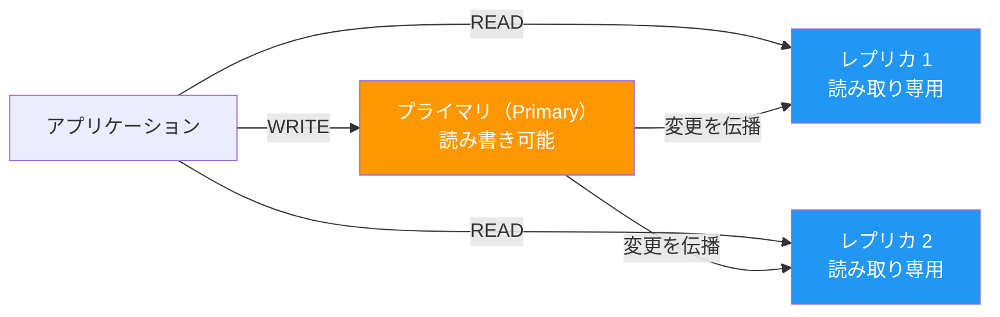
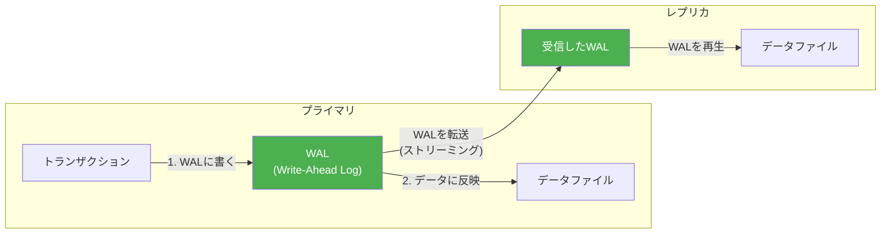
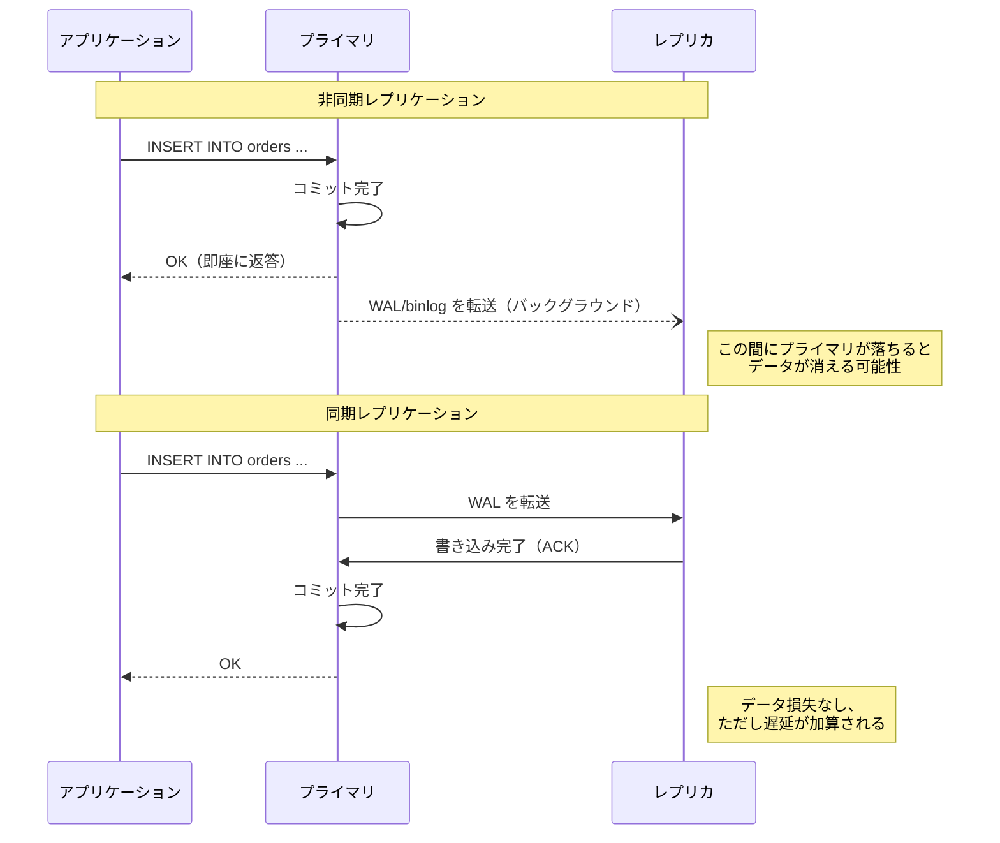
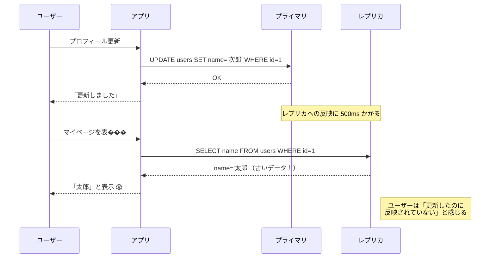

# レプリケーションとレプリケーション遅延（Replication and Replication Lag）

> **一言で言うと:** レプリケーションはプライマリDBの変更をリアルタイムにレプリカ（複製）へ反映する仕組みで、読み取りスケーリングと高可用性を実現する。レプリケーション遅延（Replication Lag）は「書き込み直後にレプリカから読むとデータがない」問題を引き起こす、Webアプリケーション開発で最も遭遇しやすい分散データの落とし穴。

## レプリケーションの基本構造



**なぜ必要か:**
- **読み取りスケーリング** — 読み取り負荷を複数のレプリカに分散する。Webアプリの大半は読み取りが書き込みの10〜100倍
- **高可用性（HA）** — プライマリが停止した際にレプリカをプライマリに昇格させる（フェイルオーバー）
- **災害復旧（DR）** — 地理的に離れた拠点にレプリカを配置する
- **分析クエリの分離** — 重い集計クエリをレプリカで実行し、プライマリの性能に影響を与えない

## PostgreSQLとMySQLのレプリケーション方式

[[PostgreSQLとMySQLの比較]]で触れた通り、レプリケーションの内部方式が異なる。

### PostgreSQL — WALベースのストリーミングレプリケーション



- **物理レプリケーション（デフォルト）** — WALのバイト列をそのまま転送。プライマリとレプリカは完全に同一のデータファイルを持つ
- **論理レプリケーション（10+）** — テーブル単位で変更を選択的に転送。異なるバージョン間やテーブルの一部だけのレプリケーションが可能

```sql
-- PostgreSQL: レプリケーションの状態を確認
SELECT
    client_addr,
    state,
    sent_lsn,
    write_lsn,
    flush_lsn,
    replay_lsn,
    -- 遅延をバイト数で表示
    pg_wal_lsn_diff(sent_lsn, replay_lsn) AS lag_bytes,
    -- 遅延を時間で表示
    replay_lag
FROM pg_stat_replication;
```

### MySQL — binlog ベースのレプリケーション


binlogの形式:

| 形式 | 内容 | 特徴 |
|------|------|------|
| **STATEMENT** | 実行されたSQL文そのもの | サイズが小さいが、非決定的関数（`NOW()`, `RAND()`）で不整合が起きうる |
| **ROW** | 変更された行のbefore/after | 確実だがサイズが大きい。**現在の推奨** |
| **MIXED** | 通常はSTATEMENT、安全でない場合はROW | 自動切替 |

```sql
-- MySQL: レプリケーションの状態を確認
SHOW REPLICA STATUS\G

-- 重要な項目:
-- Replica_IO_Running: Yes        -- I/Oスレッドが動いているか
-- Replica_SQL_Running: Yes       -- SQLスレッドが動いているか
-- Seconds_Behind_Source: 0       -- 遅延秒数（0が理想）
-- Last_Error:                    -- エラーがあれば表示
```

## 同期レプリケーション vs 非同期レプリケーション

| 方式 | 動作 | 整合性 | 性能 |
|------|------|--------|------|
| **非同期（デフォルト）** | プライマリはレプリカの応答を待たずにコミット | レプリカに未反映のデータが存在しうる | 高速 |
| **同期** | プライマリは少なくとも1つのレプリカに書き込まれるまでコミットを待つ | データ損失なし | 遅い（ネットワーク遅延の影響大） |
| **準同期（semi-sync）** | レプリカがbinlogを受信した時点でコミット（適用完了は待たない） | 中間的な保証 | 中間 |



```sql
-- PostgreSQL: 同期レプリケーションの設定
-- postgresql.conf
-- synchronous_standby_names = 'replica1'
-- synchronous_commit = on  -- デフォルト

-- トランザクション単位で切り替えも可能
-- 重要な金融トランザクションだけ同期にする
BEGIN;
SET LOCAL synchronous_commit = 'remote_apply';
INSERT INTO payments (user_id, amount) VALUES (1, 10000);
COMMIT;
```

## レプリケーション遅延（Replication Lag）

非同期レプリケーションでは、プライマリへの書き込みがレプリカに反映されるまでにタイムラグが生じる。通常はミリ秒〜数秒だが、負荷状況やネットワークによっては数十秒以上になることがある。

### 典型的な問題: 「書いた直後に読めない」



### 対策パターン

#### 1. Write-After-Read Routing（書き込み後はプライマリから読む）

```typescript
import { Pool } from "pg";

const primary = new Pool({ connectionString: process.env.PRIMARY_URL });
const replica = new Pool({ connectionString: process.env.REPLICA_URL });

// セッションに「最後に書き込んだ時刻」を記録
interface Session {
  lastWriteAt?: number;
}

function getReadPool(session: Session): Pool {
  // 書き込みから5秒以内はプライマリから読む
  if (session.lastWriteAt && Date.now() - session.lastWriteAt < 5000) {
    return primary;
  }
  return replica;
}

async function updateProfile(session: Session, userId: number, name: string) {
  await primary.query("UPDATE users SET name = $1 WHERE id = $2", [name, userId]);
  session.lastWriteAt = Date.now();
}

async function getProfile(session: Session, userId: number) {
  const pool = getReadPool(session);
  const result = await pool.query("SELECT * FROM users WHERE id = $1", [userId]);
  return result.rows[0];
}
```

#### 2. ORMレベルでの読み書き分離（Ruby on Rails の例）

```ruby
# Rails 6+ の組み込み機能
# config/database.yml
# production:
#   primary:
#     url: postgres://primary-host/mydb
#   primary_replica:
#     url: postgres://replica-host/mydb
#     replica: true

class ApplicationRecord < ActiveRecord::Base
  # HTTP メソッドに基づいて自動で振り分け
  # GET/HEAD → レプリカ、POST/PUT/DELETE → プライマリ
  connects_to database: { writing: :primary, reading: :primary_replica }
end

# コントローラーで明示的に切り替え
class UsersController < ApplicationController
  def update
    ActiveRecord::Base.connected_to(role: :writing) do
      @user = User.find(params[:id])
      @user.update!(user_params)
    end

    # 更新直後は writing ロールから読む
    ActiveRecord::Base.connected_to(role: :writing) do
      redirect_to @user
    end
  end

  def show
    # 通常の参照はレプリカから
    ActiveRecord::Base.connected_to(role: :reading) do
      @user = User.find(params[:id])
    end
  end
end
```

#### 3. Go — 読み書き分離のDBアクセス層

```go
package main

import (
	"context"
	"database/sql"
	"fmt"
	"log"
	"time"

	_ "github.com/lib/pq"
)

// DBCluster はプライマリとレプリカの接続を管理する
type DBCluster struct {
	Primary *sql.DB
	Replica *sql.DB
}

// Session はユーザーセッションの書き込み追跡
type Session struct {
	LastWriteAt time.Time
}

// ReadDB は遅延を考慮して読み取り先を選択する
func (c *DBCluster) ReadDB(session *Session) *sql.DB {
	// 書き込みから5秒以内はプライマリから読む
	if !session.LastWriteAt.IsZero() && time.Since(session.LastWriteAt) < 5*time.Second {
		return c.Primary
	}
	return c.Replica
}

func main() {
	cluster := &DBCluster{}
	var err error

	cluster.Primary, err = sql.Open("postgres", "postgres://primary:5432/mydb?sslmode=disable")
	if err != nil {
		log.Fatal(err)
	}
	cluster.Replica, err = sql.Open("postgres", "postgres://replica:5432/mydb?sslmode=disable")
	if err != nil {
		log.Fatal(err)
	}

	session := &Session{}

	// 書き込み → プライマリ
	_, err = cluster.Primary.ExecContext(context.Background(),
		"UPDATE users SET name = $1 WHERE id = $2", "次郎", 1)
	if err != nil {
		log.Fatal(err)
	}
	session.LastWriteAt = time.Now()

	// 直後の読み取り → プライマリが自動選択される
	db := cluster.ReadDB(session)
	var name string
	err = db.QueryRowContext(context.Background(),
		"SELECT name FROM users WHERE id = $1", 1).Scan(&name)
	if err != nil {
		log.Fatal(err)
	}
	fmt.Printf("Name: %s\n", name) // "次郎"（プライマリから読むので最新）
}
```

## レプリケーション遅延の監視

### PostgreSQL

```sql
-- レプリカ側で遅延を確認
SELECT
    now() - pg_last_xact_replay_timestamp() AS replication_lag;

-- プライマリ側で各レプリカの遅延を確認
SELECT
    client_addr,
    state,
    pg_wal_lsn_diff(pg_current_wal_lsn(), replay_lsn) AS lag_bytes,
    replay_lag
FROM pg_stat_replication;
```

### MySQL

```sql
-- レプリカ側で遅延を確認
SHOW REPLICA STATUS\G
-- Seconds_Behind_Source: 0  -- 遅延秒数

-- Performance Schema で詳細を確認（MySQL 8.0+）
SELECT * FROM performance_schema.replication_applier_status_by_worker;
```

## よくある落とし穴

### 1. レプリケーション遅延を無視した読み書き分離

「レプリカから読めばスケールする」と安易に導入し、「書き込み直後に読めない」問題に遭遇する。特に危険なのは:
- ユーザー登録直後のログイン（ユーザーがレプリカにまだない）
- 決済完了直後の注文確認画面
- ファイルアップロード直後の一覧表示

### 2. 同期レプリケーションの性能影響を過小評価

同期レプリケーションはネットワークのラウンドトリップタイムがコミットに加算される。同じデータセンター内（RTT ~0.5ms）なら影響は小さいが、異なるリージョン間（RTT ~50ms）では致命的な遅延になる。

### 3. フェイルオーバー後のデータ不整合

非同期レプリケーションでプライマリが突然停止した場合、まだレプリカに反映されていないトランザクションが失われる。この「失われるデータの量」は `Seconds_Behind_Source`（MySQL）や `replay_lag`（PostgreSQL）で見積もれる。

### 4. レプリカの台数を増やせばスケールすると思い込む

レプリケーションはプライマリの**書き込み負荷はスケールしない**。全てのレプリカがプライマリと同じ書き込みを再生する必要があるため、書き込み負荷が高い場合はシャーディングやCQRSを検討する。

## 関連トピック

- [[RDB]] — 親トピック
- [[PostgreSQLとMySQLの比較]] — レプリケーション方式の違い（WAL vs binlog）
- [[VACUUM]] — PostgreSQLではレプリカでもVACUUMが動作する
- [[ファイルシステムとIO]] — WALはfsyncでディスクに永続化される
- [[キャッシュ戦略]] — レプリケーション遅延が許容できない場合、キャッシュで整合性を補う手法もある

## 参考リソース

- [PostgreSQL: High Availability, Load Balancing, and Replication](https://www.postgresql.org/docs/current/high-availability.html) — 公式ドキュメント
- [MySQL: Replication](https://dev.mysql.com/doc/refman/8.0/en/replication.html) — 公式ドキュメント
- 『Designing Data-Intensive Applications』（Martin Kleppmann著） — Chapter 5 "Replication" がレプリケーションの理論と実践を包括的に解説
