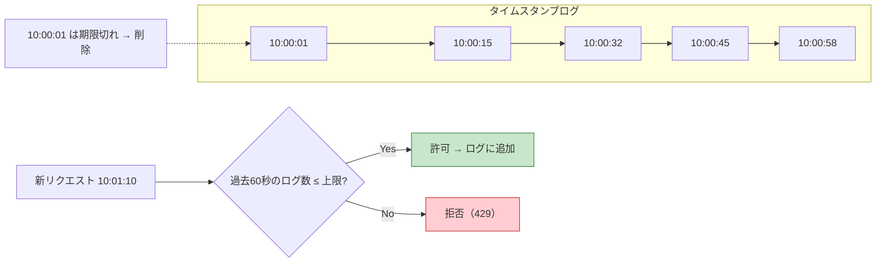
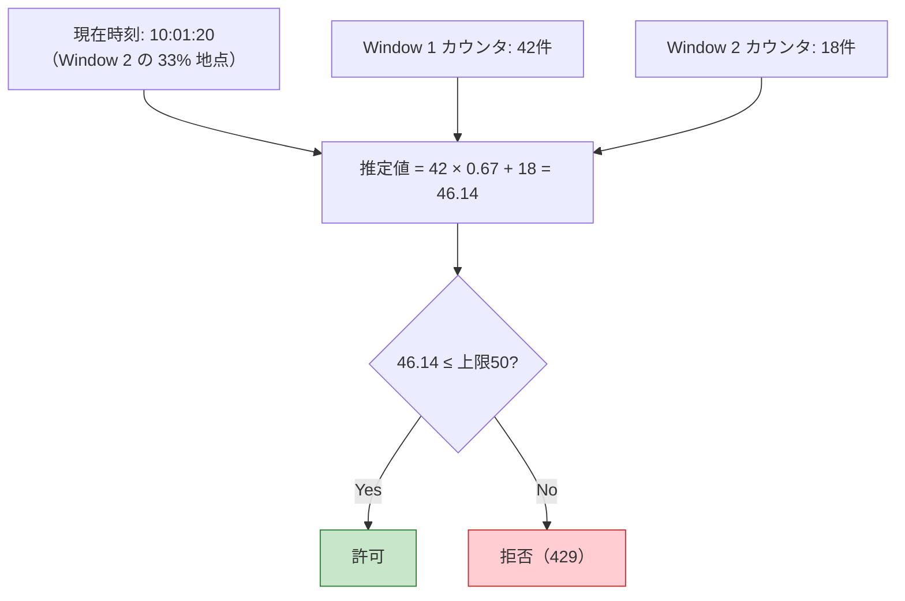
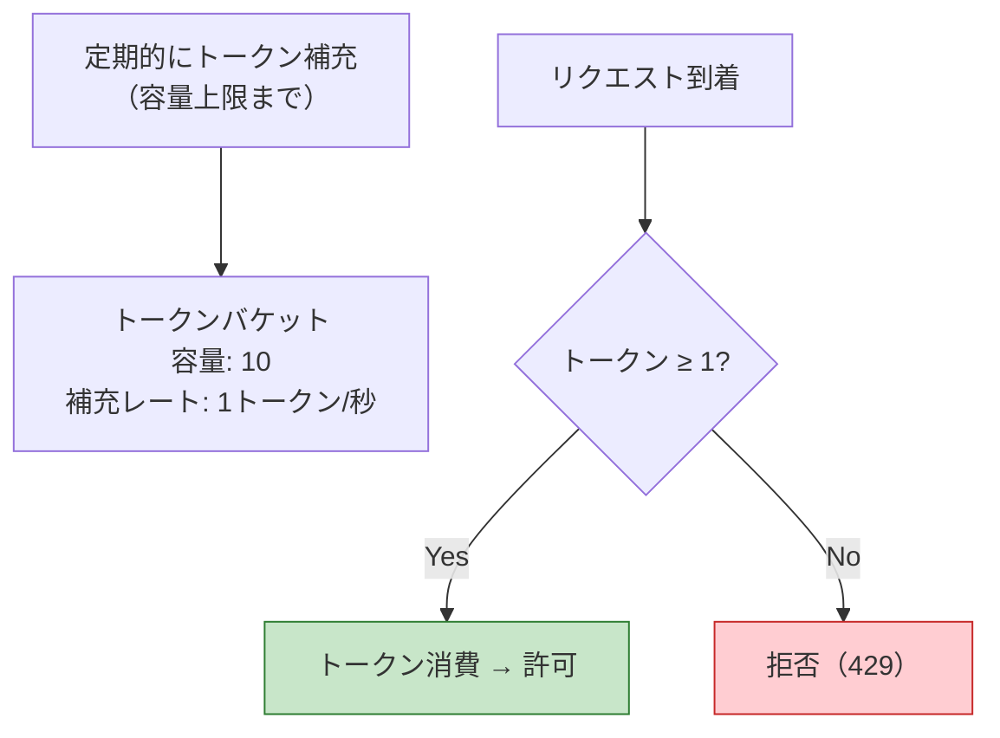
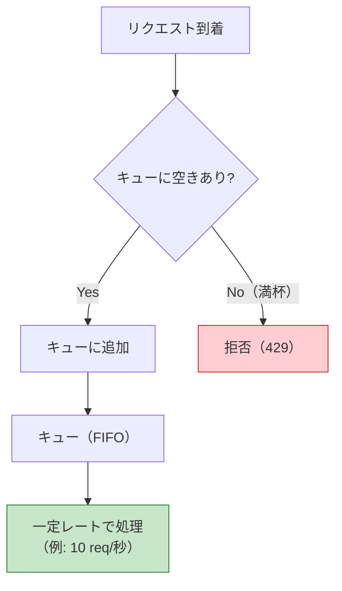
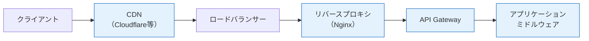
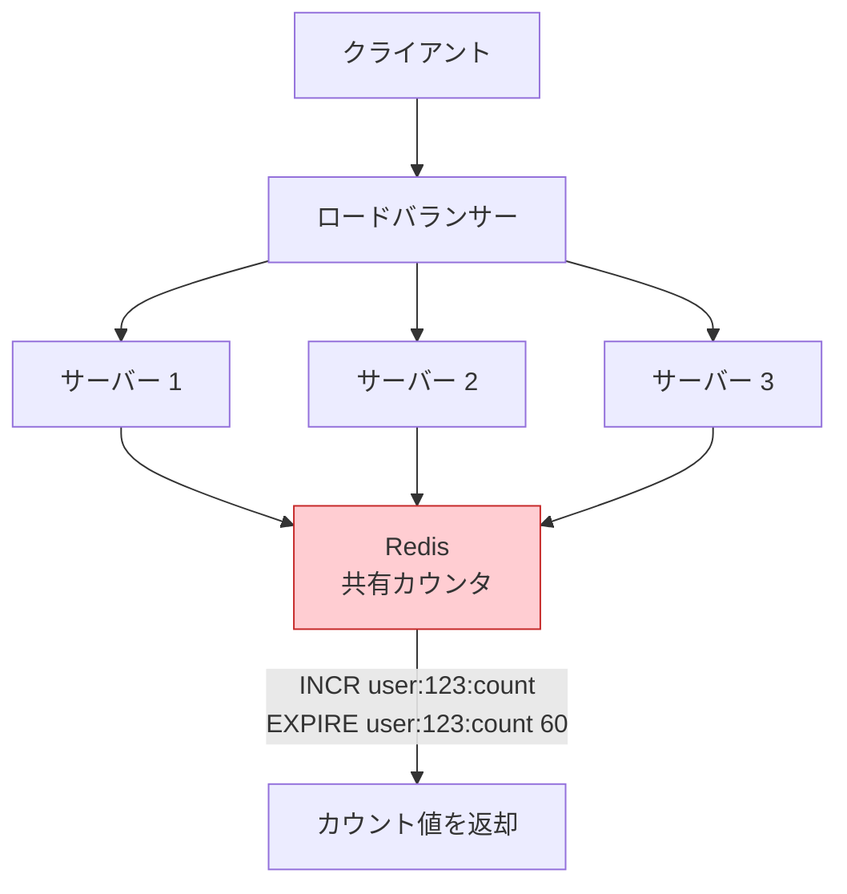

# レート制限（Rate Limiting）

> **一言で言うと:** レート制限は一定時間内のリクエスト数を制限する仕組みで、DoS攻撃の緩和、API乱用の防止、インフラコストの保護、ユーザー間の公平性確保を担う。[[ルーティングとミドルウェア|ミドルウェア]]として実装されることが多く、分散環境では[[MemcachedとRedis|Redis]]を使った共有カウンタが標準的な手法となる。

## なぜ必要か

レート制限が存在しない API は以下のリスクに晒される。

| リスク | 説明 |
|--------|------|
| DoS / DDoS 攻撃 | 大量リクエストでサーバーリソースを枯渇させられる |
| API 乱用 | スクレイピングや自動化ツールによる過剰なアクセス |
| コスト爆発 | クラウド環境ではリクエスト数が直接課金に影響する |
| 不公平なリソース占有 | 一部ユーザーが帯域を独占し、他のユーザーの体験が悪化する |
| カスケード障害 | バックエンドの DB やマイクロサービスに過負荷が連鎖する |

## 主要アルゴリズムの比較

### Fixed Window（固定ウィンドウ）

時間を固定長のウィンドウ（例: 1分間）に区切り、ウィンドウ内のリクエスト数をカウントする。最もシンプルだが、ウィンドウ境界で瞬間的に2倍のリクエストが通過する「バーストの境界問題」がある。

```mermaid
gantt
    title Fixed Window — ウィンドウ境界のバースト問題
    dateFormat X
    axisFormat %s秒

    section Window 1（0-60秒）
    リクエスト50件（後半に集中） :done, 30, 60

    section Window 2（60-120秒）
    リクエスト50件（前半に集中） :done, 60, 90

    section 問題
    30秒間に100件通過（制限50/分なのに） :crit, 30, 90
```



**特徴:** 実装が最も簡単。メモリ消費が少ない（ウィンドウごとにカウンタ1つ）。境界問題が許容できるなら十分実用的。

### Sliding Window Log（スライディングウィンドウログ）

個々のリクエストのタイムスタンプをすべて記録し、現在時刻から過去N秒のリクエスト数を正確にカウントする。境界問題は解消されるが、メモリ消費が大きい。



**特徴:** 正確だがメモリ使用量がリクエスト数に比例する。Redis の Sorted Set で実装するのが一般的。

### Sliding Window Counter（スライディングウィンドウカウンタ）

Fixed Window と Sliding Window Log の折衷案。現在のウィンドウと直前のウィンドウのカウンタを重み付けで合算する。



**特徴:** 精度と効率のバランスが良い。メモリはウィンドウ2つ分のカウンタのみ。Cloudflare などの大規模サービスで採用。

### Token Bucket（トークンバケット）

バケットに一定レートでトークンが追加され、リクエストごとにトークンを消費する。バケットが空なら拒否。バースト（一時的な大量リクエスト）を許容しつつ、平均レートを制限できる。



**特徴:** AWS API Gateway、Google Cloud のデフォルトアルゴリズム。バースト対応が必要な場合の第一選択。

### Leaky Bucket（漏れバケット）

リクエストをキュー（バケット）に入れ、一定レートで処理する。バケットが満杯なら拒否。出力レートが完全に均一になる。



**特徴:** 出力が平滑化されるためバックエンドへの負荷が安定する。Nginx の `limit_req` はこのアルゴリズムに基づいている。

### アルゴリズム比較表

| アルゴリズム | メモリ効率 | 精度 | バースト対応 | 実装難易度 | 代表的な採用例 |
|-------------|-----------|------|------------|-----------|-------------|
| Fixed Window | ◎ | △ | × | 簡単 | 小規模 API |
| Sliding Window Log | × | ◎ | × | 中程度 | 高精度が必要な場面 |
| Sliding Window Counter | ○ | ○ | × | 中程度 | Cloudflare |
| Token Bucket | ○ | ○ | ◎ | 中程度 | AWS API Gateway |
| Leaky Bucket | ○ | ○ | △（キュー） | 中程度 | Nginx `limit_req` |

## レスポンスヘッダ

レート制限の状態はHTTPレスポンスヘッダでクライアントに通知する。IETF RFC 6585 で `429 Too Many Requests` が定義され、[draft-ietf-httpapi-ratelimit-headers](https://datatracker.ietf.org/doc/draft-ietf-httpapi-ratelimit-headers/) でヘッダの標準化が進められている。

| ヘッダ | 説明 | 例 |
|--------|------|-----|
| `RateLimit-Limit` | ウィンドウ内の最大リクエスト数 | `100` |
| `RateLimit-Remaining` | ウィンドウ内の残りリクエスト数 | `57` |
| `RateLimit-Reset` | ウィンドウがリセットされるまでの秒数 | `43` |
| `Retry-After` | 429 応答時、再試行までの待機秒数 | `30` |

```http
HTTP/1.1 429 Too Many Requests
Content-Type: application/json
RateLimit-Limit: 100
RateLimit-Remaining: 0
RateLimit-Reset: 43
Retry-After: 43

{"error": "rate_limit_exceeded", "message": "リクエスト上限に達しました。43秒後に再試行してください。"}
```

## 実装場所の選択



| 実装場所 | ユースケース | メリット | デメリット |
|----------|------------|---------|-----------|
| **CDN** | グローバルなDDoS防御 | アプリに到達する前にブロック | 細かい制御が難しい |
| **リバースプロキシ（Nginx）** | インフラレベルの汎用制限 | 高性能、設定変更のみで適用 | ビジネスロジックに基づく制限は困難 |
| **API Gateway** | マイクロサービス全体の統一制限 | サービス横断で一元管理 | 別途インフラが必要 |
| **アプリケーションミドルウェア** | エンドポイントごとの細かい制御 | ビジネスロジックと統合可能 | アプリの負荷になる |

実務では**多層防御**が推奨される。CDN / Nginx でグローバルな制限をかけ、アプリケーション層でエンドポイント単位やユーザー単位の細かい制限を追加する。

## 各言語でのミドルウェア実装例

### TypeScript（Express + express-rate-limit）

```typescript
import express from "express";
import rateLimit from "express-rate-limit";

const app = express();

// グローバルなレート制限
const globalLimiter = rateLimit({
  windowMs: 15 * 60 * 1000, // 15分
  max: 100,                  // ウィンドウあたり100リクエスト
  standardHeaders: true,     // RateLimit-* ヘッダを返す
  legacyHeaders: false,      // X-RateLimit-* は無効化
  message: {
    error: "rate_limit_exceeded",
    message: "リクエスト上限に達しました。しばらく待ってから再試行してください。",
  },
});

// 認証エンドポイント用の厳しい制限
const authLimiter = rateLimit({
  windowMs: 15 * 60 * 1000,
  max: 5,
  keyGenerator: (req) => req.ip ?? "unknown",
});

app.use(globalLimiter);
app.use("/api/auth", authLimiter);

app.get("/api/data", (_req, res) => {
  res.json({ status: "ok" });
});

app.listen(3000);
```

### Go（標準ライブラリ + golang.org/x/time/rate）

```go
package main

import (
	"encoding/json"
	"net/http"
	"sync"

	"golang.org/x/time/rate"
)

// クライアントごとにリミッターを管理
type clientLimiter struct {
	mu       sync.RWMutex
	limiters map[string]*rate.Limiter
	rate     rate.Limit
	burst    int
}

func newClientLimiter(r rate.Limit, burst int) *clientLimiter {
	return &clientLimiter{
		limiters: make(map[string]*rate.Limiter),
		rate:     r,
		burst:    burst,
	}
}

func (cl *clientLimiter) getLimiter(key string) *rate.Limiter {
	cl.mu.RLock()
	limiter, exists := cl.limiters[key]
	cl.mu.RUnlock()
	if exists {
		return limiter
	}

	cl.mu.Lock()
	defer cl.mu.Unlock()
	// ダブルチェック
	if limiter, exists = cl.limiters[key]; exists {
		return limiter
	}
	limiter = rate.NewLimiter(cl.rate, cl.burst)
	cl.limiters[key] = limiter
	return limiter
}

// Token Bucket: 毎秒10リクエスト、バースト上限20
var clients = newClientLimiter(10, 20)

func rateLimitMiddleware(next http.Handler) http.Handler {
	return http.HandlerFunc(func(w http.ResponseWriter, r *http.Request) {
		ip := r.RemoteAddr
		limiter := clients.getLimiter(ip)

		if !limiter.Allow() {
			w.Header().Set("Content-Type", "application/json")
			w.Header().Set("Retry-After", "1")
			w.WriteHeader(http.StatusTooManyRequests)
			json.NewEncoder(w).Encode(map[string]string{
				"error": "rate_limit_exceeded",
			})
			return
		}
		next.ServeHTTP(w, r)
	})
}

func main() {
	mux := http.NewServeMux()
	mux.HandleFunc("/api/data", func(w http.ResponseWriter, r *http.Request) {
		json.NewEncoder(w).Encode(map[string]string{"status": "ok"})
	})

	http.ListenAndServe(":8080", rateLimitMiddleware(mux))
}
```

### PHP（Laravel Throttle ミドルウェア）

```php
<?php
// routes/api.php — Laravel のルート定義

use Illuminate\Support\Facades\Route;
use App\Http\Controllers\DataController;

// throttle:リクエスト数,分数
// 1分あたり60リクエストに制限
Route::middleware('throttle:60,1')->group(function () {
    Route::get('/data', [DataController::class, 'index']);
});

// 認証エンドポイントはより厳しく制限
Route::middleware('throttle:5,15')->group(function () {
    Route::post('/auth/login', [DataController::class, 'login']);
});

// カスタムレート制限 — app/Providers/RouteServiceProvider.php
use Illuminate\Cache\RateLimiting\Limit;
use Illuminate\Support\Facades\RateLimiter;

// boot() メソッド内
RateLimiter::for('api', function ($request) {
    return $request->user()
        ? Limit::perMinute(100)->by($request->user()->id)  // 認証済み: ユーザーIDベース
        : Limit::perMinute(20)->by($request->ip());         // 未認証: IPベース
});

// 429応答時のレスポンスは Laravel が自動的に生成
// X-RateLimit-Limit, X-RateLimit-Remaining ヘッダも自動付与
```

### Ruby（Rack::Attack）

```ruby
# Gemfile
# gem 'rack-attack'

# config/initializers/rack_attack.rb
class Rack::Attack
  # Redis をキャッシュストアに使用（分散環境対応）
  Rack::Attack.cache.store = ActiveSupport::Cache::RedisCacheStore.new(
    url: ENV.fetch("REDIS_URL", "redis://localhost:6379/1")
  )

  # グローバル制限: 1分あたり60リクエスト（IPベース）
  throttle("req/ip", limit: 60, period: 1.minute) do |req|
    req.ip
  end

  # 認証エンドポイント: 15分あたり5リクエスト
  throttle("logins/ip", limit: 5, period: 15.minutes) do |req|
    req.ip if req.path == "/api/auth/login" && req.post?
  end

  # 認証済みユーザーのAPI制限
  throttle("req/user", limit: 100, period: 1.minute) do |req|
    # Warden（Devise）からユーザーIDを取得
    req.env["warden"]&.user&.id
  end

  # 制限超過時のレスポンスをカスタマイズ
  self.throttled_responder = lambda do |matched, _period, _limit, request|
    retry_after = (request.env["rack.attack.match_data"] || {})[:period]
    [
      429,
      {
        "Content-Type" => "application/json",
        "Retry-After" => retry_after.to_s
      },
      [{ error: "rate_limit_exceeded", retry_after: retry_after }.to_json]
    ]
  end
end

# config/application.rb
config.middleware.use Rack::Attack
```

### Python（FastAPI + slowapi）

```python
from fastapi import FastAPI, Request
from slowapi import Limiter, _rate_limit_exceeded_handler
from slowapi.util import get_remote_address
from slowapi.errors import RateLimitExceeded

# IPアドレスをキーとするリミッター
limiter = Limiter(
    key_func=get_remote_address,
    # Redis を使用（分散環境対応）
    storage_uri="redis://localhost:6379/0",
    default_limits=["60/minute"],  # グローバルデフォルト
)

app = FastAPI()
app.state.limiter = limiter
app.add_exception_handler(RateLimitExceeded, _rate_limit_exceeded_handler)


@app.get("/api/data")
@limiter.limit("60/minute")
async def get_data(request: Request):
    return {"status": "ok"}


# 認証エンドポイントはより厳しく
@app.post("/api/auth/login")
@limiter.limit("5/15minutes")
async def login(request: Request):
    return {"token": "..."}


# 認証済みユーザーのIDベース制限
def get_user_id_or_ip(request: Request) -> str:
    user = getattr(request.state, "user", None)
    if user:
        return str(user.id)
    return get_remote_address(request)


@app.get("/api/premium")
@limiter.limit("100/minute", key_func=get_user_id_or_ip)
async def premium_data(request: Request):
    return {"data": "premium"}
```

## 分散環境でのレート制限

単一サーバーではインメモリのカウンタで十分だが、複数サーバー（水平スケーリング）環境ではサーバー間でカウンタを共有する必要がある。[[MemcachedとRedis|Redis]]が事実上の標準。



### Redis を使った Sliding Window Counter の例

```
# Lua スクリプトでアトミックに実行（race condition を防止）
EVAL "
  local key = KEYS[1]
  local window = tonumber(ARGV[1])
  local limit = tonumber(ARGV[2])
  local now = tonumber(ARGV[3])

  -- 期限切れエントリを削除
  redis.call('ZREMRANGEBYSCORE', key, 0, now - window)

  -- 現在のカウント
  local count = redis.call('ZCARD', key)

  if count < limit then
    -- 許可: タイムスタンプを追加
    redis.call('ZADD', key, now, now .. '-' .. math.random(1000000))
    redis.call('EXPIRE', key, window)
    return 0  -- allowed
  else
    return 1  -- denied
  end
" 1 "ratelimit:user:123" 60 100 1679900000
```

## 落とし穴

### IPベースの制限の問題

IPアドレスをキーにしたレート制限は最も一般的だが、以下の状況で正しく機能しない。

| 状況 | 問題 |
|------|------|
| **NAT / CGNAT** | 企業ネットワークやモバイル回線では数百〜数千のユーザーが同一IPを共有する。1ユーザーの制限が全員に波及する |
| **プロキシ / VPN** | プロキシサーバー経由のアクセスは同一IPに見える。`X-Forwarded-For` ヘッダの参照が必要だが、ヘッダの偽装リスクがある |
| **IPv6 のアドレス変動** | クライアントがIPv6プライバシー拡張を使う場合、接続ごとにIPが変わり制限を回避できる |
| **CDN / ロードバランサー背後** | リアルIPの取得に `X-Real-IP` や `X-Forwarded-For` の適切なパースが必要 |

**対策:** 可能な限りIPとユーザーIDの両方でレート制限をかける。未認証リクエストにはIPベースの制限を適用し、認証済みリクエストにはユーザーIDベースの制限に切り替える。

### その他の落とし穴

- **レート制限の粒度が粗すぎる:** 全エンドポイントに同じ制限をかけると、重要なエンドポイント（ログイン、パスワードリセット）への攻撃を防げない。エンドポイントごとに制限値を設定すべき
- **429 レスポンスの情報不足:** `Retry-After` ヘッダがないと、クライアントが即座にリトライして悪循環に陥る
- **ローカルのみのレート制限:** サーバーが複数台ある環境でインメモリのカウンタを使うと、サーバーごとに別カウントになり制限が台数倍に緩和される
- **レート制限自体のコスト:** Redis への問い合わせが全リクエストに追加されるため、Redis の障害やレイテンシがボトルネックになりうる。Redis 障害時にフェイルオープン（許可）かフェイルクローズ（拒否）かのポリシーを事前に決めておく

## Nginx での設定例（参考）

```nginx
http {
    # Leaky Bucket ベースのレート制限
    # $binary_remote_addr をキーに、10MB の共有メモリゾーンを確保
    # rate=10r/s は 100ms に 1 リクエストの均一レート
    limit_req_zone $binary_remote_addr zone=api:10m rate=10r/s;

    server {
        location /api/ {
            # burst=20: 最大20リクエストのバーストを許容（キューイング）
            # nodelay: キュー待ちせず即座に処理（バースト分は即座に通す）
            limit_req zone=api burst=20 nodelay;

            # 429 を返す（デフォルトは 503）
            limit_req_status 429;

            proxy_pass http://backend;
        }
    }
}
```

## 関連リンク

- [[ルーティングとミドルウェア]] — レート制限はミドルウェアの代表的なユースケース
- [[MemcachedとRedis]] — 分散環境でのカウンタ共有に Redis が使われる
