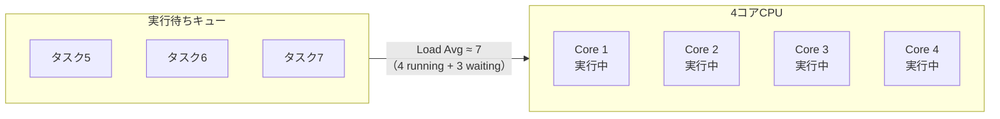
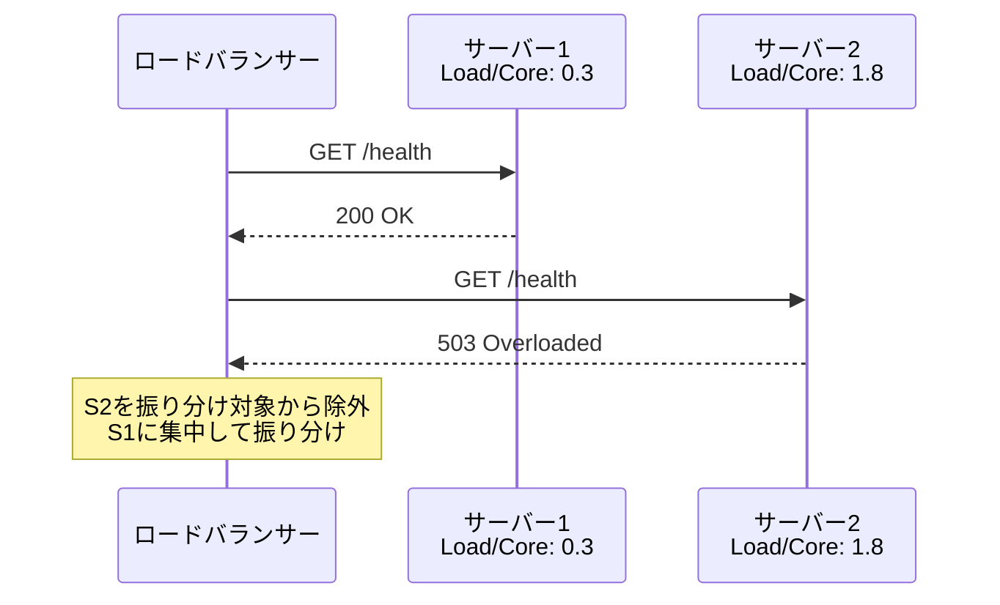

# ロードアベレージとCPU負荷（Load Average & CPU Utilization）

> **一言で言うと:** ロードアベレージは「CPUを使っている＋使いたくて待っているタスクの数」を時間平均した値で、CPU負荷率とは異なる指標。両者を組み合わせて初めてサーバーの本当の負荷状態がわかり、ロードバランサーの振り分け判断やオートスケーリングの閾値設定に直結する。

## ロードアベレージ（Load Average）とは

ロードアベレージは、**実行中（Running）+ 実行待ち（Runnable）+ I/O待ち（Uninterruptible Sleep）のタスク数**を一定期間で平均した値。Linux の `uptime` や `top` で表示される3つの数値は、それぞれ **1分・5分・15分** の指数移動平均（Exponential Moving Average）を表す。

```
$ uptime
 14:32:01 up 42 days, load average: 2.45, 1.80, 1.20
                                     ^^^^  ^^^^  ^^^^
                                     1min   5min  15min
```

### ロードアベレージの読み方

ロードアベレージの「意味」はCPUコア数に依存する:

| コア数 | Load Avg | 状態 |
|--------|----------|------|
| 4コア | 0.5 | 余裕あり（CPU 12.5% 相当の需要） |
| 4コア | 4.0 | ちょうど飽和（全コアがフル稼働） |
| 4コア | 8.0 | 深刻な過負荷（4タスクが常に待ち状態） |
| 1コア | 1.0 | 飽和点 |
| 16コア | 16.0 | 飽和点 |

**判断基準: Load Average ÷ CPUコア数**

| 値 | 状態 |
|----|------|
| < 0.7 | 健全 — 余裕がある |
| 0.7 〜 1.0 | 注意 — そろそろ飽和 |
| > 1.0 | 過負荷 — タスクが待たされている |
| > 2.0 | 深刻 — レスポンス劣化が顕著 |



### Linux 固有の注意: I/O 待ちもカウントされる

Linux のロードアベレージは他のUnix系OSと異なり、**D状態（Uninterruptible Sleep = ディスクI/O待ち等）のタスクもカウント**する。そのため:

- CPUは余裕があるのにロードアベレージが高い → ディスクI/OやNFS待ちが原因の可能性
- CPUバウンドかI/Oバウンドかの切り分けが重要

## CPU負荷率（CPU Utilization）との違い

| 指標 | ロードアベレージ | CPU負荷率（%） |
|------|----------------|---------------|
| **何を測るか** | CPUを要求しているタスクの数 | CPUが実際に使われた時間の割合 |
| **単位** | タスク数（無次元） | パーセント（0〜100%） |
| **I/O待ち** | Linux ではカウントされる | カウントされない（iowait は別枠） |
| **飽和の検知** | 1コアあたり > 1.0 で飽和 | 100% でも待ちがなければ飽和とは限らない |
| **時間粒度** | 1分/5分/15分の平均 | 瞬間値〜秒単位 |

**重要な違い:** CPU負荷率が100%でもロードアベレージが低い場合、CPUはフル稼働しているが待ちは発生しておらず応答時間は劣化していない。逆にCPU負荷率が低いのにロードアベレージが高い場合、I/Oボトルネックの可能性がある。

```
シナリオ1: CPU負荷率 95%, Load Avg/コア = 0.9
  → CPUは忙しいが待ちはほぼない。健全。

シナリオ2: CPU負荷率 40%, Load Avg/コア = 3.0
  → CPUは空いているのにタスクが待っている。I/Oボトルネック。

シナリオ3: CPU負荷率 95%, Load Avg/コア = 4.0
  → CPUも飽和、待ちも大量。スケールアウトが急務。
```

## コード例

### Python — psutil でロードアベレージとCPU負荷を取得

```python
import os
import psutil

# ロードアベレージ（1分, 5分, 15分）
# Windows では os.getloadavg() は利用不可
load1, load5, load15 = os.getloadavg()
cpu_count = os.cpu_count()

print(f"Load Average: {load1:.2f}, {load5:.2f}, {load15:.2f}")
print(f"CPU Cores: {cpu_count}")
print(f"Load/Core (1min): {load1 / cpu_count:.2f}")

# CPU負荷率（全コア平均 + コアごと）
cpu_percent = psutil.cpu_percent(interval=1)
per_cpu = psutil.cpu_percent(interval=1, percpu=True)

print(f"CPU Utilization: {cpu_percent}%")
print(f"Per-core: {per_cpu}")

# ヘルスチェック判定の例
def is_healthy(max_load_per_core: float = 1.5) -> bool:
    load1, _, _ = os.getloadavg()
    return load1 / os.cpu_count() < max_load_per_core
```

### Go — ロードアベレージによるヘルスチェック

```go
package main

import (
	"encoding/json"
	"net/http"
	"runtime"

	"golang.org/x/sys/unix"
)

type HealthResponse struct {
	Status       string  `json:"status"`
	LoadAvg1     float64 `json:"load_avg_1"`
	LoadPerCore  float64 `json:"load_per_core"`
	CPUCores     int     `json:"cpu_cores"`
}

func healthHandler(w http.ResponseWriter, r *http.Request) {
	var info unix.Sysinfo_t
	if err := unix.Sysinfo(&info); err != nil {
		http.Error(w, "failed to get sysinfo", 500)
		return
	}

	// Sysinfo の loads は 65536 倍された整数値
	load1 := float64(info.Loads[0]) / 65536.0
	cores := runtime.NumCPU()
	loadPerCore := load1 / float64(cores)

	resp := HealthResponse{
		LoadAvg1:    load1,
		LoadPerCore: loadPerCore,
		CPUCores:    cores,
	}

	if loadPerCore > 1.5 {
		resp.Status = "overloaded"
		w.WriteHeader(http.StatusServiceUnavailable)
	} else {
		resp.Status = "ok"
		w.WriteHeader(http.StatusOK)
	}

	json.NewEncoder(w).Encode(resp)
}

func main() {
	http.HandleFunc("/health", healthHandler)
	http.ListenAndServe(":8080", nil)
}
```

### TypeScript（Node.js） — ロードアベレージ監視

```typescript
import os from "node:os";

interface ServerLoad {
  loadAvg: [number, number, number];
  loadPerCore: number;
  cpuCount: number;
  isOverloaded: boolean;
}

function getServerLoad(threshold = 1.5): ServerLoad {
  const [load1, load5, load15] = os.loadavg() as [number, number, number];
  const cpuCount = os.cpus().length;
  const loadPerCore = load1 / cpuCount;

  return {
    loadAvg: [load1, load5, load15],
    loadPerCore,
    cpuCount,
    isOverloaded: loadPerCore > threshold,
  };
}

// Express ヘルスチェックでの利用例
// app.get('/health', (req, res) => {
//   const load = getServerLoad();
//   res.status(load.isOverloaded ? 503 : 200).json(load);
// });
```

## ロードバランシングにおける活用

### ヘルスチェックへの組み込み

LBのヘルスチェックにロードアベレージやCPU負荷を含めることで、**過負荷のサーバーへの振り分けを自動的に減らせる**:



### オートスケーリングの閾値

| 条件 | アクション |
|------|-----------|
| CPU負荷率 > 70%（5分平均） | スケールアウト（インスタンス追加） |
| CPU負荷率 < 30%（15分平均） | スケールイン（インスタンス削減） |
| Load/Core > 1.0（5分平均） | スケールアウト（CPU飽和の兆候） |

AWS Auto Scaling ではCPU負荷率（`CPUUtilization`）がデフォルトメトリクスとして使える。ロードアベレージはカスタムメトリクスとしてCloudWatchに送信する必要がある。

## よくある落とし穴

### 1. ロードアベレージだけ見てCPUボトルネックと断定する

前述の通り、Linuxではディスク I/O 待ちもロードアベレージに含まれる。`vmstat` や `iostat` で `wa`（iowait）を確認し、CPU バウンドか I/O バウンドかを切り分ける:

```bash
# vmstat で1秒間隔で監視
$ vmstat 1
procs -----------memory---------- ---swap-- -----io---- -system-- ------cpu-----
 r  b   swpd   free   buff  cache   si   so    bi    bo   in   cs us sy id wa st
 1  4      0 512000  64000 2048000   0    0   800  1200  500  900 10  5 25 60  0
#                                                                         ^^ wa=60%!
# → CPUは15%しか使ってないがI/O待ちが60%。ディスクがボトルネック
```

### 2. CPU負荷率100%を即座に異常と判断する

バッチ処理やビルドサーバーなど、意図的にCPUを使い切る用途では100%が正常。重要なのは「待ちが発生しているか」（ロードアベレージ/コア > 1.0）であり、CPU使用率単体では判断できない。

### 3. 1分平均だけで判断する

ロードアベレージの3つの値にはトレンドが含まれる:

| パターン | 解釈 |
|---------|------|
| 1min > 5min > 15min | 負荷が**上昇中** — 対応が必要 |
| 1min < 5min < 15min | 負荷が**下降中** — 収束に向かっている |
| 1min ≈ 5min ≈ 15min | 負荷が**安定** — 恒常的な状態 |

### 4. コンテナ環境でホストのロードアベレージを見てしまう

Docker/Kubernetes環境では、`/proc/loadavg` はホストOS全体の値を返す。コンテナに割り当てられたCPUリソース（cgroup v2 の `cpu.max`）との比率で判断する必要がある:

```python
import os

def get_container_cpu_limit() -> float:
    """cgroup v2 からコンテナのCPU制限を取得"""
    try:
        with open("/sys/fs/cgroup/cpu.max") as f:
            quota, period = f.read().strip().split()
            if quota == "max":
                return float(os.cpu_count())  # 制限なし
            return int(quota) / int(period)
    except FileNotFoundError:
        return float(os.cpu_count())  # ホスト環境

# コンテナ内ではホストのコア数ではなく割り当て分で判断
cpu_limit = get_container_cpu_limit()
load1 = os.getloadavg()[0]
load_per_allocated_cpu = load1 / cpu_limit
```

## 関連トピック

- [[ロードバランシング]] — 親トピック。ロードアベレージはLBのヘルスチェックやアルゴリズム選択の判断材料
- [[モニタリング]] — ロードアベレージとCPU負荷率はサーバー監視の最も基本的なメトリクス
- [[プロセスとスレッド]] — ロードアベレージの「タスク」はプロセス/スレッドに対応する
- [[シングルコア・マルチコアとスレッドモデル]] — コア数がロードアベレージの解釈に直接影響する
