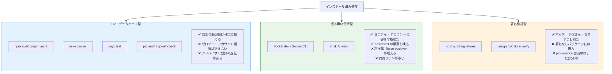

# 依存パッケージの事後検知ツール比較（Dependency Vulnerability Scanners）

> **一言で言うと:** インストール済みの依存パッケージから危険なものを検知するツール群は、検知ロジック（既知 CVE / 振る舞い分析 / 署名検証）と対象エコシステム（npm 単一 / 多言語横断）が異なる。`npm audit` だけでは「公開済みの CVE」しか拾えないため、Socket.dev のような**振る舞い分析系**と、`osv-scanner` のような**横断 CVE 系**を組み合わせるのが実用解。[[minimum-release-age（公開後待機期間）]] が「公開直後の侵害版を取りに行かない」前段防御だとすれば、事後検知は「すり抜けたものを実行前に止める」最終ライン。

## なぜ事後検知が必要か

[[minimum-release-age（公開後待機期間）]] や `--ignore-scripts` のような前段防御は強力だが、以下のケースを取りこぼす:

1. **休眠マルウェア** — 攻撃者が無害なバージョンを長期間公開しておき、待機期間を超えてから悪用するパターン（npm worm 系で観測）
2. **既存依存に後から CVE が判明** — インストール時点では問題なくても、後日脆弱性が公開されることがある（Log4Shell が典型）
3. **lockfile を介した間接侵害** — 自分は最新を取りに行かなくても、推移的依存（Transitive Dependency）の更新で危険なパッケージが入り込む
4. **設定ミス・例外フラグでの抜け道** — チームメンバーが急いで `--ignore-minimum-release-age` を使った直後に侵害版を踏むケース

つまり**前段防御は「確率を下げる」**もので、**事後検知は「実行前にもう一度ふるいにかける」**役割を担う。両者は別の防御層であり、片方では完結しない。

> [!info] 用語ミニ辞典
> - **CVE（Common Vulnerabilities and Exposures）**: 既知の脆弱性を一意に識別する番号（例: CVE-2021-44228 = Log4Shell）。MITRE が採番する世界標準
> - **CVSS（Common Vulnerability Scoring System）**: 脆弱性の深刻度を 0.0〜10.0 で表すスコア。7.0 以上を High、9.0 以上を Critical とするのが慣習
> - **OSV.dev**: Google が運営する脆弱性データベース。npm / PyPI / Go / Cargo / Maven などのエコシステムを横断して脆弱性情報を集約。`osv-scanner` がこのデータを参照する
> - **GitHub Advisory Database (GHSA)**: GitHub が運営する脆弱性 DB。`npm audit` / Dependabot のバックエンド
> - **行動分析（Behavioral Analysis）**: パッケージの postinstall や実行コードを静的・動的に解析して「環境変数を読む」「外部 HTTP を叩く」など疑わしい振る舞いを検知するアプローチ。CVE 登録を待たない
> - **SBOM（Software Bill of Materials）**: ソフトウェアに含まれる全コンポーネントの一覧。SPDX / CycloneDX などのフォーマットがあり、規制対応で必須化されつつある

## 検知の 3 つのアプローチ

事後検知ツールは大きく 3 つのアプローチに分類できる。**カバーできるリスクが異なる**ので、用途で選ぶ・併用するのがポイント。



「CVE 型だけ」では Axios のような**アドバイザリ未登録の新しい侵害**が拾えない（Socket.dev は Axios インシデントを公開数分で警告した）。一方「振る舞い型だけ」では Log4Shell（CVE-2021-44228）のような**正規パッケージのコードロジック脆弱性**が拾えない — Log4j 自体は信頼できるメンテナによる正規パッケージなので、「外部 HTTP を叩く」「postinstall で怪しいことをする」といった振る舞い指標には引っかからない。両者は**カバーする脅威の種類が違う**ため、**最低でも CVE 型 1 つ + 振る舞い型 1 つの併用**が、コミュニティのおおむねの合意となっている。

## 主要ツールの詳細

### `npm audit` / `pnpm audit` — 最低ライン

GitHub Advisory Database を参照する CVE スキャン。**npm をインストールすれば標準で使える**ので、まず最初に有効化すべき。

```bash
# 全脆弱性を表示
npm audit

# CI で High 以上があれば失敗させる（推奨）
npm audit --audit-level=high

# JSON 出力でパースして処理
npm audit --json | jq '.metadata.vulnerabilities'

# pnpm 版
pnpm audit --audit-level=high
```

**長所:** ゼロ追加コスト、lockfile ベースで正確、CI で1行追加するだけ
**短所:** GitHub Advisory DB に登録された CVE のみ、登録には数日〜数週間のラグがある

### `osv-scanner`（Google）— 多言語横断

OSV.dev を参照するスキャナ。**npm / PyPI / Go / Cargo / Maven / RubyGems を 1 ツールでカバー**するため、モノレポや多言語プロジェクトで強力。Go 製シングルバイナリで配布が楽。

```bash
# プロジェクト全体をスキャン（lockfile を自動検出）
osv-scanner scan source .

# 特定の lockfile を指定
osv-scanner scan source --lockfile=pnpm-lock.yaml --lockfile=requirements.txt

# Docker イメージをスキャン
osv-scanner scan image my-app:latest
```

**長所:** 多言語横断、データソースが統合されているため重複排除が効く、シングルバイナリ
**短所:** 振る舞い分析はしない、商用サポートはない

### `socket scan` / Socket CI — 振る舞い分析の代表

Socket.dev は npm パッケージの**ソースコードと postinstall の振る舞いを静的解析**し、「外部 HTTP を叩く」「シェルコマンドを実行する」「環境変数を読む」など 70 以上のリスク指標でスコアリングする。**Axios 事件は Socket が公開後数分で警告を出した**ことで知られる。

```bash
# ローカルで package.json をスキャン
socket scan create --repo my-app --branch main

# CI で PR 単位の差分スキャン（Socket CI を GitHub に連携）
# → PR コメントで「この PR で追加された依存に X というリスク指標がある」と通知
```

**長所:** ゼロデイに強い、PR ベースで「依存追加時にレビュー」を実現できる
**短所:** 商用プランが基本（OSS には無料枠あり）、誤検知の判断にエンジニア工数が必要

### `snyk test` — 商用 CVE + ライセンス

Snyk 独自の脆弱性 DB（GHSA より早く登録されることがある）+ ライセンス違反検知。Snyk Advisor は振る舞い分析も提供。

```bash
# CI で実行（Snyk アカウントの API トークン必須）
snyk auth $SNYK_TOKEN
snyk test --severity-threshold=high
snyk monitor   # 結果を Snyk ダッシュボードに継続記録
```

**長所:** ライセンスチェック統合、商用サポート、Snyk DB の登録速度
**短所:** 課金、無料プランは月間スキャン数制限

### `trivy fs --scanners vuln` — コンテナと統合

Aqua Security の trivy は **OS パッケージ + 言語依存 + コンテナイメージを 1 ツールでカバー**する。Dockerfile / コンテナイメージのスキャンが本業のため、[[Dockerイメージ]] のセキュリティと統合する場面で第一選択。

```bash
# ファイルシステムをスキャン（lockfile + Dockerfile）
trivy fs --scanners vuln,secret,misconfig .

# コンテナイメージをスキャン
trivy image my-app:latest --severity HIGH,CRITICAL
```

**長所:** OS 層から言語層まで一気通貫、Docker レジストリと統合、シークレットスキャンも兼ねる
**短所:** npm 単独プロジェクトでは少しオーバースペック

### `govulncheck`（Go 公式）— 「実際に呼ばれているか」まで判定

Go チーム公式。`go.mod` の脆弱性チェックに加え、**コールグラフ解析で「脆弱な関数が実際に呼ばれているか」**まで判定する。CVE が登録されていても自分のコードから呼んでいなければ報告しない設計で、誤検知が極端に少ない。

```bash
# プロジェクト直下で実行
govulncheck ./...

# CI 用 SARIF 出力
govulncheck -format sarif ./... > result.sarif
```

**長所:** 誤検知率が極端に低い、Go 公式
**短所:** Go 専用

### `pip-audit`（PyPA 公式）— Python の最低ライン

Python Packaging Authority 公式（元は Trail of Bits 製で 2023 年に PyPA に寄贈されて公式化された経緯がある）。`pip-audit` は `requirements.txt` / `Pipfile.lock` / `poetry.lock` を読んで PyPI Advisory DB と照合。

```bash
pip-audit                                # 環境にインストール済みのものをスキャン
pip-audit -r requirements.txt            # lockfile 指定
pip-audit --vulnerability-service osv    # OSV.dev もソースに追加
```

### `npm audit signatures` — provenance 検証

npm 公式の **provenance 署名検証**コマンド。Sigstore で署名されたパッケージかを検証する。

```bash
# 全インストール済みパッケージの署名を検証
npm audit signatures
```

**長所:** パッケージのなりすまし・改ざん検知
**短所:** **そもそも署名されていないパッケージには無力**。普及率は調査ごとに幅があり、トップパッケージでも一部にとどまる（2026.05 時点）。エコシステム全体（200 万パッケージ）で見るとさらに低いため、**「provenance 検証通過 = 全依存が安全」とは言えない**ことに注意

## CI への組み込み — 推奨パターン

### パターン A: PR 時に既知 CVE をブロック（最低ライン）

```yaml
# .github/workflows/ci.yml
name: CI
on:
  pull_request:
    paths:
      - 'package*.json'
      - 'pnpm-lock.yaml'

jobs:
  audit:
    runs-on: ubuntu-latest
    steps:
      - uses: actions/checkout@v4
      - uses: pnpm/action-setup@v6   # pnpm v11 対応、Node 24 ランタイム
      - uses: actions/setup-node@v4
        with:
          node-version: 22
          cache: 'pnpm'

      # CVE 既知脆弱性: High 以上があれば PR をブロック
      - run: pnpm audit --audit-level=high
```

### パターン B: 多言語横断スキャンを併用（推奨）

`pnpm audit` は npm Advisory のみ参照するので、**多言語横断＋データソースが豊富な osv-scanner を併用**する。osv-scanner v2 の公式 reusable workflow をジョブとして並べるのが最も簡単（`scan source` サブコマンドや権限設定を内部で扱ってくれる）。

```yaml
# .github/workflows/ci.yml
name: CI
on:
  pull_request:
    paths:
      - 'package*.json'
      - 'pnpm-lock.yaml'

jobs:
  # ジョブ1: npm Advisory ベースの CVE チェック
  audit:
    runs-on: ubuntu-latest
    steps:
      - uses: actions/checkout@v4
      - uses: pnpm/action-setup@v6
      - uses: actions/setup-node@v4
        with:
          node-version: 22
          cache: 'pnpm'
      - run: pnpm audit --audit-level=high

  # ジョブ2: OSV.dev ベースの多言語横断 CVE チェック（reusable workflow を呼ぶ）
  scan-osv:
    uses: google/osv-scanner-action/.github/workflows/osv-scanner-reusable.yml@v2.2.3
    permissions:
      actions: read
      contents: read
      security-events: write   # SARIF を GitHub Security タブに送るのに必要
```

reusable workflow ではなく osv-scanner CLI を直接 step として組み込みたい場合は、v2 のサブコマンド形式（`scan source --lockfile=...`）を使う:

```yaml
      # audit ジョブの最後に追加する step として
      - name: Install osv-scanner
        run: go install github.com/google/osv-scanner/v2/cmd/osv-scanner@latest
      - run: osv-scanner scan source --lockfile=pnpm-lock.yaml --recursive .
```

### パターン C: 定期スキャン（毎日）

PR 時のスキャンだけでは「PR 後に新規 CVE 公開された依存」を見逃す。定期ジョブで毎日全件スキャンし、新規検出時に Slack 等に通知する。

```yaml
# .github/workflows/daily-scan.yml
name: Daily Vulnerability Scan
on:
  schedule:
    - cron: '0 9 * * *'   # 毎朝 9 時 UTC
  workflow_dispatch:

jobs:
  scan:
    uses: google/osv-scanner-action/.github/workflows/osv-scanner-reusable.yml@v2.2.3
    permissions:
      actions: read
      contents: read
      security-events: write

  notify:
    needs: scan
    if: failure()       # scan ジョブが脆弱性検出で fail したら通知
    runs-on: ubuntu-latest
    steps:
      - uses: slackapi/slack-github-action@v1
        with:
          payload: '{"text": "新規脆弱性検出: ${{ github.repository }}"}'
        env:
          SLACK_WEBHOOK_URL: ${{ secrets.SLACK_WEBHOOK_URL }}
```

## CVSS しきい値設計の考え方

「`--audit-level=high` か `critical` か」は単純な選択ではない。**しきい値が緩すぎれば素通り、厳しすぎれば false positive で開発が止まる**。

| しきい値 | 推奨ケース | リスク |
|---|---|---|
| `critical` のみブロック | プロトタイプ、社内ツール | High 級の SQL injection 脆弱性などが素通り |
| `high` 以上ブロック（推奨） | 本番プロダクション | False positive で開発が止まる頻度が増える |
| `moderate` 以上ブロック | 金融・医療など高セキュリティ要件 | 開発速度との両立が困難 |
| `low` 以上ブロック | 通常は不要 | 例: `prototype pollution` の low 級など、実害がほぼない指摘で大量ブロック |

実運用では **「High 以上 = ブロック」「Moderate 以下 = ダッシュボードで可視化のみ」** が落としどころ。

## false positive をどう運用するか

事後検知は必ず誤検知が混じる。「スキャンに引っかかったが、実際には脆弱な経路を呼んでいない」というケースは頻発する。**運用フローを決めずに `audit-level=high` を入れると、CI が頻繁に止まって形骸化する**。

| ツール | 例外指定の方法 |
|---|---|
| `npm audit` | `package.json` の `"overrides"` フィールドで脆弱な推移的依存を強制差し替え |
| `pnpm audit` | `pnpm.overrides` または `pnpm.auditConfig.ignoreCves` に CVE-ID 列挙 |
| `osv-scanner` | `osv-scanner.toml` に `[[IgnoredVulns]]` で CVE-ID と理由・期限を記載 |
| `socket scan` | `socket.yml` で specific issue を ignore（理由必須） |
| `snyk test` | `.snyk` ファイルに ignore + 理由 + 有効期限 |

**運用上のキモ:** 例外指定には**必ず期限と理由**を書く。「いつまで」「なぜ」が記録されないと、永久に放置される（実例: 2 年前の CVE が `.snyk` に "TODO" コメントだけで放置されているプロジェクトは多い）。期限切れで再評価する仕組みを CI で組む。

```toml
# osv-scanner.toml の例
[[IgnoredVulns]]
id = "GHSA-xxxx-xxxx-xxxx"
ignoreUntil = 2026-08-01
reason = "脆弱な関数 lodash.set は使用していない。8月のメジャー更新で lodash 自体を削除予定"
```

## よくある落とし穴

1. **`npm audit fix` の自動適用は危険**
   `npm audit fix` は脆弱な依存を自動更新するが、**メジャーバージョンを跨ぐ更新で破壊的変更が入る**ことがある。`npm audit fix --force` ならなおさら。CI は検出のみに留め、修正は人間が PR で行う運用が安全

2. **`devDependencies` の脆弱性を軽視する罠**
   「ビルド時にしか使わないから本番に影響しない」は半分正しい。だが webpack のような devDeps は CI 環境のシークレット（`NPM_TOKEN`, `GITHUB_TOKEN`）にアクセスできるため、ビルド環境を侵害される可能性がある。**`--production` フィルタで dev を除外したスキャンと、含めたスキャンの両方**を回すべき

3. **「CVE スコアが低い = 安全」は誤り**
   CVSS は「脆弱性の理論的な深刻度」であり、**「自分のプロジェクトでの実害」とは別物**。CVSS 4.0 の脆弱性でも、自分のコードで該当関数を直接 SQL クエリに渡していれば致命的になる。逆に CVSS 9.0 でも実際に呼んでいなければ無害（govulncheck がこの問題に対処している）

4. **lockfile なしで `npm audit` を実行している**
   `npm audit` は lockfile から依存ツリーを構築する。lockfile が `.gitignore` されていたり古かったりすると、実環境と異なるツリーをスキャンしてしまう。**`npm ci` でのインストールと audit はセットで考える**（[[サプライチェーンセキュリティ]] 参照）

5. **「事後検知さえ入れれば前段防御はいらない」発想**
   事後検知は**実行前にもう一度ふるう**仕組みであり、**侵害バージョンが lockfile に入り込むのを防ぐ**ものではない。`--ignore-scripts` を切っていれば postinstall マルウェアは `npm install` 時点で発火するため、検知前に被害が出る。前段（[[minimum-release-age（公開後待機期間）]]、`--ignore-scripts`）と併用すること

## AI 実装のアンチパターン

| アンチパターン | なぜ問題か | レビュー観点 / 対策 |
|---|---|---|
| AI が `npm audit fix --force` を提案 | メジャー更新で破壊的変更が入り、CI が緑のまま本番が壊れる | `--force` は禁止、`fix` も人間レビューを挟む |
| `--audit-level=critical` だけ設定して「対応済」と報告 | High 級の致命的脆弱性が素通り | 最低 `high`、本番は `moderate` 以上推奨 |
| 検出された CVE を `.snyk` に理由なしで `ignore` 追加 | 永久放置の温床 | 例外には**期限と理由**を必ず添える |
| `npm audit` と `socket scan` のどちらか一方だけ | 既知 CVE / ゼロデイのどちらかが盲点に | 必ず CVE 型 + 振る舞い型を併用 |
| `devDependencies` を audit 対象から外している | CI 環境侵害ベクタを見逃す | `--production` フィルタなしのスキャンも必ず回す |
| AI が `pnpm.overrides` で脆弱バージョンを別の任意バージョンに置き換え | 互換性検証なしで動作不能になる | overrides は最小範囲、必ずテスト走行を確認 |
| 定期スキャン未設定で「PR 時のチェックだけで OK」 | 既存依存に後日 CVE 公開された場合に検知が遅れる | 日次の cron スキャン + 通知連携を必ず併設 |

## 関連トピック

- [[サプライチェーンセキュリティ]] — 親トピック。多層防御の中での事後検知の位置付け
- [[minimum-release-age（公開後待機期間）]] — 前段防御。本ドキュメントは「すり抜けたものを止める」最終ラインを担当
- [[npmサプライチェーン攻撃事例]] — Axios 事件で Socket.dev が数分で検知した経緯
- [[npmとpnpmの比較]] — `pnpm audit` と `pnpm.overrides` の挙動差
- [[Dockerイメージ]] — `trivy fs` / `trivy image` でコンテナ層と統合する観点
