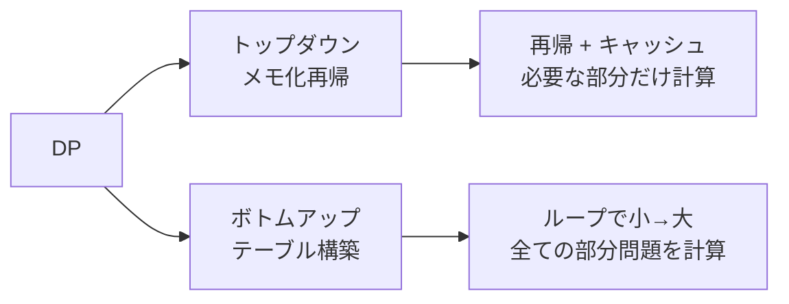

# 動的計画法（Dynamic Programming / DP）

> **一言で言うと:** 「同じ計算を何度もやっている」ことに気づき、結果を保存して再利用することで、指数的な計算量を多項式時間に落とすテクニック。

## 概念

### なぜ「動的計画法」なのか

名前は仰々しいが、本質は単純: **重複する部分問題の答えを覚えておく**。

[[フィボナッチ数列]]がわかりやすい例:

```
fib(5) の素朴な再帰:

                    fib(5)
                   /      \
              fib(4)      fib(3)      ← fib(3) が2回
             /    \       /    \
         fib(3)  fib(2) fib(2) fib(1) ← fib(2) が3回
        /    \
    fib(2)  fib(1)
```

fib(3) は2回、fib(2) は3回計算される。n が大きくなると計算回数は指数的に爆発する（O(2^n)）。

DPを使うと、各値を一度だけ計算して保存する → **O(n)** になる。

### DP の2つのアプローチ



| | トップダウン（メモ化） | ボトムアップ（テーブル） |
|---|---|---|
| 実装 | 再帰 + メモ（ハッシュマップ等） | ループ + 配列 |
| 計算する部分問題 | 必要な分だけ | 全部 |
| スタックオーバーフロー | 深い再帰で発生しうる | なし |
| 直感性 | 問題の定義そのまま | 少し考え方の転換が必要 |
| 使い分け | まず考えやすい方で実装 | 性能を詰めるときに最適化 |

### DP が適用できる条件

1. **最適部分構造（Optimal Substructure）** — 大きな問題の最適解が、部分問題の最適解から構成できる
2. **重複する部分問題（Overlapping Subproblems）** — 同じ部分問題が何度も現れる

この2つが揃わない問題には DP は適用できない（あるいは効果がない）。

## 基本実装 — フィボナッチ数列

### TypeScript

```typescript
// ❌ 素朴な再帰 — O(2^n)
function fibNaive(n: number): number {
  if (n <= 1) return n;
  return fibNaive(n - 1) + fibNaive(n - 2);
}

// ✅ トップダウン（メモ化再帰）— O(n)
function fibMemo(n: number, memo = new Map<number, number>()): number {
  if (n <= 1) return n;
  if (memo.has(n)) return memo.get(n)!;
  const result = fibMemo(n - 1, memo) + fibMemo(n - 2, memo);
  memo.set(n, result);
  return result;
}

// ✅ ボトムアップ（テーブル）— O(n)、空間 O(n)
function fibTable(n: number): number {
  if (n <= 1) return n;
  const dp = new Array(n + 1);
  dp[0] = 0;
  dp[1] = 1;
  for (let i = 2; i <= n; i++) {
    dp[i] = dp[i - 1] + dp[i - 2];
  }
  return dp[n];
}

// ✅ ボトムアップ（空間最適化）— O(n)、空間 O(1)
function fibOptimized(n: number): number {
  if (n <= 1) return n;
  let prev2 = 0, prev1 = 1;
  for (let i = 2; i <= n; i++) {
    const curr = prev1 + prev2;
    prev2 = prev1;
    prev1 = curr;
  }
  return prev1;
}

console.log(fibOptimized(50)); // 12586269025
```

### Python

```python
from functools import lru_cache

# トップダウン — lru_cache で自動メモ化
@lru_cache(maxsize=None)
def fib_memo(n: int) -> int:
    if n <= 1:
        return n
    return fib_memo(n - 1) + fib_memo(n - 2)

# ボトムアップ
def fib_table(n: int) -> int:
    if n <= 1:
        return n
    dp = [0] * (n + 1)
    dp[1] = 1
    for i in range(2, n + 1):
        dp[i] = dp[i - 1] + dp[i - 2]
    return dp[n]

print(fib_memo(50))  # 12586269025
print(fib_table(50)) # 12586269025
```

### PHP

```php
<?php
// トップダウン（メモ化再帰）
function fibMemo(int $n, array &$memo = []): int {
    if ($n <= 1) return $n;
    if (isset($memo[$n])) return $memo[$n];
    $memo[$n] = fibMemo($n - 1, $memo) + fibMemo($n - 2, $memo);
    return $memo[$n];
}

// ボトムアップ（テーブル）
function fibTable(int $n): int {
    if ($n <= 1) return $n;
    $dp = array_fill(0, $n + 1, 0);
    $dp[1] = 1;
    for ($i = 2; $i <= $n; $i++) {
        $dp[$i] = $dp[$i - 1] + $dp[$i - 2];
    }
    return $dp[$n];
}

// ボトムアップ（空間最適化）
function fibOptimized(int $n): int {
    if ($n <= 1) return $n;
    $prev2 = 0;
    $prev1 = 1;
    for ($i = 2; $i <= $n; $i++) {
        $curr = $prev1 + $prev2;
        $prev2 = $prev1;
        $prev1 = $curr;
    }
    return $prev1;
}

echo fibOptimized(50); // 12586269025
```

### Ruby

```ruby
# トップダウン（メモ化再帰）
def fib_memo(n, memo = {})
  return n if n <= 1
  memo[n] ||= fib_memo(n - 1, memo) + fib_memo(n - 2, memo)
end

# ボトムアップ（テーブル）
def fib_table(n)
  return n if n <= 1
  dp = Array.new(n + 1, 0)
  dp[1] = 1
  (2..n).each { |i| dp[i] = dp[i - 1] + dp[i - 2] }
  dp[n]
end

# ボトムアップ（空間最適化）
def fib_optimized(n)
  return n if n <= 1
  prev2, prev1 = 0, 1
  (2..n).each { prev2, prev1 = prev1, prev2 + prev1 }
  prev1
end

puts fib_optimized(50) # 12586269025
```

### Go

```go
package main

import "fmt"

// トップダウン（メモ化再帰）
func fibMemo(n int, memo map[int]int) int {
	if n <= 1 {
		return n
	}
	if v, ok := memo[n]; ok {
		return v
	}
	memo[n] = fibMemo(n-1, memo) + fibMemo(n-2, memo)
	return memo[n]
}

// ボトムアップ（空間最適化）
func fibOptimized(n int) int {
	if n <= 1 {
		return n
	}
	prev2, prev1 := 0, 1
	for i := 2; i <= n; i++ {
		prev2, prev1 = prev1, prev2+prev1
	}
	return prev1
}

func main() {
	fmt.Println(fibMemo(50, map[int]int{})) // 12586269025
	fmt.Println(fibOptimized(50))            // 12586269025
}
```

## 実務での使用シーン

### 1. 編集距離（Levenshtein Distance）— あいまい検索

2つの文字列がどれだけ似ているかを測る。検索のタイポ修正、diff アルゴリズム、DNA 配列比較に使われる。

```typescript
// 編集距離: 挿入・削除・置換の最小回数
function editDistance(a: string, b: string): number {
  const m = a.length, n = b.length;
  // dp[i][j] = a の先頭 i 文字と b の先頭 j 文字の編集距離
  const dp: number[][] = Array.from({ length: m + 1 }, () => Array(n + 1).fill(0));

  for (let i = 0; i <= m; i++) dp[i][0] = i; // 全削除
  for (let j = 0; j <= n; j++) dp[0][j] = j; // 全挿入

  for (let i = 1; i <= m; i++) {
    for (let j = 1; j <= n; j++) {
      if (a[i - 1] === b[j - 1]) {
        dp[i][j] = dp[i - 1][j - 1];  // 一致 → コストなし
      } else {
        dp[i][j] = 1 + Math.min(
          dp[i - 1][j],     // 削除
          dp[i][j - 1],     // 挿入
          dp[i - 1][j - 1], // 置換
        );
      }
    }
  }
  return dp[m][n];
}

console.log(editDistance("kitten", "sitting")); // 3
// kitten → sitten（置換）→ sittin（置換）→ sitting（挿入）
```

### 2. ナップサック問題 — リソース配分の最適化

「限られた予算（容量）で最大の価値を得る」パターン。広告予算の配分、サーバーリソースの割り当て、バッチ処理のスケジューリングなどに応用できる。

```typescript
// 0/1 ナップサック: 各アイテムは1回だけ選べる
function knapsack(capacity: number, items: { weight: number; value: number }[]): number {
  const n = items.length;
  // dp[w] = 容量 w で得られる最大価値
  const dp = new Array(capacity + 1).fill(0);

  for (const item of items) {
    // 逆順に走査（同じアイテムを2回使わないため）
    for (let w = capacity; w >= item.weight; w--) {
      dp[w] = Math.max(dp[w], dp[w - item.weight] + item.value);
    }
  }
  return dp[capacity];
}

const items = [
  { weight: 2, value: 3 },  // API機能A: 工数2日、価値3
  { weight: 3, value: 4 },  // API機能B: 工数3日、価値4
  { weight: 4, value: 5 },  // API機能C: 工数4日、価値5
  { weight: 5, value: 7 },  // API機能D: 工数5日、価値7
];
console.log(knapsack(7, items)); // 10（A + D を選択: 工数7日、価値10）
```

### 3. 最長共通部分列（LCS）— diff ツールの基盤

`git diff` や差分表示の内部で使われる。2つのテキストの「共通する最長の部分列」を見つけることで、何が追加・削除されたかを判定する。

```python
def lcs(a: str, b: str) -> str:
    m, n = len(a), len(b)
    dp = [[""] * (n + 1) for _ in range(m + 1)]

    for i in range(1, m + 1):
        for j in range(1, n + 1):
            if a[i - 1] == b[j - 1]:
                dp[i][j] = dp[i - 1][j - 1] + a[i - 1]
            else:
                dp[i][j] = max(dp[i - 1][j], dp[i][j - 1], key=len)
    return dp[m][n]

print(lcs("ABCBDAB", "BDCABA"))  # "BCBA"（長さ4）
```

## DP の考え方 — 問題を解くステップ

1. **状態を定義する** — `dp[i]` や `dp[i][j]` が何を表すか決める
2. **遷移式を立てる** — `dp[i]` を `dp[i-1]` などから求める漸化式を考える
3. **ベースケースを設定する** — 最小の部分問題の答え（`dp[0]`, `dp[1]` など）
4. **計算順序を決める** — 依存関係に沿って小さい問題から順に解く
5. **（オプション）空間を最適化する** — 直前の行だけ使うなら配列を使い回せる

## よくある落とし穴

1. **メモ化を忘れて指数時間** — 素朴な再帰をそのまま書くと、fib(50) ですら現実的な時間で終わらない。再帰で DP を書くなら必ずメモ化する。
2. **状態の定義が曖昧** — `dp[i]` が何を表すかを明確にしないと、遷移式が矛盾する。紙に書いて定義を固めてから実装する。
3. **ボトムアップの走査方向を間違える** — ナップサック問題で順方向に走査すると同じアイテムを複数回使ってしまう。依存関係をよく考える。
4. **不要な次元を持つ** — 2次元テーブルが必要だと思い込むが、実は1次元で済むケースが多い（フィボナッチなら変数2個で十分）。
5. **DP が必要ない問題に DP を使う** — 貪欲法（Greedy）で解ける問題に DP を持ち出すと、コードが複雑になるだけで得るものがない。

## AIによる実装のアンチパターン

| アンチパターン | なぜ問題か | 対策 |
|---|---|---|
| **汎用 DP フレームワークを自作する** — `DPSolver` のようなクラスを作り、状態遷移をコールバックで定義させる | DP は問題ごとに状態と遷移が異なるため、汎用化のメリットがない。抽象化が問題の理解を妨げる | 問題ごとにシンプルな関数として実装する |
| **メモ化と DP テーブルの二重実装** — 「念のため」両方のアプローチを用意する | コードが倍になり、どちらを使うべきか迷う。通常はどちらか一方で十分 | まずメモ化再帰で正しく実装し、性能が問題ならボトムアップに変換 |
| **全ケースで空間最適化をする** — フィボナッチの変数2個パターンを、複雑な2次元 DP にも無理に適用する | 可読性が大幅に下がる。デバッグ時にテーブル全体を見られなくなる | まずフルテーブルで実装し、必要な場合のみ最適化する |

## 関連トピック

- [[データ構造とアルゴリズム]] — 親トピック
- [[フィボナッチ数列]] — DP の最も基本的な例題
- [[計算量-BigO]] — O(2^n) → O(n) の改善を評価する
- [[DFSとBFS]] — DFS + メモ化は DP の一形態
