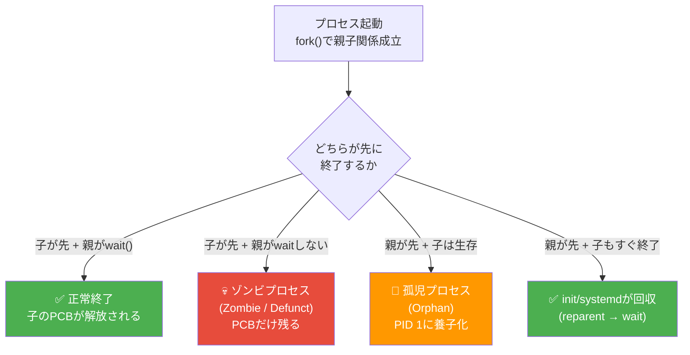
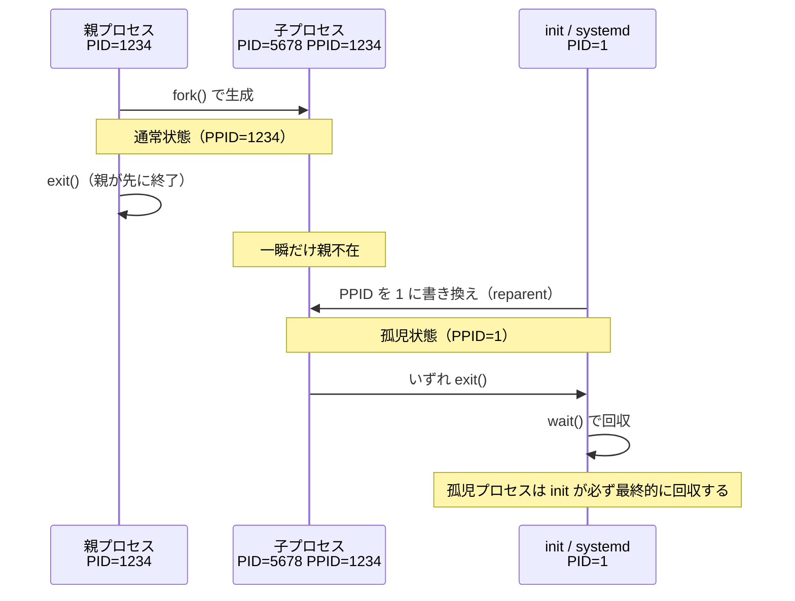
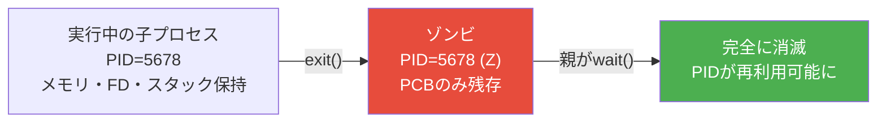
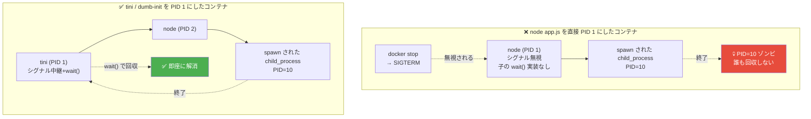

# 孤児プロセスとゾンビプロセス（Orphan Process & Zombie Process）

> **一言で言うと:** 親プロセスより先に**子が終了して親が回収していない**状態がゾンビ、**親が先に死んだ**状態が孤児。両者はプロセスのライフサイクルにおける真逆の異常で、Docker コンテナの PID 1 問題やシグナル伝播トラブルの根本原因になる。

## プロセスのライフサイクルとふたつの逸脱

Unix 系 OS では、プロセスは必ず親子関係を持つ（PID 1 を除く）。終了の仕方が「親が先か / 子が先か」「親がきちんと回収するか」で4通りに分かれ、そのうち2つが異常状態になる。



### 比較表

| 観点 | 孤児プロセス（Orphan） | ゾンビプロセス（Zombie / Defunct） |
|---|---|---|
| 何が起きているか | 親が先に終了して子が残った | 子が終了したが親が `wait()` で回収していない |
| プロセスは生きているか | **生きている**（実行中） | **既に死んでいる**（実体はなくPCBだけ残る） |
| リソース消費 | 通常のプロセスと同じ（CPU/メモリ） | 通常プロセスより大幅に小さい（task_struct の残骸＋PID エントリ1つ。**真の問題は PID 番号空間の占有**）|
| ps 表示 | 通常通り `R/S/D` | `Z` または `<defunct>` |
| 解消方法 | 自動で PID 1 が養子化 → 終了時に回収 | **親が `wait()` を呼ぶか、親が死んで PID 1 に再親付けされる**まで残る |
| 実務での主な害 | 通常は無害／意図的な「デーモン化」にも使われる | 大量発生で PID テーブルが枯渇しシステム麻痺 |

> **ポイント:** 孤児プロセスは「親不在の生者」、ゾンビは「親放置の死者」。両者を混同するとシグナル伝播やコンテナ運用の判断を誤る。

## 孤児プロセス（Orphan Process）

### 発生する仕組み

親プロセスが先に `exit()` すると、子プロセスは parent PID（PPID）が宙に浮く。OS（Linux カーネル）はこれを検知し、子の PPID を **`init`（PID 1、現代のディストリビューションでは多くが `systemd`）** に書き換える。これを **再親付け（reparenting / adoption）** と呼ぶ。



### 意図的な孤児化＝デーモン化（Daemonization）

孤児プロセスは「異常」だけでなく、Unix のデーモンプロセス（バックグラウンドサービス）の作り方そのものでもある。古典的な **double-fork** イディオムは、親をわざと死なせて子を init に養子化させ、ターミナルから完全に切り離す。

```c
// 古典的な double-fork デーモン化
pid_t pid = fork();
if (pid > 0) exit(0);          // 親は即終了 → 子は孤児に
setsid();                       // 新しいセッションを作成（端末から切り離す）
pid = fork();
if (pid > 0) exit(0);          // 中間プロセスも終了 → 孫はセッションリーダーでなくなる
// ここで動いているのが本来のデーモン本体
```

> 現代の systemd 環境では、`Type=simple` を使ってフォアグラウンドで動かし、systemd 自身に親（PID 1）を担わせるのが推奨。手動の double-fork は不要になりつつある。

## ゾンビプロセス（Zombie Process）

### 発生する仕組み

子プロセスが終了すると、終了ステータス（`exit status`）と CPU 使用統計だけは PCB（Process Control Block）に残る。これは親プロセスが `wait()` / `waitpid()` で回収するための情報源。親がこの呼び出しを忘れる、または遅らせると、**実体は消えたが PID とステータスだけが居残る**「ゾンビ」になる。



### なぜ存在するのか（不要に見えて必要な仕組み）

「子が死んだら即座に全消去すれば良いのでは？」と思いがちだが、終了ステータスは親にしか意味がない情報。親が `wait()` するまで保持する仕組みがないと、`exit code 1 でリトライ`のような基本的な制御フローが成立しない。

### ゾンビが累積するとどうなるか

PID は OS の有限資源。**Linux カーネル本来のデフォルトは 32768**（PID は歴史的に 16-bit 値）だが、systemd 239 以降を採用する 64-bit ディストリビューション（RHEL 8+, Fedora 31+, Ubuntu 22.04+ 等）では `/usr/lib/sysctl.d/50-pid-max.conf` により `pid_max = 4194304`（2²²）が設定される。32-bit 環境では引き続き上限 32768。いずれにしても PID テーブルが埋まると新規 fork ができなくなり、`fork: Resource temporarily unavailable` でシステムが事実上停止する。**ゾンビ自体はメモリをほぼ消費しないが、PID 番号空間を1つ占有する**点が落とし穴。

## Docker コンテナの PID 1 問題（実務直結）

孤児・ゾンビの理論が Web エンジニアの日常に直結するのが、**Docker コンテナにおける PID 1 問題**。コンテナ内で起動した最初のプロセスは PID 1 として動作するが、PID 1 には Linux カーネルから特殊な責務が課される:

1. **孤児プロセスの再親付け先**になる（init の役割）
2. **未処理シグナルがデフォルトで無視される**（暴走 init を防ぐカーネルの仕様）
3. **ゾンビを `wait()` で回収する責任**がある



### 何が起きるか

- **graceful shutdown が効かない**: `docker stop` が送る `SIGTERM` を Node.js / Python が無視し、10 秒後に強制 `SIGKILL`。処理中のリクエストが切断される
- **ゾンビの累積**: アプリが `child_process.spawn` などで子を作る場合、それらが終了するとゾンビになり、長時間稼働コンテナで PID 枯渇が起きる
- **Kubernetes での再起動失敗**: Pod の terminationGracePeriodSeconds が役に立たない

### 解決策

| 方法 | 仕組み | 設定例 |
|---|---|---|
| `docker run --init` | Docker が自動で `tini` を PID 1 にする | `docker run --init myapp` |
| Dockerfile で `tini` を ENTRYPOINT に | 明示的に init 役を入れる | `ENTRYPOINT ["/tini", "--", "node", "app.js"]` |
| `dumb-init` | `tini` と同等の最小 init | `ENTRYPOINT ["dumb-init", "node", "app.js"]` |
| アプリ側で SIGTERM を実装 + 自分の子を wait | 自前で init の責務を果たす | Node.js: `process.on('SIGTERM', ...)` |

> 関連: [[Webサーバーとランタイムのリクエスト処理モデル]] の Graceful Shutdown は、PID 1 問題が解決されている前提で初めて意味を持つ。

## コード例

### Python — 子をフォークして孤児／ゾンビを観察する

```python
import os
import time

pid = os.fork()
if pid == 0:
    # 子プロセス
    print(f"子 PID={os.getpid()}, PPID={os.getppid()}")
    time.sleep(5)
    print(f"子終了直前 PPID={os.getppid()}")  # 親が死んだ後は 1 になる
else:
    # 親プロセス: あえて wait() せずすぐ終了 → 子が孤児になる
    print(f"親 PID={os.getpid()}, child PID={pid}")
    time.sleep(1)
    print("親終了 — 子は孤児になる")
    # os.waitpid(pid, 0) を呼べば正常回収される
```

### Python — 正しい SIGCHLD ハンドラでゾンビを防ぐ

```python
import os
import signal

def reap_children(signum, frame):
    """SIGCHLD を受けたら、終了済みの子を片っ端から回収"""
    while True:
        try:
            pid, status = os.waitpid(-1, os.WNOHANG)
            if pid == 0:
                break  # まだ終了していない子しかいない
            print(f"reaped pid={pid} status={status}")
        except ChildProcessError:
            break  # もう子がいない

signal.signal(signal.SIGCHLD, reap_children)
```

> `WNOHANG` を while で回す理由: 標準シグナル（SIGCHLD 含む）はキューイングされず、ハンドラ実行中（シグナルブロック中）に複数届くとカーネル内で1つに合体する。そのため複数の子が同時に終了しても1回の SIGCHLD しか観測できない可能性があり、1回のハンドラで全員を回収する必要がある。なおリアルタイムシグナル（`SIGRTMIN`〜）はキューイングされるため挙動が異なる。

### Go — exec.Cmd は Wait() を呼ばないとゾンビになる

```go
package main

import (
    "os/exec"
)

func main() {
    cmd := exec.Command("sleep", "1")
    cmd.Start()
    // ❌ cmd.Wait() を呼ばずに main が長く生きると、sleep 終了後にゾンビが残る

    // ✅ 必ず Wait() を呼ぶ
    cmd.Wait()
}
```

Go では `exec.Cmd.Run()` が `Start() + Wait()` を内部で呼ぶ。`Start()` だけ使う場合は対応する `Wait()` が必須になる。

### TypeScript（Node.js） — child_process でゾンビを作らない

```typescript
import { spawn } from "node:child_process";

const child = spawn("sleep", ["1"]);

// 'exit' イベント = 子が終了した（OS レベルで wait 済み）
// 'close' イベント = stdio が閉じた
child.on("exit", (code, signal) => {
  console.log(`reaped: code=${code} signal=${signal}`);
});

// detached: true + unref() で意図的に孤児化（バックグラウンドプロセス）
const daemon = spawn("long-running-task", [], {
  detached: true,
  stdio: "ignore",
});
daemon.unref(); // 親 Node プロセスのイベントループから切り離す
```

> libuv が SIGCHLD を補足して `waitpid` するのは **Node.js 自身が spawn した子だけ**。`spawn({ detached: true })` で切り離した子や、Node.js を PID 1 で動作させたときに別経由で養子化された孤児プロセスは reap されない。コンテナで Node.js を PID 1 にする場合に tini が必要なのはこのため。

## よくある落とし穴

### 1. ゾンビをシグナルで殺そうとする

`kill -9` でゾンビを消そうとしても効かない（既に死んでいるので殺せない）。**正しい解消法は親に `wait()` を呼ばせる**こと。親が反応しなければ、親を殺して PID 1 に再親付けさせる（init は確実に回収する）。

```bash
# ゾンビ（Z 状態）のプロセスを探す
ps -eo pid,ppid,state,comm | awk '$3=="Z"'

# kill -9 PID は効かない
# 親プロセス（PPID）を kill すれば PID 1 が回収する
kill <PPID>
```

### 2. 孤児 = 即削除すべき、と思い込む

孤児プロセスは異常状態ではなく、デーモン化や `nohup` の仕組みそのもの。`PPID=1` を見ただけで「異常」と判断するとデーモンや `setsid` で起動したジョブを誤って殺してしまう。

### 3. Docker コンテナでアプリを直接 ENTRYPOINT にする

```dockerfile
# ❌ これだけだと PID 1 問題が直撃する
ENTRYPOINT ["node", "server.js"]

# ✅ tini を init として挟む（イメージに apt-get install tini で導入した場合）
ENTRYPOINT ["/usr/bin/tini", "--", "node", "server.js"]
```

> イメージに tini を入れずに `docker run --init` を使う場合は、Docker が同梱する `docker-init`（中身は tini）が自動で挟まるため Dockerfile 側のパス指定は不要。

### 4. SIGCHLD を `signal()` で SIG_IGN すれば大丈夫と思う

`signal(SIGCHLD, SIG_IGN)` は確かにゾンビを防ぐ（POSIX.1-2001 / Linux 2.6+）。ただし `wait()` 系を呼ぶと **すべての子が終了するまでブロックした後に `errno=ECHILD` で -1 を返す**挙動になり、子の終了ステータスを個別に取得したい用途には使えない。**`waitpid(-1, &status, WNOHANG)` をループで呼ぶ**のが正攻法。

### 5. 「ゾンビはメモリを食わないから無視していい」

PID 番号空間を消費する点を見落としやすい。長時間稼働するワーカープール（PHP-FPM の子、resque ワーカー等）でゾンビが累積すると、`pid_max` 到達時に新規プロセス起動が完全に止まる。**長期運用するサービスでは必ず `wait()` の責務を持つ親を設計する**。

### 6. ゾンビ表示と D 状態（Uninterruptible Sleep）の混同

`ps` で `D` 状態のプロセスは「I/O 待ちで応答しない」だけで生きている。`Z` 状態だけがゾンビ。D 状態の解消には [[ロードアベレージとCPU負荷]] の I/O ボトルネック分析が必要で、ゾンビとは別問題。

## AI による実装のアンチパターン

| アンチパターン | なぜ問題か | 対策 |
|---|---|---|
| Dockerfile に `CMD ["node", "app.js"]` のみで終わらせる | PID 1 問題でシグナル無視・ゾンビ累積が起きる | `docker run --init` か `tini`/`dumb-init` を ENTRYPOINT に挟む |
| `child_process.spawn` の戻り値を変数に保持しない | リスナー登録ができず終了検知不能。長時間稼働でゾンビ化 | 必ず変数に受けて `'exit'` イベントを購読 |
| `subprocess.Popen` の後 `wait()` も `communicate()` も呼ばない | `<defunct>` プロセスが累積する | `with subprocess.Popen(...) as p:` でコンテキストマネージャ化 |
| バックグラウンド起動に `setsid` も `--init` も使わず単に `&` を付ける | 親の終了で意図せず孤児化、ターミナル切断時に SIGHUP で死ぬ | `nohup` + `&`、または systemd unit にする |
| ゾンビ検出を `kill -0 PID` でやろうとする | `kill -0` はゾンビにも成功するため検出できない | `ps` の状態列で `Z` を見るか `/proc/<pid>/status` の `State` を読む |

## 実務での使用シーン

1. **Docker / Kubernetes の本番運用** — `--init` の有無、tini の採用、Pod 終了時の SIGTERM 伝播確認は全コンテナの基本設計
2. **CI/CD ランナーの長期稼働** — GitHub Actions self-hosted runner や Jenkins agent で大量にサブプロセスを起動するため、ゾンビ累積で詰まる事故が多い
3. **PHP-FPM / Unicorn / Puma のワーカー管理** — マスタープロセスが [[Webサーバーとランタイムのリクエスト処理モデル]] に従ってワーカーを fork し `wait()` で回収する。マスターのバグでゾンビ化することがある
4. **シェルスクリプトのバックグラウンドジョブ** — `&` で起動した job が `wait` されずスクリプト終了 → 孤児として init に養子化
5. **デバッグ時のプロセスツリー読解** — `pstree -p` で PPID=1 のプロセスはデーモンか異常孤児か判別する判断材料

## 関連トピック

- [[プロセスとスレッド]] — 親トピック。fork/exec/wait の基本動作
- [[Docker]] — PID 1 問題の最大の発生源。`--init` フラグの意味
- [[Webサーバーとランタイムのリクエスト処理モデル]] — Graceful Shutdown が効くにはシグナル伝播が前提
- [[Linux基本操作]] — `ps`, `pstree`, `kill`, `/proc` の使い方
- [[ダングリングポインタ]] — メモリの世界での「孤児」概念。プロセスとメモリの両方で「親不在の参照」が問題になる構造的類似
- [[ロードアベレージとCPU負荷]] — D 状態（I/O 待ち）と Z 状態（ゾンビ）の切り分け

## 参考リソース

- *The Linux Programming Interface* — Michael Kerrisk: 第26章「プロセスの監視」が `wait()` 系システムコールを完全網羅
- [tini GitHub](https://github.com/krallin/tini) — Docker の PID 1 init 実装。README に PID 1 問題の詳細解説あり
- [Docker docs: --init flag](https://docs.docker.com/engine/reference/run/#specify-an-init-process) — 公式の PID 1 問題と解決策
- `man 2 wait` / `man 2 waitpid` — システムコール仕様の一次ソース
- *Advanced Programming in the UNIX Environment* — W. Richard Stevens: デーモン化と double-fork の古典的解説
