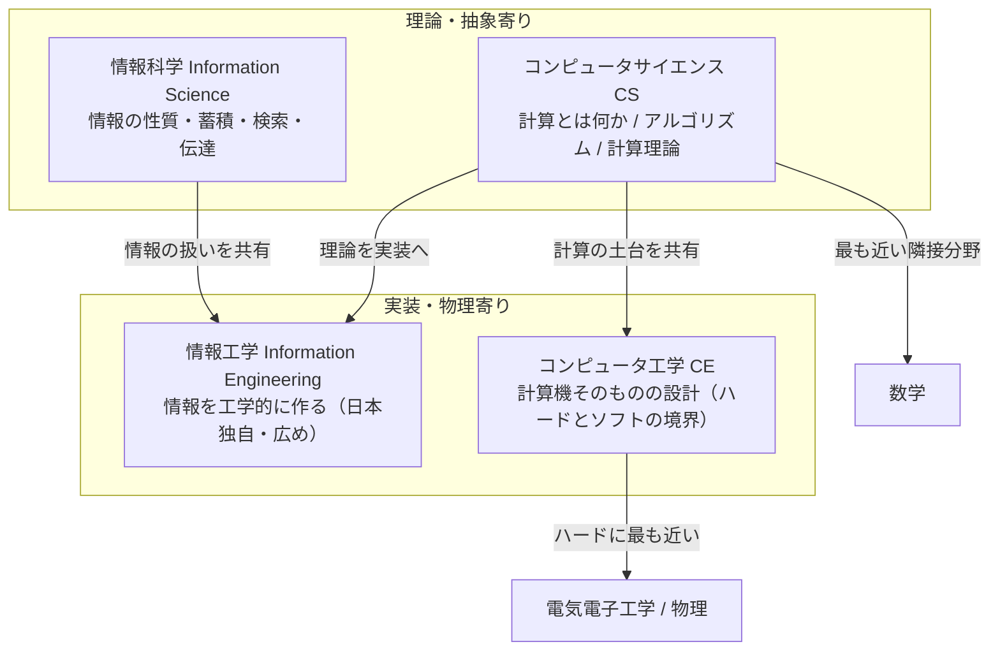

# 情報工学・情報科学・CS・CEの違い（Computer Science / Computer Engineering / Information Science / Information Engineering ≒ Computer Science and Engineering）

> **一言で言うと:** 「情報工学」「情報科学」「コンピュータサイエンス（CS）」「コンピュータ工学（CE）」は重なり合う隣接領域の名前であり、**英語圏では扱う対象（理論／ハードウェア）で線が引かれ、日本語ではどの大学・文脈で使うかで境界が揺れる**。この4語が指す範囲を整理する。

## なぜこの4語は紛らわしいのか

紛らわしさの正体は、**2つの異なる命名体系が混ざっている**ことにある。

- **英語圏（ACM / IEEE 由来）の命名**: `Computer Science`・`Computer Engineering` は、学会（ACM = Association for Computing Machinery、IEEE = Institute of Electrical and Electronics Engineers、本部は米国だが国際組織）が策定した計算機系カリキュラムの分類に基づき、**扱う対象によって明確に線が引かれている**。
- **日本語の命名**: 「情報工学」「情報科学」は日本で独自に定着した呼び名で、**大学・学部・文脈によって指す範囲が変わる**。同じ「情報科学科」でも、ある大学では理論寄り、別の大学ではほぼCS全般を指す。

つまり「CSとCEの違い」は比較的はっきり答えられるが、「情報工学と情報科学の違い」は**一意の正解がなく文脈依存**になる。この非対称性を押さえておくと混乱しない。

> [!info] 用語ミニ辞典：ACM / IEEE
> **ACM（Association for Computing Machinery）** は計算機分野で最も歴史ある国際学会。**IEEE（アイトリプルイー、Institute of Electrical and Electronics Engineers）** は電気・電子・情報分野の世界最大規模の専門家組織。両者が共同で策定する *Computing Curricula* は、世界中の大学が計算機系学科を設計する際の事実上の基準になっている。

## 軸で捉える：理論↔実装、ソフト↔ハード

4語の位置関係は、2本の軸で整理すると見通しが良い。

- **縦軸（抽象度）**: 数学・理論に近いか、物理・実装に近いか
- **横軸（対象）**: ソフトウェア（情報そのもの）寄りか、ハードウェア（計算機という機械）寄りか

この図の要点は、**CSとCEは「縦の関係（数学側↔物理側）」で対になり、情報工学はそれらを工学として束ねる日本側の広い箱**、という構造である。

## 4領域それぞれの定義

### コンピュータサイエンス（Computer Science, CS）

**「計算（computation）」そのものを科学する分野。** 中心の問いは2つに集約される。

1. **何が計算できるのか**（計算可能性・計算理論）— 原理的に解けない問題（停止性問題など）があることを示すのもCSの仕事。
2. **どれだけ効率よく計算できるのか**（計算量理論）— 同じ問題でも解法によって速さが桁違いに変わる。

ここからアルゴリズム、データ構造、プログラミング言語理論、計算量（→ [[計算量-BigO]]）といった主題が派生する。**4語の中で最も数学に近く、特定のハードウェアや特定の応用から独立した普遍的な理論**を扱うのが特徴。「コンピュータの科学」と訳されがちだが、実態は**機械よりも"計算という現象"の科学**である。この性格をよく表す有名な警句に「Computer science is no more about computers than astronomy is about telescopes（CSがコンピュータについての学問でないのは、天文学が望遠鏡についての学問でないのと同じだ）」がある（しばしば Dijkstra の言葉として引用されるが出典は不確かで、Alan Perlis の1968年の発言が源流とみられる）。

### コンピュータ工学（Computer Engineering, CE）

**計算機という「機械」そのものを設計・構築する分野。** 電気電子工学（Electrical Engineering）とCSが重なる領域に位置し、**ハードウェアとソフトウェアの境界**を主戦場とする。

扱う主題は、デジタル回路、コンピュータアーキテクチャ（CPUの内部設計）、組み込みシステム、OSとハードウェアの接点など。**「ソフトウェアが最終的にどう物理的な回路の上で動くか」**を理解し設計するのがCE。CSが「計算の理論」なら、CEは「その計算を実際に動かす機械の工学」と言える。

> CSとCEの違いを一言で:
> **CS = 計算を"考える"／CE = 計算機を"造る"。** CSが「このアルゴリズムは O(n log n) だ」と論じる側、CEは「そのアルゴリズムを動かすCPUのキャッシュをどう設計するか」を論じる側。

### 情報科学（Information Science / Informatics）

**「情報」そのもの——その収集・分類・蓄積・検索・伝達・利用——を扱う分野。** 由来が2系統あり、ここが日本語の混乱の一因になっている。

- **狭義（本来の Information Science）**: 図書館情報学（library science）に起源を持ち、「情報をどう整理し、必要なときに取り出せるようにするか」を扱う。検索、分類体系、情報検索（information retrieval）などが中心。**必ずしも計算機が主役ではない。**
- **広義（日本での慣用）**: 日本の大学では「情報科学」が **CSとほぼ同義** で使われることが多い。「情報科学科」が計算理論やアルゴリズムを教える、というケースは珍しくない。

このため「情報科学とは何か」は**所属する組織が英語のどちらの語を当てているかで決まる**。英訳が `Information Science` なら狭義、`Computer Science` なら実質CS、と読み替えるのが実務的なコツ。

### 情報工学（Information Engineering）

**情報を「工学的に」作る分野で、日本で独自に定着した呼び名。** 英語の特定の単語に1対1で対応しないのが最大の特徴で、日本の大学の「情報工学科」は英語表記では **Computer Science and Engineering（CSとCEを合わせたもの）** と訳されることが多い。なお `Information Engineering` という英語自体は、1980年代に提唱されたデータ駆動型のシステム開発方法論（Clive Finkelstein・James Martin らによる）を指す確立した別概念でもあり、学問分野名としてそのまま使うと紛らわしい。

実質的に **CSの理論 + CEのハードウェア + ソフトウェア開発の実装** を工学として束ねた広い箱であり、「研究のための理論」より**「動くものを作る」工学志向**が強い。日本のソフトウェアエンジニアの多くが学んだ学科名がこれにあたるため、最も身近に感じられる一方、**英語圏には直接対応する固定カテゴリがない**点に注意がいる。

## 一覧で比較する

| 領域 | 中心の問い | 立ち位置 | 隣接する分野 | 英語名の安定度 |
|---|---|---|---|---|
| コンピュータサイエンス（CS） | 何がどれだけ効率よく計算できるか | 理論・数学寄り | 数学 | 安定（ACM/IEEE が定義） |
| コンピュータ工学（CE） | 計算機をどう設計・構築するか | 実装・物理寄り | 電気電子工学 | 安定（ACM/IEEE が定義） |
| 情報科学 | 情報をどう蓄積・検索・伝達するか | 狭義は理論／日本では CS とほぼ同義 | 図書館情報学・CS | **揺れる**（文脈依存） |
| 情報工学 | 情報を使って動くものをどう作るか | 工学・実装志向（CS+CEを束ねる） | CS・CE・ソフトウェア工学 | **揺れる**（日本独自） |

## よくある誤解

### 1.「情報工学＝プログラミングを学ぶ学問、CS＝難しい数学」ではない

両者は"難易度"で分かれているのではなく、**重心の置き方**で分かれている。CSも当然プログラミングを使うし、情報工学も理論を扱う。違いは「普遍的な計算の原理を解明することに重きを置く（CS）」か「動くシステムを構築する工学に重きを置く（情報工学）」かという**志向の差**であって、優劣でも難易度でもない。

### 2.「CEはハードウェアだけ」ではない

CEの本質は**ハードとソフトの"境界"**にある。CPUを設計するだけでなく、その上で動くOSやデバイスドライバ、組み込みソフトウェアもCEの守備範囲。「ハードウェア専業」と捉えると、CEが最も得意とする"両者をまたぐ設計"を見落とす。

### 3.「情報科学」を英語の Information Science と機械的に対応させると誤読する

前述の通り、日本語の「情報科学」は組織によって `Computer Science` を当てている場合がある。海外の `Information Science`（図書館情報学系）と同じものだと早合点すると、カリキュラムの中身（アルゴリズム中心なのか情報検索中心なのか）を読み違える。**日本語名ではなく、その組織が掲げる英語名と科目構成で判断する**のが安全。

### 4. これらは排他的に分かれた縄張りではない

4語は**重なり合うグラデーション**であり、明確な境界線で4分割されているわけではない。同じ「コンパイラ」という主題が、CSでは「言語理論として」、CEでは「ハードウェア最適化として」、情報工学では「ツールを作る工学として」扱われうる。**同じ対象を別の角度から見ている**と捉えるのが実態に近い。

## このプロジェクトとの距離感

本教材（Web Engineer Knowledge Layers）が扱うのは、これら学問領域そのものではなく、**それらの成果を Web エンジニアリングという応用領域で使いこなすための実践知**である。たとえば [[計算量-BigO]] や [[データ構造とアルゴリズム]] はCSの成果を、メモリ階層やプロセス管理はCEの視点を借りている。**「どの学問の話を今しているのか」を意識できると、各トピックがなぜその深さで語られるのかが腑に落ちる。**

## 関連トピック

- 親レイヤー: [[Layer0-CS基礎/_index|Layer 0: コンピュータサイエンス基礎]]
- CSの中核: [[計算量-BigO]] / [[データ構造とアルゴリズム]]

## 参考リソース

- ACM / IEEE *Computing Curricula 2020*（計算機系の分野を CS / CE / Cybersecurity / Information Systems / Information Technology / Software Engineering / Data Science の7つとして国際的に定義。旧 CC2005 の5分野に Cybersecurity・Data Science が加わった）
- E. W. Dijkstra による計算機科学観に関する各種講演・エッセイ（CSが"機械"ではなく"計算"の科学であるという視点）
