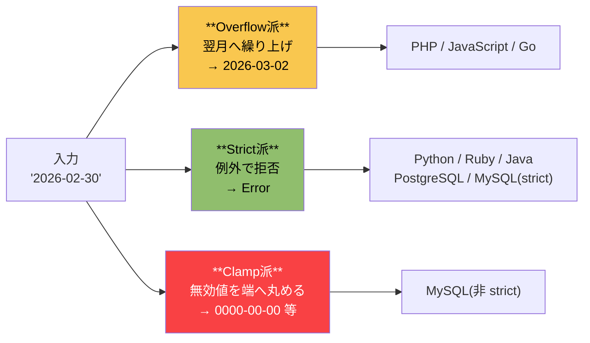

# 日付のオーバーフローとクランプ（Date Overflow & Clamping）

> **一言で言うと:** `'2026-02-30'` のように月日が範囲外になった入力に対して、言語・DB は「翌月に繰り上げて受理（overflow）」「拒否して例外（strict）」「範囲端の値に丸めて受理（clamp）」の3派に分かれる。同じ入力でも言語をまたぐと結果が変わるため、入力検証層で受け止め方を明示的に決めないと、不正日付が静かにDBへ流れ込む。

> [!info] 用語ミニ辞典
> - **オーバーフロー（overflow / normalize）**: 範囲外の月日を、繰り上げて有効な日付に **再計算** して受理する方式。例: `2026-02-30` → `2026-03-02`。C 言語の `mktime(3)` 由来。
> - **ストリクト（strict）**: 範囲外の値を **エラー** として拒否する方式。例: Python の `datetime(2026, 2, 30)` は `ValueError`。
> - **クランプ（clamp / saturate）**: 範囲外の値を、有効範囲の **端の値** に強制的に丸めて受理する方式（例: 数値の `0..255` で `300` を渡すと `255` を返す）。日付の文脈では純粋なクランプは稀で、**MySQL の旧挙動が無効日付をゼロ日付 `0000-00-00` に置換する** ことを慣習的にクランプと呼んでいる（厳密には置換だが業界用語として浸透。詳細は後述）。原義は「鉤爪で押さえつける」。
> - **レニエント解析（lenient parsing）**: 厳密でない解析。文字列の日付表現を寛容に受理して overflow や clamp を行う処理全般。逆は厳格解析（strict parsing）。

## 3つの設計思想 — 同じ入力が3通りに分かれる

`'2026-02-30'`（2 月 30 日）は実在しない日付だが、これをコードに与えたとき、言語・DB は次のいずれかの態度を取る。



それぞれの選択には背後の設計思想がある。**「便利さ優先で受理する」「正しさ優先で拒否する」「過去互換で丸める」** という三者三様の哲学が、同じ無効日付に対して別の出力を生む。

## 言語・DB ごとの分類

| 言語 / DB | 既定の方針 | `2026-02-30` を渡したときの結果 | 該当 API |
|---|---|---|---|
| **PHP** | Overflow | `2026-03-02` | `new DateTime()`, `mktime()`, `strtotime()` |
| **JavaScript / TypeScript** | Overflow | `2026-03-02` | `new Date(2026, 1, 30)` ※月は 0-index |
| **Go** | Overflow | `2026-03-02` | `time.Date()`（godoc に "will be normalized" と明記） |
| **Python** | Strict | `ValueError` | `datetime(2026, 2, 30)` / `strptime` |
| **Ruby** | Strict | `Date::Error: invalid date`（`ArgumentError` のサブクラス） | `Date.new(2026, 2, 30)` |
| **Java** (8+) | Strict | `DateTimeException` | `LocalDate.of(2026, 2, 30)` |
| **PostgreSQL** | Strict | `ERROR: date/time field value out of range` | `DATE '2026-02-30'` |
| **MySQL** (8.0+ 既定) | Strict | `ERROR 1292` | `STRICT_TRANS_TABLES` 有効時 |
| **MySQL** (非 strict) | Clamp / ゼロ化 | `0000-00-00` で挿入 + 警告 | レガシー `sql_mode` |
| **MySQL** (+`ALLOW_INVALID_DATES`) | 素通し | `2026-02-30` をそのまま保存 | 同上 |
| **SQLite** | 型なし | 文字列 `'2026-02-30'` をそのまま保存 | TEXT として保存 |

ここで気づきたいのは「**PHP / JS / Go が overflow 派、Python / Ruby / Java / PostgreSQL が strict 派、MySQL の旧設定だけが clamp 派**」という分布。スクリプト言語 vs コンパイル言語の対立ではなく、**Unix の `mktime(3)` の系譜を引き継いだか否か** で割れている点が本質的。

## なぜ PHP / JS / Go は overflow なのか — `mktime` の系譜

これらの言語の overflow 挙動は偶然ではなく、**C 標準ライブラリの `mktime(3)`** に起源を持つ。

POSIX 仕様には「`struct tm` の各フィールドが通常の範囲外にあっても、関数はそれを正規化して有効な暦日に変換する」と明記されている。これは便利関数として意図されており、`1月31日 + 1ヶ月` のような相対計算を呼び出し側が場合分けせずに済むようにする狙いがあった。

```c
// C: mktime は範囲外の月日を「再計算」する
struct tm t = {0};
t.tm_year = 2026 - 1900;
t.tm_mon  = 1;    // 月（0-index, 2月）
t.tm_mday = 30;   // 範囲外
mktime(&t);
// t.tm_mon が 2 (3月), t.tm_mday が 2 に書き換えられる
```

PHP の `mktime()` はこの仕様をほぼそのまま継承し、`DateTime` クラス時代以降も同じ挙動を維持している（後方互換を優先）。JavaScript の `Date` は、Netscape と Sun の提携で「Java っぽい言語」を要請された経緯から **Java 1.0 の `java.util.Date` を移植** したもので、Java 側が C 由来の overflow 挙動を持っていたため、`new Date(year, month, day)` も同じ性質を引き継いだ。皮肉なことに Java 自身は後（Java 8）に strict 派へ転向するが（後述）、JavaScript の `Date` は後方互換のため overflow のまま残っている。Go は新興言語だが、`time.Date()` の godoc に「The month, day, hour, min, sec, and nsec values may be outside their usual ranges and will be normalized during the conversion.」と書かれており、**意図的に overflow を採用** している。

**副作用としてのバグ:** `new DateTime($userInput)` で `'2026-02-30'` が成功してしまうと、アプリは「ユーザーが 2 月 30 日と入力した」のではなく「**正規化後の 3 月 2 日として処理した**」ことになる。気づかないまま DB へ書き込むと、後から「なぜこの日付が記録されているのか」のトレースが極めて困難になる。便利関数としての設計が、入力検証の文脈では罠として働く。

## なぜ Python / Ruby / Java は strict なのか

これらの言語は **「入力の正しさはアプリの責務」「暗黙の挙動は害をなす」** という設計哲学を共有する。

- **Python** は Zen of Python の "Explicit is better than implicit." を掲げ、`datetime` モジュールは「無効な日付は呼び出し側のバグ」とみなして即座に `ValueError` を投げる。
- **Ruby** の `Date.new` も同様に `Date::Error: invalid date`（`ArgumentError` のサブクラス）を返す。値の妥当性は厳密だが、文字列解析の `Date.parse` は **書式の解釈** が緩く、区切り文字の異なる入力で月日の並びが意図と違って解釈される余地がある（後述の落とし穴を参照）。
- **Java** の `java.time.LocalDate`（Java 8+）は `DateTimeException` を投げる。これは旧 `java.util.Date` が overflow 挙動でバグの温床だった反省から、**意図的に厳密化** された設計。Java 6 以前との非互換は織り込み済み。

> [!info] 用語ミニ辞典
> **Zen of Python**: Python の設計哲学を 20 行ほどの箴言にまとめたもの。`import this` で表示される。コミュニティの判断基準として頻繁に引用される。

strict 派の利点は「**入力ミスが即座に表面化する**」こと。overflow 派は静かに `'2026-02-30' → 3月2日` に変換して DB へ流すが、strict 派ではアプリ層で例外が立つため、バリデーション層がそれを **400 Bad Request** に変換する標準フローを組める。

[[バリデーション]] の文脈では、**strict 派の方が「外部からの入力は信用しない」という原則と相性が良い**。overflow 派の言語を使う場合、**ユーザー入力を直接 `DateTime` / `Date` に渡さない** 設計が必須になる。

## SQL — クランプか拒否かは DBMS と `sql_mode` で割れる

SQL の「クランプ」は単純ではなく、DBMS と設定値で挙動が大きく変わる。

### PostgreSQL — 一貫して strict

```sql
SELECT DATE '2026-02-30';
-- ERROR:  date/time field value out of range: "2026-02-30"
-- SQLSTATE: 22008 (datetime_field_overflow)
```

PostgreSQL は SQL 標準への忠実さを設計指針としており、この挙動を設定で緩める手段は提供されない。これは [[Resources/Study/details/PostgreSQLとMySQLの比較|PostgreSQL の「正確性重視」の思想]] と一致する。

### MySQL — `sql_mode` で挙動が反転する

MySQL は歴史的に **寛容な暗黙変換** を採用してきたが、5.7 以降は strict mode がデフォルトに変わり、現代の構築では PostgreSQL に近い挙動になっている。一方、移行案件で古い設定が残っていると別人の顔を見せる。

| `sql_mode` の構成 | `INSERT ... VALUES ('2026-02-30')` の結果 |
|---|---|
| `STRICT_TRANS_TABLES` あり（8.0+ の既定） | `ERROR 1292: Incorrect date value` |
| strict なし | `0000-00-00` が挿入され、警告のみ（**クランプ**） |
| `ALLOW_INVALID_DATES` あり | `2026-02-30` がそのまま保存される（**素通し**） |
| `NO_ZERO_DATE` なし | ゼロ日付 (`0000-00-00`) が許容される |

`ALLOW_INVALID_DATES` は MySQL 独自の概念で、「**月日の整合性を一切検査しない**（2 月 30 日でも 6 月 31 日でも保存する）」モード。フォーム入力のソフトな救済として用意されたが、現代の運用では **使うべきでない**。

> [!info] 用語ミニ辞典
> **sql_mode**: MySQL のサーバ動作を決定する設定値。`SELECT @@sql_mode;` で確認できる。カンマ区切りでフラグを組み合わせる。MySQL 5.7 以降のデフォルトは `STRICT_TRANS_TABLES,NO_ENGINE_SUBSTITUTION,...` と不正値拒否寄りに振られた。これは MySQL が PostgreSQL 的な厳格性に歩み寄った歴史的転換点と言える。

### SQLite — 型がなく素通し

SQLite は **型親和性（type affinity）** だけを持つ動的型システムで、`DATE` カラムに `'2026-02-30'` を入れても文字列としてそのまま保存される。アプリ層で日付を扱う際には自分でパースし直す必要があり、そこで言語側の strict/overflow に巻き戻される。SQLite を使う場合、不正日付検査は **完全にアプリ側の責務**。

### 「SQL がクランプする」と言われるとき

実務で「SQL がクランプする」と言われるのは、ほとんどが **MySQL の非 strict モードでのゼロ日付化** を指す。これは正確には「範囲端への丸め」ではなく「**無効値の置換（substitution）**」だが、慣習的にクランプと呼ばれる。PostgreSQL や現代の MySQL（8.0+ 既定）は strict 派なので、「SQL = クランプ」と一般化するのは誤り。

## コード例で挙動を見比べる

### PHP — overflow が静かに発生する

```php
<?php
// 入力: ユーザーフォームから来た "2026-02-30"
$input = '2026-02-30';

// ❌ 危険: そのまま受け取ると 3月2日 に正規化される
$d = new DateTimeImmutable($input);
echo $d->format('Y-m-d');  // → "2026-03-02"

// ❌ さらに分かりにくい例: mktime の 13月
$ts = mktime(0, 0, 0, 13, 1, 2026);  // 13月1日
echo date('Y-m-d', $ts);              // → "2027-01-01"（翌年1月）

// ✅ 安全: createFromFormat + getLastErrors で警告を拾う
$d = DateTimeImmutable::createFromFormat('!Y-m-d', $input);
$errors = DateTimeImmutable::getLastErrors();
$invalid = ($d === false)
    || ($errors !== false && ($errors['warning_count'] + $errors['error_count']) > 0);
if ($invalid) {
    throw new InvalidArgumentException("invalid date: {$input}");
}
```

PHP では `createFromFormat` 単独でも overflow を防げないため、`getLastErrors()` で警告を拾うのが定石。Laravel の `date_format` ルールや Symfony Validator はこの定石を内部で実装している。

### Python — 例外で即座に止まる

```python
from datetime import datetime

input_str = "2026-02-30"

# ✅ strict: ValueError が即座に立つので bad request に変換できる
try:
    d = datetime.strptime(input_str, "%Y-%m-%d")
except ValueError as e:
    # → "day is out of range for month"
    raise BadRequest(f"invalid date: {input_str}") from e
```

Pydantic などのスキーマバリデータは内部で `datetime` を呼ぶため、不正日付は自動的に検証エラーになる。Python では **特別な工夫なしに strict** が手に入る。

### JavaScript / TypeScript — overflow + 月が 0-index の二重トラップ

```typescript
// 引数版コンストラクタ: 月が 0-index、しかも overflow
const d = new Date(2026, 1, 30);  // 2 月（1）の 30 日 → 3 月 2 日
console.log(d.toISOString());      // "2026-03-02T..."

// 文字列版: 多くのモダン環境で strict 寄り（ISO 8601 のみ正式サポート）
const d2 = new Date("2026-02-30");
console.log(d2.toString());        // "Invalid Date"
// ※ 古い実装や非 ISO 文字列では overflow する場合がある

// ✅ 推奨: date-fns / dayjs / Temporal API で明示的に検証
import { parse, isValid } from "date-fns";
const parsed = parse("2026-02-30", "yyyy-MM-dd", new Date());
if (!isValid(parsed)) throw new Error("invalid date");
// → date-fns は strict、isValid は false を返す
```

JavaScript 標準 `Date` は **overflow と「月の 0-index」の二重の落とし穴** があり、AI 生成コードで最も見落とされやすい言語。ECMAScript の **Temporal API**（TC39 で標準化が進行中、執筆時点 Stage 3）は `Temporal.PlainDate.from('2026-02-30')` で既定 strict になり、この問題を構造的に解決する。

### SQL — PostgreSQL vs MySQL を並べて見る

```sql
-- ============================
-- PostgreSQL（一貫して strict）
-- ============================
SELECT DATE '2026-02-30';
-- ERROR:  date/time field value out of range: "2026-02-30"

INSERT INTO events (occurred_on) VALUES ('2026-02-30');
-- ERROR:  date/time field value out of range

-- ============================
-- MySQL 8.0+ 既定（STRICT_TRANS_TABLES）
-- ============================
SELECT @@sql_mode;
-- "ONLY_FULL_GROUP_BY,STRICT_TRANS_TABLES,NO_ZERO_IN_DATE,NO_ZERO_DATE,..."

INSERT INTO events (occurred_on) VALUES ('2026-02-30');
-- ERROR 1292 (22007): Incorrect date value: '2026-02-30'

-- ============================
-- MySQL 非 strict（古いシステムで遭遇しがち）
-- ============================
SET sql_mode = '';  -- ← レガシー設定
INSERT INTO events (occurred_on) VALUES ('2026-02-30');
-- Query OK, 1 row affected, 1 warning
-- → occurred_on に "0000-00-00" が入る（クランプ）

-- 検出: 移行案件で混入を確認するクエリ
SELECT COUNT(*) FROM events WHERE occurred_on = '0000-00-00';
```

実務的に、**MySQL 5.6 以前から 8.0 へアップグレードした際、過去に蓄積された `0000-00-00` レコードが発掘される** のはよくある光景。これは「以前は静かに通っていたが、新しい strict モードでは見えてきた歴史的傷跡」。

## よくある落とし穴

1. **PHP の `new DateTime($input)` をバリデーション代わりに使う**
   構文エラーは例外を投げるが、`'2026-02-30'` は静かに成功して overflow する。バリデーション層で `createFromFormat` + `getLastErrors()` を組み合わせるか、Symfony Validator / Laravel `date_format` ルールに任せる。

2. **JavaScript の `new Date(year, month, day)` の月を 1-index と思い込む**
   `new Date(2026, 12, 1)` を「2026 年 12 月 1 日」のつもりで書くと、overflow で `2027-01-01` になる。AI 生成コードでも頻発するので、レビュー時は **必ず月引数の値を疑う**。

3. **MySQL を非 strict のまま運用していて `0000-00-00` が混入**
   旧アプリから移行したテーブルで頻発。`SELECT * FROM t WHERE date_col = '0000-00-00'` で混入数を確認し、修正・削除のバックフィルが必要。修正後は `sql_mode = 'STRICT_TRANS_TABLES,NO_ZERO_DATE,...'` を恒久的に設定する。

4. **言語間で日付を JSON 経由でやり取りする際の挙動不一致**
   PHP バックエンドが `'2026-02-30'` を受けて `'2026-03-02'` に正規化、それを JSON で出して Python 側で受けると、Python 側は「ただの 3 月 2 日」として処理してしまう。**境界で必ず再検証する** のが鉄則。

5. **「来月の同日」計算で 1/31 が 3/3 になる**
   PHP の `strtotime('+1 month', strtotime('2026-01-31'))` は `2026-03-03`（2 月にずれ込んで overflow）。意図したのは「2 月末日」のはず。`DateTime::modify('last day of next month')` や Carbon の `addMonthNoOverflow()` を使う。

6. **Ruby の `Date.parse` は書式の解釈が緩い**
   Ruby の `Date.parse` は値の妥当性については strict（`'2026-02-30'` は `Date::Error` を投げる）だが、**書式の解釈が緩い**ため、`Date.parse('02/03/2026')` のような曖昧な区切り入力で月日の並びが意図と違う解釈になりうる（地域差: 米国式 `MM/DD/YYYY` か欧州式 `DD/MM/YYYY` か）。実務では書式を明示する `Date.strptime('2026-02-30', '%Y-%m-%d')` を使うか、API の境界で受けるならフィールドを分解して `Date.new(y, m, d)` で組み立てる。

7. **タイムゾーン変換で日付が前日/翌日にズレる**
   これは overflow/clamp とは別軸だが、同じ「日付が変わる」事故として混同されやすい。詳細は [[CA証明書とタイムゾーンデータ]]。本記事の対象は「**月日の妥当性**」、タイムゾーン側は「**同じ瞬間の日付表現**」と分けて捉える。

## AI 実装のアンチパターン

LLM 生成コードで頻出する誤用パターン。レビュー時の照合表として使う。

| パターン | 何が起きるか | レビュー観点 / 対策 |
|---|---|---|
| `new DateTime($input)` / `new Date(str)` で受けて検証しない | overflow で正規化された日付が静かに DB へ流入 | スキーマバリデータ（Zod, Pydantic, Laravel `date_format`）を必ず挟む |
| `date.toISOString()` で済ます | UTC 変換で日付が前日/翌日にずれる場合がある | 入出力に **タイムゾーン情報を必ず含める**（`TIMESTAMPTZ`, `ZonedDateTime`） |
| 「無効な日付は `1900-01-01` にする」フォールバック | クランプを誤適用。本来は拒否して 400 を返すべき | バリデーション層で例外送出 → アプリは無効値を絶対に保存しない |
| MySQL で `sql_mode = ''` をテンプレに含める | overflow より悪い「ゼロ日付化」が発動する | `STRICT_TRANS_TABLES,NO_ZERO_DATE,NO_ZERO_IN_DATE` を最低限要求 |
| `new Date(year, month - 1, day)` の `- 1` 補正を書き忘れる | 月の 0-index 罠に毎回ハマる | レビューで月引数を必ず疑う。可能なら ISO 文字列 or Temporal API を使う |
| 月またぎ計算に `+1 month` を素朴に使う | 1/31 → 3/3 のような overflow 副作用 | `addMonthNoOverflow` 系か「月末日 → 月末日」の意図を明示するヘルパを使う |

→ レイヤー横断のアンチパターン索引: [[_anti-patterns/_index|AIアンチパターン索引]]

## 関連トピック

- [[バリデーション]] — 親トピック。日付の overflow / clamp / strict は **範囲チェックとフォーマットチェックの交差点** に位置する
- [[Resources/Study/Layer3-データ永続化/RDB|RDB]] — SQL 側のクランプ挙動・`sql_mode` の扱い・`TIMESTAMPTZ` の選定
- [[Resources/Study/details/PostgreSQLとMySQLの比較|PostgreSQLとMySQLの比較]] — TIMESTAMP 型の **2038 年問題（型範囲の overflow）** は本記事の **月日 overflow** とは別軸。両者を混同しない
- [[CA証明書とタイムゾーンデータ]] — タイムゾーン由来の「日付が変わる」事故。本記事との混同を避ける
- [[バリデーションとサニタイズとエスケープ]] — 「拒否」と「変換」の方針差は本記事の strict vs overflow と同じ構図

## 参考リソース

- PHP: [DateTimeImmutable::createFromFormat](https://www.php.net/manual/en/datetimeimmutable.createfromformat.php) / [getLastErrors](https://www.php.net/manual/en/datetime.getlasterrors.php)
- Python: [datetime — `strptime` の例外仕様](https://docs.python.org/3/library/datetime.html#datetime.datetime.strptime)
- Go: [time.Date の godoc](https://pkg.go.dev/time#Date)（"will be normalized during the conversion"）
- MySQL: [Server SQL Modes](https://dev.mysql.com/doc/refman/8.4/en/sql-mode.html) — `ALLOW_INVALID_DATES`, `NO_ZERO_DATE` の節
- PostgreSQL: [Date/Time Types](https://www.postgresql.org/docs/current/datatype-datetime.html)
- ECMAScript: [Temporal API Proposal](https://tc39.es/proposal-temporal/docs/) — JavaScript 標準で strict 既定の新 API
