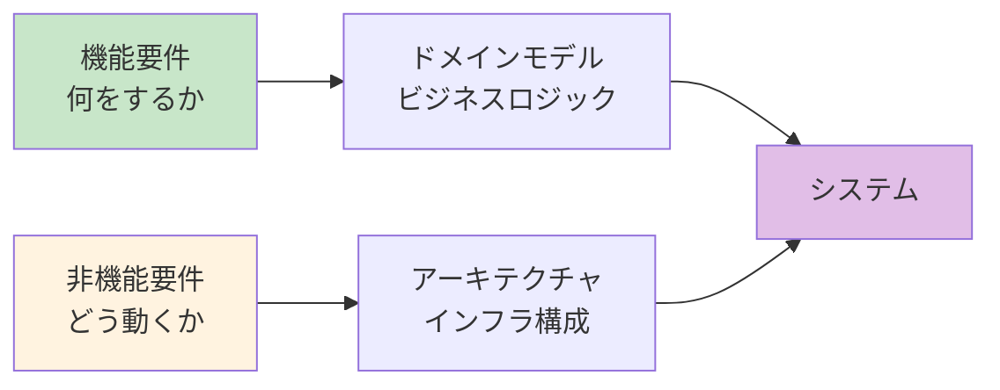
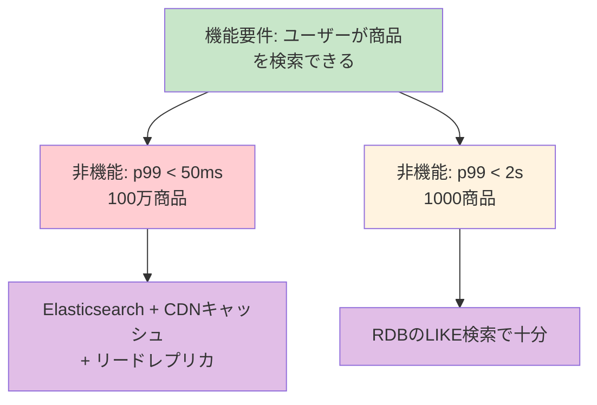

# 機能要件と非機能要件（Functional Requirements & Non-Functional Requirements）

> **一言で言うと:** 機能要件は「システムが**何をするか**」、非機能要件は「システムが**どのように動くか**」を定義する。アーキテクチャ選択を実際に駆動するのは非機能要件の方であり、これを曖昧にしたまま設計すると「動くが使えないシステム」ができあがる。

## なぜ分けて考える必要があるのか

要件を「機能」と「非機能」に分類する理由は、**設計判断への影響の仕方がまったく異なる**からである。

- **機能要件**はドメインロジックとデータモデルを決定する — 「何を」作るかの問題
- **非機能要件**はアーキテクチャとインフラを決定する — 「どう」作るかの問題

同じ「ECサイト」でも、月間100ユーザーと月間1億ユーザーでは機能要件は同じでもアーキテクチャは根本的に異なる。この差を生むのが非機能要件である。



## 機能要件（Functional Requirements）

システムが提供すべき**振る舞い・機能**の定義。ユーザーストーリーやユースケースとして記述されることが多い。

### 特徴

| 観点 | 機能要件 |
|------|---------|
| **問い** | 「システムは何をするか？」 |
| **記述形式** | ユーザーストーリー、ユースケース、画面仕様 |
| **検証方法** | 機能テスト（ユニットテスト、E2Eテスト） |
| **例** | ユーザーがメールアドレスでログインできる |
| **満たさないと** | システムとして成立しない |

### 機能要件の記述手法

**ユーザーストーリー**と**ユースケース**は目的が異なる:

| 手法 | 粒度 | 用途 |
|------|------|------|
| **ユーザーストーリー** | 粗い（会話の出発点） | アジャイル開発での要件収集・優先順位付け |
| **ユースケース** | 細かい（正常系・異常系を網羅） | 画面仕様・API仕様への落とし込み |

ユーザーストーリーは「詳細な仕様書」ではなく、**ステークホルダーとの会話を始めるためのプレースホルダ**である。詳細は受け入れ基準（Acceptance Criteria）で補完する。

```
# ユーザーストーリー形式
As a 購入者
I want to カートに商品を追加する
So that まとめて購入できる

# 受け入れ条件（Acceptance Criteria）
- 商品詳細ページから「カートに追加」を押すと、カートに商品が追加される
- 同じ商品を複数回追加すると数量が増える
- 在庫がない商品は追加できず、エラーメッセージが表示される
- カートの合計金額がリアルタイムで更新される
```

### 優先順位付け — MoSCoW法

全ての機能要件を同時に実装することはできない。MoSCoW法はステークホルダーと優先度を合意するための分類手法:

| 分類 | 意味 | 例 |
|------|------|---|
| **Must have** | なければリリースできない | ユーザー登録、ログイン、商品購入 |
| **Should have** | 重要だが代替手段がある | パスワードリセット、お気に入り機能 |
| **Could have** | あれば便利 | 購入履歴のCSVエクスポート |
| **Won't have** | 今回は対象外（将来の候補） | 多言語対応、ソーシャルログイン |

## 非機能要件（Non-Functional Requirements）

システムの**品質特性**を定義する。機能要件が「何を」であるのに対し、非機能要件は「どの程度のレベルで」を規定する。ISO/IEC 25010:2023（システム・ソフトウェア品質モデル）では品質特性を9つに分類しているが、以下ではWeb開発で特に重要なカテゴリを実務寄りに整理する。

### 代表的な非機能要件カテゴリ

| カテゴリ | 問い | 定量的な例 | 関連レイヤー |
|---------|------|----------|------------|
| **性能（Performance）** | どれだけ速く応答するか | API レスポンスタイム p99 < 200ms | [[パフォーマンス最適化]] |
| **可用性（Availability）** | どれだけ落ちないか | 月間稼働率 99.9%（ダウンタイム月43分以内） | [[モニタリング]]、[[SLI-SLO-SLA]] |
| **スケーラビリティ（Scalability）** | 負荷増加にどう対応するか | 同時接続1万→10万に水平スケール可能 | [[ロードバランシング]] |
| **セキュリティ（Security）** | どう守るか | OWASP Top 10 対応、暗号化保存 | [[CORS]]、[[認証と認可]] |
| **保守性（Maintainability）** | どれだけ変更しやすいか | 新機能追加が平均3日以内 | [[関心の分離]]、[[SOLID原則]] |
| **信頼性（Reliability）** | 障害時にどう振る舞うか | 単一ノード障害で全体停止しない | [[フォールバックとグレースフルデグラデーション]] |
| **移植性（Portability）** | 環境を変えられるか | AWS→GCP 移行が3ヶ月以内に可能 | [[Docker]]、[[IaCとクラウドインフラ管理]] |
| **監査性（Auditability）** | 誰が何をしたか追跡できるか | 全操作ログを1年間保持 | [[モニタリング]] |

### 非機能要件がアーキテクチャを決定する

非機能要件の違いが、同じ機能要件に対してまったく異なるアーキテクチャを導く:



## 非機能要件の定量化

非機能要件が価値を持つのは**定量的に表現されたとき**だけである。「高速であること」「セキュアであること」は要件ではなく願望に過ぎない。

### 悪い例と良い例

| 悪い例（曖昧） | 良い例（定量的・検証可能） |
|--------------|----------------------|
| 高速に動作すること | API レスポンスタイム p99 < 200ms |
| 高可用性であること | 月間稼働率 99.9%（計画メンテナンス除外） |
| スケーラブルであること | 現在の10倍のトラフィック（10万req/s）に水平スケールで対応可能 |
| セキュアであること | 保存データはAES-256で暗号化、通信はTLS 1.2以上 |
| 使いやすいこと | 主要タスクの完了率95%以上（ユーザビリティテストで検証） |

### TypeScript — 非機能要件を型で表現する

```typescript
// 非機能要件を設計の制約として型に反映する例

// --- 性能要件: タイムアウト付きのAPI呼び出し ---
async function fetchWithTimeout<T>(
  url: string,
  timeoutMs: number,
): Promise<T> {
  const controller = new AbortController();
  const timer = setTimeout(() => controller.abort(), timeoutMs);

  try {
    const res = await fetch(url, { signal: controller.signal });
    if (!res.ok) throw new Error(`HTTP ${res.status}`);
    return await res.json() as T;
  } finally {
    clearTimeout(timer);
  }
}

// SLO: p99 < 200ms の場合、タイムアウトはSLOより余裕を持たせる
// タイムアウト = SLO値にすると、SLO境界付近の正常リクエストまで中断してしまう
const product = await fetchWithTimeout<Product>(
  '/api/products/123',
  500, // SLO 200ms に対してタイムアウトは 500ms（余裕を確保）
);
```

### Go — 非機能要件をミドルウェアで横断的に適用する

```go
package main

import (
	"log"
	"net/http"
	"time"
)

// 性能要件: レスポンスタイムの計測と閾値チェック
func latencyMiddleware(threshold time.Duration, next http.Handler) http.Handler {
	return http.HandlerFunc(func(w http.ResponseWriter, r *http.Request) {
		start := time.Now()
		next.ServeHTTP(w, r)
		elapsed := time.Since(start)

		if elapsed > threshold {
			log.Printf("[SLOW] %s %s took %v (threshold: %v)",
				r.Method, r.URL.Path, elapsed, threshold)
		}
	})
}

// 可用性要件: ヘルスチェックエンドポイント
func healthHandler(w http.ResponseWriter, r *http.Request) {
	// DB接続、キャッシュ接続などを確認
	w.WriteHeader(http.StatusOK)
	w.Write([]byte(`{"status":"healthy"}`))
}

func main() {
	mux := http.NewServeMux()
	mux.HandleFunc("/health", healthHandler)

	// 非機能要件: p99 < 200ms をミドルウェアで監視
	handler := latencyMiddleware(200*time.Millisecond, mux)
	http.ListenAndServe(":8080", handler)
}
```

### PHP — バリデーションで非機能要件の制約を表現する

```php
<?php
// スケーラビリティ要件:
// ページネーション必須、一度に取得できる件数を制限する

class ProductSearchRequest
{
    public function __construct(
        public readonly string $keyword,
        public readonly int $page = 1,
        public readonly int $perPage = 20,
    ) {
        // 非機能要件: 1リクエストあたりの最大件数を制限
        if ($this->perPage > 100) {
            throw new \InvalidArgumentException(
                'perPage must be <= 100 to maintain response time SLO'
            );
        }
    }
}

// 非機能要件: キャッシュによる性能保証
class CachedProductSearch
{
    public function __construct(
        private ProductRepository $repo,
        private CacheInterface $cache,
        private int $ttlSeconds = 60,
    ) {}

    /** @return Product[] */
    public function search(ProductSearchRequest $req): array
    {
        $key = sprintf('search:%s:%d:%d', $req->keyword, $req->page, $req->perPage);

        return $this->cache->remember($key, $this->ttlSeconds, function () use ($req) {
            return $this->repo->search($req->keyword, $req->page, $req->perPage);
        });
    }
}
```

## 機能要件と非機能要件のトレードオフ

非機能要件同士は互いに競合することが多い。すべてを最高レベルで満たすことは不可能であり、**ビジネスの優先度に基づいたトレードオフ**が必要になる。

| トレードオフ | 例 |
|------------|---|
| **性能 vs セキュリティ** | 全リクエストの暗号化・復号はレイテンシを増加させる |
| **可用性 vs 一貫性** | CAP定理 — 分散システムでは両立不可能な場面がある |
| **保守性 vs 性能** | 抽象化層を増やすと変更しやすいがオーバーヘッドが生じる |
| **スケーラビリティ vs コスト** | 自動スケールは可用性を上げるがインフラコストも上がる |

## モノリスvsマイクロサービスの選択と非機能要件

親トピック[[モノリスvsマイクロサービス]]のアーキテクチャ選択は、本質的に非機能要件によって駆動される:

| 非機能要件 | モノリスで十分 | マイクロサービスが必要 |
|----------|-------------|-------------------|
| **スケーラビリティ** | 全体を均一にスケール | 機能ごとに異なるスケール要件 |
| **可用性** | 単一プロセスの冗長化で達成 | 障害の局所化が必須 |
| **デプロイ頻度** | 週1回のリリースで十分 | チームごとに日次デプロイが必要 |
| **保守性** | 10人以下のチーム | 50人以上で独立した開発が必要 |

**重要:** 非機能要件が明確でないままアーキテクチャを選択するのは、目的地を決めずに乗り物を選ぶのと同じである。

## よくある落とし穴

### 1. 非機能要件を「後から考える」

機能を全て実装した後に「性能を改善しよう」とすると、アーキテクチャレベルの変更が必要になることが多い。非機能要件は設計の初期段階で明確にし、アーキテクチャ判断の入力とすべきである。ただし、[[YAGNI]]の原則に従い、**定量的な根拠なしに過剰な性能設計をする必要はない**。

### 2. 非機能要件を定量化しない

「高速であること」「安全であること」は要件ではなく願望である。数値（レスポンスタイム p99 < 200ms、月間稼働率 99.9%）で表現しなければ、達成の検証も優先順位の判断もできない。

### 3. すべての非機能要件を最高レベルで満たそうとする

99.999%の可用性と1ms以下のレイテンシと完全なセキュリティを同時に達成しようとすると、コストと複雑性が指数的に増大する。ビジネス上の優先度に基づき、各要件の目標レベルを現実的に設定する。

### 4. 機能要件だけでアーキテクチャを決める

「ECサイトを作る」という機能要件だけでは、静的サイト生成で十分なのか、リアルタイム在庫管理が必要なのか判断できない。アーキテクチャは非機能要件が決定する。

## 実務での使用シーン

### 要件定義フェーズ

1. ステークホルダーから機能要件をユーザーストーリーとして収集
2. 各機能に対して「どの程度のレベルで」を非機能要件として定量化
3. 非機能要件の優先順位を決定（全てを最高レベルにはできない）
4. 非機能要件をもとにアーキテクチャの方針を決定

### 設計レビュー

- 「この設計でスケーラビリティ要件を満たせるか？」
- 「このキャッシュ戦略で性能要件の p99 < 200ms を達成できるか？」
- 「単一障害点はどこか？可用性要件に影響しないか？」

## 関連トピック

- [[モノリスvsマイクロサービス]] — 親トピック。非機能要件がアーキテクチャ選択を駆動する
- [[SLI-SLO-SLA]] — 非機能要件（特に可用性・性能）を運用レベルで定量化する仕組み
- [[テスト戦略]] — 機能要件は機能テスト、非機能要件は負荷テスト・セキュリティテストで検証する
- [[YAGNI]] — 非機能要件も過剰設計の対象になりうる。定量的根拠のない「将来のため」の設計は避ける
- [[関心の分離]] — 非機能要件（ログ、認証、キャッシュ等）は横断的関心事として分離する

## 参考リソース

- ISO/IEC 25010:2023 — ソフトウェア品質モデルの国際標準。2023年改訂版で9つの品質特性（Safety を追加）を定義
- *Software Requirements* (3rd Edition) — Karl Wiegers（要件定義の実践ガイド。非機能要件の収集・文書化手法）
- *Designing Data-Intensive Applications* — Martin Kleppmann（信頼性・スケーラビリティ・保守性を軸にしたシステム設計の名著）
- *Release It!* (2nd Edition) — Michael Nygard（本番環境の非機能要件、特に安定性パターンに特化）
