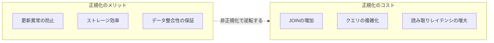
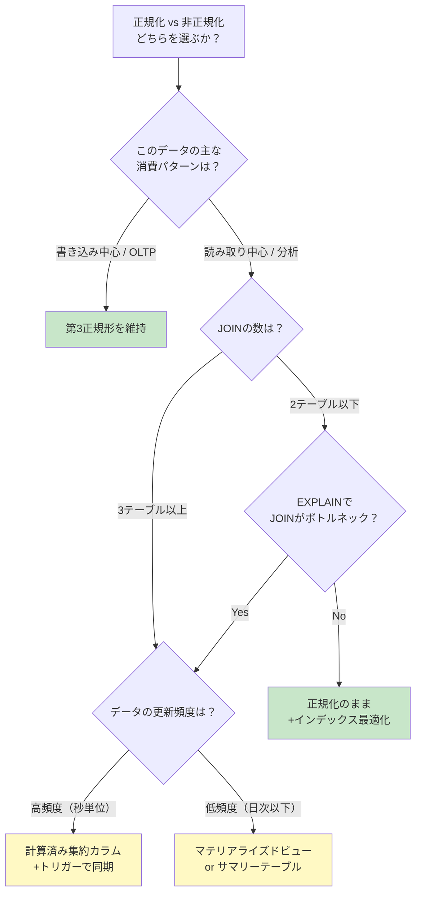

# 正規化と非正規化の判断基準（Normalization vs Denormalization）

> **一言で言うと:** 正規化は「同じ事実を1箇所に」の原則でデータ異常を防ぐ。非正規化は読み取り性能のためにその原則を意図的に破る。判断の鍵は「このデータの主な消費パターンは何か」を見極めることにある。

## 正規化のレベルを理解する

正規化は段階的に適用される。実務では **第3正規形（3NF）** までが標準的なゴールラインである。

| 正規形 | 条件 | 排除される問題 | 例 |
|--------|------|---------------|-----|
| **第1正規形（1NF）** | 各カラムが原子値（Atomic Value）を持つ | 繰り返しグループ、カンマ区切りの複数値 | `tags = "go,rust,ts"` → tags テーブルに分離 |
| **第2正規形（2NF）** | 1NF + 非キー属性が主キー全体に完全関数従属 | 複合主キーの一部にだけ依存する属性 | `(order_id, product_id)` → `product_name` は `product_id` だけに依存するので分離 |
| **第3正規形（3NF）** | 2NF + 非キー属性間の推移的関数従属がない | A→B→C の間接依存 | `department_id → department_name` は departments テーブルへ |
| **BCNF** | 全ての決定項が候補キー | 候補キーでない属性が他の属性を決定する | 実務で意識する場面は少ない |

### 正規形ごとの具体例

```sql
-- ❌ 1NF違反: カンマ区切りで複数値を持つ
CREATE TABLE articles (
    id INT PRIMARY KEY,
    title VARCHAR(200),
    tags VARCHAR(500)  -- "go,rust,typescript" のようにカンマ区切り
);

-- ✅ 1NF準拠: 中間テーブルで多対多を表現
CREATE TABLE articles (
    id INT PRIMARY KEY,
    title VARCHAR(200) NOT NULL
);

CREATE TABLE tags (
    id INT PRIMARY KEY,
    name VARCHAR(50) UNIQUE NOT NULL
);

CREATE TABLE article_tags (
    article_id INT NOT NULL REFERENCES articles(id),
    tag_id INT NOT NULL REFERENCES tags(id),
    PRIMARY KEY (article_id, tag_id)
);
```

```sql
-- ❌ 2NF違反: product_name は複合キーの一部(product_id)にだけ依存
CREATE TABLE order_items (
    order_id INT,
    product_id INT,
    product_name VARCHAR(100),  -- product_id だけで決まる
    quantity INT,
    PRIMARY KEY (order_id, product_id)
);

-- ✅ 2NF準拠: product_name を products テーブルへ
CREATE TABLE products (
    id INT PRIMARY KEY,
    name VARCHAR(100) NOT NULL
);

CREATE TABLE order_items (
    order_id INT,
    product_id INT REFERENCES products(id),
    quantity INT NOT NULL,
    PRIMARY KEY (order_id, product_id)
);
```

```sql
-- ❌ 3NF違反: department_name は department_id 経由の推移的従属
CREATE TABLE employees (
    id INT PRIMARY KEY,
    name VARCHAR(100) NOT NULL,
    department_id INT NOT NULL,
    department_name VARCHAR(100)  -- department_id → department_name
);

-- ✅ 3NF準拠: 推移的従属を分離
CREATE TABLE departments (
    id INT PRIMARY KEY,
    name VARCHAR(100) NOT NULL
);

CREATE TABLE employees (
    id INT PRIMARY KEY,
    name VARCHAR(100) NOT NULL,
    department_id INT NOT NULL REFERENCES departments(id)
);
```

## 正規化のメリットとコスト



| 観点 | 正規化 | 非正規化 |
|------|--------|----------|
| **書き込み** | 1箇所の更新で完結（高速・安全） | 複数箇所の更新が必要（遅い・不整合リスク） |
| **読み取り** | JOINが必要（テーブル数に応じて遅くなる） | 1テーブルで完結（高速） |
| **ストレージ** | 重複なし（効率的） | 重複あり（肥大化） |
| **スキーマ変更** | 影響範囲が限定的 | 重複データの全箇所を修正する必要 |
| **整合性** | DB制約で保証できる | アプリケーション層で維持する必要 |

## 非正規化を検討すべきシグナル

以下のシグナルが複数当てはまる場合、非正規化を検討する価値がある:

1. **読み取りが圧倒的に多い（Read-Heavy）**: 読み書き比率が 100:1 以上
2. **JOINが3テーブル以上に及ぶクエリが頻出する**: 特にレポートやダッシュボード
3. **レイテンシ要件が厳しい**: ユーザー向けAPIで p99 < 50ms など
4. **データの更新頻度が低い**: マスタデータや履歴データ
5. **EXPLAINで JOIN がボトルネックと判明**: Nested Loop Join で大量の行を処理している

## 非正規化の代表的パターン

### パターン1: 計算済み集約カラム（Computed Aggregate）

JOINと集約を毎回実行する代わりに、集約結果をカラムとして保持する。

```sql
-- 正規化された状態: 投稿ごとにコメント数をCOUNTする
SELECT p.id, p.title, COUNT(c.id) AS comment_count
FROM posts p
LEFT JOIN comments c ON c.post_id = p.id
GROUP BY p.id, p.title;

-- 非正規化: posts テーブルに comment_count を持たせる
ALTER TABLE posts ADD COLUMN comment_count INT NOT NULL DEFAULT 0;

-- コメント追加・削除時にカウンタを更新（post_id の UPDATE は想定しない前提）
CREATE OR REPLACE FUNCTION update_comment_count()
RETURNS TRIGGER AS $$
BEGIN
    IF TG_OP = 'INSERT' THEN
        UPDATE posts SET comment_count = comment_count + 1
        WHERE id = NEW.post_id;
    ELSIF TG_OP = 'DELETE' THEN
        UPDATE posts SET comment_count = comment_count - 1
        WHERE id = OLD.post_id;
    END IF;
    RETURN NULL;
END;
$$ LANGUAGE plpgsql;

CREATE TRIGGER trg_comment_count
AFTER INSERT OR DELETE ON comments
FOR EACH ROW EXECUTE FUNCTION update_comment_count();
```

**適用場面**: SNSの「いいね数」「フォロワー数」、ECサイトの「レビュー平均点」

### パターン2: スナップショットの埋め込み（Snapshot Embedding）

注文確定時点の情報を注文テーブルにコピーする。参照先が後から変更されても、確定時点の値を保持できる。厳密には「時点の異なる独立した事実の記録」であり、正規化の観点でも正当な設計だが、テーブル構造としては冗長に見えるため非正規化パターンとして扱われることが多い。

```sql
-- 正規化だけでは不十分な例:
-- 顧客の住所変更後に、過去の注文の配送先がわからなくなる

CREATE TABLE orders (
    id BIGINT PRIMARY KEY,
    customer_id BIGINT NOT NULL REFERENCES customers(id),
    -- スナップショット: 注文確定時点の情報を保存
    shipping_name VARCHAR(100) NOT NULL,
    shipping_address TEXT NOT NULL,
    shipping_postal_code VARCHAR(10) NOT NULL,
    -- 注文確定時点の商品単価（値上げされても影響しない）
    unit_price DECIMAL(10,2) NOT NULL,
    quantity INT NOT NULL,
    created_at TIMESTAMPTZ NOT NULL DEFAULT NOW()
);
```

**適用場面**: 注文の配送先・請求先、契約時点の料金プラン、請求書の明細

### パターン3: マテリアライズドビュー（Materialized View）

正規化されたテーブルはそのままに、読み取り用の非正規化ビューを別途作成する。**テーブル自体は正規化を維持**できるため、最も安全な非正規化手法。

```sql
-- 正規化されたテーブル群はそのまま維持
-- 読み取り用にマテリアライズドビューを作成
CREATE MATERIALIZED VIEW mv_user_dashboard AS
SELECT
    u.id AS user_id,
    u.name,
    u.email,
    COUNT(DISTINCT p.id) AS post_count,
    COUNT(DISTINCT c.id) AS comment_count,
    MAX(p.created_at) AS last_post_at
FROM users u
LEFT JOIN posts p ON p.user_id = u.id
LEFT JOIN comments c ON c.user_id = u.id
GROUP BY u.id, u.name, u.email;

-- ユニークインデックスを付けてCONCURRENTLY更新を可能にする
CREATE UNIQUE INDEX idx_mv_user_dashboard_user_id ON mv_user_dashboard(user_id);

-- 定期的にリフレッシュ（例: 5分ごと、ロックなし）
REFRESH MATERIALIZED VIEW CONCURRENTLY mv_user_dashboard;
```

> MySQL にはマテリアライズドビューのネイティブサポートがない。代わりにサマリーテーブルを手動で管理するか、定期バッチで集計テーブルを更新するアプローチを取る。

**適用場面**: ダッシュボード、ランキング、管理画面の統計

### パターン4: 検索用サマリーテーブル（Summary Table）

複雑な集計を事前計算してテーブルに格納する。マテリアライズドビューと似ているが、より細かい更新制御が可能。

```sql
-- 日次の売上サマリーテーブル
CREATE TABLE daily_sales_summary (
    date DATE NOT NULL,
    product_id BIGINT NOT NULL REFERENCES products(id),
    total_quantity INT NOT NULL DEFAULT 0,
    total_revenue DECIMAL(12,2) NOT NULL DEFAULT 0,
    order_count INT NOT NULL DEFAULT 0,
    PRIMARY KEY (date, product_id)
);

-- バッチジョブまたはトリガーで更新
INSERT INTO daily_sales_summary (date, product_id, total_quantity, total_revenue, order_count)
SELECT
    DATE(created_at),
    product_id,
    SUM(quantity),
    SUM(quantity * unit_price),
    COUNT(*)
FROM order_items
WHERE DATE(created_at) = CURRENT_DATE
GROUP BY DATE(created_at), product_id
ON CONFLICT (date, product_id) DO UPDATE SET
    total_quantity = EXCLUDED.total_quantity,
    total_revenue = EXCLUDED.total_revenue,
    order_count = EXCLUDED.order_count;
```

**適用場面**: 売上レポート、アクセス解析、KPI ダッシュボード

## 判断フローチャート



## コード例

### TypeScript（Prisma）: 計算済みカラムの整合性維持

```typescript
import { PrismaClient } from "@prisma/client";

const prisma = new PrismaClient();

// コメント追加時に posts.comment_count を同期する
async function addComment(postId: number, userId: number, body: string) {
  // トランザクションで一括実行し、不整合を防ぐ
  const [comment] = await prisma.$transaction([
    prisma.comment.create({
      data: { postId, userId, body },
    }),
    prisma.post.update({
      where: { id: postId },
      data: { commentCount: { increment: 1 } },
    }),
  ]);

  return comment;
}

// カウンタのドリフト（ズレ）を修正するバッチ
async function reconcileCommentCounts() {
  await prisma.$executeRaw`
    UPDATE posts SET comment_count = (
      SELECT COUNT(*) FROM comments WHERE comments.post_id = posts.id
    )
    WHERE comment_count != (
      SELECT COUNT(*) FROM comments WHERE comments.post_id = posts.id
    )
  `;
}
```

### Go: スナップショット埋め込みパターン

```go
package main

import (
	"context"
	"database/sql"
	"fmt"
)

type Order struct {
	ID              int64
	CustomerID      int64
	ShippingName    string  // スナップショット: 注文時点の顧客名
	ShippingAddress string  // スナップショット: 注文時点の住所
	UnitPrice       float64 // スナップショット: 注文時点の単価
	Quantity        int
}

// 注文確定時に顧客情報と商品価格のスナップショットを取る
func createOrder(ctx context.Context, db *sql.DB, customerID, productID int64, qty int) (*Order, error) {
	tx, err := db.BeginTx(ctx, nil)
	if err != nil {
		return nil, fmt.Errorf("begin tx: %w", err)
	}
	defer tx.Rollback()

	// 現在の顧客情報を取得（この時点の値をスナップショットとして保存）
	var name, address string
	err = tx.QueryRowContext(ctx,
		"SELECT name, address FROM customers WHERE id = $1", customerID,
	).Scan(&name, &address)
	if err != nil {
		return nil, fmt.Errorf("fetch customer: %w", err)
	}

	// 現在の商品単価を取得
	var unitPrice float64
	err = tx.QueryRowContext(ctx,
		"SELECT price FROM products WHERE id = $1", productID,
	).Scan(&unitPrice)
	if err != nil {
		return nil, fmt.Errorf("fetch product: %w", err)
	}

	// スナップショットを含めて注文を作成
	var orderID int64
	err = tx.QueryRowContext(ctx, `
		INSERT INTO orders (customer_id, shipping_name, shipping_address, unit_price, quantity)
		VALUES ($1, $2, $3, $4, $5) RETURNING id`,
		customerID, name, address, unitPrice, qty,
	).Scan(&orderID)
	if err != nil {
		return nil, fmt.Errorf("insert order: %w", err)
	}

	if err := tx.Commit(); err != nil {
		return nil, fmt.Errorf("commit: %w", err)
	}

	return &Order{
		ID: orderID, CustomerID: customerID,
		ShippingName: name, ShippingAddress: address,
		UnitPrice: unitPrice, Quantity: qty,
	}, nil
}
```

## よくある落とし穴

### 1. 「遅いからとりあえず非正規化」

EXPLAINでボトルネックを特定せずに非正規化するのは危険。多くの場合、[[インデックス設計の判断基準|インデックスの追加]]やクエリの書き換えで解決できる。非正規化は最後の手段。

### 2. 非正規化データの同期漏れ

計算済みカラムやスナップショットを導入すると、「正規化されたデータ」と「非正規化されたコピー」の2つの真実が生まれる。同期の仕組み（トリガー、アプリケーション層のトランザクション、定期バッチ）を設計に含めないと、データ不整合が発生する。

```sql
-- ❌ アプリ側で comment_count を更新し忘れると不整合になる
INSERT INTO comments (post_id, user_id, body) VALUES (1, 42, 'Great post!');
-- posts.comment_count が更新されない！

-- ✅ トリガーで自動同期するか、定期的な reconciliation バッチを走らせる
```

### 3. 1NF違反を「柔軟」と勘違いする

カンマ区切りの値をカラムに入れると、個別の値での検索・集計・制約設定ができなくなる。「タグ検索」「カテゴリ別集計」が後から必要になると、中間テーブルへの移行コストが非常に高い。ただし、PostgreSQL の `jsonb` 型は GIN インデックスによる検索が可能であり、スキーマレスなメタデータ格納など適切なユースケースもある。カンマ区切り文字列とは区別すること。

```sql
-- ❌ 1NF違反: 後から「特定タグの記事を検索」が困難
SELECT * FROM articles WHERE tags LIKE '%rust%';
-- "trustworthy" もヒットしてしまう

-- ✅ 中間テーブルなら正確なタグ検索が可能
SELECT a.* FROM articles a
JOIN article_tags at ON at.article_id = a.id
JOIN tags t ON t.id = at.tag_id
WHERE t.name = 'rust';
```

### 4. スナップショットと正規化データの使い分けミス

スナップショットは「確定時点の事実」を記録するためのもの。現在の値が必要な画面でスナップショットを表示すると、古い情報を見せてしまう。逆に、過去の記録にJOINで現在の値を使うと、当時の事実と食い違う。

### 5. マテリアライズドビューのリフレッシュ戦略の欠如

`REFRESH MATERIALIZED VIEW` の実行タイミングを決めずに導入すると、データの鮮度が不明な状態になる。リフレッシュ間隔・トリガー条件・エラー時のリトライを事前に設計すること。

## 関連トピック

- [[RDB]] — 正規化の基本概念と設計原則
- [[インデックス設計の判断基準]] — 非正規化の前にまず検討すべきインデックス最適化
- [[トランザクション]] — 非正規化データの同期にはトランザクションが不可欠
- [[NoSQL]] — スキーマの柔軟性が本当に必要なら非正規化よりNoSQLを検討
- [[マイグレーション]] — 非正規化の導入・撤回に伴うスキーマ変更の管理
