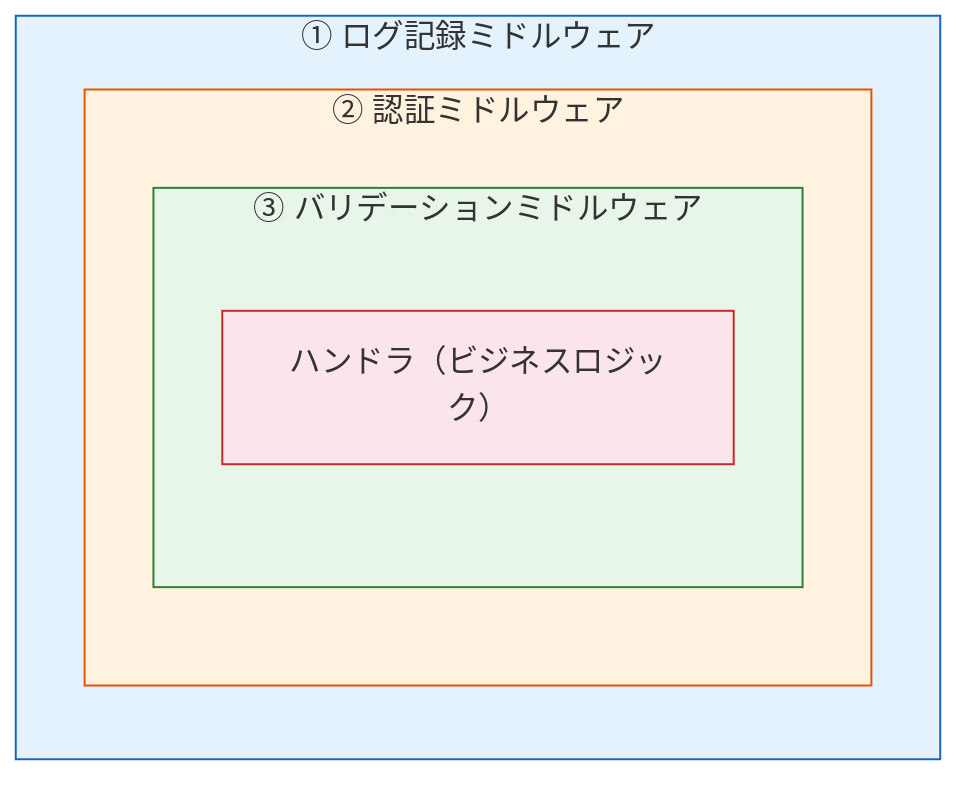
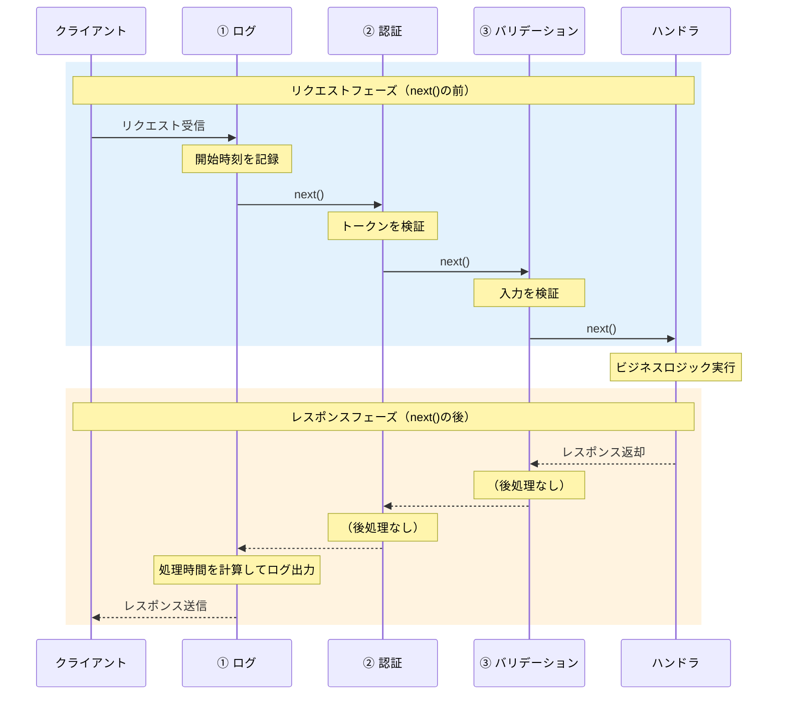

# 玉ねぎモデル（Onion Model）

> **一言で言うと:** ミドルウェアがリクエスト→ハンドラ→レスポンスの流れを**同心円状に包み込む**実行モデル。各ミドルウェアは `next()` の前でリクエストを処理し、`next()` の後でレスポンスを処理する。この「行きと帰り」の対称性がミドルウェア設計の本質。

## なぜ「玉ねぎ」なのか

ミドルウェアの実行順序を「リストの順に実行して終わり」と考えると、レスポンス時の後処理が理解できない。実際のミドルウェアは、玉ねぎの皮のようにハンドラを**入れ子で包んでいる**。



リクエストは外側の層から順に内側へ進み（①→②→③→ハンドラ）、レスポンスは逆に内側から外側へ戻る（ハンドラ→③→②→①）。各ミドルウェアは **往路（リクエスト）と復路（レスポンス）の両方で処理を実行できる**。

## 実行の流れ — `next()` が分水嶺

ミドルウェア内の `next()` 呼び出しが、リクエスト処理とレスポンス処理の境界になる。



このモデルの核心は、**`next()` の前に書いたコードはリクエスト時に実行され、`next()` の後に書いたコードはレスポンス時に実行される**という点にある。

## チェーンモデルとの対比

ミドルウェアの実行モデルには主に2つのアプローチがある。

| 観点 | チェーンモデル（Express） | 玉ねぎモデル（Koa） |
|------|--------------------------|---------------------|
| 実行の流れ | 一方向（上から下へ） | 双方向（行きと帰り） |
| 後処理 | イベント（`res.on('finish')`）で間接的に | `await next()` の後に直接書ける |
| エラーハンドリング | 別のエラーミドルウェア（4引数）に委譲 | try-catch で自然にキャッチ |
| 非同期制御 | コールバック＋next() | async/await |
| コードの見通し | 前処理と後処理が分離しがち | 1つの関数内で前処理と後処理がペアになる |

**Expressのチェーンモデル**では、レスポンスの後処理が`res.on('finish')` のようなイベントリスナーに分散する。一方、**Koaの玉ねぎモデル**では `await next()` の前後に自然に前処理・後処理を書ける。

Goの `func(http.Handler) http.Handler` パターンも構造的には玉ねぎモデルそのもので、`next.ServeHTTP(w, r)` の前後で処理を分けられる。

## コード例

### Koa（Node.js）— 玉ねぎモデルの最も直感的な表現

```typescript
import Koa from 'koa';
const app = new Koa();

// ① ログ記録ミドルウェア（最外層）
app.use(async (ctx, next) => {
  const start = Date.now();
  console.log(`--> ${ctx.method} ${ctx.url}`);

  await next(); // ここで②→③→ハンドラ→③→②が実行される

  // レスポンスフェーズ: next()の後
  const ms = Date.now() - start;
  ctx.set('X-Response-Time', `${ms}ms`);
  console.log(`<-- ${ctx.method} ${ctx.url} ${ctx.status} ${ms}ms`);
});

// ② 認証ミドルウェア
app.use(async (ctx, next) => {
  const token = ctx.get('Authorization');
  if (!token && ctx.path !== '/public') {
    ctx.throw(401, 'Authentication required');
    // ここでreturnされるため、next()は呼ばれない
    // → 内側のミドルウェアとハンドラは実行されない
  }
  ctx.state.user = { id: 'user-123' };

  await next();
  // 認証ミドルウェアの後処理（必要に応じて）
});

// ③ ハンドラ（最内層）
app.use(async (ctx) => {
  ctx.body = { message: 'Hello', user: ctx.state.user };
});

app.listen(3000);

// 出力例:
// --> GET /api/data
// <-- GET /api/data 200 5ms
```

### Go — `http.Handler` ラッパーパターン

```go
package main

import (
	"log"
	"net/http"
	"time"
)

// ① ログ記録ミドルウェア（最外層）
func logger(next http.Handler) http.Handler {
	return http.HandlerFunc(func(w http.ResponseWriter, r *http.Request) {
		start := time.Now()
		log.Printf("--> %s %s", r.Method, r.URL.Path)

		next.ServeHTTP(w, r) // ②→③→ハンドラ→③→② が実行される

		// レスポンスフェーズ
		log.Printf("<-- %s %s %v", r.Method, r.URL.Path, time.Since(start))
	})
}

// ② 認証ミドルウェア
func auth(next http.Handler) http.Handler {
	return http.HandlerFunc(func(w http.ResponseWriter, r *http.Request) {
		token := r.Header.Get("Authorization")
		if token == "" {
			http.Error(w, "unauthorized", http.StatusUnauthorized)
			return // next.ServeHTTPを呼ばない → 内側は実行されない
		}

		next.ServeHTTP(w, r)
	})
}

// ③ ハンドラ（最内層）
func handler(w http.ResponseWriter, r *http.Request) {
	w.Write([]byte(`{"message":"Hello"}`))
}

func main() {
	// 玉ねぎの組み立て: logger(auth(handler))
	// リクエスト: logger → auth → handler
	// レスポンス: handler → auth → logger
	h := logger(auth(http.HandlerFunc(handler)))
	http.ListenAndServe(":3000", h)
}
```

### Python（Starlette / FastAPI）— ASGIミドルウェア

```python
import time
from starlette.applications import Starlette
from starlette.middleware import Middleware
from starlette.middleware.base import BaseHTTPMiddleware
from starlette.requests import Request
from starlette.responses import JSONResponse
from starlette.routing import Route


class TimingMiddleware(BaseHTTPMiddleware):
    async def dispatch(self, request: Request, call_next):
        start = time.time()

        # リクエストフェーズ
        print(f"--> {request.method} {request.url.path}")

        response = await call_next(request)  # 内側を実行

        # レスポンスフェーズ
        ms = (time.time() - start) * 1000
        response.headers["X-Response-Time"] = f"{ms:.0f}ms"
        print(f"<-- {request.method} {request.url.path} {response.status_code} {ms:.0f}ms")
        return response


async def homepage(request: Request):
    return JSONResponse({"message": "Hello"})


app = Starlette(
    routes=[Route("/", homepage)],
    middleware=[Middleware(TimingMiddleware)],
)
```

## 玉ねぎモデルが活きる典型的なパターン

### 1. レスポンスタイム計測

`next()` の前後で時刻を記録するだけで、全リクエストの処理時間をログに残せる。チェーンモデルでは `res.on('finish')` のようなイベントベースの回避策が必要になる。

### 2. エラーの一括キャッチ

```typescript
// Koa: try-catch で全ミドルウェアのエラーをキャッチ
app.use(async (ctx, next) => {
  try {
    await next();
  } catch (err) {
    ctx.status = err.status || 500;
    ctx.body = { error: err.message };
    // ログ、アラート送信なども可能
  }
});
```

最外層のミドルウェアで `try-catch` を書くと、内側のどの層で例外が発生してもキャッチできる。これは玉ねぎモデルの入れ子構造が可能にする自然なエラーハンドリング。

### 3. トランザクション管理

```go
func transactionMiddleware(db *sql.DB) func(http.Handler) http.Handler {
    return func(next http.Handler) http.Handler {
        return http.HandlerFunc(func(w http.ResponseWriter, r *http.Request) {
            tx, _ := db.Begin()
            ctx := context.WithValue(r.Context(), txKey, tx)

            next.ServeHTTP(w, r.WithContext(ctx)) // ハンドラでtxを使う

            // レスポンスフェーズ: ステータスに応じてcommit/rollback
            if w.(*statusRecorder).status >= 400 {
                tx.Rollback()
            } else {
                tx.Commit()
            }
        })
    }
}
```

`next()` の前でトランザクションを開始し、`next()` の後で結果に応じてcommit/rollbackする。前処理と後処理がペアになる操作は、玉ねぎモデルで最も自然に表現できる。

## よくある落とし穴

### 1. `next()` の呼び忘れでリクエストがハングする

ミドルウェア内で `next()` を呼ばないと、リクエストは内側に進まずタイムアウトする。条件分岐で `next()` を呼ぶパスと呼ばないパスがある場合、意図しないルートで `next()` が抜け落ちがち。

```typescript
// ❌ elseで next() を呼び忘れ
app.use(async (ctx, next) => {
  if (ctx.path === '/skip') {
    ctx.body = 'skipped';
    // ここではnext()を呼ばない（意図的）→ OK
  }
  // else のケースでnext()がない → ハング
});

// ✅ 明示的にnext()を呼ぶ
app.use(async (ctx, next) => {
  if (ctx.path === '/skip') {
    ctx.body = 'skipped';
    return; // 早期リターン
  }
  await next();
});
```

### 2. `next()` を `await` し忘れて後処理が先に実行される

```typescript
// ❌ awaitなし → next()の完了を待たずに後処理が走る
app.use(async (ctx, next) => {
  const start = Date.now();
  next(); // awaitがない！
  console.log(`${Date.now() - start}ms`); // ほぼ0msになる
});

// ✅ awaitで完了を待つ
app.use(async (ctx, next) => {
  const start = Date.now();
  await next();
  console.log(`${Date.now() - start}ms`); // 正しい処理時間
});
```

### 3. レスポンスが送信された後にヘッダを変更しようとする

`next()` の後でレスポンスヘッダを追加する場合、レスポンスが既にストリーミング送信されていると変更できない。ヘッダはボディの送信前にしか設定できないため、フレームワークがレスポンスをバッファリングしているかどうかに注意。

### 4. ミドルウェアの登録順序と実行順序の混同

玉ねぎモデルでは、**最初に登録したミドルウェアが最外層**になる。つまり最初に登録したものが最初に実行され、最後に完了する。

```typescript
app.use(A); // 最外層: 最初に開始、最後に完了
app.use(B); // 中間層
app.use(C); // 最内層: 最後に開始、最初に完了

// 実行順: A前 → B前 → C前 → ハンドラ → C後 → B後 → A後
```

エラーハンドリングミドルウェアは最外層（最初に登録）にしないと、外側で発生するエラーをキャッチできない。

## 関連トピック

- [[ルーティングとミドルウェア]] — 親トピック。ミドルウェアの全体像と設計パターン
- [[CORS]] — 玉ねぎモデルで実装されるミドルウェアの代表例。プリフライト応答は `next()` を呼ばずに早期リターンする
- [[エラーハンドリング]] — 最外層の try-catch による一括エラーハンドリングは玉ねぎモデルの代表的な応用
