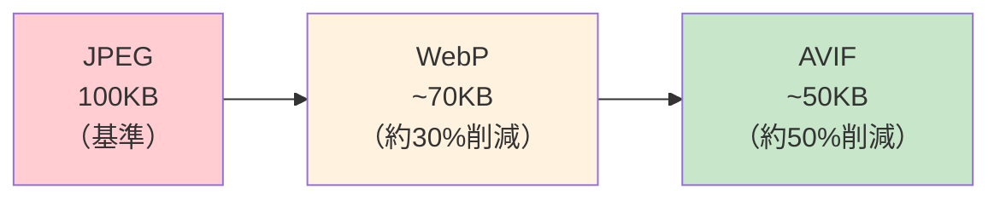
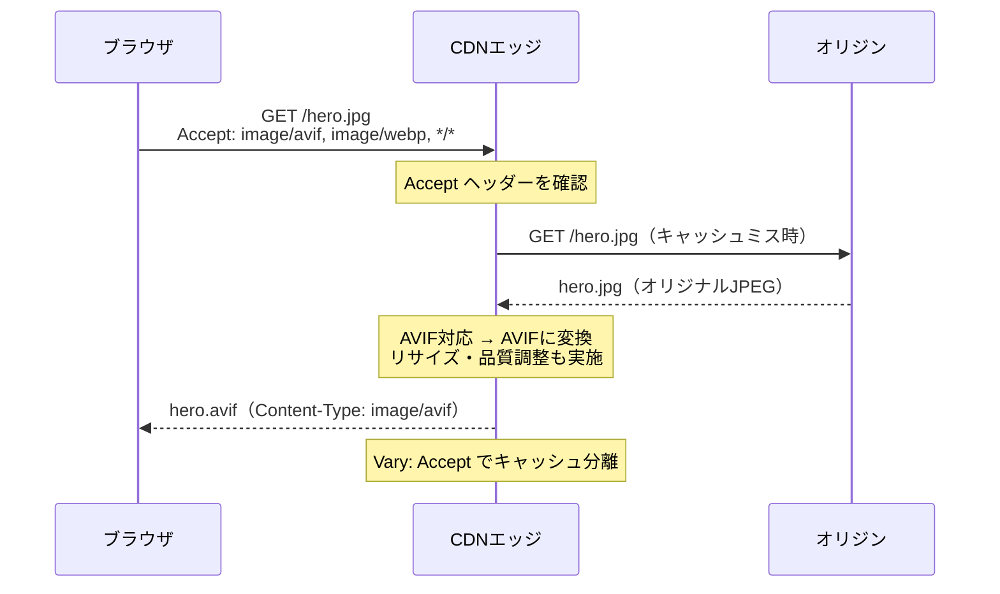
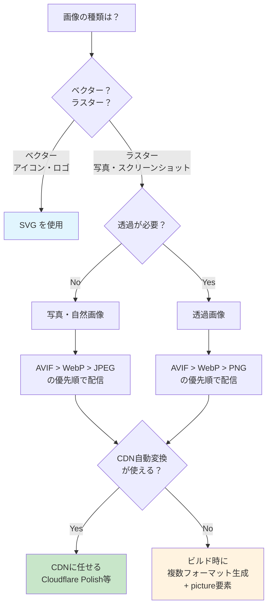

# 画像フォーマットと最適化（Image Formats and Optimization）

> **一言で言うと:** WebP/AVIFなどの次世代画像フォーマットとCDNの自動変換機能を組み合わせ、帯域を削減しつつ視覚品質を維持する。Lighthouseはこの最適化の検証・計測ツールとして機能する。

## なぜ画像最適化が重要か

Webページの転送量の**平均50%以上**を画像が占めている（HTTP Archive統計）。画像の最適化は:

- **LCP（Largest Contentful Paint）の改善** --- LCP要素の多くはヒーロー画像。画像のファイルサイズがLCPを直接左右する
- **帯域コストの削減** --- CDN経由の転送量が減ればコスト削減に直結
- **モバイルユーザー体験** --- 低速回線（3G/4G）では画像サイズの影響が顕著

## 主要な画像フォーマットの比較

| フォーマット | 圧縮 | 透過 | アニメーション | ブラウザ対応 | 用途 |
|---|---|---|---|---|---|
| **JPEG** | 非可逆 | ✗ | ✗ | 全ブラウザ | 写真・複雑な画像 |
| **PNG** | 可逆 | ✓ | ✗ | 全ブラウザ | ロゴ・スクリーンショット・透過が必要な画像 |
| **GIF** | 可逆（256色） | ✓ | ✓ | 全ブラウザ | 簡易アニメーション（非推奨→動画に置換） |
| **WebP** | 可逆/非可逆 | ✓ | ✓ | 全モダンブラウザ | JPEG/PNGの汎用的な代替 |
| **AVIF** | 非可逆（可逆も可） | ✓ | ✓ | Chrome, Firefox, Safari 16.4+ | 最高圧縮率。写真に特に有効 |
| **SVG** | ベクター | ✓ | ✓ | 全ブラウザ | アイコン・ロゴ・図形 |

### 圧縮効率の比較（同等の視覚品質で）



一般的な目安として、同じ視覚品質でJPEGと比較した場合:
- **WebP**: 25-35%のファイルサイズ削減
- **AVIF**: 40-60%のファイルサイズ削減

## WebP --- 現在のデファクトスタンダード

Googleが開発した画像フォーマット。VP8ベースの非可逆圧縮とWebP Lossless（可逆圧縮）の両方に対応する。

**強み:**
- JPEGとPNGの両方を1フォーマットで代替できる（非可逆 + 透過 + アニメーション）
- 全モダンブラウザが対応（IE11は非対応だが、もはや考慮不要）
- エンコード/デコードが高速

**弱み:**
- AVIFと比べると圧縮効率は劣る
- 非常に高品質な写真ではJPEGとの差が縮まる

## AVIF --- 最高の圧縮効率

AV1動画コーデックから派生した画像フォーマット。AOM（Alliance for Open Media: Google, Apple, Mozilla等が参加）が開発。

**強み:**
- 現在利用可能なフォーマットの中で最高の圧縮効率
- HDR（High Dynamic Range）、広色域に対応
- 写真・グラデーションの表現に特に優れる

**弱み:**
- エンコードが遅い（WebPの5-10倍程度）
- Safari 16.4+（2023年3月）で対応したが、古いiOS端末では未対応
- プログレッシブデコード非対応（画像全体をダウンロードするまで表示開始できない）

## CDNによる自動画像最適化

現代のCDNは、オリジンにアップロードされた画像をリクエスト時にブラウザの対応フォーマットに自動変換する。



### 主要CDNの画像最適化機能

| CDN | 機能名 | 自動変換 | リサイズ | 品質調整 |
|---|---|---|---|---|
| **Cloudflare** | Image Resizing / Polish | WebP, AVIF | URL パラメータ | 自動 or 手動 |
| **AWS CloudFront** | Lambda@Edge + Sharp | 手動実装 | 手動実装 | 手動実装 |
| **Imgix** | 画像CDN専用 | WebP, AVIF | URLパラメータ | URLパラメータ |
| **Cloudinary** | 画像CDN専用 | 自動（`f_auto`） | URLパラメータ | URLパラメータ（`q_auto`） |
| **Vercel** | Image Optimization | WebP, AVIF | `next/image` 連携 | 自動 |

## Lighthouse --- パフォーマンス監査ツール

Lighthouse はGoogleが開発したWebページの品質監査ツール。画像最適化に関する以下の監査項目がある:

### 画像関連の主な監査項目

| 監査項目 | 内容 | 影響する指標 |
|---------|------|-------------|
| **Serve images in next-gen formats** | WebP/AVIFへの変換推奨 | LCP, 転送量 |
| **Properly size images** | 表示サイズに対して大きすぎる画像の検出 | LCP, 転送量 |
| **Efficiently encode images** | 圧縮不足の画像の検出 | LCP, 転送量 |
| **Defer offscreen images** | ファーストビュー外の画像の遅延読み込み推奨 | LCP |
| **Image elements have explicit width and height** | CLS防止のためのサイズ指定確認 | CLS |
| **Preload Largest Contentful Paint image** | LCP画像のプリロード推奨 | LCP |

### Lighthouse の実行方法

```bash
# CLI でのLighthouse実行
npx lighthouse https://example.com \
  --output=json \
  --output-path=./report.json \
  --only-categories=performance

# 特定の監査項目のみ実行
npx lighthouse https://example.com \
  --only-audits=modern-image-formats,uses-optimized-images,offscreen-images
```

```bash
# Lighthouse CI（CI/CDパイプラインに組み込み）
npm install -g @lhci/cli

# lighthouserc.js で閾値を設定
# LCPが2.5秒以内、CLSが0.1以下であることを検証
lhci autorun
```

## コード例

### `<picture>` 要素によるフォーマット出し分け（HTML）

```html
<!-- ブラウザがサポートする最適なフォーマットを自動選択 -->
<picture>
  <!-- AVIF対応ブラウザはAVIFを使用（最高圧縮） -->
  <source srcset="/images/hero.avif" type="image/avif">
  <!-- WebP対応ブラウザはWebPを使用 -->
  <source srcset="/images/hero.webp" type="image/webp">
  <!-- フォールバック: すべてのブラウザで表示可能 -->
  
</picture>

<!-- レスポンシブ画像: デバイス幅に応じたサイズを提供 -->
<picture>
  <source
    srcset="/images/hero-400.avif 400w, /images/hero-800.avif 800w, /images/hero-1200.avif 1200w"
    sizes="(max-width: 600px) 100vw, (max-width: 1200px) 50vw, 1200px"
    type="image/avif"
  >
  <source
    srcset="/images/hero-400.webp 400w, /images/hero-800.webp 800w, /images/hero-1200.webp 1200w"
    sizes="(max-width: 600px) 100vw, (max-width: 1200px) 50vw, 1200px"
    type="image/webp"
  >
  
</picture>
```

### Sharp によるビルド時画像変換（Node.js）

```javascript
// build-images.js - ビルド時に複数フォーマットを生成
const sharp = require('sharp');
const fs = require('fs');
const path = require('path');

const SIZES = [400, 800, 1200];
const FORMATS = [
  { ext: 'avif', options: { quality: 50 } },  // AVIFはquality低めでも高品質
  { ext: 'webp', options: { quality: 75 } },
  { ext: 'jpg',  options: { quality: 80, mozjpeg: true } },
];

async function optimizeImage(inputPath) {
  const name = path.parse(inputPath).name;

  for (const size of SIZES) {
    for (const format of FORMATS) {
      const outputPath = `dist/images/${name}-${size}.${format.ext}`;
      await sharp(inputPath)
        .resize(size)        // 幅を指定、高さは自動算出
        .toFormat(format.ext, format.options)
        .toFile(outputPath);

      const stat = fs.statSync(outputPath);
      console.log(`${outputPath}: ${(stat.size / 1024).toFixed(1)}KB`);
    }
  }
}

// 使用例
optimizeImage('src/images/hero.jpg');
// dist/images/hero-800.avif: 32.1KB
// dist/images/hero-800.webp: 48.5KB
// dist/images/hero-800.jpg:  71.2KB
```

### Pillow による画像変換（Python）

```python
from PIL import Image
import pillow_avif  # pip install pillow-avif-plugin

def convert_image(input_path: str, sizes: list[int] = [400, 800, 1200]):
    img = Image.open(input_path)
    name = input_path.rsplit('.', 1)[0].rsplit('/', 1)[-1]

    for size in sizes:
        # アスペクト比を維持してリサイズ
        ratio = size / img.width
        resized = img.resize((size, int(img.height * ratio)), Image.LANCZOS)

        # WebP
        webp_path = f"dist/images/{name}-{size}.webp"
        resized.save(webp_path, "WEBP", quality=75)

        # AVIF
        avif_path = f"dist/images/{name}-{size}.avif"
        resized.save(avif_path, "AVIF", quality=50, speed=6)

        # JPEG（フォールバック）
        jpg_path = f"dist/images/{name}-{size}.jpg"
        resized.convert("RGB").save(jpg_path, "JPEG", quality=80, optimize=True)

convert_image("src/images/hero.jpg")
```

### Next.js の Image コンポーネント（自動最適化）

```tsx
// Next.js の next/image は自動で以下を行う:
// - WebP/AVIF への変換
// - デバイス幅に応じたリサイズ
// - 遅延読み込み（ファーストビュー外）
// - CLS防止のためのプレースホルダー

import Image from 'next/image';

// LCP画像: priority で遅延読み込みを無効化 + プリロード
export function HeroSection() {
  return (
    <Image
      src="/images/hero.jpg"
      alt="Hero image"
      width={1200}
      height={600}
      priority           // LCP画像には必須
      sizes="100vw"
      quality={75}
    />
  );
}

// ファーストビュー外の画像: デフォルトで遅延読み込み
export function ProductCard({ product }) {
  return (
    <Image
      src={product.imageUrl}
      alt={product.name}
      width={400}
      height={400}
      sizes="(max-width: 768px) 50vw, 25vw"
      placeholder="blur"         // ぼかしプレースホルダーでCLS防止
      blurDataURL={product.blurHash}
    />
  );
}
```

### Nginx での Accept ヘッダーに基づくフォーマット出し分け

```nginx
# オリジンサーバーでブラウザの対応フォーマットに応じて画像を返す
# CDNが Vary: Accept でフォーマット別にキャッシュを分離する前提

map $http_accept $webp_suffix {
    default   "";
    "~*webp"  ".webp";
}

map $http_accept $avif_suffix {
    default   "";
    "~*avif"  ".avif";
}

server {
    location ~* ^(/images/.+)\.(jpe?g|png)$ {
        # AVIFを優先、次にWebP、最後にオリジナル
        set $base $1;
        set $ext  $2;

        # AVIF版が存在し、ブラウザが対応していれば返す
        try_files ${base}.avif ${base}.webp $uri =404;

        # CDNがフォーマット別にキャッシュを分離するために必要
        add_header Vary "Accept";
        add_header Cache-Control "public, max-age=31536000, immutable";
    }
}
```

## Lighthouse CI による画像最適化の自動検証

```javascript
// lighthouserc.js
module.exports = {
  ci: {
    collect: {
      url: ['http://localhost:3000/', 'http://localhost:3000/products'],
      numberOfRuns: 3,
    },
    assert: {
      assertions: {
        // 次世代フォーマットを使用しているか
        'modern-image-formats': ['warn', { minScore: 0.9 }],
        // 画像サイズが適切か
        'uses-responsive-images': ['error', { minScore: 0.9 }],
        // 画像が効率的にエンコードされているか
        'uses-optimized-images': ['warn', { minScore: 0.9 }],
        // ファーストビュー外の画像が遅延読み込みされているか
        'offscreen-images': ['warn', { minScore: 0.9 }],
        // LCPが目標値以内か
        'largest-contentful-paint': ['error', { maxNumericValue: 2500 }],
      },
    },
    upload: {
      target: 'temporary-public-storage', // またはLHCI Server
    },
  },
};
```

## 画像最適化の判断フロー



## よくある落とし穴

### 1. WebPにすれば全て解決と思い込む

WebPへの変換だけでは不十分な場合が多い。画像の**リサイズ**（表示サイズに合わせたピクセル数の最適化）がファイルサイズに与える影響はフォーマット変換以上に大きい。2400px幅の画像を400px幅で表示しているなら、リサイズだけで90%以上削減できる。

### 2. AVIFのエンコード時間を見積もらない

AVIFのエンコードはJPEGやWebPの5-10倍遅い。ユーザーアップロード画像をリクエスト時にリアルタイム変換するとタイムアウトの原因になる。ビルド時の事前変換か、CDNのバックグラウンド変換を利用すべき。

### 3. Lighthouseのスコアだけを追い求める

Lighthouseはラボ環境（シミュレーション）のスコアであり、実ユーザーのフィールドデータとは異なる。Lighthouseで100点でも、低スペックモバイル端末では体験が悪い可能性がある。[[CoreWebVitals]]のフィールドデータ（CrUX）と併せて評価すべき。

### 4. Vary: Accept を忘れてCDNが不適切なフォーマットを返す

CDNが画像をキャッシュする際、`Vary: Accept` ヘッダーがないと、最初にキャッシュされたフォーマット（例: AVIF）がAVIF非対応ブラウザにも返される。Nginxやオリジンで `Vary: Accept` を必ず設定する。

### 5. 全画像をWebP/AVIFに変換してSVGを忘れる

アイコンやロゴなどのベクター画像はSVGが最適。SVGはスケーラブルで、小さいファイルサイズで任意の解像度に対応する。ラスター化（PNG/WebP）するとRetina対応で2倍・3倍のサイズが必要になり、かえって非効率。

## 関連トピック

- [[CDN]] --- 親トピック。画像最適化はCDNの主要機能の一つ
- [[CoreWebVitals]] --- LCPの改善に画像最適化が直結。Lighthouseはcore Web Vitalsの計測ツール
- [[エッジコンピューティング]] --- Lambda@EdgeやCloudflare Workersでの画像変換処理
- [[HTTP-HTTPS]] --- Accept ヘッダーによるコンテンツネゴシエーション、Vary ヘッダーによるキャッシュ分離

## 参考リソース

- [web.dev - Use WebP images](https://web.dev/articles/serve-images-webp) --- WebP導入の公式ガイド
- [web.dev - Use AVIF images](https://web.dev/articles/serve-images-avif) --- AVIF導入の公式ガイド
- [Squoosh](https://squoosh.app/) --- Google製の画像変換・比較ツール（ブラウザ上で動作）
- [Sharp Documentation](https://sharp.pixelplumbing.com/) --- Node.jsの高性能画像処理ライブラリ
- [Lighthouse Documentation](https://developer.chrome.com/docs/lighthouse/) --- Lighthouse公式ドキュメント
