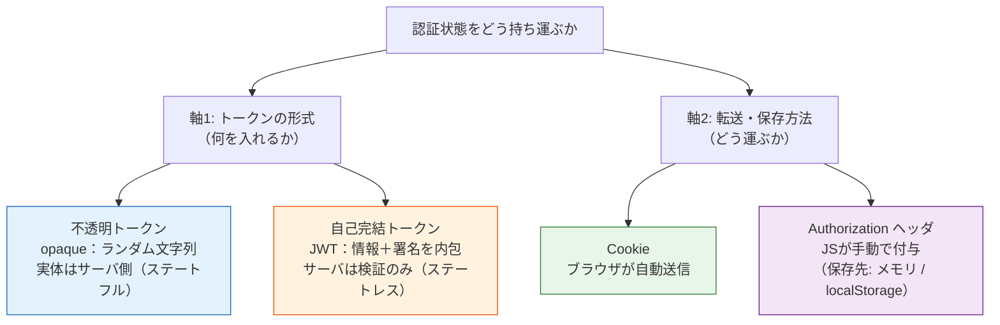
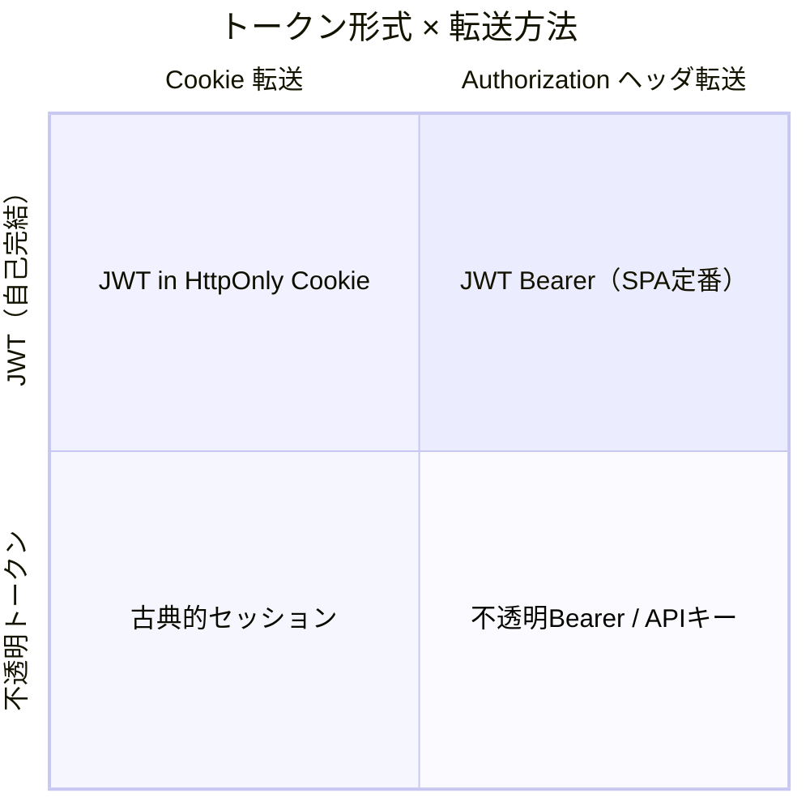
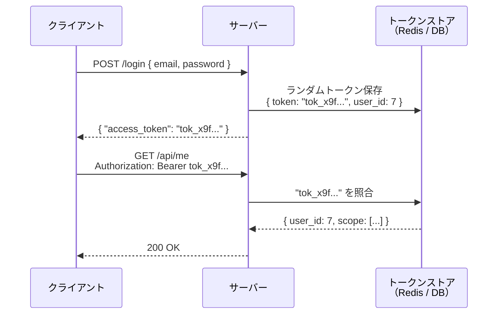
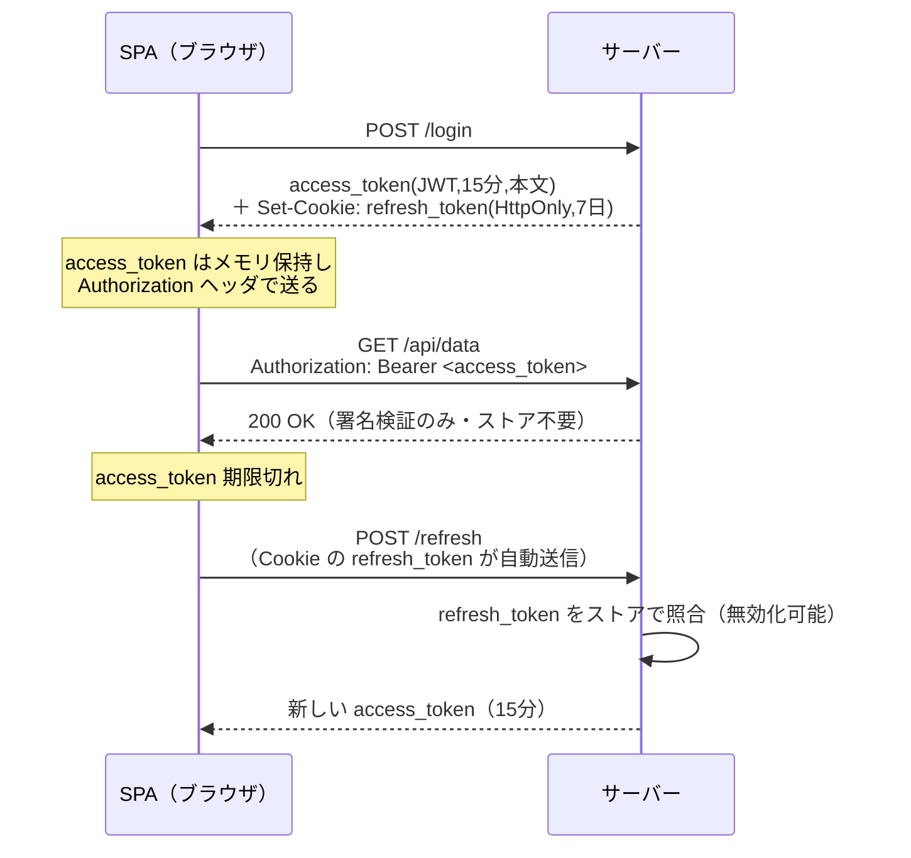
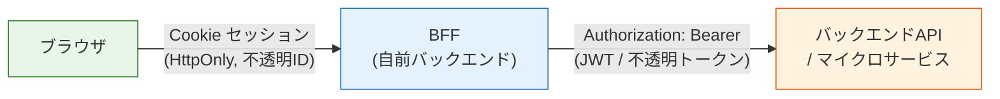
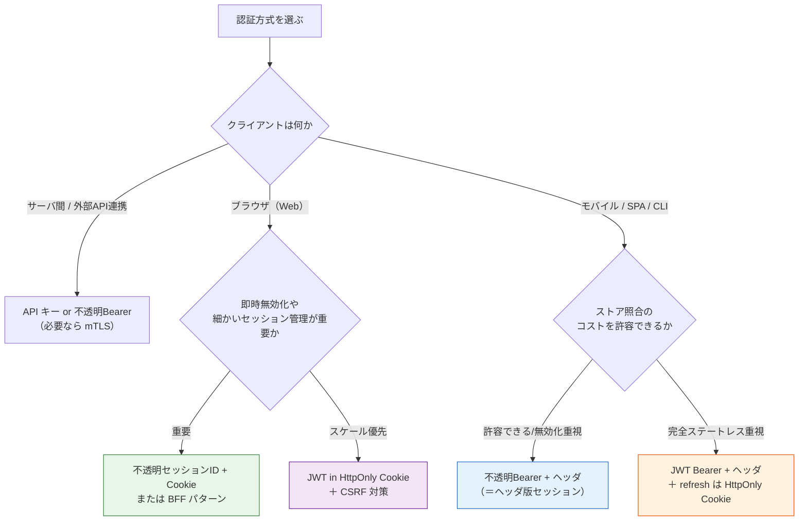

# 認証トークンの形式と転送方式（Token Format × Transport）

> **一言で言うと:** 「JWT か Cookie か」はそもそも**二択ではない**。JWT は**トークンの形式**（自己完結の署名トークンか、不透明なランダム文字列か）、Cookie は**トークンの転送・保存方法**（ブラウザが自動送信するか、`Authorization` ヘッダで手動送信するか）であり、**直交する別の軸**である。「JWT も Cookie も使わない」システムの正体は、ほとんどの場合「**不透明トークンを `Authorization` ヘッダで送る方式**」——つまり*ヘッダ転送版のサーバ側セッション*にすぎない。

## 「JWT or Cookie」という二択がなぜ誤りか

実務で「うちはJWT認証」「いやセッション（Cookie）認証だ」という会話をよく聞く。[[セッションとJWT]] の解説も、便宜上「セッション＝Cookie・ステートフル」「JWT＝ヘッダ・ステートレス」という典型構成を一断面として束ねている。これは入り口としては正しいが、**「JWT と Cookie が対立する選択肢だ」と誤解させやすい**。

実際には次の2つは**まったく別の問いに対する答え**である。

- **JWT** が答えるのは「**トークンに何を入れるか**」という*形式*の問い。中身（ユーザ情報）を署名付きでトークン自体に詰めるのか、それとも意味のないランダム文字列にして実体はサーバ側に置くのか。
- **Cookie** が答えるのは「**トークンをどう運ぶ・どこに置くか**」という*転送/保存*の問い。ブラウザに自動送信させる Cookie に置くのか、JavaScript が `Authorization` ヘッダに手で載せるのか。

「JWTもCookieも使わない」と見えたシステムは、**形式＝不透明トークン**かつ**転送＝ヘッダ**を選んだだけで、認証の枠組みから外れているわけではない。この2軸で捉え直すと、見慣れない方式もすべて同じ地図の上に置ける。

## 2つの直交する軸



### 軸1: トークンの形式

| 形式 | 中身 | サーバ側の状態 | 即時無効化 |
|------|------|--------------|-----------|
| **不透明トークン（opaque）** | 意味のないランダム文字列（例: `ghp_a1b2c3...`）。情報の実体はサーバ側ストアにある | **必要**（ストアで照合）＝ステートフル | **容易**（ストアから消すだけ） |
| **自己完結トークン（JWT）** | ユーザ情報＋有効期限＋署名を内包。デコードすれば中身が読める | **不要**（署名検証のみ）＝ステートレス | **困難**（有効期限まで有効。→ [[セッションとJWT]] のブラックリスト方式） |

> [!info] 用語ミニ辞典
> - **不透明トークン（Opaque Token）:** それ自体には意味のないランダム文字列。受け取ったサーバが DB / Redis を照合して初めてユーザを特定できる。「セッションID」も不透明トークンの一種。GitHub の Personal Access Token（`ghp_...`）、多くの OAuth プロバイダのアクセストークンがこれ。
> - **自己完結トークン（Self-contained Token）:** トークン自体にユーザ情報を含み、サーバ側ストアを引かずに検証できるトークン。JWT が代表例。「Bearer トークン」という言葉は*転送方法*（持参人方式）を指すだけで、中身が JWT か不透明かは問わない点に注意。

### 軸2: 転送・保存方法

| 方法 | 送信のされ方 | CSRF | XSS でのトークン窃取 | CORS |
|------|------------|------|-------------------|------|
| **Cookie** | ブラウザが対象オリジンへ**自動送信** | 自動送信ゆえ **CSRF 対策が必要**（`SameSite` / CSRF トークン） | `HttpOnly` 付きなら **JS から読めず安全** | クロスオリジンは `credentials` 設定が必要（→ [[CORS]]） |
| **Authorization ヘッダ** | JS が明示的に付与（自動送信されない） | 自動送信されないため **CSRF が原理的に成立しない** | `localStorage` 保存だと **XSS 1 発で窃取**。メモリ保持なら緩和 | プリフライト対象。設定は比較的単純 |

> Cookie と Authorization ヘッダは「片方が安全」ではなく、**リスクの所在が CSRF 側か XSS 側かに移るトレードオフ**である。ここを「ヘッダ転送だから安全」と単純化するのが典型的な落とし穴（後述）。

## 2×2 マトリクス — 4象限すべてが実在する

2つの軸を掛け合わせると、世の中の認証方式はきれいに4象限に収まる。



| | **Cookie 転送** | **Authorization ヘッダ転送** |
|---|---|---|
| **不透明トークン** | **古典的セッション**（session ID を Cookie で運ぶ）。SSR Web アプリの定番 | **不透明 Bearer トークン / API キー** ←「**JWT も Cookie も使わない**」の正体。実質ヘッダ転送版のセッション |
| **JWT** | **JWT in HttpOnly Cookie**。自動送信＋改ざん検知。ただし CSRF 対策が必要 | **JWT Bearer**。SPA / モバイル / マイクロサービス間の定番 |

ユーザが見かけた「JWTもCookieも使わない」システムは、ほぼ確実にこの表の**右下（不透明 Bearer / API キー）**に該当する。

## 「どちらも使わない」系の方式 — メリット・デメリット

### 不透明 Bearer トークン（DB / Redis 照合）— 最も多い「どちらも使わない」の実態

ログイン時にサーバが暗号論的に安全なランダム文字列を生成し、`token → user_id, scope, 有効期限` を Redis 等に保存する。クライアントは `Authorization: Bearer <token>` で毎回送り、サーバはストアを照合してユーザを特定する。



**これはセッションと本質的に同じ**（サーバ側に状態がある不透明トークン）。違いは「Cookie で運ぶか、ヘッダで運ぶか」という*転送軸*だけ。GitHub の Personal Access Token、多くの OAuth プロバイダのアクセストークン（不透明型を選んだ場合）がこの方式。

| メリット | デメリット |
|---------|-----------|
| **即時無効化が容易**（ストアから削除するだけ。漏洩・退職・パスワード変更に即応） | リクエストごとに**ストア照合が必要**（JWT のような完全ステートレスにはならない） |
| **CSRF が原理的に成立しない**（ヘッダ転送で自動送信されない） | トークンを `localStorage` に置くと **XSS で窃取**されうる（メモリ保持で緩和） |
| トークンに情報を含まないため**漏洩しても中身は読めない**（JWT は Base64 デコードで中身が読める） | クロスオリジンでは [[CORS]] のプリフライト設定が必要 |
| クライアント（SPA / モバイル / CLI / サーバ間）を問わず使える | ストア（Redis 等）の可用性が認証の単一障害点になりうる |

### API キー（サーバ間通信）

発行した長命の文字列を `Authorization: Bearer <key>` や `X-API-Key: <key>` で送る。ユーザ単位のログインではなく、**アプリ / サービス単位の認証**に使う（Stripe・SendGrid 等の外部 API 連携）。

- **メリット:** 実装が単純。ブラウザを介さないサーバ間通信に最適。スコープを絞って権限を限定できる。
- **デメリット:** 多くは長命で**ローテーションを怠ると漏洩リスクが累積**する。ブラウザ（フロントエンド）に置くと丸見えになるため、**フロントエンドのコードに API キーを埋め込んではならない**（バックエンド経由で中継する）。

### mTLS（クライアント証明書）— トークンが存在しない方式（軽く触れる）

TLS ハンドシェイク時にクライアントも証明書を提示し、**TLS 層で本人を特定**する（→ [[TLS-SSL]]）。アプリ層にトークンを乗せない、文字どおり「JWT も Cookie も使わない」方式。ゼロトラスト環境のサービス間通信や金融系で使われる。

- **メリット:** アプリ層に資格情報が流れない。中間者攻撃やトークン窃取に強い。
- **デメリット:** 証明書の発行・配布・失効（PKI 運用）が重い。ブラウザの一般ユーザ向けには不向き。

### HTTP Basic / Digest 認証（軽く触れる）

`Authorization: Basic base64(user:pass)` を**毎リクエスト送る**古典的方式。資格情報を毎回流す・ログアウトの概念が弱い等の理由で、ユーザ向けには原則非推奨。社内ツールや CI のような限定用途、あるいは他の認証で保護された区間でのみ使う。

## 「片方のみ」パターン

### JWT のみ（Cookie を使わず、ヘッダ転送）

SPA・モバイルアプリの定番。`Authorization: Bearer <JWT>` で送り、サーバはストアを引かずに署名検証だけで認証する。

- **向く場面:** 複数サーバ / マイクロサービスでセッションストアを共有したくない、モバイルやサードパーティ API。
- **注意:** `localStorage` 保存は **XSS でトークンを根こそぎ窃取される**。メモリ保持＋短命アクセストークンが基本。即時無効化が難しい点も JWT 共通の弱点（→ [[セッションとJWT]]）。

### Cookie のみ（JWT を使わず＝不透明セッションID）

古典的な SSR Web アプリの定番。`Set-Cookie: session_id=<不透明文字列>; HttpOnly; Secure; SameSite=Lax` でセッションIDを配り、サーバ側ストアで照合する。

- **向く場面:** サーバレンダリング中心の Web アプリ、即時無効化やきめ細かいセッション管理が要る業務システム。
- **注意:** Cookie は自動送信されるため **[[CSRF]] 対策（`SameSite` / CSRF トークン）が必須**。

## 「併用」パターン

### ① JWT を HttpOnly Cookie に入れる

「JWTの改ざん検知」と「Cookie の自動送信＋ `HttpOnly` による XSS 耐性」を両取りする構成。

- **利点:** JS からトークンを読めない（XSS でのトークン窃取を防ぐ）うえ、署名で改ざんを検知できる。
- **重要な注意:** **Cookie に入れた時点で「ヘッダ転送だから CSRF に強い」というメリットは消える**。ブラウザが自動送信するため、`SameSite=Lax/Strict` か CSRF トークンによる対策が**必須**になる（→ [[CSRF]]）。

### ② アクセストークン（ヘッダ/JWT）＋ リフレッシュトークン（HttpOnly Cookie）— 実務頻出

短命の **アクセストークン（JWT, メモリ保持, `Authorization` ヘッダ送信）** と、長命の **リフレッシュトークン（不透明, `HttpOnly` Cookie, サーバ側で無効化可能）** を組み合わせる。2つの軸を*役割ごとに使い分ける*ハイブリッドの代表。



- **狙い:** 通常の API アクセスは JWT の**ステートレスな高速検証**で捌き、無効化が必要なリフレッシュ操作だけ**サーバ側ストアで管理**する。漏洩時の影響を短命アクセストークンで限定しつつ、リフレッシュトークンは即時失効できる。

### ③ BFF（Backend for Frontend）パターン

ブラウザ↔BFF は **Cookie セッション（不透明）**、BFF↔バックエンド API は **Bearer / JWT** と、区間ごとに方式を分ける。ブラウザにトークンを一切露出させない構成で、近年の SPA セキュリティのベストプラクティスとして推奨される。



- **利点:** ブラウザには `HttpOnly` Cookie しか渡らない（XSS でのトークン窃取を構造的に防ぐ）。トークンの保管・更新はサーバ側に集約される。
- **コスト:** BFF というコンポーネントを1つ増やす運用負担。

## 選択の指針



## メリット・デメリット総まとめ表

| 方式（形式 × 転送） | 状態 | 即時無効化 | CSRF | 主な窃取リスク | 代表的な用途 |
|---|---|---|---|---|---|
| 不透明セッションID × Cookie | ステートフル | ◎ 容易 | 要対策（自動送信） | Cookie 窃取（`HttpOnly` で緩和） | 古典 SSR Web アプリ |
| **不透明Bearer × ヘッダ** | ステートフル | ◎ 容易 | ○ 原理的に不成立 | `localStorage` 保存時の XSS | API・SPA・「どちらも使わない」系 |
| API キー × ヘッダ | ステートフル | ○（鍵失効） | ○ 不成立 | 鍵の漏洩・埋め込み | サーバ間・外部API |
| JWT × Cookie(HttpOnly) | ステートレス | △ 困難 | **要対策**（自動送信） | 窃取は困難（HttpOnly）。主リスクは CSRF | Cookie 自動送信を活かしたい SPA |
| JWT × ヘッダ | ステートレス | △ 困難 | ○ 不成立 | `localStorage` 保存時の XSS | SPA・モバイル・サービス間 |
| mTLS（トークンレス） | — | ○（証明書失効） | ○ 不成立 | 秘密鍵の漏洩 | ゼロトラスト・金融系 |

## よくある誤解・落とし穴

### 1. 「JWT か Cookie か」を二択だと考える

最大の誤解。両者は直交する軸であり、`JWT × Cookie` も `不透明 × ヘッダ` も成立する。正しい問いは「**形式は不透明か JWT か**」と「**転送は Cookie かヘッダか**」を**別々に**決めること。

### 2. 「不透明＝安全 / JWT＝危険」あるいはその逆、という単純化

優劣ではなくトレードオフ。不透明トークンは即時無効化に強いがストア照合コストがかかる。JWT はスケールしやすいが即時無効化が難しい。「どちらが安全か」ではなく「**何を諦めて何を取るか**」で選ぶ。

### 3. 「ヘッダ転送だから CSRF 安全」で思考停止する

ヘッダ転送が CSRF に強いのは事実だが、その代償として**保存先（`localStorage` 等）が XSS 攻撃の標的**になる。リスクは消えるのではなく **CSRF → XSS へ移動する**。`localStorage` 直置きを避け、メモリ保持や `HttpOnly` Cookie との併用（②③パターン）で対処する。

### 4. 「不透明トークンはセッションではない」という思い込み

不透明トークンをヘッダで送る方式は、**転送経路が違うだけで本質はサーバ側セッションそのもの**。「セッション認証を捨ててトークン認証にした」と言いつつ中身が不透明トークンなら、ステートフルである点は何も変わっていない。

## コード例

### 不透明 Bearer トークン認証（Express / Node.js）

```javascript
const express = require('express');
const crypto = require('crypto');
const app = express();
app.use(express.json());

// 実運用では Redis 等。ここでは概念を示すための簡易ストア
const tokenStore = new Map(); // token -> { userId, expiresAt }

app.post('/login', async (req, res) => {
  // パスワード照合は省略（bcrypt.compare 等。→ [[パスワードハッシュ]]）
  const userId = 7;

  // 暗号論的に安全なランダム文字列＝不透明トークン（JWT ではない）
  const token = crypto.randomBytes(32).toString('base64url');
  tokenStore.set(token, {
    userId,
    expiresAt: Date.now() + 60 * 60 * 1000, // 1時間
  });

  // Cookie ではなくレスポンス本文で返す → クライアントは Authorization ヘッダで送る
  res.json({ access_token: token, token_type: 'Bearer' });
});

// 認証ミドルウェア: ヘッダのトークンをストアで照合（＝ヘッダ版セッション）
function requireAuth(req, res, next) {
  const header = req.headers.authorization || '';
  if (!header.startsWith('Bearer ')) {
    return res.status(401).json({ error: 'authentication required' });
  }
  const token = header.slice('Bearer '.length);
  const entry = tokenStore.get(token);
  if (!entry || entry.expiresAt < Date.now()) {
    return res.status(401).json({ error: 'invalid or expired token' });
  }
  req.userId = entry.userId;
  next();
}

// 即時無効化はストアから消すだけ（JWT には難しい芸当）
app.post('/logout', requireAuth, (req, res) => {
  tokenStore.delete(req.headers.authorization.slice('Bearer '.length));
  res.json({ message: 'logged out' });
});

app.get('/api/me', requireAuth, (req, res) => {
  res.json({ userId: req.userId });
});

app.listen(3000);
```

JWT 版（署名検証のみでストア照合不要）と比べると、**毎リクエストでストアを引く**代わりに **`logout` で即座に無効化できる**という非対称が一目で分かる。

### 不透明 Bearer トークン認証（Go / Chi）

同じ仕組みを Go で書くと、ストア照合の構造がより明示的に見える（[[セッションとJWT]] の JWT 版ミドルウェアと対比して読むとよい）。

```go
package main

import (
	"crypto/rand"
	"encoding/base64"
	"encoding/json"
	"net/http"
	"strings"
	"sync"
	"time"

	"github.com/go-chi/chi/v5"
)

type session struct {
	userID    int64
	expiresAt time.Time
}

// 実運用では Redis 等。ここでは概念を示すための簡易ストア（mutex で保護）
var (
	mu         sync.RWMutex
	tokenStore = map[string]session{}
)

// 暗号論的に安全なランダム文字列＝不透明トークン（JWT ではない）
func newToken() string {
	b := make([]byte, 32)
	rand.Read(b) // 本番では err を必ずチェック
	return base64.RawURLEncoding.EncodeToString(b)
}

func login(w http.ResponseWriter, r *http.Request) {
	// パスワード照合は省略（bcrypt 等。→ [[パスワードハッシュ]]）
	token := newToken()
	mu.Lock()
	tokenStore[token] = session{userID: 7, expiresAt: time.Now().Add(time.Hour)}
	mu.Unlock()

	// Cookie ではなくレスポンス本文で返す → クライアントは Authorization ヘッダで送る
	json.NewEncoder(w).Encode(map[string]string{
		"access_token": token, "token_type": "Bearer",
	})
}

// 認証ミドルウェア: ヘッダのトークンをストアで照合（＝ヘッダ版セッション）
func requireAuth(next http.Handler) http.Handler {
	return http.HandlerFunc(func(w http.ResponseWriter, r *http.Request) {
		h := r.Header.Get("Authorization")
		if !strings.HasPrefix(h, "Bearer ") {
			http.Error(w, `{"error":"authentication required"}`, http.StatusUnauthorized)
			return
		}
		token := strings.TrimPrefix(h, "Bearer ")
		mu.RLock()
		s, ok := tokenStore[token]
		mu.RUnlock()
		if !ok || s.expiresAt.Before(time.Now()) {
			http.Error(w, `{"error":"invalid or expired token"}`, http.StatusUnauthorized)
			return
		}
		// userID を context に格納してハンドラへ渡す（省略）
		next.ServeHTTP(w, r)
	})
}

func main() {
	r := chi.NewRouter()
	r.Post("/login", login)
	r.With(requireAuth).Get("/api/me", func(w http.ResponseWriter, r *http.Request) {
		w.Write([]byte(`{"message":"authenticated"}`))
	})
	http.ListenAndServe(":3000", r)
}
```

### mTLS（概念）— Nginx でクライアント証明書を要求する設定例

```nginx
server {
    listen 443 ssl;
    ssl_certificate     /etc/nginx/server.crt;
    ssl_certificate_key /etc/nginx/server.key;

    # クライアントにも証明書を要求（TLS 層で本人特定。アプリ層トークン不要）
    ssl_client_certificate /etc/nginx/ca.crt;
    ssl_verify_client on;

    location / {
        # 検証済みクライアント証明書の情報をアプリへ渡す
        proxy_set_header X-Client-DN $ssl_client_s_dn;
        proxy_pass http://backend;
    }
}
```

アプリケーションコードには `Authorization` ヘッダも Cookie も登場しない。認証は TLS ハンドシェイクで完結している。

## 関連トピック

- [[認証と認可]] — 親トピック。認証の全体像とセッション/JWT の基本
- [[セッションとJWT]] — 「ステートフル vs ステートレス」の詳細。本ドキュメントはその2軸への分解版
- [[CSRF]] — Cookie 自動送信が生む脆弱性。Cookie 転送を選ぶ／JWT を Cookie に入れる場合は必須対策
- [[CORS]] — ヘッダ転送・クロスオリジンでのトークン/Cookie 送信設定
- [[OAuth2とOpenID-Connect]] — 不透明アクセストークンと JWT(ID トークン) が同居する実例
- [[API設計-REST-GraphQL]] — API の認証スキーム（Bearer / API キー）設計
- [[HTTP-HTTPS]] — Cookie・`Authorization` ヘッダ・HTTPS の基盤
- [[TLS-SSL]] — mTLS（相互 TLS 認証）の土台

## 参考リソース

- RFC 6750 — OAuth 2.0 Bearer Token Usage（Bearer トークンの転送方法。形式は問わない）
- RFC 7519 — JSON Web Token (JWT) の仕様
- OWASP — Session Management Cheat Sheet / JSON Web Token for Java Cheat Sheet（保存場所とリスクの指針）
- IETF draft — OAuth 2.0 for Browser-Based Applications（BFF を3パターン中もっともセキュアと位置づけ）

## 理解度セルフチェック

> 答えられなければ本文に戻る。答えはこのファイル内に必ずある。

1. **「JWT認証」と「Cookie認証」が対立する二択ではない理由を30秒で説明せよ。** それぞれが「どの軸の問いに答えているか」に触れること。
2. **「JWTもCookieも使わない」と説明された認証システムの正体として最も可能性が高いものは何か。** なぜそれが「実質セッションと同じ」と言えるのかを述べよ。
3. **AI生成コードレビュー設問:** AI に「ステートレスでセキュアなSPA認証を作って」と頼んだところ、次の方針のコードが返ってきた。本文の観点で**問題点を最低3つ**指摘せよ。
   - ログイン時に有効期限30日の JWT を発行し、レスポンス JSON で返す
   - フロントエンドは受け取った JWT を `localStorage` に保存する
   - 以降のリクエストは `Authorization: Bearer <JWT>` で送る
   - ログアウトは `localStorage` から JWT を削除するだけ

> [!note]- 解答の指針
>
> > [!info] 用語ミニ辞典
> > - **Bearer トークン:** 「持参人（bearer）が権利を持つ」方式のトークン。`Authorization: Bearer <token>` で送る*転送方法*を指す語であり、中身が JWT か不透明トークンかは規定しない。鍵を持っている人＝正当な利用者とみなすため、漏洩＝なりすましに直結する。
> > - **ステートフル / ステートレス:** サーバがリクエスト間でユーザの状態（セッション）を保持するか否か。不透明トークンはストアに状態を持つ（ステートフル）、JWT はトークン自体が状態を運ぶ（ステートレス）。
> > - **即時無効化（Immediate Revocation）:** 漏洩・退職・パスワード変更時にトークンを直ちに使用不能にする能力。サーバ側ストアを持つ方式（不透明・セッション）は得意、JWT は苦手。
> > - **BFF（Backend for Frontend）:** フロントエンド専用の中継バックエンド。ブラウザとは Cookie セッション、API とは Bearer/JWT を話し、ブラウザにトークンを露出させない。
>
> 1. **JWT は「トークンの形式」（中身を署名付きで内包するか、不透明なランダム文字列にするか）という軸の答え**であり、**Cookie は「トークンの転送・保存方法」（ブラウザ自動送信か、`Authorization` ヘッダ手動送信か）という別の軸の答え**である。両者は直交しており、`JWT × Cookie`（HttpOnly Cookie に JWT）も `不透明 × ヘッダ`（不透明 Bearer）も成立する。だから「JWT か Cookie か」は同じ土俵の二択ではなく、**形式と転送をそれぞれ独立に選ぶ**のが正しい。
> 2. 最も可能性が高いのは **「不透明トークンを `Authorization` ヘッダ（Bearer）で送る方式」**。これは「JWT ではない（自己完結トークンでなく、実体はサーバ側ストアにある）」「Cookie ではない（ヘッダで手動送信）」を両方満たす。サーバはトークンをキーに Redis / DB を照合してユーザを特定しており、**状態をサーバ側に持つ＝セッションそのもの**。違いは運ぶ経路が Cookie かヘッダかだけなので「実質ヘッダ版のセッション」と言える。GitHub PAT や多くの OAuth アクセストークンがこの形。
> 3. AI生成コードの問題点（最低限以下を指摘できれば本文を理解している）:
>     - **有効期限30日の JWT が長すぎる** — JWT は即時無効化できないため、漏洩すると30日間なりすまし放題。短命アクセストークン（15分）＋ サーバ側で失効可能なリフレッシュトークンの2段階にすべき。
>     - **JWT を `localStorage` に保存** — XSS が1つでもあれば全トークンが窃取される。「ヘッダ転送だから CSRF に強い」と引き換えに XSS リスクへ移っているのに、最も危険な `localStorage` 直置きを選んでいる。メモリ保持や `HttpOnly` Cookie + リフレッシュ構成にすべき。
>     - **ログアウトが `localStorage` 削除だけ＝サーバ側で無効化できていない** — クライアントが消す前にトークンが漏れていれば、有効期限まで使われ続ける。「ステートレス」を選んだ代償として*そもそも即時無効化が要件なら JWT 単独は不適*で、不透明トークン or リフレッシュトークンのストア管理が必要。
>     - （加点）**「ステートレスでセキュア」という要件自体を疑う視点** — 即時ログアウト（無効化）が欲しいなら完全ステートレスとは両立しにくい。要件に応じて「不透明 Bearer（ヘッダ版セッション）」や「BFF パターン」の方が適切なこともある、と形式・転送の2軸で再検討するのが正解。
