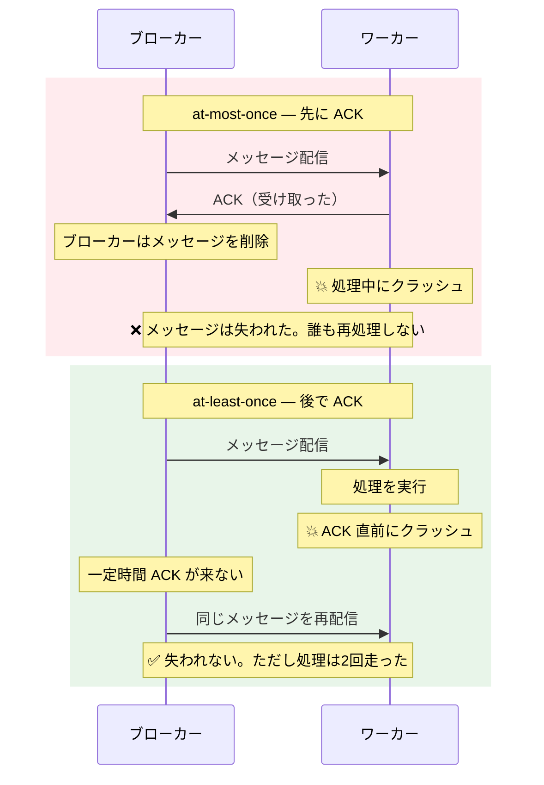
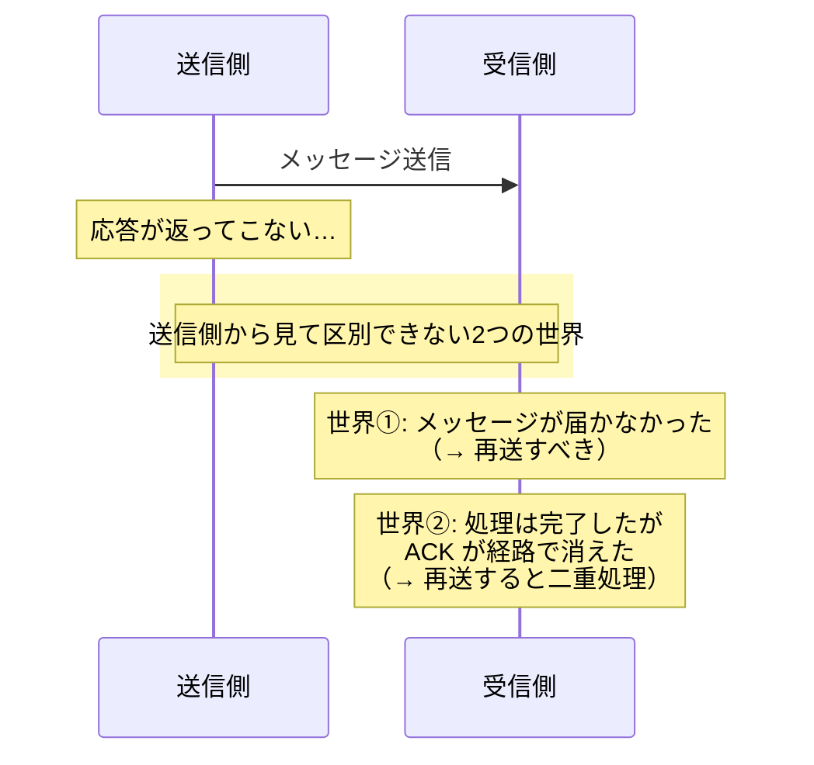
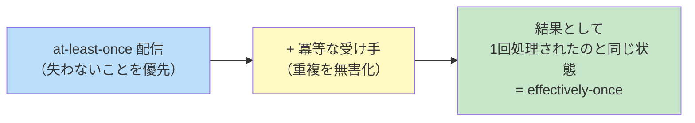
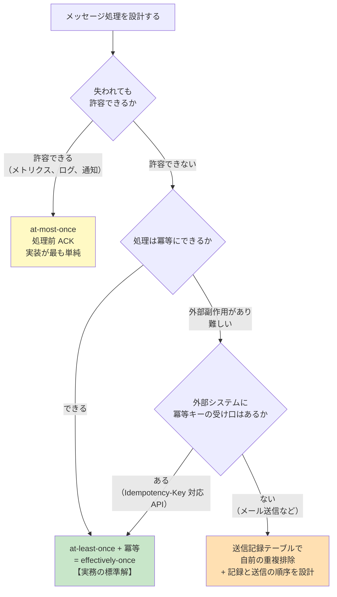

# 配信保証セマンティクス（Delivery Semantics）

> **一言で言うと:** メッセージングの配信保証には at-most-once / at-least-once / exactly-once の3種類があり、**exactly-once は分散システムでは原理的に達成できない**。実務で「1回だけ処理された」を実現する唯一の道は、**at-least-once で配信し、受け手を冪等にする**（effectively-once）ことである。

> [!info] 用語ミニ辞典（読み始める前に）
> - **セマンティクス（semantics / 意味論）** — 「その形が**何を意味し、どう振る舞うと約束されているか**」を指す語。**シンタックス（syntax / 構文 = どう書くか、どういう形か）と対になる概念**で、単なる「意味」ではなく **仕様として厳密に定義された振る舞いの取り決め** を指すときに使う（RFC 9110 のタイトルがそのまま "HTTP Semantics" であるように）。詳しい語源と HTTP 文脈での用例は [[RESTとRPC]] を参照
> - **配信保証セマンティクス** — したがって「**メッセージ配信が保証している約束の内容**」のこと。コードの見た目（`queue.add(message)`）はどのブローカーでもほぼ同じだが、「必ず1回以上届く」のか「届かないかもしれないが重複はしない」のかという**約束の中身**が違う。その違いの分類がこの文書の主題である
> - **ACK（acknowledgement / 確認応答）** — 受け手が「このメッセージを受け取った・処理し終えた」とブローカーに通知すること。これを返さないでいると、ブローカーは失敗とみなして再配信する

セマンティクスの取り決めが重要なのは、**周辺の仕組みがその約束を信じて動いている**からである。「at-least-once だ」と分かっていれば受け手を冪等に書くし、「at-most-once だ」と分かっていれば失われて困るデータには使わない。約束の中身を誤解したまま組むと、コード自体は正常に動いているのに**重複送金やメッセージの消失が起きる**。しかもシンタックスエラーと違い、コンパイラも実行時エラーも何も教えてくれない。

## 3つのセマンティクス

| セマンティクス | 意味 | 何が起こりうるか | 実現方法 |
|---|---|---|---|
| **at-most-once**（高々1回） | 重複しない。ただし**失われることがある** | メッセージロスト | 処理**前**に ACK を返す |
| **at-least-once**（少なくとも1回） | 失われない。ただし**重複することがある** | 重複処理 | 処理**後**に ACK を返し、ACK がなければ再送 |
| **exactly-once**（正確に1回） | 失われず、重複もしない | — | **分散システムでは達成できない**（後述） |

重要なのは、**at-most-once と at-least-once の違いが「ACK をいつ返すか」という1点だけ**で決まることだ。これは設定項目の名前を覚えるより、はるかに応用が効く理解になる。



Celery の `acks_late=True`、RabbitMQ の手動 ACK、SQS の `DeleteMessage` を処理後に呼ぶ設計 — これらはすべて**同じ1つの判断**、「ACK を処理の後ろに置く」ことの各実装での呼び名にすぎない。

## なぜ exactly-once は達成できないのか

理由は単純で、しかも回避不能である。**送信側は「相手に届かなかった」のか「届いたが ACK が失われた」のかを区別できない。**



送信側に許された選択肢は2つしかない。

- **再送する** → 世界②だったとき重複する = **at-least-once**
- **再送しない** → 世界①だったとき失われる = **at-most-once**

「両方避ける」選択肢は存在しない。これは実装の巧拙の問題ではなく、**信頼できない通信路の上では合意に到達できない**という理論的な限界であり、古典的には **二人の将軍問題（Two Generals' Problem）** として知られている。

> [!info] 用語ミニ辞典
> **二人の将軍問題** — 谷を挟んだ2つの軍が、伝令（途中で捕まりうる）だけで「同時に攻撃する」ことを合意できるか、という思考実験。答えは「有限回のやり取りでは合意できない」。最後の伝令が届いたか送り手には確認できず、その確認のための伝令もまた届いたか分からない、と無限に遡るため。**メッセージングの重複問題は、この問題の実務版である**

したがって、ブローカーやライブラリが「exactly-once 対応」と謳っているとき、**それが何の範囲で成り立つのかを必ず確認する**必要がある。多くの場合、後述するように限定された境界の内側でしか成立しない。

## 実務の答え: effectively-once

分散システムの現実解は決まっている。



**「重複を起こさない」のではなく「重複しても結果が変わらないようにする」。** 予防ではなく無害化で解く、という発想の転換がここにある。

冪等性そのものの実装パターン（UPSERT、条件付き UPDATE、冪等キー追跡テーブル）は [[データ書き込みの冪等性設計]] に詳しい。ここでは**配信保証の文脈で特に効いてくる点**を扱う。

### 重複排除の「窓」という制約

重複排除テーブルは無限には持てない。放置すれば肥大化するので、24〜72時間程度の TTL（有効期限）を設けて古い記録を削除するのが一般的である。

ここに残る穴を認識しておく必要がある。**TTL を超えて遅れてきた重複メッセージは検知できない。** DLQ から数日後に手動で再投入したメッセージ、長時間停止していたコンシューマが復帰したときの滞留メッセージなどが該当する。

対策は2段構えにするのがよい。

1. **重複排除テーブル**（短期・高速）— 通常のリトライによる重複を吸収する
2. **DB の一意制約**（永続・確実）— `INSERT ... ON CONFLICT DO NOTHING` や、業務上の一意キー（注文番号、外部システムのイベント ID）に対する UNIQUE 制約

1 は最適化、**2 が本当の防御線**である。この優先順位を取り違えると、TTL 切れの重複が本番データを壊す。

### 何を「同じメッセージ」とみなすか

冪等キーの選択は、配信保証の設計で最も判断を要する部分である。

| キーの選び方 | 適する場面 | 注意点 |
|---|---|---|
| **メッセージ ID**（ブローカーが採番） | 単純なリトライの重複排除 | **プロデューサーが再送すると別 ID になる**ため、上流の重複は検知できない |
| **業務上の一意キー**（注文番号、`user_id + date`） | 最も堅牢。DB の UNIQUE 制約と直結できる | 「同じ操作」の定義がビジネスルールに依存する |
| **外部システムのイベント ID**（Stripe の `event.id` 等） | Webhook の重複配信 | 外部が一意性を保証してくれる。最も素直 |
| **ペイロードのハッシュ** | キーが取れない場合の代替 | 「意図的な同一操作の再実行」（同じ商品をもう一度買う）と区別できない |

**メッセージ ID を選んだ場合の穴**は特に見落とされやすい。プロデューサー側がタイムアウトして同じ内容を再送すると、ブローカーは2つの異なるメッセージとして扱い、コンシューマから見れば ID が違うので重複と判定できない。**上流の重複まで防ぐには、業務上の一意キーが必要になる。**

## ブローカーの「exactly-once」は何を保証しているか

### Amazon SQS FIFO キュー

SQS FIFO は「exactly-once 処理」を謳うが、実際の仕様は **`MessageDeduplicationId` による、5分間の重複排除ウィンドウ**である。

- 5分以内に同じ重複排除 ID で送られたメッセージは、2通目以降が破棄される
- **5分を超えれば別のメッセージとして受け付けられる**
- コンシューマ側の重複（Visibility Timeout 超過による再配信）は、この機能の対象外

つまり「プロデューサーが短時間にリトライした場合の重複を、ブローカー側で吸収する」機能であり、**エンドツーエンドの exactly-once ではない**。加えて FIFO キューはスループット上限が標準キューより厳しく、順序保証と引き換えに並列度を失う。

### Apache Kafka の Exactly-Once Semantics（EOS）

Kafka の EOS は、2つの機構の組み合わせで成り立っている。

| 機構 | 何を解決するか |
|---|---|
| **冪等プロデューサー**（`enable.idempotence=true`） | プロデューサーが producer ID と連番を付与し、ブローカー側が連番の重複を破棄する。**ネットワークリトライによる重複書き込み**を除去する |
| **トランザクション**（`transactional.id` + `sendOffsetsToTransaction`） | 「読む → 処理する → 書く + オフセットをコミットする」を**原子的**に行う。コンシューマ側は `isolation.level=read_committed` で未コミットのメッセージを読み飛ばす |

これは強力だが、**境界は Kafka の内側にある**。read-process-write の書き込み先が Kafka のトピックだから原子性を保証できるのであって、

- ワーカーが**外部の DB** に書く
- ワーカーが**メールを送る**
- ワーカーが**決済 API を呼ぶ**

これらは Kafka のトランザクションに参加できない。**外部への副作用がある限り、コンシューマ側の冪等性は依然として必要**である。「Kafka を EOS 設定にしたから冪等性は不要」は、最も危険な誤読の一つ。

## 落とし穴: 設定が黙って at-most-once にしていることがある

「失われない方がまし」と考えて at-least-once を選んだつもりでも、**デフォルト設定が at-most-once になっている**ケースがある。

### Kafka の自動オフセットコミット

Kafka コンシューマの `enable.auto.commit` は既定で有効になっている。ここで正確に押さえるべきは、**このコミットが独立したタイマースレッドで走るのではなく、`poll()` の呼び出しの中で発火する**という点である。しかも、コミットされるのは **1つ前の `poll()` が返したレコード**のオフセットであり、**そのレコードを処理し終えたかどうかは一切参照されない**（`auto.commit.interval.ms`、既定 5秒 が経過していれば次の `poll()` で無条件にコミットされる）。

つまり危険なのは「時間が経つこと」ではなく、**処理を終える前に次の `poll()` を呼ぶこと**である。

```
poll() #1 → メッセージ 100〜199 を取得
  ↓
100〜149 だけ処理し、残りをワーカースレッドに投げて先へ進む
  ↓
poll() #2 → ここでオフセット 200 がコミットされる（150〜199 の完了は見ていない）
  ↓
ワーカーがクラッシュ 💥
  ↓
再起動後、オフセット 200 から再開 → メッセージ 150〜199 は永久に処理されない
```

逆に言えば、**1回の `poll()` が返したレコードを、次の `poll()` を呼ぶ前に必ず処理し切る**ループになっていれば、自動コミットのままでも実質 at-least-once になる。事故が起きるのは次のような設計である。

- レコードをスレッドプールやチャネルに**投げっぱなし**にして即座に次の `poll()` へ進む
- 非同期処理（Promise / goroutine）を待たずにループを回す
- バッチの一部でエラーが出たときに、残りを飛ばして次の `poll()` へ進む

さらに、**librdkafka 系のクライアント（confluent-kafka-python / -go、node-rdkafka）ではもう一段リスクが高い。** これらは `enable.auto.offset.store` が既定で有効で、**メッセージをアプリケーションに引き渡した時点でオフセットが記録済みになる**。その後は処理の成否と無関係にコミットされるため、素直なループを書いていてもロストしうる。

**いずれの場合も、メッセージロストは例外もログも出さずに起きる。** 検知が非常に難しい種類の障害である。安全側に倒すなら `enable.auto.commit=false`（librdkafka 系ではあわせて `enable.auto.offset.store=false`）にして、**処理完了後に明示的にコミットする**。

### Celery の `acks_late`

Celery の `acks_late` は既定で `False` — つまりタスクを**受け取った時点で ACK** する at-most-once である。ワーカーが処理中にクラッシュすればタスクは消える。at-least-once にするには明示的に `acks_late=True` を設定する（あわせてタスクを冪等にすること）。

### 「ジョブが時々消える」の切り分け

キューを使ったシステムで「たまにメール未着がある」といった症状が出たら、まずこの順に確認する。

1. **ACK / コミットのタイミング** — 処理前になっていないか
2. **プロデューサー側の確認応答** — ブローカーへの書き込みが成功したことを確認しているか（RabbitMQ の publisher confirms、Kafka の `acks=all`）
3. **DB 書き込みとキュー投入の隙間** — Transactional Outbox になっているか（親トピック参照）
4. **エラーの握りつぶし** — `try-catch` で例外を飲み込んで ACK していないか

## 判断フロー



**重複排除の受け口がない外部システム（典型はメール送信 API）** をどう扱うかは、最後まで残る難所である。送信記録を先に書けば「記録したが送っていない」、後に書けば「送ったが記録していない」— どちらかの不整合が必ず残る。実務では **「先に記録 → 送信 → 記録を確定」の3段階**にして、中間状態のレコードを後から突き合わせる（送信済みか外部 API の履歴と照合する）運用にすることが多い。**完全な解がないことを理解した上で、どちらの不整合を受け入れるかを決めるのが設計判断**である。

## コード例

### TypeScript — SQS コンシューマの effectively-once 実装

```typescript
import {
  SQSClient,
  ReceiveMessageCommand,
  DeleteMessageCommand,
} from "@aws-sdk/client-sqs";

const sqs = new SQSClient({});
const QUEUE_URL = process.env.QUEUE_URL!;

/**
 * at-least-once 配信を前提に、冪等な処理で effectively-once を作る。
 * ポイントは3つ:
 *   1. DeleteMessage（= ACK）は処理が完全に終わってから呼ぶ
 *   2. 重複判定は「業務上の一意キー」で行う（メッセージ ID ではない）
 *   3. 判定と処理を同一トランザクションに入れ、一意制約を最終防衛線にする
 */
async function pollOnce(): Promise<void> {
  const res = await sqs.send(
    new ReceiveMessageCommand({
      QueueUrl: QUEUE_URL,
      MaxNumberOfMessages: 10,
      WaitTimeSeconds: 20, // ロングポーリング（空振りのリクエスト課金を減らす）
      // VisibilityTimeout は「処理の最大所要時間 + マージン」に設定する。
      // 短すぎると処理中に再配信され、重複が増える
      VisibilityTimeout: 120,
    }),
  );

  for (const message of res.Messages ?? []) {
    const body = JSON.parse(message.Body!);

    try {
      await handleOrderCreated(body);

      // 処理が成功して初めて削除する = at-least-once
      // ここより前に削除すると at-most-once になり、クラッシュでメッセージが消える
      await sqs.send(
        new DeleteMessageCommand({
          QueueUrl: QUEUE_URL,
          ReceiptHandle: message.ReceiptHandle!,
        }),
      );
    } catch (err) {
      // 削除しない = Visibility Timeout 経過後に再配信される。
      // リトライ上限を超えたメッセージは、キューの Redrive ポリシーで DLQ に移送される
      console.error({ msg: "処理に失敗、再配信を待つ", orderId: body.orderId, err });
    }
  }
}

async function handleOrderCreated(payload: { orderId: string; email: string }) {
  // 業務上の一意キー（orderId + 処理種別）で重複を判定する。
  // メッセージ ID ではプロデューサー側の再送を検知できない
  const key = `order-confirmation:${payload.orderId}`;

  // 【段階1】「これから処理する」という枠を先に確保する。
  // 一意制約が競合を弾くので、並行して届いた重複メッセージは 0 件挿入になる。
  // トランザクションはこの1文だけで完結させ、外部 I/O は絶対に中に入れない
  // （外部 API の応答を待つ間トランザクションが開きっぱなしになり、
  //   ロック保持とコネクション枯渇の原因になる）
  const claimed = await db.processedEvent.createMany({
    data: [{ key, status: "processing" }],
    skipDuplicates: true, // 一意制約違反を例外にせず 0 件挿入として扱う
  });

  if (claimed.count === 0) {
    // 既に他のワーカーが確保済み、または処理済み。副作用は起こさずに抜ける
    return;
  }

  try {
    // 【段階2】トランザクションの外で副作用を実行する。
    // 冪等キーを渡せる相手（決済 API など）には必ず渡す。
    // ここでクラッシュするとレコードは 'processing' のまま残る（後述）
    await sendOrderConfirmationMail(payload.email, payload.orderId, {
      idempotencyKey: key,
    });

    // 【段階3】成功を確定させる
    await db.processedEvent.update({ where: { key }, data: { status: "done" } });
  } catch (err) {
    // 失敗したら枠を解放し、再配信での再試行を可能にする。
    // これを忘れると 'processing' のまま残り、リトライしても
    // 段階1で 0 件挿入になって「永久に送信されない」状態になる
    await db.processedEvent.delete({ where: { key } }).catch(() => {});
    throw err;
  }
}
```

### Go — Kafka: 自動コミットを切って at-least-once にする

```go
package main

import (
	"context"
	"log"

	"github.com/twmb/franz-go/pkg/kgo"
)

func main() {
	client, err := kgo.NewClient(
		kgo.SeedBrokers("localhost:9092"),
		kgo.ConsumeTopics("orders"),
		kgo.ConsumerGroup("order-worker"),

		// 【最重要】自動コミットを無効化する。
		// 有効のままだと処理の完了と無関係にオフセットが進み、
		// クラッシュ時に未処理メッセージが静かに失われる（at-most-once 化）
		kgo.DisableAutoCommit(),

		// トランザクション対応プロデューサーが書いたメッセージのうち、
		// コミット済みのものだけを読む
		kgo.FetchIsolationLevel(kgo.ReadCommitted()),
	)
	if err != nil {
		log.Fatalf("Kafka クライアントの生成に失敗: %v", err)
	}
	defer client.Close()

	ctx := context.Background()
	for {
		fetches := client.PollFetches(ctx)
		if errs := fetches.Errors(); len(errs) > 0 {
			log.Printf("fetch エラー: %v", errs)
			continue
		}

		succeeded := true
		fetches.EachRecord(func(record *kgo.Record) {
			// handleRecord は冪等に実装しておく。
			// オフセットコミット直前のクラッシュで同じレコードが再配信されるため
			if err := handleRecord(record); err != nil {
				log.Printf("処理失敗 offset=%d: %v", record.Offset, err)
				succeeded = false
			}
		})

		// 全件の処理が成功したときだけオフセットを進める。
		// 失敗があれば次回同じ位置から再開する = 再処理される（冪等性が前提）
		if succeeded {
			if err := client.CommitUncommittedOffsets(ctx); err != nil {
				log.Printf("オフセットのコミットに失敗（次回再処理される）: %v", err)
			}
		}
	}
}

func handleRecord(record *kgo.Record) error {
	// 業務上の一意キーで重複排除してから副作用を実行する
	return nil
}
```

### Python — Celery: 既定の at-most-once から抜け出す

```python
from celery import Celery

app = Celery("tasks", broker="redis://localhost:6379/0")


@app.task(
    bind=True,
    # 既定は False（= 受信時に ACK する at-most-once）。
    # True にすると処理完了後に ACK するため、クラッシュ時に再配信される
    acks_late=True,
    # ワーカープロセスが強制終了された場合も再配信対象にする。
    # acks_late=True だけでは SIGKILL 等で消えるケースが残る
    reject_on_worker_lost=True,
    max_retries=5,
    retry_backoff=True,       # 指数バックオフ
    retry_jitter=True,        # 同時リトライの集中を避ける
)
def send_order_confirmation(self, order_id: str) -> None:
    """at-least-once 前提のタスク。冪等性は自分で担保する。

    前提となるテーブル定義:
        CREATE TABLE processed_events (
            key        TEXT PRIMARY KEY,          -- 冪等キー。一意制約が最終防衛線
            status     TEXT NOT NULL DEFAULT 'processing',
            created_at TIMESTAMPTZ NOT NULL DEFAULT NOW()
        );
    """
    key = f"order-confirmation:{order_id}"

    # 一意制約を最終防衛線にする。
    # 「SELECT で存在チェック → INSERT」は競合で二重挿入されうるため、
    # 挿入を先に試みて、その成否で判定する
    inserted = db.execute(
        """
        INSERT INTO processed_events (key, status)
        VALUES (%s, 'processing')
        ON CONFLICT (key) DO NOTHING
        """,
        (key,),
    )

    if inserted.rowcount == 0:
        # 既に処理済み。再配信されただけなので何もしない
        return

    try:
        mail.send_order_confirmation(order_id)
    except TransientMailError as exc:
        # 一時的な障害はリトライする。
        # 注意: この時点で processed_events には行が入っているため、
        #       リトライ時に「処理済み」と誤判定される。
        #       そのため失敗時は記録を取り消してから再送する
        db.execute("DELETE FROM processed_events WHERE key = %s", (key,))
        raise self.retry(exc=exc)
    except PermanentMailError:
        # 恒久的なエラー（宛先不正など）はリトライせず DLQ 相当へ。
        # 行は残したまま status だけ倒すので、再配信されても再送はされない
        db.execute(
            "UPDATE processed_events SET status = 'failed' WHERE key = %s",
            (key,),
        )
        raise
    else:
        # 正常終了。処理済みとして確定させる
        db.execute(
            "UPDATE processed_events SET status = 'done' WHERE key = %s",
            (key,),
        )
```

> [!note] 上のコードが示している非自明な点
> 「処理済みを先に記録してから副作用を実行する」設計は、**失敗時の取り消しまで含めて初めて成立する**。記録だけ残って副作用が実行されないと、リトライしても「処理済み」と判定されて永久に送信されない。冪等性の実装は「重複を防ぐ」側だけを見ていると、この**逆方向の穴**を作りやすい。

## 実務での使用シーン

| シーン | 選ぶセマンティクス | 冪等キー |
|---|---|---|
| 決済 Webhook の受信（Stripe など） | at-least-once + 冪等 | 外部システムの `event.id` |
| 注文確認メールの送信 | at-least-once + 送信記録テーブル | `order_id + メール種別` |
| アクセスログ / メトリクスの収集 | at-most-once で十分 | 不要（1件欠けても統計に影響しない） |
| 在庫の増減 | at-least-once + 条件付き UPDATE | 操作 ID + 楽観ロック |
| 日次集計バッチの起動 | at-least-once + DELETE→INSERT | 対象日付 |
| マイクロサービス間のイベント連携 | at-least-once + Outbox + 冪等コンシューマ | イベント ID（ULID / UUID） |

**「ログやメトリクスは at-most-once で十分」**という判断ができることも重要である。すべてを最高強度で守ろうとすると、実装コストとレイテンシに見合わない。**失われて困るのかを問う**のが最初の一歩になる。

## AI実装のアンチパターン

| アンチパターン | なぜ問題か | レビュー観点 / 対策 |
|---|---|---|
| 「Kafka を exactly-once 設定にしたので冪等性は不要」と結論づける | EOS の保証は Kafka 内部の read-process-write に限られる。外部 DB・メール・決済 API への副作用は対象外 | 副作用の宛先が Kafka の外なら、コンシューマ側の冪等性は必須 |
| Kafka コンシューマで `enable.auto.commit` を既定のまま、レコードを非同期に処理する | 自動コミットは `poll()` の中で「**前回の `poll()` が返したレコード**」のオフセットを、処理完了を確認せずにコミットする。ワーカースレッドへ投げっぱなしにして次の `poll()` を呼ぶ設計だと、メッセージが**無言で**失われる | `enable.auto.commit=false` + 処理後の明示コミット。librdkafka 系は `enable.auto.offset.store=false` も併せて設定 |
| Celery で `acks_late` を設定しない | 既定は at-most-once。ワーカーのクラッシュでタスクが消える | `acks_late=True` + `reject_on_worker_lost=True` + 冪等なタスク |
| 重複判定に「ブローカーのメッセージ ID」を使う | プロデューサー側の再送では ID が変わるため、上流の重複を検知できない | 業務上の一意キー、または外部システムのイベント ID を使う |
| `SELECT` で存在チェック → なければ `INSERT` | 並行実行時に両方が「存在しない」と判定して二重挿入される（TOCTOU） | `INSERT ... ON CONFLICT DO NOTHING` の戻り行数で判定し、一意制約を防衛線にする |
| SQS FIFO を指定して「exactly-once 達成」とする | 実際は5分間の重複排除ウィンドウ。コンシューマ側の再配信は対象外。スループットも制限される | 順序保証が本当に必要かを問い直し、冪等性は別途実装する |
| 重複排除テーブルに TTL を設けない / TTL だけに頼る | 前者は肥大化、後者は TTL を超えた重複を取りこぼす | 短期の重複排除テーブル + 永続的な UNIQUE 制約の2段構え |
| 「処理済み」を先に記録し、失敗時に取り消さない | リトライ時に処理済みと誤判定され、副作用が永久に実行されない | 失敗時のロールバック、または「処理中 / 完了 / 失敗」の状態遷移で管理 |
| `try-catch` で全例外を握りつぶして ACK する | at-least-once のつもりが実質 at-most-once。障害が可視化されない | エラー種別で分類し、リトライ / DLQ を使い分ける。メトリクスに出す |

→ レイヤー横断のアンチパターン索引: [[_anti-patterns/_index|AIアンチパターン索引]] / [[_anti-patterns/レイヤー別/Layer5|Layer 5 パフォーマンス アンチパターン集]]

## 参考リソース

- **書籍**: 『Designing Data-Intensive Applications』（Martin Kleppmann）第11章 — ストリーム処理における配信保証と耐障害性
- **Web**: Confluent, "Exactly-Once Semantics Are Possible: Here's How Kafka Does It" — Kafka の EOS が何をどこまで保証するかの一次情報
- **Web**: Amazon SQS FIFO キューの重複排除 — https://docs.aws.amazon.com/AWSSimpleQueueService/latest/SQSDeveloperGuide/FIFO-queues-exactly-once-processing.html
- **Web**: Celery Task Execution Options（`acks_late` の挙動） — https://docs.celeryq.dev/en/stable/userguide/tasks.html

## 関連トピック

- [[非同期処理とメッセージキュー]] — 親トピック。Producer/Consumer、DLQ、Transactional Outbox の全体像
- [[データ書き込みの冪等性設計]] — 冪等性を DB レベルでどう実装するか（UPSERT、条件付き UPDATE、冪等キー）
- [[トランザクション]] — 「処理済み記録」と副作用を原子的にまとめるための基礎
- [[TOCTOU]] — 「存在チェック → 挿入」が競合で壊れる理由
- [[エラーハンドリングとフォールバックの設計戦略]] — リトライ可能 / 不可能なエラーの分類
- [[モニタリング]] — 失われたメッセージは例外を出さない。キュー深さ・DLQ 深さ・処理遅延の監視で検知する
