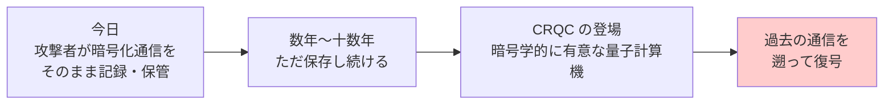
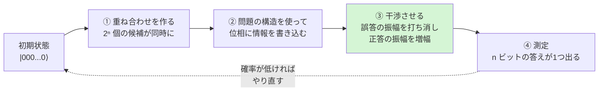
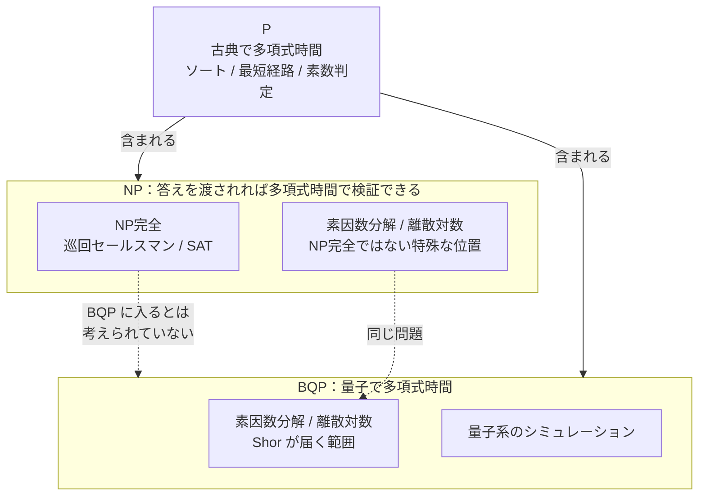

# 量子ビットと量子コンピュータ（Qubit / Quantum Computing）

> **一言で言うと:** 量子コンピュータは「あらゆる計算が速くなる魔法の箱」ではなく、**特定の構造を持った問題だけを別の計算量クラスに移す装置**である。Web エンジニアにとっての実害はただ一点、**公開鍵暗号（RSA / 楕円曲線）が原理的に破れる**ことに集約される。

## なぜ Web エンジニアがこれを知る必要があるのか

量子コンピュータは「いつか来るかもしれない未来の話」に見える。しかし2つの理由で、すでに**現在進行形の実務トピック**になっている。

1. **保存しておいて後で解読される（Harvest Now, Decrypt Later, HNDL）** — 今日 TLS で暗号化された通信を攻撃者がそのまま記録して保存し、十年後に量子コンピュータで遡って復号する、という攻撃モデル。「量子コンピュータが完成してから対策する」では**手遅れになる唯一の攻撃**である。
2. **対策はもう配線に入っている** — 主要ブラウザと CDN は 2024〜2025 年にかけて、TLS 1.3 の鍵交換を**耐量子ハイブリッド方式に既定で切り替えた**。つまり「量子対応」はすでにあなたのアプリのハンドシェイクで毎日走っている。仕組みを知らないまま、原因不明の接続失敗として遭遇する可能性がある（後述の ClientHello 肥大化問題）。



> [!info] 用語ミニ辞典：CRQC
> **CRQC（Cryptographically Relevant Quantum Computer、暗号学的に有意な量子コンピュータ）** — 現行の公開鍵暗号を現実的な時間で破れる規模・精度に達した量子コンピュータを指す業界用語。「量子コンピュータが存在するか」ではなく「**CRQC が存在するか**」が暗号移行の判断基準になる。実験室の数十量子ビット機は量子コンピュータではあるが CRQC ではない。

## 古典ビットと量子ビットは何が違うのか

古典的なビットは 0 か 1 のどちらかである。量子ビット（qubit）は、**2つの複素数（振幅, amplitude）の組**で状態が表される。

```
|ψ⟩ = α|0⟩ + β|1⟩       ただし |α|² + |β|² = 1
       ~     ~
       複素数の「振幅」。絶対値の2乗が測定確率になる
```

記号 `|0⟩`（ケット・ゼロ）は「測ると必ず 0 が出る状態」を表す慣習的な書き方で、深い意味はない。重要なのは α と β が**複素数**であることだ。

| | 古典ビット | 確率的ビット（コイン） | 量子ビット |
|---|---|---|---|
| 状態の表現 | 0 または 1 | 確率 p で 1（実数1個） | 振幅 α, β（**複素数**2個） |
| 取りうる値 | 2通り | 0.0〜1.0 の連続 | 単位球面上の点 |
| 合成の規則 | — | 確率は足し算のみ | **振幅は打ち消し合える** |
| 読み出し | 何度読んでも同じ | 何度も投げれば分布がわかる | **1回読むと状態が壊れる** |

### 「0と1を同時に持つ」より重要なのは位相

量子ビットの説明で必ず出てくる「0と1を**重ね合わせ（superposition）**で同時に持つ」という表現は、入門としては便利だが、**そこで止まると量子計算の本質を取り逃がす**。

決定的な違いは、確率が実数（必ず 0 以上）なのに対し、**振幅は複素数なので負や虚数になれる**ことにある。負の振幅同士を足すと**打ち消し合う（destructive interference、破壊的干渉）**。コインを2回投げても表裏が「消える」ことはないが、量子ビットでは消える。この**干渉こそが、量子計算が古典的なランダムアルゴリズムより強くなれる唯一の源泉**である。

> [!info] 用語ミニ辞典：振幅 / 位相 / 干渉
> **振幅（amplitude）** — 各状態に割り当てられた複素数。その絶対値の2乗が「測ったときにその値が出る確率」になる（**ボルンの規則, Born rule**）。
> **位相（phase）** — 複素数の「向き」。絶対値が同じでも向きが違えば別の状態であり、確率には直接現れないが計算結果には効く。
> **干渉（interference）** — 複数の経路の振幅が足し合わされること。同じ向きなら強め合い（constructive）、逆向きなら弱め合う（destructive）。

次のコードは、たった1量子ビットでこの現象を再現する。**アダマールゲート（Hadamard gate）**を2回かけると、途中で「50%対50%」になったにもかかわらず、最終的に確実に 0 に戻る。コイン投げを2回やっても五分五分のままなのとは決定的に違う。

```python
# 1量子ビットの状態は「振幅2つ」で表せる: |psi> = a|0> + b|1>
# 純粋な Python の複素数だけで、干渉が起きる様子を再現する。

def hadamard(state):
    """アダマールゲート: 重ね合わせを作る／ほどく、量子計算で最も基本的な操作"""
    a, b = state
    r = 2 ** -0.5                      # 1/√2
    return [r * (a + b), r * (a - b)]  # 引き算があるので「打ち消し」が起きうる

def probabilities(state):
    """ボルンの規則: 測定して各値が出る確率 = 振幅の絶対値の2乗"""
    return [round(abs(x) ** 2, 6) for x in state]

zero = [1 + 0j, 0 + 0j]                # |0> の状態からスタート

print(probabilities(zero))                        # [1.0, 0.0]  必ず 0 が出る
print(probabilities(hadamard(zero)))              # [0.5, 0.5]  五分五分の重ね合わせ
print(probabilities(hadamard(hadamard(zero))))    # [1.0, 0.0]  必ず 0 に戻る！

# 2行目で「五分五分」に見えた状態は、確率が半々のコインとは別物だった。
# |1> 側に回った振幅が、2回目のアダマールで符号違いの経路と打ち消し合っている。
# 量子アルゴリズムとは、この打ち消しを「間違った答えの側で起こす」設計に他ならない。
```

## n量子ビットは 2ⁿ 個の振幅を持つ — ただし取り出せるのは n ビット

量子ビットを n 個並べると、状態は `2ⁿ` 個の複素振幅で表される。50量子ビットで振幅の個数は約 10¹⁵ 個になり、**古典コンピュータのメモリには到底載らない**。ここが「量子コンピュータは指数的にすごい」と言われる根拠であり、同時に**最大の誤解の温床**でもある。

```typescript
// なぜ古典コンピュータで量子コンピュータを完全再現できないのか。
// 状態ベクトル方式のシミュレータは 2^n 個の複素数を保持する必要がある。
const BYTES_PER_AMPLITUDE = 16; // 複素数 = 倍精度浮動小数点数 2 個

for (const n of [10, 20, 30, 40, 50]) {
  const gib = (2 ** n * BYTES_PER_AMPLITUDE) / 1024 ** 3;
  console.log(`${n} qubits -> ${gib.toExponential(2)} GiB`);
}
// 10 qubits -> 1.53e-5 GiB   ノートPCで余裕
// 20 qubits -> 1.56e-2 GiB   まだ余裕
// 30 qubits -> 1.60e+1 GiB   個人PCの限界あたり
// 40 qubits -> 1.64e+4 GiB   スパコン級
// 50 qubits -> 1.68e+7 GiB   16 PiB、現実的でない
// 量子ビットを 10 個増やすたびに、必要メモリが 1024 倍になる。
```

ところが、**測定して取り出せる情報は n ビットだけ**である。2ⁿ 個の振幅は計算の途中でしか存在せず、測定した瞬間に1つの答えへ確率的に崩れ落ちる（**波束の収縮 / 状態の崩壊, collapse**）。しかも**複製もできない**（**複製不可能定理, no-cloning theorem**：未知の量子状態を丸ごとコピーする操作は物理的に存在しない）。だから「並列に全部試して、最後に一番良い答えを読み出す」ことはできない。



**量子アルゴリズムの設計とは、③をどう作るかがすべて**である。③が作れない問題では、量子コンピュータは「ランダムに1つ答えを返す高価な機械」でしかない。これが「量子コンピュータで何でも速くなるわけではない」ことの技術的な理由である。

### もつれ（entanglement）は超光速通信ではない

複数の量子ビットが分離できない相関を持つ状態を**もつれ（量子エンタングルメント, entanglement）**と呼ぶ。代表例が**ベル状態（Bell state）**で、2つの量子ビットの測定結果が必ず一致する。

```typescript
// ベル状態 (|00⟩ + |11⟩)/√2 — 2量子ビットの「もつれ」
const r = Math.SQRT1_2;
const bell = [r, 0, 0, r]; // 振幅の並びは |00⟩, |01⟩, |10⟩, |11⟩

function measure(state: number[]): string {
  const probs = state.map((a) => a * a); // 今回は実数振幅なので2乗でよい
  let x = Math.random();
  for (let i = 0; i < probs.length; i++) {
    if ((x -= probs[i]) < 0) return i.toString(2).padStart(2, "0");
  }
  return "";
}

for (let i = 0; i < 5; i++) console.log(measure(bell));
// "00" か "11" しか出ない = 2ビットの測定結果は必ず一致する（強い相関）。
// しかし「どちらが出るか」は毎回ランダムで、送信側から選べない。
// → 相関はあるが情報は載せられない。もつれで通信はできない（no-communication theorem）。
```

「片方を観測した瞬間、もう片方が遠く離れていても即座に決まる」のは事実だが、**出る値をこちらから選べない**以上、メッセージは送れない。SF 的な「量子通信」の話とはここで分岐する。

## どの問題が速くなり、どの問題が速くならないか

| 問題 | 古典の最良既知 | 量子 | 加速の度合い | 実務への影響 |
|---|---|---|---|---|
| **素因数分解**（RSA の安全性の根拠） | 準指数時間（一般数体篩） | **多項式時間**（Shor） | 指数的 | **RSA が崩壊** |
| **離散対数**（DH・楕円曲線の根拠） | 準指数〜指数時間 | **多項式時間**（Shor） | 指数的 | **ECDH / ECDSA が崩壊** |
| **非構造データの探索**（N件から1件） | O(N) | O(√N)（Grover） | 二次的 | 対称鍵の実効強度が「半分相当」 |
| **量子系のシミュレーション**（分子・材料） | 指数時間 | 多項式時間 | 指数的 | 創薬・電池・触媒。本命の応用 |
| **組合せ最適化**（巡回セールスマンなど） | 指数時間 | 有意な一般解なし | ほぼなし | 期待先行。過信禁物 |
| **一般の業務ロジック / DB検索 / JSON処理** | — | — | **なし** | **Web アプリは何も速くならない** |

最後の行が Web エンジニアにとって最も重要である。**あなたの API のレイテンシは、量子コンピュータでは1ミリ秒も改善しない。**

> [!info] 用語ミニ辞典：Shor / Grover
> **Shor のアルゴリズム（1994年, Peter Shor）** — 素因数分解と離散対数を多項式時間で解く。問題を「周期を見つける問題」に帰着させ、量子フーリエ変換で周期を干渉によって浮かび上がらせる。公開鍵暗号が壊れる直接の原因。
> **Grover のアルゴリズム（1996年, Lov Grover）** — 構造のない探索を約 √N 回の問い合わせで解く。**二次加速に過ぎない**点が重要で、しかも本質的に逐次的（台数を並べても稼ぎにくい）ため、実用上の脅威は Shor よりはるかに小さい。

> [!warning] 「探索が √N になる」を DB 検索と読み替えない
> 上の表の O(√N) は「**問い合わせ回数**」の計算量である。N件の実データを量子状態に載せる作業そのものに O(N) かかるため、**手元のデータベース検索が √N 倍速くなるわけではない**。Grover が効くのは「鍵を総当たりする」ように、**答えの正しさをその場で計算して判定できる**探索に限られる。だからこの行の実務的な意味は「DB が速くなる」ではなく「**対称鍵の総当たりが速くなる**」——つまり性能の話ではなく暗号強度の話になる。


### 計算量クラスから見た位置づけ

[[計算量-BigO]] で扱う Big-O は「同じ計算モデルの上でアルゴリズムを比較する」道具だった。量子コンピュータは**計算モデルそのものを取り替える**ため、Big-O ではなく計算量クラスの地図で捉える必要がある。



ここに、押さえておくべき「裏側の理由」がある。**素因数分解は NP完全問題ではない。** 一般に難しいと信じられている問題の代表格は NP完全問題（巡回セールスマン、SAT など）だが、素因数分解はそれらより「弱い」位置にあり、NP と co-NP の両方に属する特殊な問題である。そして**量子コンピュータが破ったのは、まさにこの特殊な位置にある問題だけ**だった。

「量子コンピュータは NP完全問題を解ける」は誤りで、専門家の主流の予想は「**BQP は NP完全問題を含まない**」である。Shor が刺さったのは、**周期性という隠れた構造**が公開鍵暗号の数学的土台に埋まっていたからであって、難問一般を打ち破ったわけではない。裏を返せば、**構造を持たない数学的問題に土台を移せば公開鍵暗号は生き延びられる**——これが後述する耐量子暗号の発想である。

## ハードウェアの現実 — 物理量子ビットと論理量子ビット

ニュースで「〇〇社が1000量子ビット達成」と報じられるとき、それは**物理量子ビット（physical qubit）**の数である。物理量子ビットは極めて壊れやすく、周囲との相互作用でごく短時間のうちに情報を失う（**デコヒーレンス, decoherence**）。演算1回あたりのエラー率は 10⁻³ 程度が現在の良好な水準で、Shor が要求する膨大な回数の演算にはまったく足りない。

そこで多数の物理量子ビットを束ねて誤りを訂正し、1個の信頼できる**論理量子ビット（logical qubit）**を作る（**量子誤り訂正, quantum error correction**、代表的な符号が **surface code**）。交換レートは技術と要求精度によるが、**論理1個あたり物理1000個規模**が目安としてよく語られる。

ただしこの 1000:1 という数字には**適用条件がある**。これは Shor のような**深い回路を最後まで誤りなく回しきる**ために必要な見積もりであって、浅い回路のデモンストレーションであれば、物理数個で論理1個という高い符号化率の実証も報告される。ニュースで「N個の物理量子ビットから M個の論理量子ビットを実現」と読んだときは、**同じ「論理量子ビット」という語でも要求される品質がまったく違う**ことを思い出したい。ここを混同すると、CRQC までの距離を大幅に見誤る。

| 用語 | 意味 | 到達点（2026年時点） |
|---|---|---|
| 物理量子ビット | 実際のハードウェア上の量子ビット | 千個規模の機体が稼働 |
| 論理量子ビット | 誤り訂正済みの「使える」量子ビット | 数十個規模の実証が報告される段階 |
| しきい値超え | 誤り訂正によって誤り率が「減る」領域に入ること | Google の Willow（2024年）を皮切りに複数方式で実証 |
| RSA-2048 の破壊 | Shor の実行に必要な規模 | **未達**。数千個規模の論理量子ビットが必要 |

必要規模の見積もりが下がり続けている点には注意がいる。2019年の代表的な研究では「2000万個の物理量子ビットで8時間」とされた RSA-2048 の分解が、2025年の見積もりでは「100万個未満で1週間程度」まで縮んだ。**ハードウェアが近づいているだけでなく、必要な段数の側も下りてきている**——これが「まだ先の話」と楽観できない理由である。とはいえ現在稼働中の機体との差は依然として3桁規模あり、CRQC がいつ現れるかについて確立した予測は存在しない。

だからこそ標準化機関は、到来時期を予測するのではなく**期限を先に切る**アプローチを取っている。NIST は RSA-2048 や P-256 に相当する強度（112ビット安全性）の公開鍵暗号を、**2030年に非推奨（deprecated）、2035年に使用禁止（disallowed）** とする移行期限を示した。「量子コンピュータができたら」ではなく「**2035年までに**」が実務上の締切である。

> [!warning] 量子アニーリングは別物
> D-Wave 社などの**量子アニーリング（quantum annealing）**マシンは数千量子ビットを謳うが、これは組合せ最適化に特化した別の計算モデルであり、**Shor のような汎用アルゴリズムは動かせない**。「量子ビット数」を横並びで比較すると本質を誤る。ここで議論しているのはすべて**ゲート型（gate-based）汎用量子コンピュータ**である。

## Web への実際の影響 — 耐量子暗号への移行

対策は量子コンピュータではなく、**古典コンピュータ上で動く新しい数学**で行う。これを**耐量子暗号（PQC, Post-Quantum Cryptography）**と呼ぶ。格子（lattice）や符号（code）やハッシュに基づく問題は、Shor の周期発見が刺さる構造を持たないため、量子コンピュータでも近道がないと考えられている。

NIST（米国標準技術研究所）は2024年8月に最初の標準を確定した。

| 標準 | 通称 | 用途 | 数学的な土台 |
|---|---|---|---|
| FIPS 203 | **ML-KEM**（旧 Kyber） | 鍵カプセル化（鍵交換） | 格子（Module-LWE） |
| FIPS 204 | **ML-DSA**（旧 Dilithium） | デジタル署名 | 格子 |
| FIPS 205 | **SLH-DSA**（旧 SPHINCS+） | デジタル署名（保守的な保険） | ハッシュのみ |
| （2025年選定・標準化作業中） | **HQC** | 鍵カプセル化の予備 | 符号理論 |

SLH-DSA と HQC が「予備」として残されているのは偶然ではない。**格子暗号に将来的な弱点が見つかった場合に備え、まったく別系統の数学に基づく方式を確保しておく**という設計判断である。

### 対称鍵とハッシュは「壊れない」

ここは実務判断に直結する。Grover の二次加速は AES や SHA-2 にも効くが、**鍵長やダイジェスト長を伸ばせば吸収できる**。AES-256 の実効強度は Grover 下でも 128 ビット相当と見積もられ、十分安全とされる。しかも Grover は逐次的で並列化の効率が悪いため、実際の脅威度はこの単純計算よりさらに低いと考えられている。

したがって移行が必要なのは**公開鍵暗号だけ**である。[[パスワードハッシュ]] の bcrypt / Argon2 を作り直す必要はないし、保存データの AES-GCM も鍵長を確認すれば足りる。

### 鍵交換が先、署名は後 — この順序には理由がある

移行の優先順位は「鍵交換 → 署名」であり、これは**攻撃の時間軸が違う**ためである。

- **鍵交換（TLS のセッション鍵確立）** — 今日の通信が記録され、将来復号されうる。**今すぐ守らないと手遅れ**（HNDL）。
- **署名（TLS 証明書、JWT、コード署名）** — 偽造が成立するのは CRQC が存在する**その時点以降**の検証に対してのみ。過去に遡って被害は出ない。**CRQC 出現までに間に合えばよい**。

この非対称性が、実装の展開順にそのまま現れている。TLS の鍵交換はすでに耐量子化された一方、証明書の署名アルゴリズムはまだ ECDSA / RSA のままである。[[セッションとJWT]] の署名アルゴリズム選定も、緊急度としては後段に置かれる。

ただし署名の移行が遅れているのは、**緊急度が低いからだけではない**。ML-DSA の署名と公開鍵は ECDSA より1〜2桁大きく、証明書チェーンは複数の署名と公開鍵を含むため、素直に置き換えるとハンドシェイクの転送量が跳ね上がる。次節の ClientHello 肥大化と同じ問題が、より深刻な形で署名側に現れるということだ。そのため「証明書をどう配るか」という仕組みそのものを見直す提案が議論されている段階で、**公開証明書の要件（CA/Browser Forum の Baseline Requirements）もまだ ML-DSA を許可していない**。アプリ開発者が今できるのは、移行の到来を待つことではなく、来たときに差し替えられる状態を保っておくことである。

### すでに動いている：ハイブリッド鍵交換

現在の TLS 1.3 で使われているのは、**従来方式と耐量子方式を両方走らせて、両方の共有秘密を混ぜる**ハイブリッド方式である。代表が **X25519MLKEM768**（X25519 と ML-KEM-768 の組み合わせ）。

なぜ単独の ML-KEM ではなくハイブリッドなのか。**新しい暗号は実戦経験が浅く、明日致命的な解読法が見つかる可能性を否定できない**からだ。実際、NIST の選定で第4ラウンドまで残った候補の一つ（SIKE）が、量子ではなく**古典コンピュータのシングルコアで約1時間のうちに破られる**という事件が2022年に起きている。何年も世界中の暗号研究者の査読に晒された方式が、たった1本の新しい数学的アイデアで崩れた。ハイブリッドなら、**どちらか一方が生き残れば秘密は守られる**。「新方式が壊れても、従来の安全性を下回らない」ことを保証した、極めて保守的な設計判断である。

Go では 1.24 以降、TLS クライアントがこれを既定で提案する。

```go
package main

import (
	"crypto/tls"
	"fmt"
)

// 接続先が耐量子ハイブリッド鍵交換に対応しているかを確認する。
// ConnectionState.CurveID は Go 1.25 で追加されたフィールド。
// （Go 1.24 でも X25519MLKEM768 を既定で提案する動作自体は入っている）
func main() {
	// 注意: 既定で有効になるのは Config.CurvePreferences が nil のときだけ。
	// 「対応曲線を絞りたい」等の別の理由で CurvePreferences を明示すると、
	// X25519MLKEM768 が候補から静かに外れ、耐量子性を失う。よくある事故。
	// 切り分け時は GODEBUG=tlsmlkem=0 で一時的に無効化して比較できる。
	conn, err := tls.Dial("tcp", "cloudflare.com:443", &tls.Config{})
	if err != nil {
		panic(err)
	}
	defer conn.Close()

	st := conn.ConnectionState()
	fmt.Printf("TLS version : 0x%04x\n", st.Version)
	fmt.Printf("cipher suite: %s\n", tls.CipherSuiteName(st.CipherSuite))
	fmt.Printf("key exchange: %v\n", st.CurveID)

	// key exchange が X25519MLKEM768 なら、この接続は HNDL に対して守られている。
	// X25519 のままなら、サーバ側が未対応。
}
```

> [!note]- Go を書かずに手元で確かめる
> `openssl s_client -connect cloudflare.com:443 -tls1_3 -groups X25519MLKEM768` で交渉結果を確認できる（OpenSSL 3.5 以降が必要）。ブラウザなら Chrome の DevTools → Security パネルに鍵交換方式が表示される。

### 落とし穴：ClientHello がパケットに収まらなくなった

耐量子化の副作用として、実務でトラブルになりうる現象がある。X25519 の公開鍵が32バイトなのに対し、**ML-KEM-768 の鍵共有データは約1.2KB**ある。結果として TLS の最初のメッセージである **ClientHello が典型的な MTU（約1500バイト）を超え、複数パケットに分割される**ようになった。

長年「ClientHello は1パケットに収まる」という暗黙の前提で書かれた中間装置（古いロードバランサ、ファイアウォール、TLS 検査プロキシ）が、分割された ClientHello を処理できずに接続を落とす事例が報告されている。症状は「特定のネットワーク経路からだけ TLS ハンドシェイクが失敗する / ハングする」という、切り分けの難しい形で現れる。[[HTTP-2とHTTP-3]] の QUIC では初期パケットのサイズ制約と増幅攻撃対策が絡むため、事情はさらに複雑になる。

**「原因不明の TLS 接続失敗」の容疑者リストに ClientHello 肥大化を追加しておく**こと——これが本トピックから得られる、もっとも即物的な実務知識かもしれない。

## よくある落とし穴・誤解

### 1.「量子コンピュータは全ての候補を並列に試す」

最も広く流布した誤解。2ⁿ 個の振幅を同時に扱えても、**測定で取り出せるのは n ビットだけ**である。干渉によって正答の振幅を増幅する仕組みを設計できない問題では、量子コンピュータに優位性はない。「並列に全部試す」のなら NP完全問題も解けることになるが、そうはならないと考えられている。

### 2.「量子コンピュータが完成してから対策すればいい」

HNDL 攻撃があるため、**今日の通信の機密性は今日守るしかない**。判断基準は「守りたい秘密の寿命 ＋ 移行にかかる年数 > CRQC 出現までの年数」（**Mosca の不等式**）。医療記録や個人情報のように十年単位で秘匿が必要なデータを扱っているなら、すでに期限を過ぎている可能性がある。

### 3.「すべての暗号を作り直す必要がある」

必要なのは**公開鍵暗号（鍵交換と署名）だけ**。AES・ChaCha20・SHA-2 系は鍵長・出力長を確保すれば残る。[[暗号アルゴリズム]] の分類でいえば、置き換わるのは「鍵交換」と「認証（署名）」の枠であり、「暗号化」と「メッセージ認証」の枠はほぼそのままである。

### 4.「量子暗号（QKD）を導入すればいい」

**量子鍵配送（QKD, Quantum Key Distribution）と耐量子暗号（PQC）は完全に別物**である。QKD は専用の光ファイバや衛星を要し、相手の認証は別手段で行う必要があり、距離制限もあり、既存インターネットにそのまま載らない。米 NSA や英 NCSC は国家安全保障用途において QKD を推奨せず、**PQC への移行を推奨している**。名前が似ているだけの別の解であり、Web の文脈で検討対象になることはまずない。

### 5.「量子ビット数が多い機械ほど CRQC に近い」

物理量子ビット数は、ゲート精度・コヒーレンス時間・量子ビット同士の接続性と合わせて見なければ意味がない。誤り率の高い1000量子ビットより、誤り率の低い100量子ビットのほうが論理量子ビットの生産には近い。前述の通り、**アニーリング機の数千量子ビットは、この文脈では0個と数えるべき**である。

### 6.「エンタングルメントで瞬時に通信できる」

前掲のベル状態の例の通り、測定結果は相関するが**どの値が出るかは制御できない**ため、情報は送れない（no-communication theorem）。量子テレポーテーションと呼ばれる手順ですら、古典的な通信路を併用しなければ完結せず、光速を超えない。

### 7.「素因数分解が速くなるなら NP完全問題も解ける」

素因数分解は NP完全ではない。Shor が成功したのは、その問題に**周期性という利用可能な構造**があったからである。構造を持たない問題に対して量子計算が提供するのは Grover の二次加速だけで、指数時間の問題を多項式時間に落とすことはできない。

## 今日から実務でできること

量子コンピュータの研究に踏み込む必要はない。Web エンジニアの持ち場は**暗号アジリティ（crypto agility、暗号方式を後から差し替えられる設計）**に尽きる。

- **TLS 1.3 を使う** — ハイブリッド鍵交換が入るのは TLS 1.3 のみ。[[TLS-SSL]] のバージョン方針をまず確認する。
- **暗号方式をハードコードしない** — 鍵長やアルゴリズム名がコードに直書きされていると移行が困難になる。設定で差し替えられる形にしておく。
- **長寿命の秘密を棚卸しする** — 「10年後に漏れても困らないデータ」と「困るデータ」を分ける。後者を運ぶ経路が最優先の移行対象になる。
- **対称鍵は 256 ビットを選ぶ** — 新規実装なら AES-256 / SHA-384 以上にしておけば、Grover を織り込んだ議論から最初から外れられる。
- **ライブラリを更新可能に保つ** — 実装は OpenSSL・Go・BoringSSL 側で進む。アプリ側の仕事は「新しい実装に追随できる状態を保つこと」であって、暗号そのものを書くことではない。

## AI実装のアンチパターン

| アンチパターン | 何が起きるか | 正しい方向 |
|---|---|---|
| 「量子耐性がある」と称する自作暗号を生成する | 標準化されていない方式は解読済み・実装脆弱の塊。SIKE のように査読を経た方式ですら破られる | ML-KEM 等の標準を**ライブラリ経由で**使う |
| ML-KEM / Kyber をゼロから実装する | 定数時間性を落として**サイドチャネル攻撃**に晒される。格子暗号は実装が繊細 | 検証済み実装（OpenSSL 3.5+、Go 標準ライブラリ、liboqs）を呼ぶ |
| QKD と PQC を混同した設計を提案する | 実現不能な要件（専用光回線）が仕様に混入する | Web の文脈では PQC 一択だと明示して指示する |
| 「量子コンピュータで高速化」を性能要件に書く | 業務ロジックは1ミリ秒も速くならない。工数の空費 | 高速化の議論は [[計算量-BigO]] と I/O の話に戻す |
| ハイブリッドを「冗長だから」と単独 ML-KEM に簡略化する | 新方式が破られた瞬間に全通信が無防備になる | ハイブリッドは意図的な保険であり、削ってはいけない |

→ レイヤー横断のアンチパターン索引: [[_anti-patterns/_index|AIアンチパターン索引]]

## 関連トピック

- 親トピック: [[計算量-BigO]] — 計算量クラスと、「計算モデルごと取り替える」という発想の位置づけ
- [[TLS-SSL]] / [[TLSハンドシェイクと証明書検証]] — ハイブリッド鍵交換が実際に走る場所
- [[暗号アルゴリズム]] — 鍵交換・認証・暗号化・MAC のどの枠が置き換わるのか
- [[パスワードハッシュ]] — 対称系・ハッシュ系が「壊れない」側である理由
- [[HTTP-2とHTTP-3]] — ClientHello 肥大化と QUIC 初期パケットの制約
- [[セッションとJWT]] — 署名アルゴリズムの移行緊急度が低い理由

## 参考リソース

- NIST FIPS 203 / 204 / 205（2024年8月確定。ML-KEM / ML-DSA / SLH-DSA の正式仕様）
- NIST IR 8547（移行のロードマップ。2030年に非推奨・2035年に使用禁止という期限の出典）
- P. Shor, *Algorithms for Quantum Computation: Discrete Logarithms and Factoring*（1994）
- W. Castryck, T. Decru, *An Efficient Key Recovery Attack on SIDH*（2022）— SIKE がシングルコアで破られた攻撃。「査読済みでも壊れる」の実例
- C. Gidney, *How to factor 2048 bit RSA integers with less than a million noisy qubits*（2025）— 必要規模の見積もりが下方修正され続けている実例
- Cloudflare Research のブログ（耐量子 TLS の実測デプロイ状況と ClientHello 肥大化の影響）
- NSA CNSA 2.0 / 英 NCSC のガイダンス（QKD ではなく PQC を推奨する根拠）
